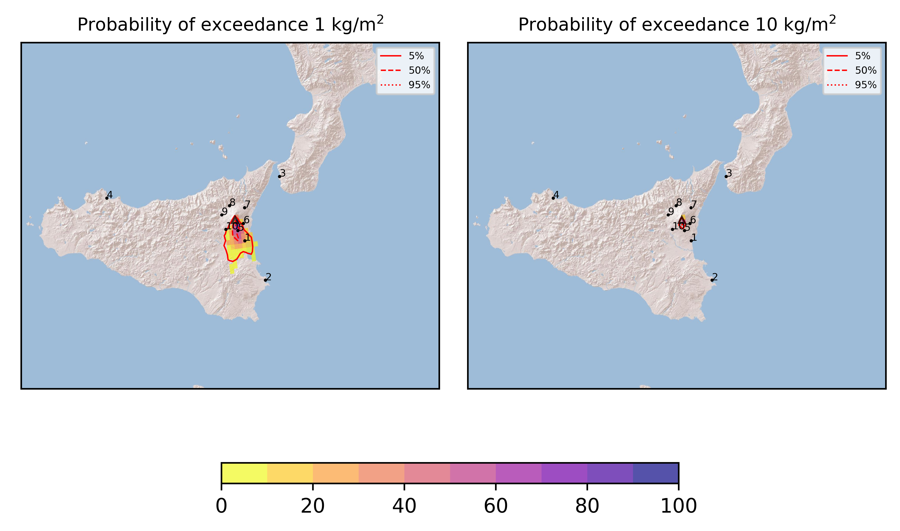
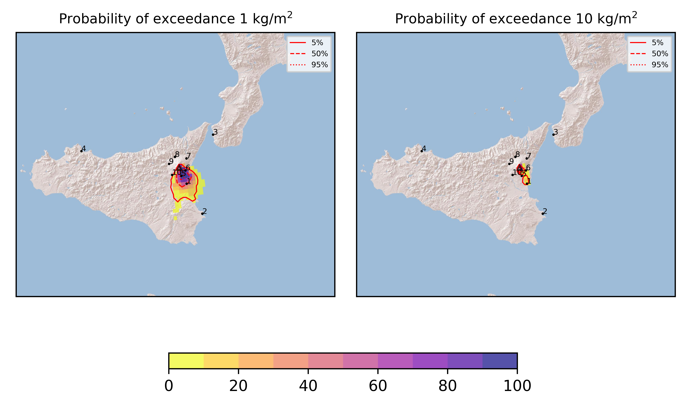
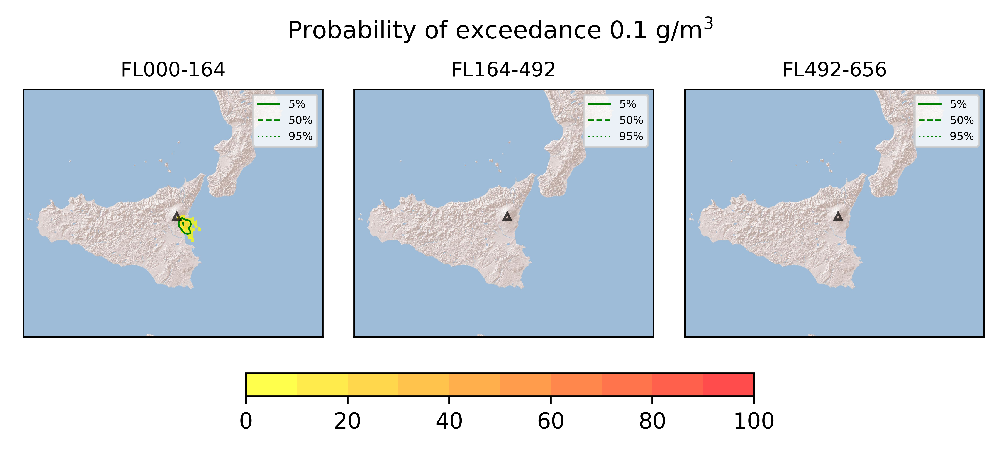
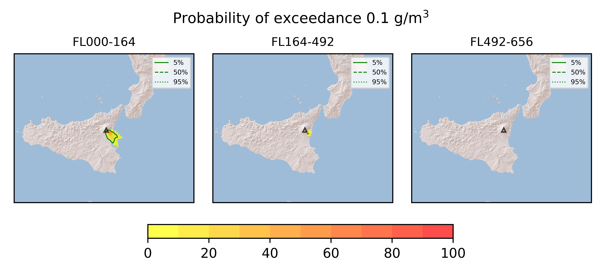

Forecast from VONA bulletin - 20210401_0747Z
============================================

Contents
========

* [Forecast products](#forecast-products)
	* [Forecast at 2021-04-01 10:50 Z](#forecast-at-2021-04-01-1050-z)
	* [Forecast at 2021-04-01 13:50 Z](#forecast-at-2021-04-01-1350-z)
	* [Forecast at 2021-04-01 16:50 Z](#forecast-at-2021-04-01-1650-z)
	* [Forecast at 2021-04-01 19:50 Z](#forecast-at-2021-04-01-1950-z)

# Forecast products

## Forecast at 2021-04-01 10:50 Z
  

|Eruption start [Z]|Eruption end [Z]|Forecast time [Z]|Column height asl [m]|
| :--- | :--- | :--- | :--- |
|2021-04-01 07:50:00|Ongoing|2021-04-01 10:50:00|9000 ± 500 - from VONA|
  
  

|Percentile|MER [kg/s¹]|Mass in the air [kg]|Mass on the ground [kg]|
| :--- | :--- | :--- | :--- |
|5th|5.05e+04|2.78e+07|5.52e+08|
|50th|1.18e+05|1.10e+08|1.15e+09|
|95th|2.14e+05|5.66e+08|1.87e+09|
  

### Ground 2021-04-01 10:50 Z
  
  
  
  
  
  
  
  
  
  
  

|Location|Ground load [kg/m²] 5th perc|Ground load [kg/m²] 50th perc|Ground load [kg/m²] 95th perc|
| :--- | :--- | :--- | :--- |
|Catania AP (1)|1.52e-03|2.19e-01|4.42e+00|
|Siracusa (2)|0.00e+00|0.00e+00|3.13e-03|
|Reggio Calabria AP (3)|0.00e+00|0.00e+00|0.00e+00|
|Palermo AP (4)|0.00e+00|0.00e+00|0.00e+00|
|Nicolosi (5)|2.14e-01|2.01e+00|3.28e+00|
|Zafferana (6)|0.00e+00|3.45e-04|3.79e-02|
|Linguaglossa (7)|0.00e+00|0.00e+00|0.00e+00|
|Randazzo (8)|0.00e+00|0.00e+00|0.00e+00|
|Bronte (9)|0.00e+00|0.00e+00|0.00e+00|
|Biancavilla (10)|0.00e+00|1.12e-03|3.79e-01|
  

### Atmosphere 2021-04-01 10:50 Z
  

## Forecast at 2021-04-01 13:50 Z
  

|Eruption start [Z]|Eruption end [Z]|Forecast time [Z]|Column height asl [m]|
| :--- | :--- | :--- | :--- |
|2021-04-01 07:50:00|Ongoing|2021-04-01 13:50:00|9000 ± 500 - from VONA|
  
  

|Percentile|MER [kg/s¹]|Mass in the air [kg]|Mass on the ground [kg]|
| :--- | :--- | :--- | :--- |
|5th|4.84e+04|4.63e+07|1.61e+09|
|50th|1.01e+05|1.24e+08|2.22e+09|
|95th|1.64e+05|4.71e+08|3.25e+09|
  

### Ground 2021-04-01 13:50 Z
  
  
  
  
  
  
  
  
  
  
  

|Location|Ground load [kg/m²] 5th perc|Ground load [kg/m²] 50th perc|Ground load [kg/m²] 95th perc|
| :--- | :--- | :--- | :--- |
|Catania AP (1)|1.84e-01|9.88e-01|7.00e+00|
|Siracusa (2)|0.00e+00|1.28e-04|3.09e-02|
|Reggio Calabria AP (3)|0.00e+00|0.00e+00|0.00e+00|
|Palermo AP (4)|0.00e+00|0.00e+00|0.00e+00|
|Nicolosi (5)|1.86e+00|3.46e+00|5.41e+00|
|Zafferana (6)|2.29e-03|9.15e-02|1.38e+00|
|Linguaglossa (7)|0.00e+00|0.00e+00|9.59e-06|
|Randazzo (8)|0.00e+00|0.00e+00|5.13e-06|
|Bronte (9)|0.00e+00|0.00e+00|1.86e-05|
|Biancavilla (10)|3.07e-04|5.95e-03|3.84e-01|
  

### Atmosphere 2021-04-01 13:50 Z
  

## Forecast at 2021-04-01 16:50 Z
  

|Eruption start [Z]|Eruption end [Z]|Forecast time [Z]|Column height asl [m]|
| :--- | :--- | :--- | :--- |
|2021-04-01 07:50:00|Ongoing|2021-04-01 16:50:00|9000 ± 500 - from VONA|
  
  

|Percentile|MER [kg/s¹]|Mass in the air [kg]|Mass on the ground [kg]|
| :--- | :--- | :--- | :--- |
|5th|4.67e+04|2.59e+07|2.33e+09|
|50th|1.04e+05|1.05e+08|3.14e+09|
|95th|1.68e+05|4.45e+08|4.76e+09|
  

### Ground 2021-04-01 16:50 Z
  
  
  
  
  
  
  
  
  
  
  

|Location|Ground load [kg/m²] 5th perc|Ground load [kg/m²] 50th perc|Ground load [kg/m²] 95th perc|
| :--- | :--- | :--- | :--- |
|Catania AP (1)|3.64e-01|1.47e+00|1.02e+01|
|Siracusa (2)|0.00e+00|1.85e-03|6.14e-02|
|Reggio Calabria AP (3)|0.00e+00|0.00e+00|0.00e+00|
|Palermo AP (4)|0.00e+00|0.00e+00|0.00e+00|
|Nicolosi (5)|2.83e+00|4.53e+00|7.31e+00|
|Zafferana (6)|1.58e-02|1.07e+00|2.47e+00|
|Linguaglossa (7)|0.00e+00|0.00e+00|9.59e-06|
|Randazzo (8)|0.00e+00|0.00e+00|5.13e-06|
|Bronte (9)|0.00e+00|0.00e+00|1.86e-05|
|Biancavilla (10)|3.59e-04|6.07e-03|3.85e-01|
  

### Atmosphere 2021-04-01 16:50 Z
  

## Forecast at 2021-04-01 19:50 Z
  

|Eruption start [Z]|Eruption end [Z]|Forecast time [Z]|Column height asl [m]|
| :--- | :--- | :--- | :--- |
|2021-04-01 07:50:00|Ongoing|2021-04-01 19:50:00|9000 ± 500 - from VONA|
  
  

|Percentile|MER [kg/s¹]|Mass in the air [kg]|Mass on the ground [kg]|
| :--- | :--- | :--- | :--- |
|5th|5.19e+04|3.45e+07|3.23e+09|
|50th|1.15e+05|1.56e+08|4.14e+09|
|95th|2.12e+05|6.30e+08|6.42e+09|
  

### Ground 2021-04-01 19:50 Z
  
  
  
  
  
  
  
  
  
  
  

|Location|Ground load [kg/m²] 5th perc|Ground load [kg/m²] 50th perc|Ground load [kg/m²] 95th perc|
| :--- | :--- | :--- | :--- |
|Catania AP (1)|4.30e-01|1.47e+00|1.28e+01|
|Siracusa (2)|2.41e-05|2.45e-03|1.27e-01|
|Reggio Calabria AP (3)|0.00e+00|0.00e+00|0.00e+00|
|Palermo AP (4)|0.00e+00|0.00e+00|0.00e+00|
|Nicolosi (5)|3.28e+00|5.77e+00|9.43e+00|
|Zafferana (6)|6.04e-02|1.87e+00|4.67e+00|
|Linguaglossa (7)|0.00e+00|0.00e+00|9.59e-06|
|Randazzo (8)|0.00e+00|0.00e+00|5.13e-06|
|Bronte (9)|0.00e+00|0.00e+00|1.86e-05|
|Biancavilla (10)|3.59e-04|6.07e-03|3.86e-01|
  

### Atmosphere 2021-04-01 19:50 Z
  
  
Go to [Supplementary page](Supplementary_page.md)  
Go to [Main directory](https://github.com/federicapardini/Real_time_ash_forecast)