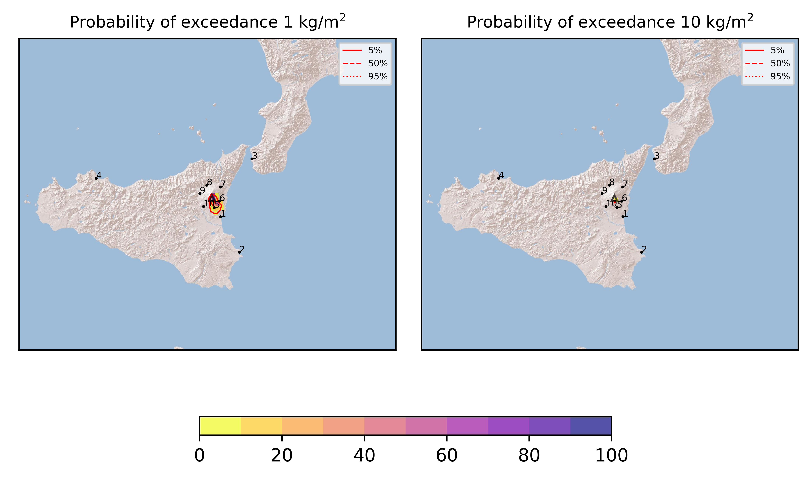

Forecast from VONA bulletin - 20210401_0932Z
============================================

Contents
========

* [Forecast products](#forecast-products)
	* [Forecast at 2021-04-01 12:30 Z](#forecast-at-2021-04-01-1230-z)
	* [Forecast at 2021-04-01 15:30 Z](#forecast-at-2021-04-01-1530-z)

# Forecast products

## Forecast at 2021-04-01 12:30 Z
  

|Eruption start [Z]|Eruption end [Z]|Forecast time [Z]|Column height asl [m]|
| :--- | :--- | :--- | :--- |
|2021-04-01 09:30:00|Ongoing|2021-04-01 12:30:00|5500 ± 500 - from VONA|
  
  

|Percentile|MER [kg/s¹]|Mass in the air [kg]|Mass on the ground [kg]|
| :--- | :--- | :--- | :--- |
|5th|4.40e+03|1.60e+06|4.99e+07|
|50th|1.53e+04|8.07e+06|1.50e+08|
|95th|3.40e+04|5.38e+07|3.44e+08|
  

### Ground 2021-04-01 12:30 Z
  
  
  
  
  
  
  
  
  
  
  

|Location|Ground load [kg/m²] 5th perc|Ground load [kg/m²] 50th perc|Ground load [kg/m²] 95th perc|
| :--- | :--- | :--- | :--- |
|Catania AP (1)|0.00e+00|3.11e-03|1.58e-01|
|Siracusa (2)|0.00e+00|0.00e+00|9.21e-06|
|Reggio Calabria AP (3)|0.00e+00|0.00e+00|0.00e+00|
|Palermo AP (4)|0.00e+00|0.00e+00|0.00e+00|
|Nicolosi (5)|7.37e-02|3.99e-01|1.17e+00|
|Zafferana (6)|3.18e-03|3.24e-02|2.95e-01|
|Linguaglossa (7)|0.00e+00|0.00e+00|0.00e+00|
|Randazzo (8)|0.00e+00|0.00e+00|0.00e+00|
|Bronte (9)|0.00e+00|0.00e+00|0.00e+00|
|Biancavilla (10)|5.65e-05|2.06e-03|3.10e-02|
  

### Atmosphere 2021-04-01 12:30 Z
  

## Forecast at 2021-04-01 15:30 Z
  

|Eruption start [Z]|Eruption end [Z]|Forecast time [Z]|Column height asl [m]|
| :--- | :--- | :--- | :--- |
|2021-04-01 09:30:00|Ongoing|2021-04-01 15:30:00|5500 ± 500 - from VONA|
  
  

|Percentile|MER [kg/s¹]|Mass in the air [kg]|Mass on the ground [kg]|
| :--- | :--- | :--- | :--- |
|5th|4.31e+03|3.19e+06|1.42e+08|
|50th|1.30e+04|9.62e+06|3.07e+08|
|95th|2.82e+04|4.07e+07|5.82e+08|
  

### Ground 2021-04-01 15:30 Z
  
  
  
  
  
  
  
  
  
  
  

|Location|Ground load [kg/m²] 5th perc|Ground load [kg/m²] 50th perc|Ground load [kg/m²] 95th perc|
| :--- | :--- | :--- | :--- |
|Catania AP (1)|3.85e-04|3.16e-02|2.94e-01|
|Siracusa (2)|0.00e+00|0.00e+00|2.64e-03|
|Reggio Calabria AP (3)|0.00e+00|0.00e+00|0.00e+00|
|Palermo AP (4)|0.00e+00|0.00e+00|0.00e+00|
|Nicolosi (5)|3.09e-01|7.77e-01|1.56e+00|
|Zafferana (6)|6.12e-02|1.69e-01|7.19e-01|
|Linguaglossa (7)|0.00e+00|0.00e+00|0.00e+00|
|Randazzo (8)|0.00e+00|0.00e+00|0.00e+00|
|Bronte (9)|0.00e+00|0.00e+00|0.00e+00|
|Biancavilla (10)|9.33e-04|3.06e-03|3.17e-02|
  

### Atmosphere 2021-04-01 15:30 Z
  
  
Go to [Supplementary page](Supplementary_page.md)  
Go to [Main directory](https://github.com/federicapardini/Real_time_ash_forecast)