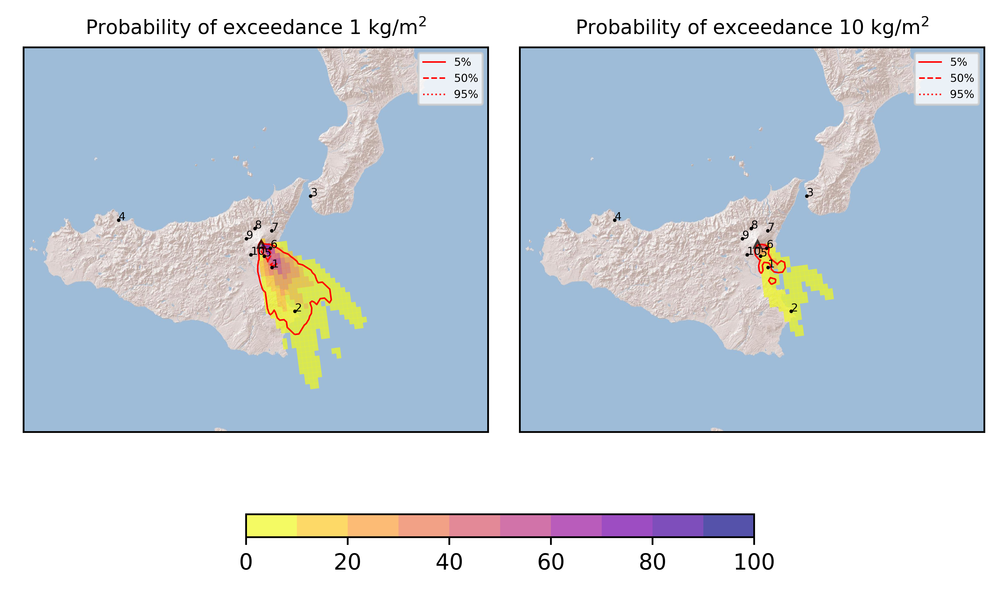
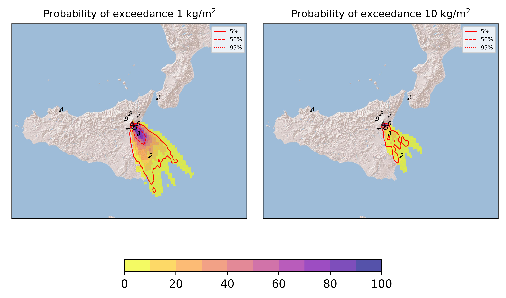
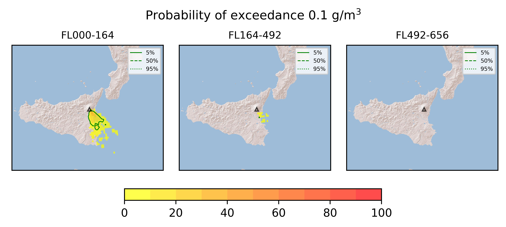
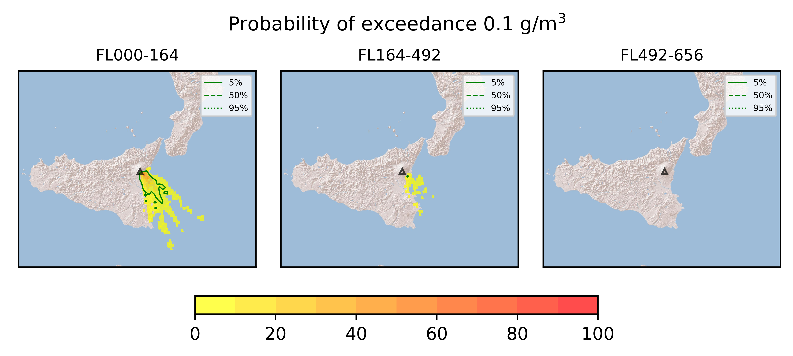

Forecast from VONA bulletin - 20210604_1622Z
============================================

Contents
========

* [Forecast products](#forecast-products)
	* [Forecast at 2021-06-04 19:20 Z](#forecast-at-2021-06-04-1920-z)
	* [Forecast at 2021-06-04 22:20 Z](#forecast-at-2021-06-04-2220-z)
	* [Forecast at 2021-06-05 01:20 Z](#forecast-at-2021-06-05-0120-z)

# Forecast products

## Forecast at 2021-06-04 19:20 Z
  

|Eruption start [Z]|Eruption end [Z]|Forecast time [Z]|Column height asl [m]|
| :--- | :--- | :--- | :--- |
|2021-06-04 16:20:00|Ongoing|2021-06-04 19:20:00|[6000 m, 12000 m]|
  
  

|Percentile|MER [kg/s¹]|Mass in the air [kg]|Mass on the ground [kg]|
| :--- | :--- | :--- | :--- |
|5th|9.15e+04|7.48e+07|7.88e+08|
|50th|3.67e+05|3.85e+08|3.25e+09|
|95th|2.37e+06|4.78e+09|1.91e+10|
  

### Ground 2021-06-04 19:20 Z
  
  
  
  
  
  
  
  
  
  
  

|Location|Ground load [kg/m²] 5th perc|Ground load [kg/m²] 50th perc|Ground load [kg/m²] 95th perc|
| :--- | :--- | :--- | :--- |
|Catania AP (1)|1.61e-03|1.17e+00|6.18e+00|
|Siracusa (2)|0.00e+00|0.00e+00|1.62e+00|
|Reggio Calabria AP (3)|0.00e+00|0.00e+00|0.00e+00|
|Palermo AP (4)|0.00e+00|0.00e+00|0.00e+00|
|Nicolosi (5)|6.72e-02|1.95e+00|2.74e+01|
|Zafferana (6)|0.00e+00|1.03e-02|1.55e+01|
|Linguaglossa (7)|0.00e+00|0.00e+00|0.00e+00|
|Randazzo (8)|0.00e+00|0.00e+00|0.00e+00|
|Bronte (9)|0.00e+00|0.00e+00|0.00e+00|
|Biancavilla (10)|0.00e+00|0.00e+00|1.93e-04|
  

### Atmosphere 2021-06-04 19:20 Z
  

## Forecast at 2021-06-04 22:20 Z
  

|Eruption start [Z]|Eruption end [Z]|Forecast time [Z]|Column height asl [m]|
| :--- | :--- | :--- | :--- |
|2021-06-04 16:20:00|Ongoing|2021-06-04 22:20:00|[6000 m, 12000 m]|
  
  

|Percentile|MER [kg/s¹]|Mass in the air [kg]|Mass on the ground [kg]|
| :--- | :--- | :--- | :--- |
|5th|1.15e+05|6.50e+07|2.60e+09|
|50th|3.27e+05|4.39e+08|7.18e+09|
|95th|1.18e+06|1.30e+09|2.64e+10|
  

### Ground 2021-06-04 22:20 Z
  
  
  
  
  
  
  
  
  
  
  

|Location|Ground load [kg/m²] 5th perc|Ground load [kg/m²] 50th perc|Ground load [kg/m²] 95th perc|
| :--- | :--- | :--- | :--- |
|Catania AP (1)|7.01e-01|3.74e+00|9.50e+00|
|Siracusa (2)|1.94e-05|9.21e-02|2.71e+00|
|Reggio Calabria AP (3)|0.00e+00|0.00e+00|0.00e+00|
|Palermo AP (4)|0.00e+00|0.00e+00|0.00e+00|
|Nicolosi (5)|1.01e+00|5.46e+00|4.74e+01|
|Zafferana (6)|4.20e-06|1.55e-01|1.57e+01|
|Linguaglossa (7)|0.00e+00|0.00e+00|0.00e+00|
|Randazzo (8)|0.00e+00|0.00e+00|0.00e+00|
|Bronte (9)|0.00e+00|0.00e+00|0.00e+00|
|Biancavilla (10)|0.00e+00|0.00e+00|6.92e-04|
  

### Atmosphere 2021-06-04 22:20 Z
  

## Forecast at 2021-06-05 01:20 Z
  

|Eruption start [Z]|Eruption end [Z]|Forecast time [Z]|Column height asl [m]|
| :--- | :--- | :--- | :--- |
|2021-06-04 16:20:00|Ongoing|2021-06-05 01:20:00|[6000 m, 12000 m]|
  
  

|Percentile|MER [kg/s¹]|Mass in the air [kg]|Mass on the ground [kg]|
| :--- | :--- | :--- | :--- |
|5th|1.16e+05|1.12e+08|5.35e+09|
|50th|2.91e+05|4.52e+08|1.14e+10|
|95th|1.22e+06|1.60e+09|3.10e+10|
  

### Ground 2021-06-05 01:20 Z
  
  
  
  
  
  
  
  
  
  
  

|Location|Ground load [kg/m²] 5th perc|Ground load [kg/m²] 50th perc|Ground load [kg/m²] 95th perc|
| :--- | :--- | :--- | :--- |
|Catania AP (1)|1.01e+00|5.98e+00|1.42e+01|
|Siracusa (2)|1.02e-04|1.65e-01|6.64e+00|
|Reggio Calabria AP (3)|0.00e+00|0.00e+00|0.00e+00|
|Palermo AP (4)|0.00e+00|0.00e+00|0.00e+00|
|Nicolosi (5)|1.76e+00|1.10e+01|6.68e+01|
|Zafferana (6)|2.48e-04|5.64e-01|1.92e+01|
|Linguaglossa (7)|0.00e+00|0.00e+00|0.00e+00|
|Randazzo (8)|0.00e+00|0.00e+00|0.00e+00|
|Bronte (9)|0.00e+00|0.00e+00|0.00e+00|
|Biancavilla (10)|0.00e+00|0.00e+00|1.71e-03|
  

### Atmosphere 2021-06-05 01:20 Z
  
  
Go to [Supplementary page](Supplementary_page.md)  
Go to [Main directory](https://github.com/federicapardini/Real_time_ash_forecast)