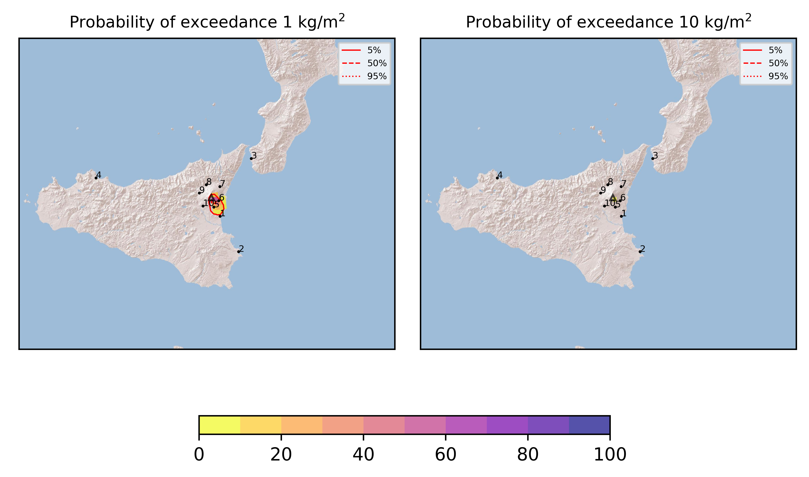
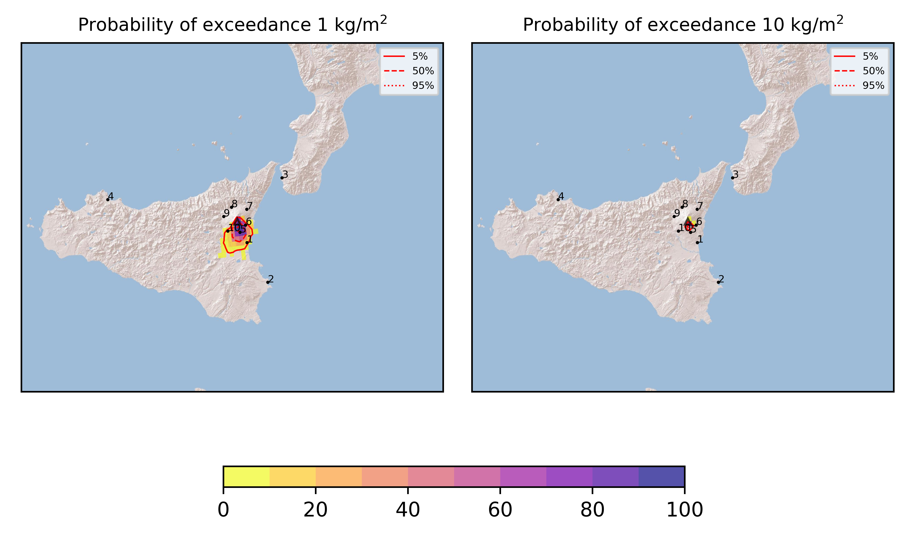
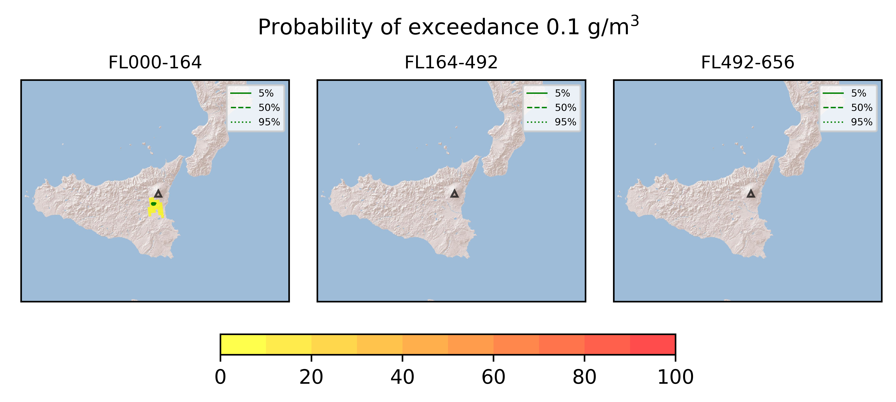

Forecast from VONA bulletin - 20210612_1328Z
============================================

Contents
========

* [Forecast products](#forecast-products)
	* [Forecast at 2021-06-12 16:30 Z](#forecast-at-2021-06-12-1630-z)
	* [Forecast at 2021-06-12 19:30 Z](#forecast-at-2021-06-12-1930-z)
	* [Forecast at 2021-06-12 22:30 Z](#forecast-at-2021-06-12-2230-z)
	* [Forecast at 2021-06-13 01:30 Z](#forecast-at-2021-06-13-0130-z)

# Forecast products

## Forecast at 2021-06-12 16:30 Z
  

|Eruption start [Z]|Eruption end [Z]|Forecast time [Z]|Column height asl [m]|
| :--- | :--- | :--- | :--- |
|2021-06-12 13:30:00|Ongoing|2021-06-12 16:30:00|6000 ± 500 - from VONA|
  
  

|Percentile|MER [kg/s¹]|Mass in the air [kg]|Mass on the ground [kg]|
| :--- | :--- | :--- | :--- |
|5th|1.06e+04|4.40e+06|8.82e+07|
|50th|2.99e+04|1.94e+07|2.72e+08|
|95th|6.83e+04|1.13e+08|6.17e+08|
  

### Ground 2021-06-12 16:30 Z
  
  
  
  
  
  
  
  
  
  
  

|Location|Ground load [kg/m²] 5th perc|Ground load [kg/m²] 50th perc|Ground load [kg/m²] 95th perc|
| :--- | :--- | :--- | :--- |
|Catania AP (1)|3.69e-06|1.03e-02|7.10e-01|
|Siracusa (2)|0.00e+00|0.00e+00|2.69e-03|
|Reggio Calabria AP (3)|0.00e+00|0.00e+00|0.00e+00|
|Palermo AP (4)|0.00e+00|0.00e+00|0.00e+00|
|Nicolosi (5)|9.07e-02|4.76e-01|1.82e+00|
|Zafferana (6)|1.07e-02|1.43e-01|1.21e+00|
|Linguaglossa (7)|0.00e+00|0.00e+00|0.00e+00|
|Randazzo (8)|0.00e+00|0.00e+00|0.00e+00|
|Bronte (9)|0.00e+00|0.00e+00|0.00e+00|
|Biancavilla (10)|0.00e+00|1.68e-04|7.40e-03|
  

### Atmosphere 2021-06-12 16:30 Z
  

## Forecast at 2021-06-12 19:30 Z
  

|Eruption start [Z]|Eruption end [Z]|Forecast time [Z]|Column height asl [m]|
| :--- | :--- | :--- | :--- |
|2021-06-12 13:30:00|Ongoing|2021-06-12 19:30:00|6000 ± 500 - from VONA|
  
  

|Percentile|MER [kg/s¹]|Mass in the air [kg]|Mass on the ground [kg]|
| :--- | :--- | :--- | :--- |
|5th|1.13e+04|7.78e+06|3.38e+08|
|50th|3.03e+04|2.42e+07|6.52e+08|
|95th|6.31e+04|9.49e+07|1.01e+09|
  

### Ground 2021-06-12 19:30 Z
  
  
  
  
  
  
  
  
  
  
  

|Location|Ground load [kg/m²] 5th perc|Ground load [kg/m²] 50th perc|Ground load [kg/m²] 95th perc|
| :--- | :--- | :--- | :--- |
|Catania AP (1)|6.99e-03|1.57e-01|1.15e+00|
|Siracusa (2)|0.00e+00|0.00e+00|7.26e-03|
|Reggio Calabria AP (3)|0.00e+00|0.00e+00|0.00e+00|
|Palermo AP (4)|0.00e+00|0.00e+00|0.00e+00|
|Nicolosi (5)|7.17e-01|1.52e+00|2.76e+00|
|Zafferana (6)|3.73e-02|1.57e-01|1.53e+00|
|Linguaglossa (7)|0.00e+00|0.00e+00|0.00e+00|
|Randazzo (8)|0.00e+00|0.00e+00|0.00e+00|
|Bronte (9)|0.00e+00|0.00e+00|0.00e+00|
|Biancavilla (10)|3.67e-06|4.14e-03|6.56e-02|
  

### Atmosphere 2021-06-12 19:30 Z
  

## Forecast at 2021-06-12 22:30 Z
  

|Eruption start [Z]|Eruption end [Z]|Forecast time [Z]|Column height asl [m]|
| :--- | :--- | :--- | :--- |
|2021-06-12 13:30:00|Ongoing|2021-06-12 22:30:00|6000 ± 500 - from VONA|
  
  

|Percentile|MER [kg/s¹]|Mass in the air [kg]|Mass on the ground [kg]|
| :--- | :--- | :--- | :--- |
|5th|8.65e+03|5.96e+06|5.04e+08|
|50th|2.92e+04|1.97e+07|9.68e+08|
|95th|6.27e+04|1.20e+08|1.38e+09|
  

### Ground 2021-06-12 22:30 Z
  
  
  
  
  
  
  
  
  
  
  

|Location|Ground load [kg/m²] 5th perc|Ground load [kg/m²] 50th perc|Ground load [kg/m²] 95th perc|
| :--- | :--- | :--- | :--- |
|Catania AP (1)|7.14e-02|2.42e-01|1.21e+00|
|Siracusa (2)|0.00e+00|3.16e-05|7.32e-03|
|Reggio Calabria AP (3)|0.00e+00|0.00e+00|0.00e+00|
|Palermo AP (4)|0.00e+00|0.00e+00|0.00e+00|
|Nicolosi (5)|1.13e+00|1.99e+00|3.61e+00|
|Zafferana (6)|4.09e-02|1.62e-01|1.54e+00|
|Linguaglossa (7)|0.00e+00|0.00e+00|0.00e+00|
|Randazzo (8)|0.00e+00|0.00e+00|0.00e+00|
|Bronte (9)|0.00e+00|0.00e+00|1.32e-05|
|Biancavilla (10)|4.13e-03|2.91e-02|4.03e-01|
  

### Atmosphere 2021-06-12 22:30 Z
  

## Forecast at 2021-06-13 01:30 Z
  

|Eruption start [Z]|Eruption end [Z]|Forecast time [Z]|Column height asl [m]|
| :--- | :--- | :--- | :--- |
|2021-06-12 13:30:00|Ongoing|2021-06-13 01:30:00|6000 ± 500 - from VONA|
  
  

|Percentile|MER [kg/s¹]|Mass in the air [kg]|Mass on the ground [kg]|
| :--- | :--- | :--- | :--- |
|5th|1.14e+04|5.84e+06|7.65e+08|
|50th|3.41e+04|3.20e+07|1.33e+09|
|95th|8.80e+04|2.11e+08|1.95e+09|
  

### Ground 2021-06-13 01:30 Z
  
  
  
  
  
  
  
  
  
  
  

|Location|Ground load [kg/m²] 5th perc|Ground load [kg/m²] 50th perc|Ground load [kg/m²] 95th perc|
| :--- | :--- | :--- | :--- |
|Catania AP (1)|7.63e-02|2.56e-01|1.41e+00|
|Siracusa (2)|0.00e+00|3.82e-05|7.32e-03|
|Reggio Calabria AP (3)|0.00e+00|0.00e+00|0.00e+00|
|Palermo AP (4)|0.00e+00|0.00e+00|0.00e+00|
|Nicolosi (5)|1.30e+00|2.34e+00|3.89e+00|
|Zafferana (6)|4.09e-02|1.62e-01|1.54e+00|
|Linguaglossa (7)|0.00e+00|0.00e+00|0.00e+00|
|Randazzo (8)|0.00e+00|0.00e+00|0.00e+00|
|Bronte (9)|0.00e+00|0.00e+00|1.54e-04|
|Biancavilla (10)|1.28e-02|1.76e-01|1.15e+00|
  

### Atmosphere 2021-06-13 01:30 Z
  
  
Go to [Supplementary page](Supplementary_page.md)  
Go to [Main directory](https://github.com/federicapardini/Real_time_ash_forecast)