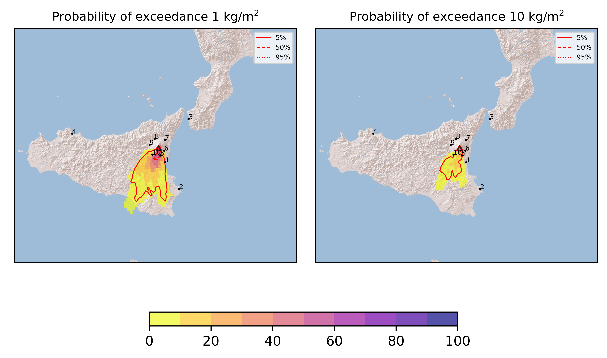
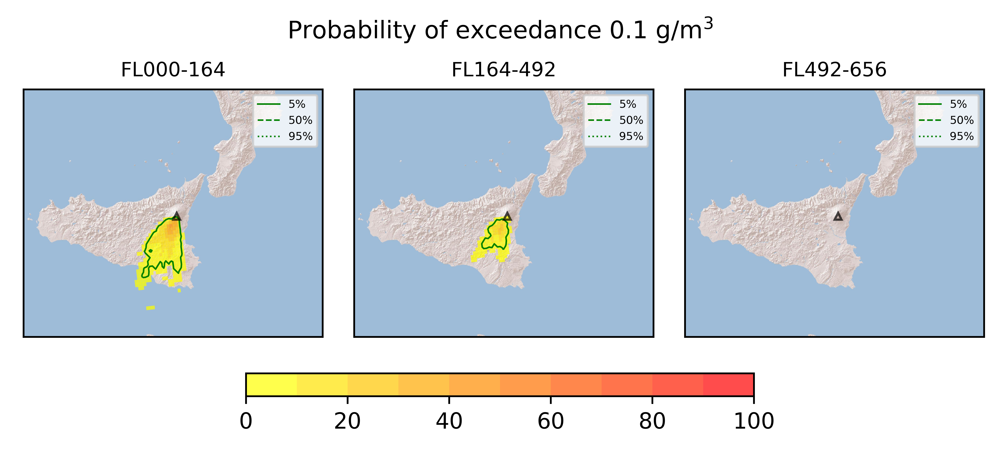
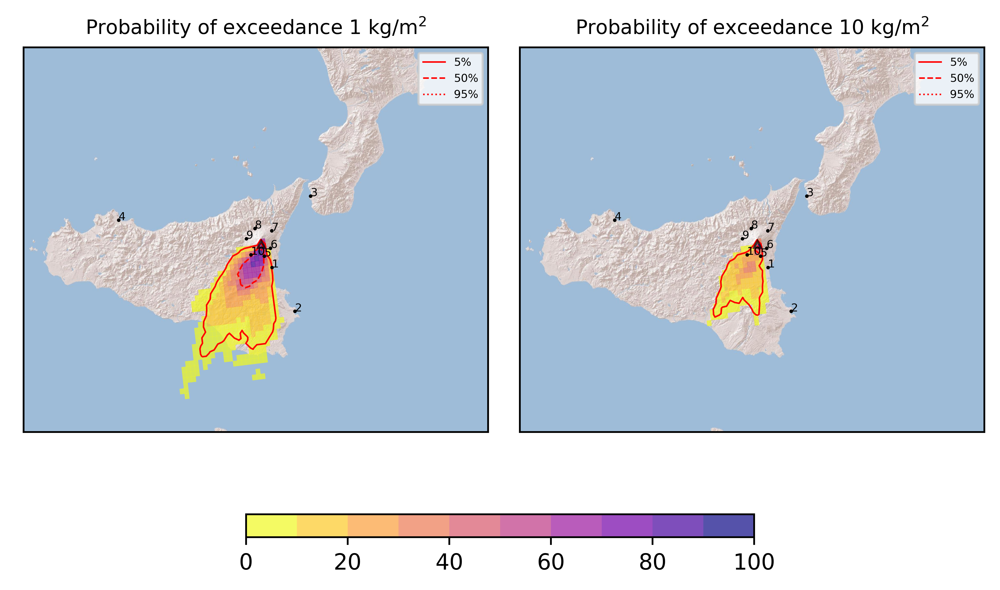

Forecast from VONA bulletin - 20210612_1950Z
============================================

Contents
========

* [Forecast products](#forecast-products)
	* [Forecast at 2021-06-12 22:50 Z](#forecast-at-2021-06-12-2250-z)
	* [Forecast at 2021-06-13 01:50 Z](#forecast-at-2021-06-13-0150-z)

# Forecast products

## Forecast at 2021-06-12 22:50 Z
  

|Eruption start [Z]|Eruption end [Z]|Forecast time [Z]|Column height asl [m]|
| :--- | :--- | :--- | :--- |
|2021-06-12 19:50:00|Ongoing|2021-06-12 22:50:00|[6000 m, 12000 m]|
  
  

|Percentile|MER [kg/s¹]|Mass in the air [kg]|Mass on the ground [kg]|
| :--- | :--- | :--- | :--- |
|5th|3.59e+04|2.57e+07|2.91e+08|
|50th|3.10e+05|4.02e+08|2.64e+09|
|95th|3.81e+06|9.25e+09|2.74e+10|
  

### Ground 2021-06-12 22:50 Z
  
  
  
  
  
  
  
  
  
  
  

|Location|Ground load [kg/m²] 5th perc|Ground load [kg/m²] 50th perc|Ground load [kg/m²] 95th perc|
| :--- | :--- | :--- | :--- |
|Catania AP (1)|0.00e+00|2.30e-03|1.00e+00|
|Siracusa (2)|0.00e+00|0.00e+00|1.31e-05|
|Reggio Calabria AP (3)|0.00e+00|0.00e+00|0.00e+00|
|Palermo AP (4)|0.00e+00|0.00e+00|0.00e+00|
|Nicolosi (5)|2.35e-04|7.24e-01|2.19e+01|
|Zafferana (6)|0.00e+00|0.00e+00|1.04e-03|
|Linguaglossa (7)|0.00e+00|0.00e+00|0.00e+00|
|Randazzo (8)|0.00e+00|0.00e+00|0.00e+00|
|Bronte (9)|0.00e+00|0.00e+00|4.11e-05|
|Biancavilla (10)|4.72e-05|6.75e-02|5.29e+00|
  

### Atmosphere 2021-06-12 22:50 Z
  

## Forecast at 2021-06-13 01:50 Z
  

|Eruption start [Z]|Eruption end [Z]|Forecast time [Z]|Column height asl [m]|
| :--- | :--- | :--- | :--- |
|2021-06-12 19:50:00|Ongoing|2021-06-13 01:50:00|[6000 m, 12000 m]|
  
  

|Percentile|MER [kg/s¹]|Mass in the air [kg]|Mass on the ground [kg]|
| :--- | :--- | :--- | :--- |
|5th|6.10e+04|8.39e+07|1.67e+09|
|50th|5.09e+05|1.04e+09|9.57e+09|
|95th|3.72e+06|4.27e+09|5.13e+10|
  

### Ground 2021-06-13 01:50 Z
  
  
  
  
  
  
  
  
  
  
  

|Location|Ground load [kg/m²] 5th perc|Ground load [kg/m²] 50th perc|Ground load [kg/m²] 95th perc|
| :--- | :--- | :--- | :--- |
|Catania AP (1)|0.00e+00|8.34e-03|1.07e+00|
|Siracusa (2)|0.00e+00|0.00e+00|1.31e-05|
|Reggio Calabria AP (3)|0.00e+00|0.00e+00|0.00e+00|
|Palermo AP (4)|0.00e+00|0.00e+00|0.00e+00|
|Nicolosi (5)|9.97e-03|1.22e+00|4.26e+01|
|Zafferana (6)|0.00e+00|0.00e+00|1.05e-03|
|Linguaglossa (7)|0.00e+00|0.00e+00|0.00e+00|
|Randazzo (8)|0.00e+00|0.00e+00|0.00e+00|
|Bronte (9)|0.00e+00|0.00e+00|3.14e-04|
|Biancavilla (10)|4.12e-03|5.92e-01|1.71e+01|
  

### Atmosphere 2021-06-13 01:50 Z
  
  
Go to [Supplementary page](Supplementary_page.md)  
Go to [Main directory](https://github.com/federicapardini/Real_time_ash_forecast)