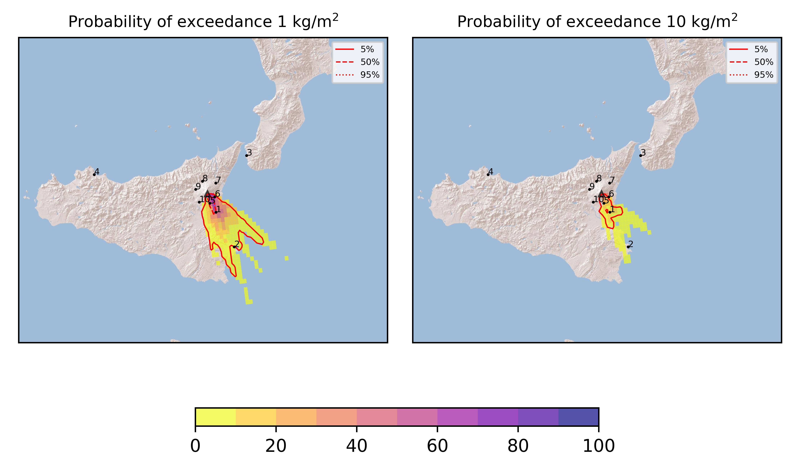
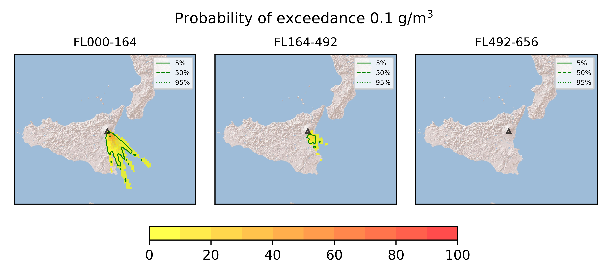
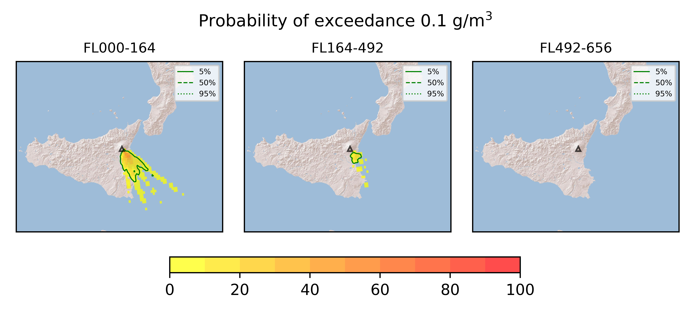
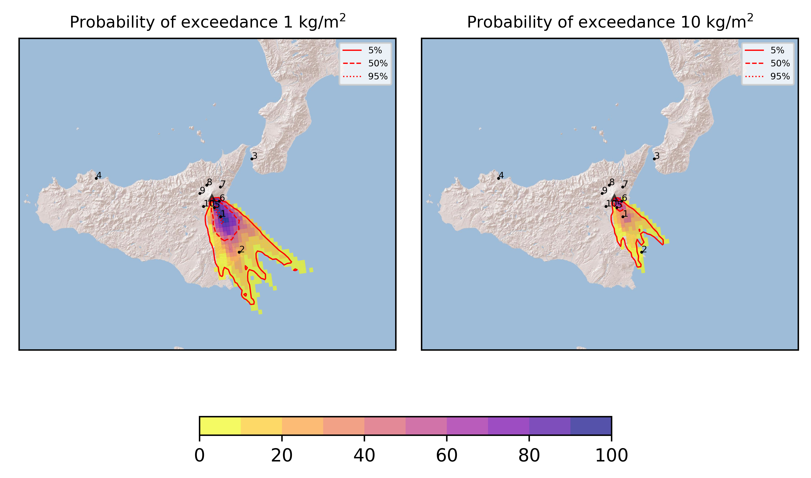

Forecast from VONA bulletin - 20210614_2131Z
============================================

Contents
========

* [Forecast products](#forecast-products)
	* [Forecast at 2021-06-15 00:30 Z](#forecast-at-2021-06-15-0030-z)
	* [Forecast at 2021-06-15 03:30 Z](#forecast-at-2021-06-15-0330-z)
	* [Forecast at 2021-06-15 06:30 Z](#forecast-at-2021-06-15-0630-z)

# Forecast products

## Forecast at 2021-06-15 00:30 Z
  

|Eruption start [Z]|Eruption end [Z]|Forecast time [Z]|Column height asl [m]|
| :--- | :--- | :--- | :--- |
|2021-06-14 21:30:00|Ongoing|2021-06-15 00:30:00|[6000 m, 12000 m]|
  
  

|Percentile|MER [kg/s¹]|Mass in the air [kg]|Mass on the ground [kg]|
| :--- | :--- | :--- | :--- |
|5th|9.47e+04|8.07e+07|8.12e+08|
|50th|4.44e+05|4.24e+08|3.77e+09|
|95th|1.68e+06|3.51e+09|1.24e+10|
  

### Ground 2021-06-15 00:30 Z
  
  
  
  
  
  
  
  
  
  
  

|Location|Ground load [kg/m²] 5th perc|Ground load [kg/m²] 50th perc|Ground load [kg/m²] 95th perc|
| :--- | :--- | :--- | :--- |
|Catania AP (1)|2.33e-02|1.43e+00|1.52e+01|
|Siracusa (2)|0.00e+00|0.00e+00|1.07e+00|
|Reggio Calabria AP (3)|0.00e+00|0.00e+00|0.00e+00|
|Palermo AP (4)|0.00e+00|0.00e+00|0.00e+00|
|Nicolosi (5)|1.45e-01|2.89e+00|3.87e+01|
|Zafferana (6)|0.00e+00|1.04e-03|2.12e+00|
|Linguaglossa (7)|0.00e+00|0.00e+00|0.00e+00|
|Randazzo (8)|0.00e+00|0.00e+00|0.00e+00|
|Bronte (9)|0.00e+00|0.00e+00|0.00e+00|
|Biancavilla (10)|0.00e+00|0.00e+00|7.85e-04|
  

### Atmosphere 2021-06-15 00:30 Z
  

## Forecast at 2021-06-15 03:30 Z
  

|Eruption start [Z]|Eruption end [Z]|Forecast time [Z]|Column height asl [m]|
| :--- | :--- | :--- | :--- |
|2021-06-14 21:30:00|Ongoing|2021-06-15 03:30:00|[6000 m, 12000 m]|
  
  

|Percentile|MER [kg/s¹]|Mass in the air [kg]|Mass on the ground [kg]|
| :--- | :--- | :--- | :--- |
|5th|1.13e+05|8.23e+07|3.14e+09|
|50th|4.67e+05|7.49e+08|9.00e+09|
|95th|1.71e+06|2.16e+09|2.38e+10|
  

### Ground 2021-06-15 03:30 Z
  
  
  
  
  
  
  
  
  
  
  

|Location|Ground load [kg/m²] 5th perc|Ground load [kg/m²] 50th perc|Ground load [kg/m²] 95th perc|
| :--- | :--- | :--- | :--- |
|Catania AP (1)|8.15e-01|5.21e+00|2.37e+01|
|Siracusa (2)|0.00e+00|3.41e-02|2.10e+00|
|Reggio Calabria AP (3)|0.00e+00|0.00e+00|0.00e+00|
|Palermo AP (4)|0.00e+00|0.00e+00|0.00e+00|
|Nicolosi (5)|1.22e+00|7.69e+00|5.39e+01|
|Zafferana (6)|0.00e+00|2.98e-01|7.03e+00|
|Linguaglossa (7)|0.00e+00|0.00e+00|0.00e+00|
|Randazzo (8)|0.00e+00|0.00e+00|0.00e+00|
|Bronte (9)|0.00e+00|0.00e+00|0.00e+00|
|Biancavilla (10)|0.00e+00|0.00e+00|1.66e-03|
  

### Atmosphere 2021-06-15 03:30 Z
  

## Forecast at 2021-06-15 06:30 Z
  

|Eruption start [Z]|Eruption end [Z]|Forecast time [Z]|Column height asl [m]|
| :--- | :--- | :--- | :--- |
|2021-06-14 21:30:00|Ongoing|2021-06-15 06:30:00|[6000 m, 12000 m]|
  
  

|Percentile|MER [kg/s¹]|Mass in the air [kg]|Mass on the ground [kg]|
| :--- | :--- | :--- | :--- |
|5th|1.11e+05|1.29e+08|6.05e+09|
|50th|4.82e+05|6.37e+08|1.58e+10|
|95th|2.02e+06|3.39e+09|3.01e+10|
  

### Ground 2021-06-15 06:30 Z
  
  
  
  
  
  
  
  
  
  
  

|Location|Ground load [kg/m²] 5th perc|Ground load [kg/m²] 50th perc|Ground load [kg/m²] 95th perc|
| :--- | :--- | :--- | :--- |
|Catania AP (1)|1.99e+00|9.38e+00|2.61e+01|
|Siracusa (2)|1.18e-03|2.24e-01|2.76e+00|
|Reggio Calabria AP (3)|0.00e+00|0.00e+00|0.00e+00|
|Palermo AP (4)|0.00e+00|0.00e+00|0.00e+00|
|Nicolosi (5)|3.59e+00|1.59e+01|6.86e+01|
|Zafferana (6)|2.52e-05|7.73e-01|9.29e+00|
|Linguaglossa (7)|0.00e+00|0.00e+00|0.00e+00|
|Randazzo (8)|0.00e+00|0.00e+00|0.00e+00|
|Bronte (9)|0.00e+00|0.00e+00|0.00e+00|
|Biancavilla (10)|0.00e+00|0.00e+00|1.80e-03|
  

### Atmosphere 2021-06-15 06:30 Z
  
  
Go to [Supplementary page](Supplementary_page.md)  
Go to [Main directory](https://github.com/federicapardini/Real_time_ash_forecast)