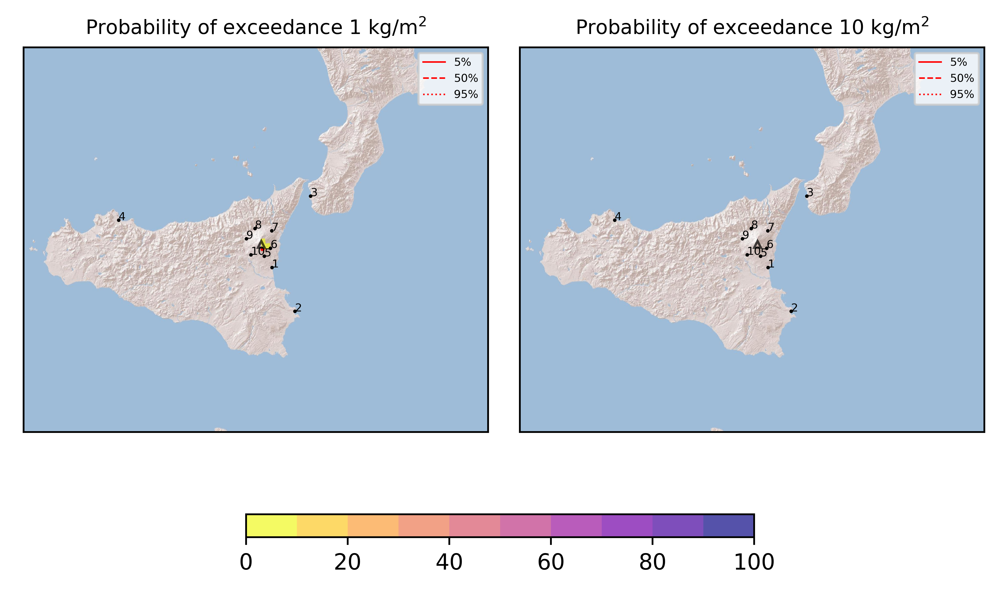

Forecast from VONA bulletin - 20210616_1143Z
============================================

Contents
========

* [Forecast products](#forecast-products)
	* [Forecast at 2021-06-16 14:40 Z](#forecast-at-2021-06-16-1440-z)

# Forecast products

## Forecast at 2021-06-16 14:40 Z
  

|Eruption start [Z]|Eruption end [Z]|Forecast time [Z]|Column height asl [m]|
| :--- | :--- | :--- | :--- |
|2021-06-16 11:40:00|Ongoing|2021-06-16 14:40:00|4000 ± 500 - from VONA|
  
  

|Percentile|MER [kg/s¹]|Mass in the air [kg]|Mass on the ground [kg]|
| :--- | :--- | :--- | :--- |
|5th|4.55e+01|2.72e+04|4.42e+05|
|50th|1.59e+03|2.87e+05|1.61e+07|
|95th|9.15e+03|8.71e+06|9.62e+07|
  

### Ground 2021-06-16 14:40 Z
  
  
  
  
  
  
  
  
  
  
  

|Location|Ground load [kg/m²] 5th perc|Ground load [kg/m²] 50th perc|Ground load [kg/m²] 95th perc|
| :--- | :--- | :--- | :--- |
|Catania AP (1)|0.00e+00|5.15e-05|1.82e-02|
|Siracusa (2)|0.00e+00|0.00e+00|0.00e+00|
|Reggio Calabria AP (3)|0.00e+00|0.00e+00|0.00e+00|
|Palermo AP (4)|0.00e+00|0.00e+00|0.00e+00|
|Nicolosi (5)|7.25e-04|2.17e-02|3.11e-01|
|Zafferana (6)|0.00e+00|5.53e-03|7.27e-02|
|Linguaglossa (7)|0.00e+00|0.00e+00|0.00e+00|
|Randazzo (8)|0.00e+00|0.00e+00|0.00e+00|
|Bronte (9)|0.00e+00|0.00e+00|0.00e+00|
|Biancavilla (10)|0.00e+00|7.03e-05|1.29e-03|
  

### Atmosphere 2021-06-16 14:40 Z
  
  
Go to [Supplementary page](Supplementary_page.md)  
Go to [Main directory](https://github.com/federicapardini/Real_time_ash_forecast)