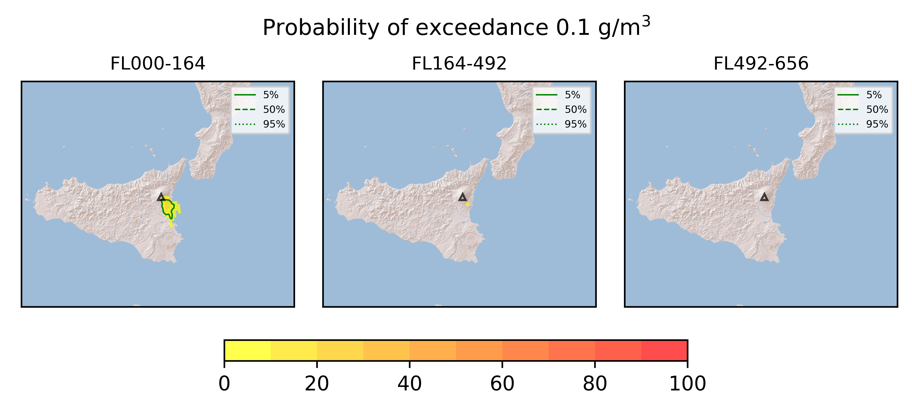
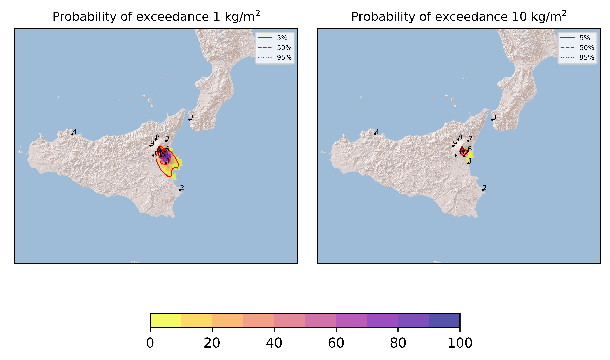
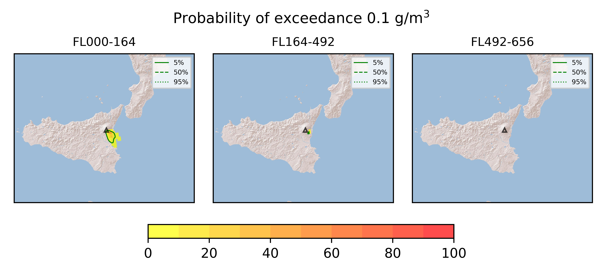
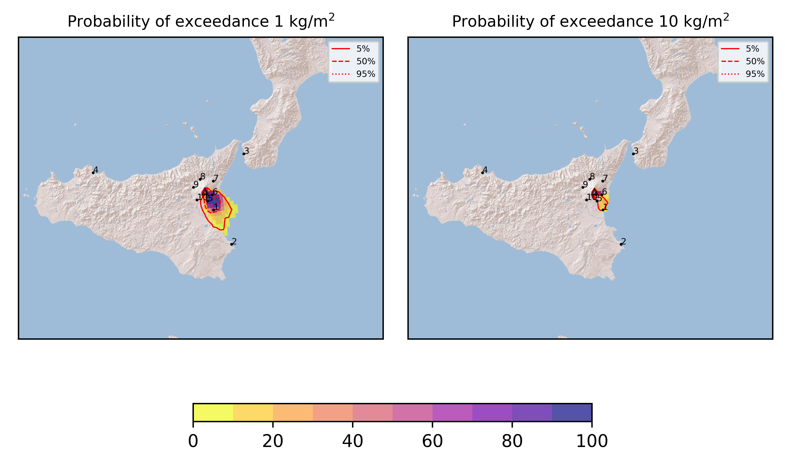

Forecast from VONA bulletin - 20210616_1143Z
============================================

Contents
========

* [Forecast products](#forecast-products)
	* [Forecast at 2021-06-16 14:40 Z](#forecast-at-2021-06-16-1440-z)
	* [Forecast at 2021-06-16 17:40 Z](#forecast-at-2021-06-16-1740-z)
	* [Forecast at 2021-06-16 15:00 Z](#forecast-at-2021-06-16-1500-z)
	* [Forecast at 2021-06-16 18:00 Z](#forecast-at-2021-06-16-1800-z)
	* [Forecast at 2021-06-16 21:00 Z](#forecast-at-2021-06-16-2100-z)

# Forecast products

## Forecast at 2021-06-16 14:40 Z
  

|Eruption start [Z]|Eruption end [Z]|Forecast time [Z]|Column height asl [m]|
| :--- | :--- | :--- | :--- |
|2021-06-16 11:40:00|Ongoing|2021-06-16 14:40:00|4000 ± 500 - from VONA|
  
  

|Percentile|MER [kg/s¹]|Mass in the air [kg]|Mass on the ground [kg]|
| :--- | :--- | :--- | :--- |
|5th|4.55e+01|2.72e+04|4.42e+05|
|50th|1.59e+03|2.87e+05|1.61e+07|
|95th|9.15e+03|8.71e+06|9.62e+07|
  

### Ground 2021-06-16 14:40 Z
  
  
  
  
  
  
  
  
  
  
  

|Location|Ground load [kg/m²] 5th perc|Ground load [kg/m²] 50th perc|Ground load [kg/m²] 95th perc|
| :--- | :--- | :--- | :--- |
|Catania AP (1)|0.00e+00|5.15e-05|1.82e-02|
|Siracusa (2)|0.00e+00|0.00e+00|0.00e+00|
|Reggio Calabria AP (3)|0.00e+00|0.00e+00|0.00e+00|
|Palermo AP (4)|0.00e+00|0.00e+00|0.00e+00|
|Nicolosi (5)|7.25e-04|2.17e-02|3.11e-01|
|Zafferana (6)|0.00e+00|5.53e-03|7.27e-02|
|Linguaglossa (7)|0.00e+00|0.00e+00|0.00e+00|
|Randazzo (8)|0.00e+00|0.00e+00|0.00e+00|
|Bronte (9)|0.00e+00|0.00e+00|0.00e+00|
|Biancavilla (10)|0.00e+00|7.03e-05|1.29e-03|
  

### Atmosphere 2021-06-16 14:40 Z
  

## Forecast at 2021-06-16 17:40 Z
  

|Eruption start [Z]|Eruption end [Z]|Forecast time [Z]|Column height asl [m]|
| :--- | :--- | :--- | :--- |
|2021-06-16 11:40:00|Ongoing|2021-06-16 17:40:00|4000 ± 500 - from VONA|
  
  

|Percentile|MER [kg/s¹]|Mass in the air [kg]|Mass on the ground [kg]|
| :--- | :--- | :--- | :--- |
|5th|4.55e+01|1.07e+04|9.28e+05|
|50th|1.95e+03|8.43e+05|4.76e+07|
|95th|6.66e+03|4.96e+06|1.24e+08|
  

### Ground 2021-06-16 17:40 Z
  
  
  
  
  
  
  
  
  
  
  

|Location|Ground load [kg/m²] 5th perc|Ground load [kg/m²] 50th perc|Ground load [kg/m²] 95th perc|
| :--- | :--- | :--- | :--- |
|Catania AP (1)|0.00e+00|5.14e-04|2.66e-02|
|Siracusa (2)|0.00e+00|0.00e+00|0.00e+00|
|Reggio Calabria AP (3)|0.00e+00|0.00e+00|0.00e+00|
|Palermo AP (4)|0.00e+00|0.00e+00|0.00e+00|
|Nicolosi (5)|1.58e-03|8.31e-02|3.99e-01|
|Zafferana (6)|3.67e-04|3.23e-02|1.93e-01|
|Linguaglossa (7)|0.00e+00|0.00e+00|0.00e+00|
|Randazzo (8)|0.00e+00|0.00e+00|0.00e+00|
|Bronte (9)|0.00e+00|0.00e+00|0.00e+00|
|Biancavilla (10)|0.00e+00|2.38e-04|1.77e-03|
  

### Atmosphere 2021-06-16 17:40 Z
  

## Forecast at 2021-06-16 15:00 Z
  

|Eruption start [Z]|Eruption end [Z]|Forecast time [Z]|Column height asl [m]|
| :--- | :--- | :--- | :--- |
|2021-06-16 11:40:00|Ongoing|2021-06-16 15:00:00|8000 ± 500 - from VONA|
  
  

|Percentile|MER [kg/s¹]|Mass in the air [kg]|Mass on the ground [kg]|
| :--- | :--- | :--- | :--- |
|5th|3.69e+04|2.70e+07|3.62e+08|
|50th|1.08e+05|9.90e+07|8.73e+08|
|95th|2.00e+05|5.04e+08|1.96e+09|
  

### Ground 2021-06-16 15:00 Z
  
  
  
  
  
  
  
  
  
  
  

|Location|Ground load [kg/m²] 5th perc|Ground load [kg/m²] 50th perc|Ground load [kg/m²] 95th perc|
| :--- | :--- | :--- | :--- |
|Catania AP (1)|2.94e-03|3.06e-01|4.24e+00|
|Siracusa (2)|0.00e+00|0.00e+00|1.67e-02|
|Reggio Calabria AP (3)|0.00e+00|0.00e+00|0.00e+00|
|Palermo AP (4)|0.00e+00|0.00e+00|0.00e+00|
|Nicolosi (5)|1.44e-01|1.50e+00|4.26e+00|
|Zafferana (6)|1.58e-03|1.05e-01|2.36e+00|
|Linguaglossa (7)|0.00e+00|0.00e+00|0.00e+00|
|Randazzo (8)|0.00e+00|0.00e+00|0.00e+00|
|Bronte (9)|0.00e+00|0.00e+00|9.30e-06|
|Biancavilla (10)|1.22e-06|1.37e-04|5.39e-03|
  

### Atmosphere 2021-06-16 15:00 Z
  

## Forecast at 2021-06-16 18:00 Z
  

|Eruption start [Z]|Eruption end [Z]|Forecast time [Z]|Column height asl [m]|
| :--- | :--- | :--- | :--- |
|2021-06-16 11:40:00|Ongoing|2021-06-16 18:00:00|8000 ± 500 - from VONA|
  
  

|Percentile|MER [kg/s¹]|Mass in the air [kg]|Mass on the ground [kg]|
| :--- | :--- | :--- | :--- |
|5th|4.63e+04|2.96e+07|1.15e+09|
|50th|1.22e+05|1.44e+08|2.46e+09|
|95th|2.37e+05|6.07e+08|3.21e+09|
  

### Ground 2021-06-16 18:00 Z
  
  
  
  
  
  
  
  
  
  
  

|Location|Ground load [kg/m²] 5th perc|Ground load [kg/m²] 50th perc|Ground load [kg/m²] 95th perc|
| :--- | :--- | :--- | :--- |
|Catania AP (1)|2.10e-01|1.51e+00|6.05e+00|
|Siracusa (2)|0.00e+00|9.89e-04|5.45e-02|
|Reggio Calabria AP (3)|0.00e+00|0.00e+00|0.00e+00|
|Palermo AP (4)|0.00e+00|0.00e+00|0.00e+00|
|Nicolosi (5)|1.18e+00|3.62e+00|5.77e+00|
|Zafferana (6)|2.75e-01|9.80e-01|3.26e+00|
|Linguaglossa (7)|0.00e+00|0.00e+00|0.00e+00|
|Randazzo (8)|0.00e+00|0.00e+00|0.00e+00|
|Bronte (9)|0.00e+00|0.00e+00|3.26e-05|
|Biancavilla (10)|3.78e-05|1.23e-03|6.11e-03|
  

### Atmosphere 2021-06-16 18:00 Z
  

## Forecast at 2021-06-16 21:00 Z
  

|Eruption start [Z]|Eruption end [Z]|Forecast time [Z]|Column height asl [m]|
| :--- | :--- | :--- | :--- |
|2021-06-16 11:40:00|Ongoing|2021-06-16 21:00:00|8000 ± 500 - from VONA|
  
  

|Percentile|MER [kg/s¹]|Mass in the air [kg]|Mass on the ground [kg]|
| :--- | :--- | :--- | :--- |
|5th|4.33e+04|2.54e+07|2.36e+09|
|50th|1.19e+05|1.11e+08|3.76e+09|
|95th|2.37e+05|7.43e+08|4.50e+09|
  

### Ground 2021-06-16 21:00 Z
  
  
  
  
  
  
  
  
  
  
  

|Location|Ground load [kg/m²] 5th perc|Ground load [kg/m²] 50th perc|Ground load [kg/m²] 95th perc|
| :--- | :--- | :--- | :--- |
|Catania AP (1)|3.23e-01|2.59e+00|8.70e+00|
|Siracusa (2)|0.00e+00|2.31e-03|1.47e-01|
|Reggio Calabria AP (3)|0.00e+00|0.00e+00|0.00e+00|
|Palermo AP (4)|0.00e+00|0.00e+00|0.00e+00|
|Nicolosi (5)|3.11e+00|4.99e+00|6.90e+00|
|Zafferana (6)|7.46e-01|2.14e+00|4.57e+00|
|Linguaglossa (7)|0.00e+00|0.00e+00|0.00e+00|
|Randazzo (8)|0.00e+00|0.00e+00|0.00e+00|
|Bronte (9)|0.00e+00|0.00e+00|3.26e-05|
|Biancavilla (10)|1.87e-04|1.82e-03|6.34e-03|
  

### Atmosphere 2021-06-16 21:00 Z
  
  
Go to [Supplementary page](Supplementary_page.md)  
Go to [Main directory](https://github.com/federicapardini/Real_time_ash_forecast)