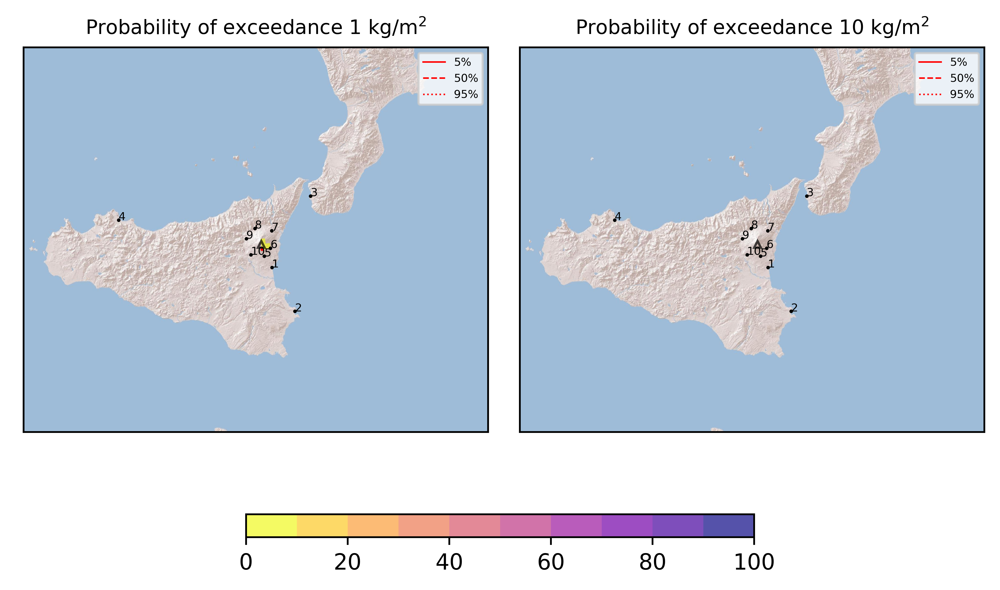

Forecast from VONA bulletin - 20210617_0542Z
============================================

Contents
========

* [Forecast products](#forecast-products)
	* [Forecast at 2021-06-17 08:40 Z](#forecast-at-2021-06-17-0840-z)

# Forecast products

## Forecast at 2021-06-17 08:40 Z
  

|Eruption start [Z]|Eruption end [Z]|Forecast time [Z]|Column height asl [m]|
| :--- | :--- | :--- | :--- |
|2021-06-17 05:40:00|Ongoing|2021-06-17 08:40:00|4000 ± 500 - from VONA|
  
  

|Percentile|MER [kg/s¹]|Mass in the air [kg]|Mass on the ground [kg]|
| :--- | :--- | :--- | :--- |
|5th|4.54e+01|2.52e+04|3.76e+05|
|50th|6.20e+02|1.04e+05|6.55e+06|
|95th|8.18e+03|4.61e+06|7.31e+07|
  

### Ground 2021-06-17 08:40 Z
  
  
  
  
  
  
  
  
  
  
  

|Location|Ground load [kg/m²] 5th perc|Ground load [kg/m²] 50th perc|Ground load [kg/m²] 95th perc|
| :--- | :--- | :--- | :--- |
|Catania AP (1)|0.00e+00|1.25e-05|1.16e-02|
|Siracusa (2)|0.00e+00|0.00e+00|0.00e+00|
|Reggio Calabria AP (3)|0.00e+00|0.00e+00|0.00e+00|
|Palermo AP (4)|0.00e+00|0.00e+00|0.00e+00|
|Nicolosi (5)|3.25e-04|2.75e-03|1.02e-01|
|Zafferana (6)|1.35e-05|3.72e-03|1.26e-01|
|Linguaglossa (7)|0.00e+00|0.00e+00|0.00e+00|
|Randazzo (8)|0.00e+00|0.00e+00|0.00e+00|
|Bronte (9)|0.00e+00|0.00e+00|0.00e+00|
|Biancavilla (10)|0.00e+00|0.00e+00|8.71e-05|
  

### Atmosphere 2021-06-17 08:40 Z
  
  
Go to [Supplementary page](Supplementary_page.md)  
Go to [Main directory](https://github.com/federicapardini/Real_time_ash_forecast)