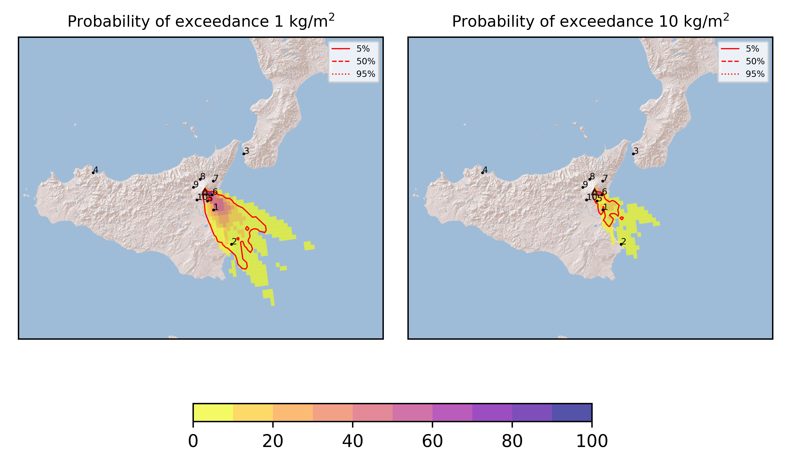
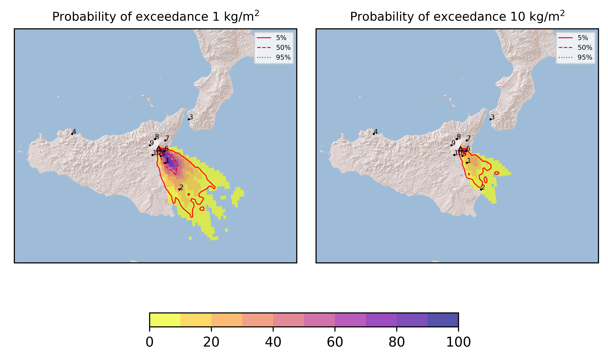
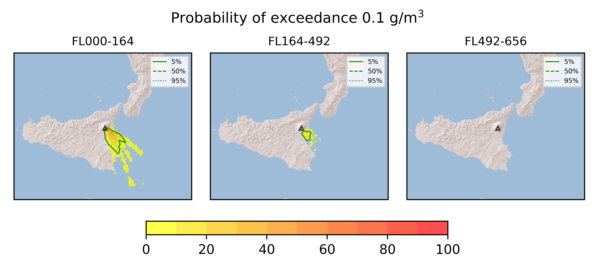

Forecast from VONA bulletin - 20210617_2320Z
============================================

Contents
========

* [Forecast products](#forecast-products)
	* [Forecast at 2021-06-18 02:20 Z](#forecast-at-2021-06-18-0220-z)
	* [Forecast at 2021-06-18 05:20 Z](#forecast-at-2021-06-18-0520-z)

# Forecast products

## Forecast at 2021-06-18 02:20 Z
  

|Eruption start [Z]|Eruption end [Z]|Forecast time [Z]|Column height asl [m]|
| :--- | :--- | :--- | :--- |
|2021-06-17 23:20:00|Ongoing|2021-06-18 02:20:00|[6000 m, 12000 m]|
  
  

|Percentile|MER [kg/s¹]|Mass in the air [kg]|Mass on the ground [kg]|
| :--- | :--- | :--- | :--- |
|5th|6.80e+04|4.83e+07|5.54e+08|
|50th|4.03e+05|3.82e+08|3.62e+09|
|95th|2.84e+06|7.11e+09|2.18e+10|
  

### Ground 2021-06-18 02:20 Z
  
  
  
  
  
  
  
  
  
  
  

|Location|Ground load [kg/m²] 5th perc|Ground load [kg/m²] 50th perc|Ground load [kg/m²] 95th perc|
| :--- | :--- | :--- | :--- |
|Catania AP (1)|7.28e-05|6.08e-01|8.76e+00|
|Siracusa (2)|0.00e+00|0.00e+00|2.75e+00|
|Reggio Calabria AP (3)|0.00e+00|0.00e+00|0.00e+00|
|Palermo AP (4)|0.00e+00|0.00e+00|0.00e+00|
|Nicolosi (5)|3.78e-04|6.28e-01|1.36e+01|
|Zafferana (6)|0.00e+00|1.86e-02|2.12e+01|
|Linguaglossa (7)|0.00e+00|0.00e+00|0.00e+00|
|Randazzo (8)|0.00e+00|0.00e+00|0.00e+00|
|Bronte (9)|0.00e+00|0.00e+00|0.00e+00|
|Biancavilla (10)|0.00e+00|0.00e+00|4.49e-06|
  

### Atmosphere 2021-06-18 02:20 Z
  

## Forecast at 2021-06-18 05:20 Z
  

|Eruption start [Z]|Eruption end [Z]|Forecast time [Z]|Column height asl [m]|
| :--- | :--- | :--- | :--- |
|2021-06-17 23:20:00|Ongoing|2021-06-18 05:20:00|[6000 m, 12000 m]|
  
  

|Percentile|MER [kg/s¹]|Mass in the air [kg]|Mass on the ground [kg]|
| :--- | :--- | :--- | :--- |
|5th|1.05e+05|6.46e+07|2.80e+09|
|50th|4.72e+05|7.39e+08|9.11e+09|
|95th|1.33e+06|2.18e+09|3.13e+10|
  

### Ground 2021-06-18 05:20 Z
  
  
  
  
  
  
  
  
  
  
  

|Location|Ground load [kg/m²] 5th perc|Ground load [kg/m²] 50th perc|Ground load [kg/m²] 95th perc|
| :--- | :--- | :--- | :--- |
|Catania AP (1)|2.78e-01|2.76e+00|1.36e+01|
|Siracusa (2)|0.00e+00|2.85e-03|7.42e+00|
|Reggio Calabria AP (3)|0.00e+00|0.00e+00|0.00e+00|
|Palermo AP (4)|0.00e+00|0.00e+00|0.00e+00|
|Nicolosi (5)|4.24e-01|3.04e+00|3.32e+01|
|Zafferana (6)|5.23e-05|9.37e-01|3.69e+01|
|Linguaglossa (7)|0.00e+00|0.00e+00|0.00e+00|
|Randazzo (8)|0.00e+00|0.00e+00|0.00e+00|
|Bronte (9)|0.00e+00|0.00e+00|0.00e+00|
|Biancavilla (10)|0.00e+00|0.00e+00|4.79e-05|
  

### Atmosphere 2021-06-18 05:20 Z
  
  
Go to [Supplementary page](Supplementary_page.md)  
Go to [Main directory](https://github.com/federicapardini/Real_time_ash_forecast)