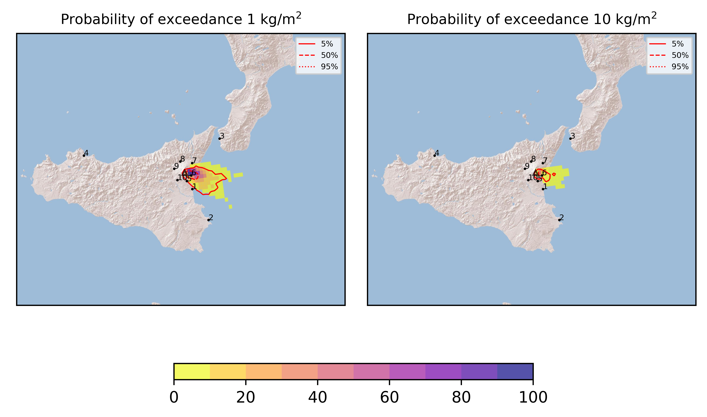
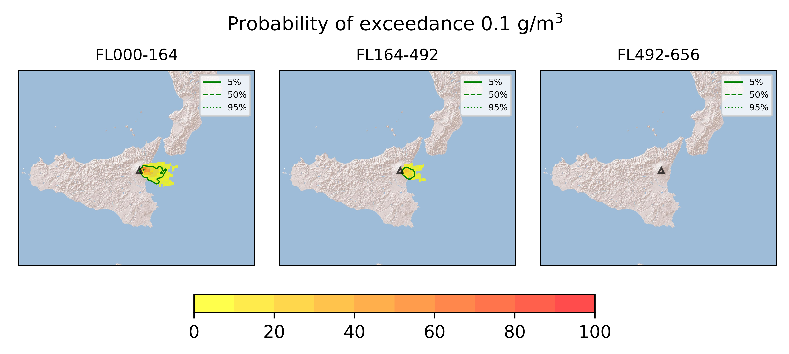

Forecast from VONA bulletin - 20210620_2219Z
============================================

Contents
========

* [Forecast products](#forecast-products)
	* [Forecast at 2021-06-21 01:20 Z](#forecast-at-2021-06-21-0120-z)

# Forecast products

## Forecast at 2021-06-21 01:20 Z
  

|Eruption start [Z]|Eruption end [Z]|Forecast time [Z]|Column height asl [m]|
| :--- | :--- | :--- | :--- |
|2021-06-20 22:20:00|Ongoing|2021-06-21 01:20:00|[6000 m, 12000 m]|
  
  

|Percentile|MER [kg/s¹]|Mass in the air [kg]|Mass on the ground [kg]|
| :--- | :--- | :--- | :--- |
|5th|4.10e+04|2.26e+07|3.85e+08|
|50th|1.88e+05|2.27e+08|1.55e+09|
|95th|1.09e+06|2.64e+09|7.42e+09|
  

### Ground 2021-06-21 01:20 Z
  
  
  
  
  
  
  
  
  
  
  

|Location|Ground load [kg/m²] 5th perc|Ground load [kg/m²] 50th perc|Ground load [kg/m²] 95th perc|
| :--- | :--- | :--- | :--- |
|Catania AP (1)|0.00e+00|1.46e-04|1.51e-01|
|Siracusa (2)|0.00e+00|0.00e+00|0.00e+00|
|Reggio Calabria AP (3)|0.00e+00|0.00e+00|0.00e+00|
|Palermo AP (4)|0.00e+00|0.00e+00|0.00e+00|
|Nicolosi (5)|2.30e-05|1.96e-02|7.00e-01|
|Zafferana (6)|7.14e-01|2.51e+00|1.15e+01|
|Linguaglossa (7)|0.00e+00|3.35e-05|8.55e-03|
|Randazzo (8)|0.00e+00|0.00e+00|0.00e+00|
|Bronte (9)|0.00e+00|0.00e+00|0.00e+00|
|Biancavilla (10)|0.00e+00|0.00e+00|1.89e-05|
  

### Atmosphere 2021-06-21 01:20 Z
  
  
Go to [Supplementary page](Supplementary_page.md)  
Go to [Main directory](https://github.com/federicapardini/Real_time_ash_forecast)