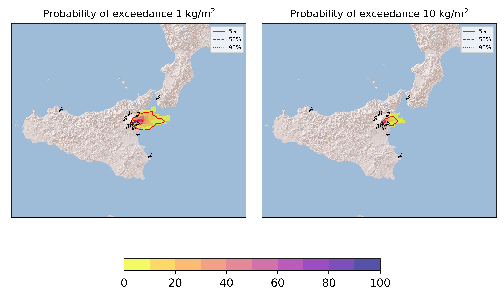
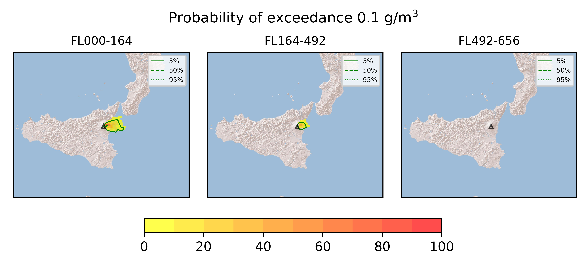

Forecast from VONA bulletin - 20210622_0305Z
============================================

Contents
========

* [Forecast products](#forecast-products)
	* [Forecast at 2021-06-22 06:10 Z](#forecast-at-2021-06-22-0610-z)

# Forecast products

## Forecast at 2021-06-22 06:10 Z
  

|Eruption start [Z]|Eruption end [Z]|Forecast time [Z]|Column height asl [m]|
| :--- | :--- | :--- | :--- |
|2021-06-22 03:10:00|Ongoing|2021-06-22 06:10:00|[6000 m, 12000 m]|
  
  

|Percentile|MER [kg/s¹]|Mass in the air [kg]|Mass on the ground [kg]|
| :--- | :--- | :--- | :--- |
|5th|1.84e+04|1.15e+07|1.88e+08|
|50th|2.02e+05|1.97e+08|1.85e+09|
|95th|8.95e+05|1.88e+09|7.23e+09|
  

### Ground 2021-06-22 06:10 Z
  
  
  
  
  
  
  
  
  
  
  

|Location|Ground load [kg/m²] 5th perc|Ground load [kg/m²] 50th perc|Ground load [kg/m²] 95th perc|
| :--- | :--- | :--- | :--- |
|Catania AP (1)|0.00e+00|0.00e+00|3.80e-05|
|Siracusa (2)|0.00e+00|0.00e+00|0.00e+00|
|Reggio Calabria AP (3)|0.00e+00|0.00e+00|1.11e-03|
|Palermo AP (4)|0.00e+00|0.00e+00|0.00e+00|
|Nicolosi (5)|0.00e+00|3.12e-04|2.63e-02|
|Zafferana (6)|2.49e-02|8.14e-01|5.40e+00|
|Linguaglossa (7)|1.08e-05|1.48e-02|2.35e+00|
|Randazzo (8)|0.00e+00|0.00e+00|0.00e+00|
|Bronte (9)|0.00e+00|0.00e+00|0.00e+00|
|Biancavilla (10)|0.00e+00|0.00e+00|2.84e-05|
  

### Atmosphere 2021-06-22 06:10 Z
  
  
Go to [Supplementary page](Supplementary_page.md)  
Go to [Main directory](https://github.com/federicapardini/Real_time_ash_forecast)