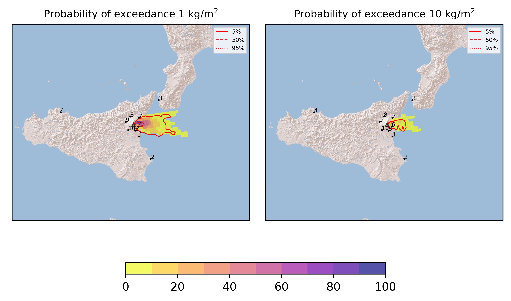
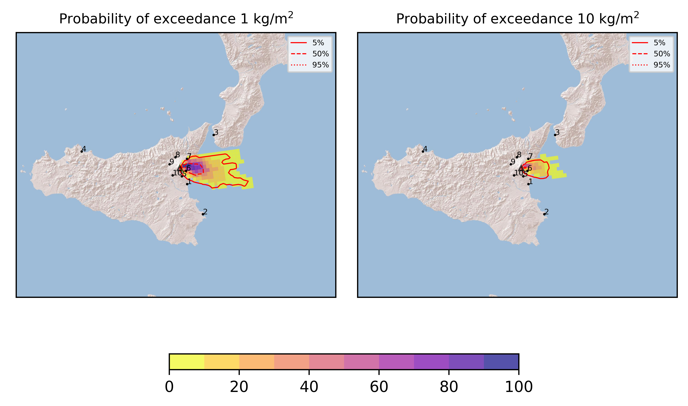
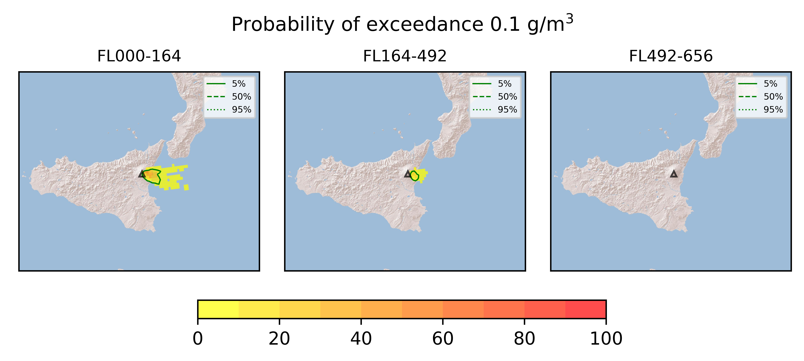

Forecast from VONA bulletin - 20210623_0125Z
============================================

Contents
========

* [Forecast products](#forecast-products)
	* [Forecast at 2021-06-23 04:30 Z](#forecast-at-2021-06-23-0430-z)
	* [Forecast at 2021-06-23 07:30 Z](#forecast-at-2021-06-23-0730-z)

# Forecast products

## Forecast at 2021-06-23 04:30 Z
  

|Eruption start [Z]|Eruption end [Z]|Forecast time [Z]|Column height asl [m]|
| :--- | :--- | :--- | :--- |
|2021-06-23 01:30:00|Ongoing|2021-06-23 04:30:00|[6000 m, 12000 m]|
  
  

|Percentile|MER [kg/s¹]|Mass in the air [kg]|Mass on the ground [kg]|
| :--- | :--- | :--- | :--- |
|5th|1.93e+04|1.01e+07|2.31e+08|
|50th|1.54e+05|1.40e+08|1.48e+09|
|95th|1.36e+06|2.99e+09|1.15e+10|
  

### Ground 2021-06-23 04:30 Z
  
  
  
  
  
  
  
  
  
  
  

|Location|Ground load [kg/m²] 5th perc|Ground load [kg/m²] 50th perc|Ground load [kg/m²] 95th perc|
| :--- | :--- | :--- | :--- |
|Catania AP (1)|0.00e+00|0.00e+00|6.14e-04|
|Siracusa (2)|0.00e+00|0.00e+00|0.00e+00|
|Reggio Calabria AP (3)|0.00e+00|0.00e+00|0.00e+00|
|Palermo AP (4)|0.00e+00|0.00e+00|0.00e+00|
|Nicolosi (5)|0.00e+00|5.10e-05|4.26e-02|
|Zafferana (6)|1.84e-01|1.88e+00|2.72e+01|
|Linguaglossa (7)|0.00e+00|8.97e-04|1.59e-01|
|Randazzo (8)|0.00e+00|0.00e+00|0.00e+00|
|Bronte (9)|0.00e+00|0.00e+00|0.00e+00|
|Biancavilla (10)|0.00e+00|0.00e+00|0.00e+00|
  

### Atmosphere 2021-06-23 04:30 Z
  

## Forecast at 2021-06-23 07:30 Z
  

|Eruption start [Z]|Eruption end [Z]|Forecast time [Z]|Column height asl [m]|
| :--- | :--- | :--- | :--- |
|2021-06-23 01:30:00|Ongoing|2021-06-23 07:30:00|[6000 m, 12000 m]|
  
  

|Percentile|MER [kg/s¹]|Mass in the air [kg]|Mass on the ground [kg]|
| :--- | :--- | :--- | :--- |
|5th|1.51e+04|2.46e+07|9.04e+08|
|50th|1.42e+05|2.81e+08|3.83e+09|
|95th|1.12e+06|1.67e+09|1.88e+10|
  

### Ground 2021-06-23 07:30 Z
  
  
  
  
  
  
  
  
  
  
  

|Location|Ground load [kg/m²] 5th perc|Ground load [kg/m²] 50th perc|Ground load [kg/m²] 95th perc|
| :--- | :--- | :--- | :--- |
|Catania AP (1)|0.00e+00|2.98e-06|7.09e-03|
|Siracusa (2)|0.00e+00|0.00e+00|0.00e+00|
|Reggio Calabria AP (3)|0.00e+00|0.00e+00|0.00e+00|
|Palermo AP (4)|0.00e+00|0.00e+00|0.00e+00|
|Nicolosi (5)|3.57e-06|1.25e-03|1.25e-01|
|Zafferana (6)|4.04e-01|4.58e+00|4.01e+01|
|Linguaglossa (7)|0.00e+00|8.92e-03|3.07e-01|
|Randazzo (8)|0.00e+00|0.00e+00|0.00e+00|
|Bronte (9)|0.00e+00|0.00e+00|0.00e+00|
|Biancavilla (10)|0.00e+00|0.00e+00|2.33e-05|
  

### Atmosphere 2021-06-23 07:30 Z
  
  
Go to [Supplementary page](Supplementary_page.md)  
Go to [Main directory](https://github.com/federicapardini/Real_time_ash_forecast)