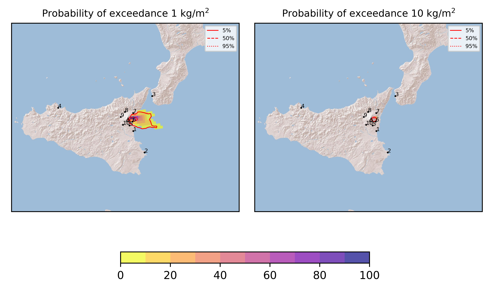
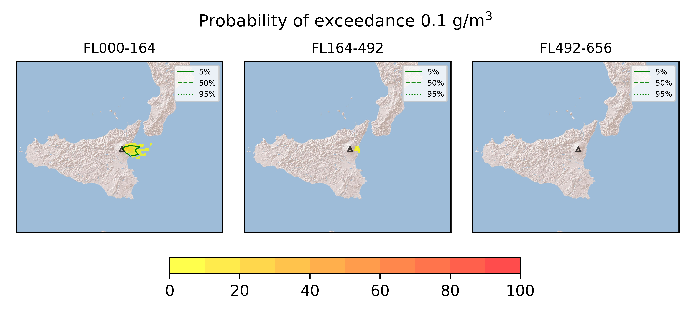
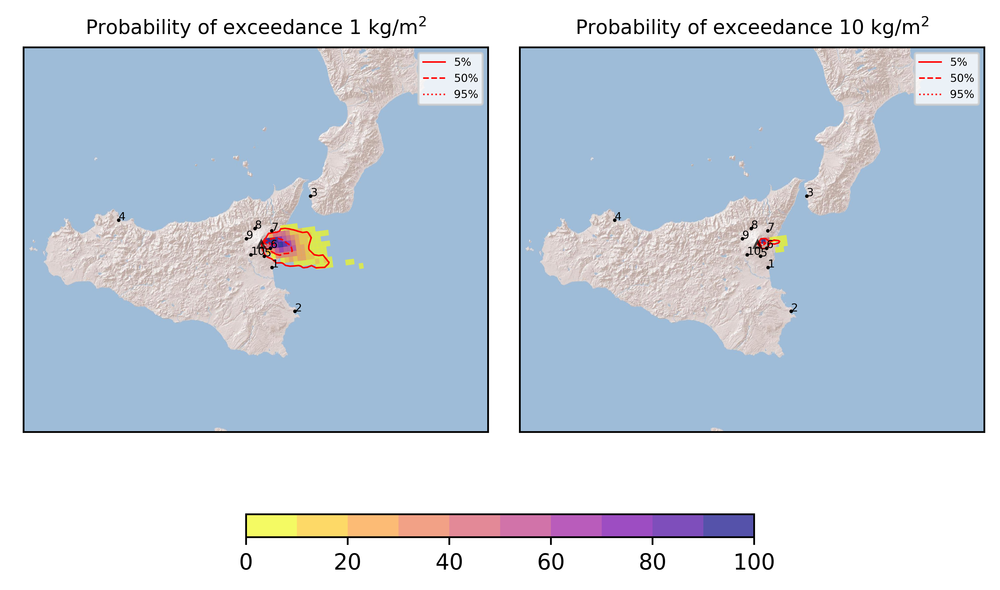

Forecast from VONA bulletin - 20210623_0318Z
============================================

Contents
========

* [Forecast products](#forecast-products)
	* [Forecast at 2021-06-23 06:20 Z](#forecast-at-2021-06-23-0620-z)
	* [Forecast at 2021-06-23 09:20 Z](#forecast-at-2021-06-23-0920-z)

# Forecast products

## Forecast at 2021-06-23 06:20 Z
  

|Eruption start [Z]|Eruption end [Z]|Forecast time [Z]|Column height asl [m]|
| :--- | :--- | :--- | :--- |
|2021-06-23 03:20:00|Ongoing|2021-06-23 06:20:00|9000 ± 500 - from VONA|
  
  

|Percentile|MER [kg/s¹]|Mass in the air [kg]|Mass on the ground [kg]|
| :--- | :--- | :--- | :--- |
|5th|7.81e+04|4.59e+07|6.01e+08|
|50th|1.43e+05|1.74e+08|1.14e+09|
|95th|2.82e+05|7.24e+08|2.39e+09|
  

### Ground 2021-06-23 06:20 Z
  
  
  
  
  
  
  
  
  
  
  

|Location|Ground load [kg/m²] 5th perc|Ground load [kg/m²] 50th perc|Ground load [kg/m²] 95th perc|
| :--- | :--- | :--- | :--- |
|Catania AP (1)|0.00e+00|0.00e+00|5.64e-04|
|Siracusa (2)|0.00e+00|0.00e+00|0.00e+00|
|Reggio Calabria AP (3)|0.00e+00|0.00e+00|0.00e+00|
|Palermo AP (4)|0.00e+00|0.00e+00|0.00e+00|
|Nicolosi (5)|0.00e+00|1.32e-04|3.43e-02|
|Zafferana (6)|2.17e-01|1.04e+00|4.67e+00|
|Linguaglossa (7)|0.00e+00|7.07e-04|1.27e-01|
|Randazzo (8)|0.00e+00|0.00e+00|0.00e+00|
|Bronte (9)|0.00e+00|0.00e+00|0.00e+00|
|Biancavilla (10)|0.00e+00|0.00e+00|0.00e+00|
  

### Atmosphere 2021-06-23 06:20 Z
  

## Forecast at 2021-06-23 09:20 Z
  

|Eruption start [Z]|Eruption end [Z]|Forecast time [Z]|Column height asl [m]|
| :--- | :--- | :--- | :--- |
|2021-06-23 03:20:00|Ongoing|2021-06-23 09:20:00|9000 ± 500 - from VONA|
  
  

|Percentile|MER [kg/s¹]|Mass in the air [kg]|Mass on the ground [kg]|
| :--- | :--- | :--- | :--- |
|5th|5.95e+04|6.44e+07|1.63e+09|
|50th|1.28e+05|1.83e+08|2.59e+09|
|95th|2.24e+05|5.79e+08|4.06e+09|
  

### Ground 2021-06-23 09:20 Z
  
  
  
  
  
  
  
  
  
  
  

|Location|Ground load [kg/m²] 5th perc|Ground load [kg/m²] 50th perc|Ground load [kg/m²] 95th perc|
| :--- | :--- | :--- | :--- |
|Catania AP (1)|0.00e+00|5.22e-05|1.32e-02|
|Siracusa (2)|0.00e+00|0.00e+00|0.00e+00|
|Reggio Calabria AP (3)|0.00e+00|0.00e+00|0.00e+00|
|Palermo AP (4)|0.00e+00|0.00e+00|0.00e+00|
|Nicolosi (5)|2.13e-05|7.32e-03|2.05e-01|
|Zafferana (6)|6.80e-01|2.91e+00|7.24e+00|
|Linguaglossa (7)|0.00e+00|3.02e-03|1.31e-01|
|Randazzo (8)|0.00e+00|0.00e+00|0.00e+00|
|Bronte (9)|0.00e+00|0.00e+00|0.00e+00|
|Biancavilla (10)|0.00e+00|0.00e+00|7.21e-06|
  

### Atmosphere 2021-06-23 09:20 Z
  
  
Go to [Supplementary page](Supplementary_page.md)  
Go to [Main directory](https://github.com/federicapardini/Real_time_ash_forecast)