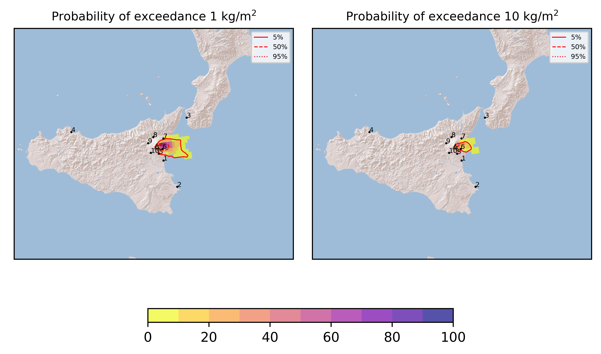
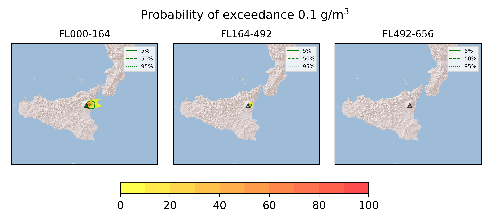

Forecast from VONA bulletin - 20210623_1816Z
============================================

Contents
========

* [Forecast products](#forecast-products)
	* [Forecast at 2021-06-23 21:20 Z](#forecast-at-2021-06-23-2120-z)
	* [Forecast at 2021-06-24 00:20 Z](#forecast-at-2021-06-24-0020-z)

# Forecast products

## Forecast at 2021-06-23 21:20 Z
  

|Eruption start [Z]|Eruption end [Z]|Forecast time [Z]|Column height asl [m]|
| :--- | :--- | :--- | :--- |
|2021-06-23 18:20:00|Ongoing|2021-06-23 21:20:00|[6000 m, 12000 m]|
  
  

|Percentile|MER [kg/s¹]|Mass in the air [kg]|Mass on the ground [kg]|
| :--- | :--- | :--- | :--- |
|5th|1.74e+04|1.07e+07|1.72e+08|
|50th|1.70e+05|1.63e+08|1.57e+09|
|95th|8.08e+05|1.76e+09|6.70e+09|
  

### Ground 2021-06-23 21:20 Z
  
  
  
  
  
  
  
  
  
  
  

|Location|Ground load [kg/m²] 5th perc|Ground load [kg/m²] 50th perc|Ground load [kg/m²] 95th perc|
| :--- | :--- | :--- | :--- |
|Catania AP (1)|0.00e+00|0.00e+00|5.74e-04|
|Siracusa (2)|0.00e+00|0.00e+00|0.00e+00|
|Reggio Calabria AP (3)|0.00e+00|0.00e+00|0.00e+00|
|Palermo AP (4)|0.00e+00|0.00e+00|0.00e+00|
|Nicolosi (5)|1.13e-05|5.06e-03|2.19e-01|
|Zafferana (6)|1.97e-01|2.01e+00|1.16e+01|
|Linguaglossa (7)|0.00e+00|1.35e-03|4.23e-01|
|Randazzo (8)|0.00e+00|0.00e+00|0.00e+00|
|Bronte (9)|0.00e+00|0.00e+00|0.00e+00|
|Biancavilla (10)|0.00e+00|0.00e+00|6.34e-05|
  

### Atmosphere 2021-06-23 21:20 Z
  

## Forecast at 2021-06-24 00:20 Z
  

|Eruption start [Z]|Eruption end [Z]|Forecast time [Z]|Column height asl [m]|
| :--- | :--- | :--- | :--- |
|2021-06-23 18:20:00|Ongoing|2021-06-24 00:20:00|[6000 m, 12000 m]|
  
  

|Percentile|MER [kg/s¹]|Mass in the air [kg]|Mass on the ground [kg]|
| :--- | :--- | :--- | :--- |
|5th|2.39e+04|5.80e+07|9.79e+08|
|50th|1.58e+05|2.08e+08|3.54e+09|
|95th|5.86e+05|7.64e+08|1.09e+10|
  

### Ground 2021-06-24 00:20 Z
  
  
  
  
  
  
  
  
  
  
  

|Location|Ground load [kg/m²] 5th perc|Ground load [kg/m²] 50th perc|Ground load [kg/m²] 95th perc|
| :--- | :--- | :--- | :--- |
|Catania AP (1)|0.00e+00|1.02e-05|5.82e-04|
|Siracusa (2)|0.00e+00|0.00e+00|0.00e+00|
|Reggio Calabria AP (3)|0.00e+00|0.00e+00|0.00e+00|
|Palermo AP (4)|0.00e+00|0.00e+00|0.00e+00|
|Nicolosi (5)|6.47e-04|1.04e-02|3.41e-01|
|Zafferana (6)|9.23e-01|5.43e+00|1.90e+01|
|Linguaglossa (7)|2.98e-05|4.48e-02|1.23e+00|
|Randazzo (8)|0.00e+00|0.00e+00|9.33e-06|
|Bronte (9)|0.00e+00|0.00e+00|0.00e+00|
|Biancavilla (10)|0.00e+00|0.00e+00|1.61e-04|
  

### Atmosphere 2021-06-24 00:20 Z
  
  
Go to [Supplementary page](Supplementary_page.md)  
Go to [Main directory](https://github.com/federicapardini/Real_time_ash_forecast)