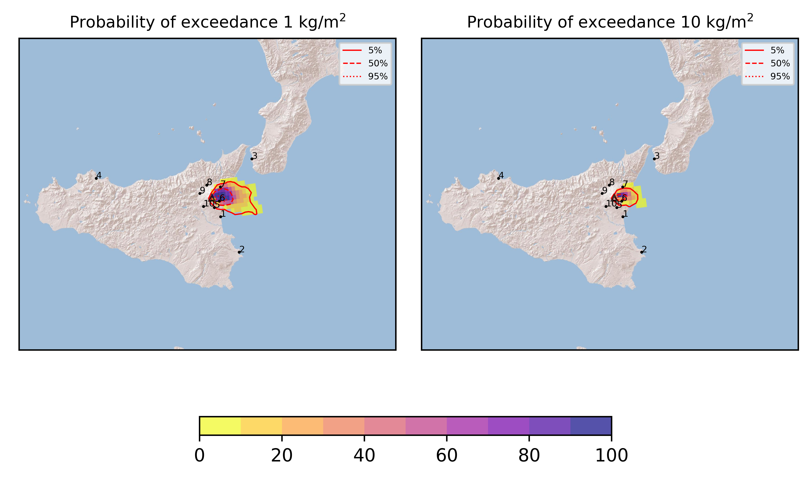
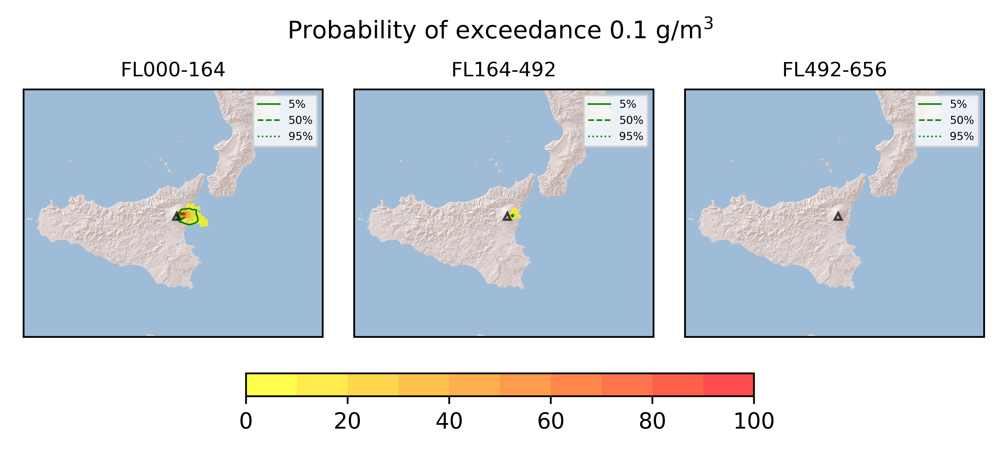

Forecast from VONA bulletin - 20210623_1816Z
============================================

Contents
========

* [Forecast products](#forecast-products)
	* [Forecast at 2021-06-23 21:20 Z](#forecast-at-2021-06-23-2120-z)
	* [Forecast at 2021-06-24 00:20 Z](#forecast-at-2021-06-24-0020-z)
	* [Forecast at 2021-06-24 03:20 Z](#forecast-at-2021-06-24-0320-z)
	* [Forecast at 2021-06-23 21:50 Z](#forecast-at-2021-06-23-2150-z)
	* [Forecast at 2021-06-24 00:50 Z](#forecast-at-2021-06-24-0050-z)
	* [Forecast at 2021-06-24 03:50 Z](#forecast-at-2021-06-24-0350-z)

# Forecast products

## Forecast at 2021-06-23 21:20 Z
  

|Eruption start [Z]|Eruption end [Z]|Forecast time [Z]|Column height asl [m]|
| :--- | :--- | :--- | :--- |
|2021-06-23 18:20:00|Ongoing|2021-06-23 21:20:00|[6000 m, 12000 m]|
  
  

|Percentile|MER [kg/s¹]|Mass in the air [kg]|Mass on the ground [kg]|
| :--- | :--- | :--- | :--- |
|5th|1.74e+04|1.07e+07|1.72e+08|
|50th|1.70e+05|1.63e+08|1.57e+09|
|95th|8.08e+05|1.76e+09|6.70e+09|
  

### Ground 2021-06-23 21:20 Z
  
  
  
  
  
  
  
  
  
  
  

|Location|Ground load [kg/m²] 5th perc|Ground load [kg/m²] 50th perc|Ground load [kg/m²] 95th perc|
| :--- | :--- | :--- | :--- |
|Catania AP (1)|0.00e+00|0.00e+00|5.74e-04|
|Siracusa (2)|0.00e+00|0.00e+00|0.00e+00|
|Reggio Calabria AP (3)|0.00e+00|0.00e+00|0.00e+00|
|Palermo AP (4)|0.00e+00|0.00e+00|0.00e+00|
|Nicolosi (5)|1.13e-05|5.06e-03|2.19e-01|
|Zafferana (6)|1.97e-01|2.01e+00|1.16e+01|
|Linguaglossa (7)|0.00e+00|1.35e-03|4.23e-01|
|Randazzo (8)|0.00e+00|0.00e+00|0.00e+00|
|Bronte (9)|0.00e+00|0.00e+00|0.00e+00|
|Biancavilla (10)|0.00e+00|0.00e+00|6.34e-05|
  

### Atmosphere 2021-06-23 21:20 Z
  

## Forecast at 2021-06-24 00:20 Z
  

|Eruption start [Z]|Eruption end [Z]|Forecast time [Z]|Column height asl [m]|
| :--- | :--- | :--- | :--- |
|2021-06-23 18:20:00|Ongoing|2021-06-24 00:20:00|[6000 m, 12000 m]|
  
  

|Percentile|MER [kg/s¹]|Mass in the air [kg]|Mass on the ground [kg]|
| :--- | :--- | :--- | :--- |
|5th|2.39e+04|5.80e+07|9.79e+08|
|50th|1.58e+05|2.08e+08|3.54e+09|
|95th|5.86e+05|7.64e+08|1.09e+10|
  

### Ground 2021-06-24 00:20 Z
  
  
  
  
  
  
  
  
  
  
  

|Location|Ground load [kg/m²] 5th perc|Ground load [kg/m²] 50th perc|Ground load [kg/m²] 95th perc|
| :--- | :--- | :--- | :--- |
|Catania AP (1)|0.00e+00|1.02e-05|5.82e-04|
|Siracusa (2)|0.00e+00|0.00e+00|0.00e+00|
|Reggio Calabria AP (3)|0.00e+00|0.00e+00|0.00e+00|
|Palermo AP (4)|0.00e+00|0.00e+00|0.00e+00|
|Nicolosi (5)|6.47e-04|1.04e-02|3.41e-01|
|Zafferana (6)|9.23e-01|5.43e+00|1.90e+01|
|Linguaglossa (7)|2.98e-05|4.48e-02|1.23e+00|
|Randazzo (8)|0.00e+00|0.00e+00|9.33e-06|
|Bronte (9)|0.00e+00|0.00e+00|0.00e+00|
|Biancavilla (10)|0.00e+00|0.00e+00|1.61e-04|
  

### Atmosphere 2021-06-24 00:20 Z
  

## Forecast at 2021-06-24 03:20 Z
  

|Eruption start [Z]|Eruption end [Z]|Forecast time [Z]|Column height asl [m]|
| :--- | :--- | :--- | :--- |
|2021-06-23 18:20:00|Ongoing|2021-06-24 03:20:00|[6000 m, 12000 m]|
  
  

|Percentile|MER [kg/s¹]|Mass in the air [kg]|Mass on the ground [kg]|
| :--- | :--- | :--- | :--- |
|5th|1.27e+04|1.79e+07|1.71e+09|
|50th|1.41e+05|1.48e+08|5.50e+09|
|95th|4.63e+05|9.35e+08|1.27e+10|
  

### Ground 2021-06-24 03:20 Z
  
  
  
  
  
  
  
  
  
  
  

|Location|Ground load [kg/m²] 5th perc|Ground load [kg/m²] 50th perc|Ground load [kg/m²] 95th perc|
| :--- | :--- | :--- | :--- |
|Catania AP (1)|0.00e+00|1.02e-05|5.82e-04|
|Siracusa (2)|0.00e+00|0.00e+00|0.00e+00|
|Reggio Calabria AP (3)|0.00e+00|0.00e+00|2.62e-05|
|Palermo AP (4)|0.00e+00|0.00e+00|0.00e+00|
|Nicolosi (5)|9.62e-04|2.30e-02|4.28e-01|
|Zafferana (6)|1.78e+00|7.87e+00|2.21e+01|
|Linguaglossa (7)|6.69e-04|4.61e-01|7.33e+00|
|Randazzo (8)|0.00e+00|0.00e+00|9.33e-05|
|Bronte (9)|0.00e+00|0.00e+00|0.00e+00|
|Biancavilla (10)|0.00e+00|2.72e-06|8.96e-04|
  

### Atmosphere 2021-06-24 03:20 Z
  

## Forecast at 2021-06-23 21:50 Z
  

|Eruption start [Z]|Eruption end [Z]|Forecast time [Z]|Column height asl [m]|
| :--- | :--- | :--- | :--- |
|2021-06-23 18:20:00|Ongoing|2021-06-23 21:50:00|9000 ± 500 - from VONA|
  
  

|Percentile|MER [kg/s¹]|Mass in the air [kg]|Mass on the ground [kg]|
| :--- | :--- | :--- | :--- |
|5th|8.47e+04|4.67e+07|9.58e+08|
|50th|1.82e+05|2.12e+08|1.85e+09|
|95th|2.84e+05|8.28e+08|2.62e+09|
  

### Ground 2021-06-23 21:50 Z
  
  
  
  
  
  
  
  
  
  
  

|Location|Ground load [kg/m²] 5th perc|Ground load [kg/m²] 50th perc|Ground load [kg/m²] 95th perc|
| :--- | :--- | :--- | :--- |
|Catania AP (1)|0.00e+00|7.95e-06|2.63e-04|
|Siracusa (2)|0.00e+00|0.00e+00|0.00e+00|
|Reggio Calabria AP (3)|0.00e+00|0.00e+00|0.00e+00|
|Palermo AP (4)|0.00e+00|0.00e+00|0.00e+00|
|Nicolosi (5)|6.89e-04|1.25e-02|2.05e-01|
|Zafferana (6)|7.17e-01|2.93e+00|8.41e+00|
|Linguaglossa (7)|2.16e-05|6.93e-03|4.11e-01|
|Randazzo (8)|0.00e+00|0.00e+00|0.00e+00|
|Bronte (9)|0.00e+00|0.00e+00|0.00e+00|
|Biancavilla (10)|0.00e+00|0.00e+00|2.12e-04|
  

### Atmosphere 2021-06-23 21:50 Z
  

## Forecast at 2021-06-24 00:50 Z
  

|Eruption start [Z]|Eruption end [Z]|Forecast time [Z]|Column height asl [m]|
| :--- | :--- | :--- | :--- |
|2021-06-23 18:20:00|Ongoing|2021-06-24 00:50:00|9000 ± 500 - from VONA|
  
  

|Percentile|MER [kg/s¹]|Mass in the air [kg]|Mass on the ground [kg]|
| :--- | :--- | :--- | :--- |
|5th|7.78e+04|4.46e+07|2.53e+09|
|50th|1.61e+05|1.83e+08|3.42e+09|
|95th|2.53e+05|7.99e+08|4.69e+09|
  

### Ground 2021-06-24 00:50 Z
  
  
  
  
  
  
  
  
  
  
  

|Location|Ground load [kg/m²] 5th perc|Ground load [kg/m²] 50th perc|Ground load [kg/m²] 95th perc|
| :--- | :--- | :--- | :--- |
|Catania AP (1)|0.00e+00|1.52e-05|2.69e-04|
|Siracusa (2)|0.00e+00|0.00e+00|0.00e+00|
|Reggio Calabria AP (3)|0.00e+00|0.00e+00|0.00e+00|
|Palermo AP (4)|0.00e+00|0.00e+00|0.00e+00|
|Nicolosi (5)|6.89e-03|3.65e-02|2.23e-01|
|Zafferana (6)|3.32e+00|6.50e+00|1.20e+01|
|Linguaglossa (7)|5.39e-03|9.50e-02|1.40e+00|
|Randazzo (8)|0.00e+00|0.00e+00|0.00e+00|
|Bronte (9)|0.00e+00|0.00e+00|0.00e+00|
|Biancavilla (10)|0.00e+00|1.50e-05|3.56e-04|
  

### Atmosphere 2021-06-24 00:50 Z
  

## Forecast at 2021-06-24 03:50 Z
  

|Eruption start [Z]|Eruption end [Z]|Forecast time [Z]|Column height asl [m]|
| :--- | :--- | :--- | :--- |
|2021-06-23 18:20:00|Ongoing|2021-06-24 03:50:00|9000 ± 500 - from VONA|
  
  

|Percentile|MER [kg/s¹]|Mass in the air [kg]|Mass on the ground [kg]|
| :--- | :--- | :--- | :--- |
|5th|7.16e+04|4.10e+07|4.02e+09|
|50th|1.56e+05|2.45e+08|5.05e+09|
|95th|2.50e+05|8.13e+08|6.27e+09|
  

### Ground 2021-06-24 03:50 Z
  
  
  
  
  
  
  
  
  
  
  

|Location|Ground load [kg/m²] 5th perc|Ground load [kg/m²] 50th perc|Ground load [kg/m²] 95th perc|
| :--- | :--- | :--- | :--- |
|Catania AP (1)|0.00e+00|1.55e-05|2.69e-04|
|Siracusa (2)|0.00e+00|0.00e+00|0.00e+00|
|Reggio Calabria AP (3)|0.00e+00|0.00e+00|5.87e-05|
|Palermo AP (4)|0.00e+00|0.00e+00|0.00e+00|
|Nicolosi (5)|8.73e-03|7.05e-02|2.45e-01|
|Zafferana (6)|4.47e+00|8.45e+00|1.67e+01|
|Linguaglossa (7)|4.88e-02|4.13e-01|2.84e+00|
|Randazzo (8)|0.00e+00|0.00e+00|1.38e-04|
|Bronte (9)|0.00e+00|0.00e+00|0.00e+00|
|Biancavilla (10)|0.00e+00|6.40e-05|8.60e-04|
  

### Atmosphere 2021-06-24 03:50 Z
  
  
Go to [Supplementary page](Supplementary_page.md)  
Go to [Main directory](https://github.com/federicapardini/Real_time_ash_forecast)