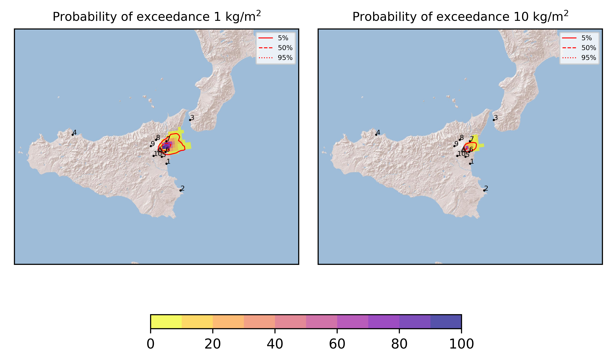
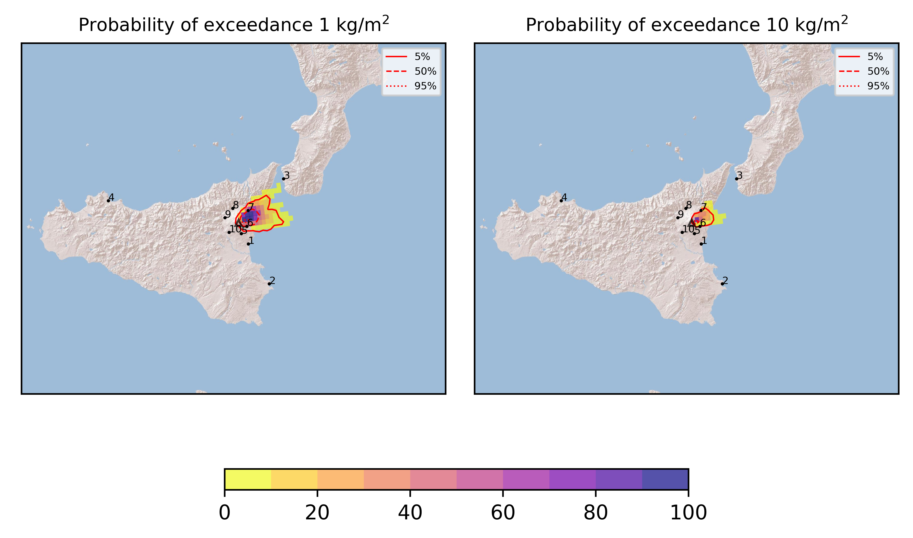
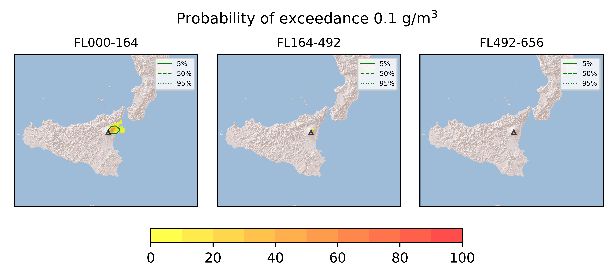

Forecast from VONA bulletin - 20210624_0929Z
============================================

Contents
========

* [Forecast products](#forecast-products)
	* [Forecast at 2021-06-24 12:30 Z](#forecast-at-2021-06-24-1230-z)
	* [Forecast at 2021-06-24 15:30 Z](#forecast-at-2021-06-24-1530-z)
	* [Forecast at 2021-06-24 18:30 Z](#forecast-at-2021-06-24-1830-z)
	* [Forecast at 2021-06-24 13:00 Z](#forecast-at-2021-06-24-1300-z)

# Forecast products

## Forecast at 2021-06-24 12:30 Z
  

|Eruption start [Z]|Eruption end [Z]|Forecast time [Z]|Column height asl [m]|
| :--- | :--- | :--- | :--- |
|2021-06-24 09:30:00|Ongoing|2021-06-24 12:30:00|[6000 m, 12000 m]|
  
  

|Percentile|MER [kg/s¹]|Mass in the air [kg]|Mass on the ground [kg]|
| :--- | :--- | :--- | :--- |
|5th|3.25e+04|2.38e+07|3.51e+08|
|50th|1.47e+05|1.59e+08|1.44e+09|
|95th|6.02e+05|1.31e+09|4.67e+09|
  

### Ground 2021-06-24 12:30 Z
  
  
  
  
  
  
  
  
  
  
  

|Location|Ground load [kg/m²] 5th perc|Ground load [kg/m²] 50th perc|Ground load [kg/m²] 95th perc|
| :--- | :--- | :--- | :--- |
|Catania AP (1)|0.00e+00|0.00e+00|1.12e-05|
|Siracusa (2)|0.00e+00|0.00e+00|0.00e+00|
|Reggio Calabria AP (3)|0.00e+00|0.00e+00|3.11e-06|
|Palermo AP (4)|0.00e+00|0.00e+00|0.00e+00|
|Nicolosi (5)|0.00e+00|2.79e-04|1.14e-02|
|Zafferana (6)|7.20e-02|5.70e-01|3.30e+00|
|Linguaglossa (7)|5.69e-03|3.10e-01|6.23e+00|
|Randazzo (8)|0.00e+00|0.00e+00|3.06e-04|
|Bronte (9)|0.00e+00|0.00e+00|0.00e+00|
|Biancavilla (10)|0.00e+00|0.00e+00|3.27e-05|
  

### Atmosphere 2021-06-24 12:30 Z
  

## Forecast at 2021-06-24 15:30 Z
  

|Eruption start [Z]|Eruption end [Z]|Forecast time [Z]|Column height asl [m]|
| :--- | :--- | :--- | :--- |
|2021-06-24 09:30:00|Ongoing|2021-06-24 15:30:00|[6000 m, 12000 m]|
  
  

|Percentile|MER [kg/s¹]|Mass in the air [kg]|Mass on the ground [kg]|
| :--- | :--- | :--- | :--- |
|5th|2.75e+04|5.41e+07|1.11e+09|
|50th|1.26e+05|1.94e+08|2.92e+09|
|95th|4.65e+05|5.81e+08|8.11e+09|
  

### Ground 2021-06-24 15:30 Z
  
  
  
  
  
  
  
  
  
  
  

|Location|Ground load [kg/m²] 5th perc|Ground load [kg/m²] 50th perc|Ground load [kg/m²] 95th perc|
| :--- | :--- | :--- | :--- |
|Catania AP (1)|0.00e+00|0.00e+00|3.72e-04|
|Siracusa (2)|0.00e+00|0.00e+00|0.00e+00|
|Reggio Calabria AP (3)|0.00e+00|0.00e+00|5.03e-03|
|Palermo AP (4)|0.00e+00|0.00e+00|0.00e+00|
|Nicolosi (5)|4.36e-05|7.22e-04|2.03e-02|
|Zafferana (6)|3.29e-01|1.45e+00|9.04e+00|
|Linguaglossa (7)|1.47e-02|1.16e+00|9.30e+00|
|Randazzo (8)|0.00e+00|0.00e+00|4.17e-04|
|Bronte (9)|0.00e+00|0.00e+00|0.00e+00|
|Biancavilla (10)|0.00e+00|0.00e+00|3.27e-05|
  

### Atmosphere 2021-06-24 15:30 Z
  

## Forecast at 2021-06-24 18:30 Z
  

|Eruption start [Z]|Eruption end [Z]|Forecast time [Z]|Column height asl [m]|
| :--- | :--- | :--- | :--- |
|2021-06-24 09:30:00|Ongoing|2021-06-24 18:30:00|[6000 m, 12000 m]|
  
  

|Percentile|MER [kg/s¹]|Mass in the air [kg]|Mass on the ground [kg]|
| :--- | :--- | :--- | :--- |
|5th|2.59e+04|2.98e+07|1.85e+09|
|50th|1.30e+05|1.47e+08|5.05e+09|
|95th|5.74e+05|8.76e+08|9.90e+09|
  

### Ground 2021-06-24 18:30 Z
  
  
  
  
  
  
  
  
  
  
  

|Location|Ground load [kg/m²] 5th perc|Ground load [kg/m²] 50th perc|Ground load [kg/m²] 95th perc|
| :--- | :--- | :--- | :--- |
|Catania AP (1)|0.00e+00|0.00e+00|3.81e-04|
|Siracusa (2)|0.00e+00|0.00e+00|0.00e+00|
|Reggio Calabria AP (3)|0.00e+00|0.00e+00|1.48e-02|
|Palermo AP (4)|0.00e+00|0.00e+00|0.00e+00|
|Nicolosi (5)|7.38e-05|1.04e-03|2.91e-02|
|Zafferana (6)|8.67e-01|4.53e+00|1.41e+01|
|Linguaglossa (7)|2.06e-02|1.94e+00|1.04e+01|
|Randazzo (8)|0.00e+00|0.00e+00|5.75e-04|
|Bronte (9)|0.00e+00|0.00e+00|0.00e+00|
|Biancavilla (10)|0.00e+00|0.00e+00|3.27e-05|
  

### Atmosphere 2021-06-24 18:30 Z
  

## Forecast at 2021-06-24 13:00 Z
  

|Eruption start [Z]|Eruption end [Z]|Forecast time [Z]|Column height asl [m]|
| :--- | :--- | :--- | :--- |
|2021-06-24 09:30:00|Ongoing|2021-06-24 13:00:00|9000 ± 500 - from VONA|
  
  

|Percentile|MER [kg/s¹]|Mass in the air [kg]|Mass on the ground [kg]|
| :--- | :--- | :--- | :--- |
|5th|7.49e+04|3.02e+07|8.76e+08|
|50th|1.59e+05|1.43e+08|1.69e+09|
|95th|2.78e+05|6.08e+08|2.58e+09|
  

### Ground 2021-06-24 13:00 Z
  
  
  
  
  
  
  
  
  
  
  

|Location|Ground load [kg/m²] 5th perc|Ground load [kg/m²] 50th perc|Ground load [kg/m²] 95th perc|
| :--- | :--- | :--- | :--- |
|Catania AP (1)|0.00e+00|0.00e+00|9.94e-06|
|Siracusa (2)|0.00e+00|0.00e+00|0.00e+00|
|Reggio Calabria AP (3)|0.00e+00|0.00e+00|0.00e+00|
|Palermo AP (4)|0.00e+00|0.00e+00|0.00e+00|
|Nicolosi (5)|6.67e-07|8.11e-04|1.27e-02|
|Zafferana (6)|1.86e-01|8.48e-01|3.96e+00|
|Linguaglossa (7)|1.96e-02|6.18e-01|6.43e+00|
|Randazzo (8)|0.00e+00|9.33e-06|4.33e-04|
|Bronte (9)|0.00e+00|0.00e+00|0.00e+00|
|Biancavilla (10)|0.00e+00|0.00e+00|5.83e-05|
  

### Atmosphere 2021-06-24 13:00 Z
  
  
Go to [Supplementary page](Supplementary_page.md)  
Go to [Main directory](https://github.com/federicapardini/Real_time_ash_forecast)