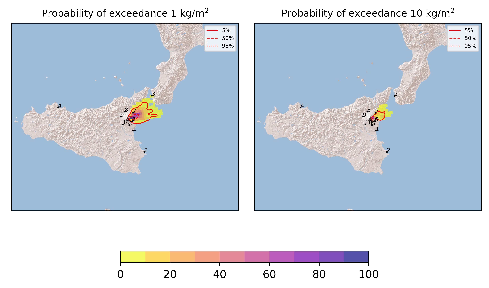
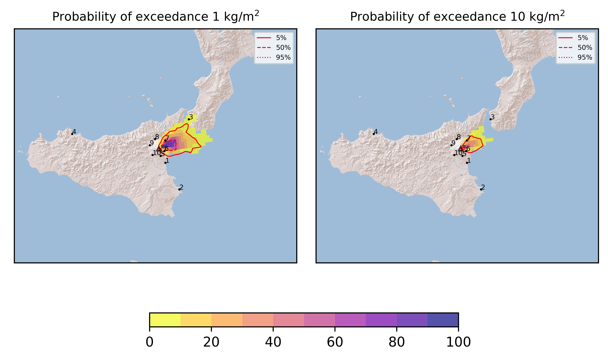
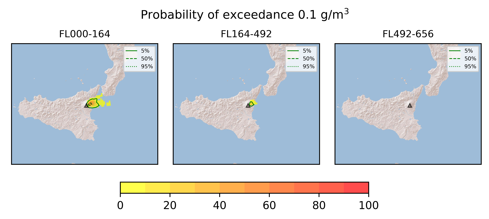

Forecast from VONA bulletin - 20210625_0013Z
============================================

Contents
========

* [Forecast products](#forecast-products)
	* [Forecast at 2021-06-25 03:10 Z](#forecast-at-2021-06-25-0310-z)
	* [Forecast at 2021-06-25 06:10 Z](#forecast-at-2021-06-25-0610-z)

# Forecast products

## Forecast at 2021-06-25 03:10 Z
  

|Eruption start [Z]|Eruption end [Z]|Forecast time [Z]|Column height asl [m]|
| :--- | :--- | :--- | :--- |
|2021-06-25 00:10:00|Ongoing|2021-06-25 03:10:00|[6000 m, 12000 m]|
  
  

|Percentile|MER [kg/s¹]|Mass in the air [kg]|Mass on the ground [kg]|
| :--- | :--- | :--- | :--- |
|5th|2.76e+04|1.71e+07|2.82e+08|
|50th|2.25e+05|1.89e+08|1.90e+09|
|95th|1.02e+06|1.97e+09|7.87e+09|
  

### Ground 2021-06-25 03:10 Z
  
  
  
  
  
  
  
  
  
  
  

|Location|Ground load [kg/m²] 5th perc|Ground load [kg/m²] 50th perc|Ground load [kg/m²] 95th perc|
| :--- | :--- | :--- | :--- |
|Catania AP (1)|0.00e+00|0.00e+00|0.00e+00|
|Siracusa (2)|0.00e+00|0.00e+00|0.00e+00|
|Reggio Calabria AP (3)|0.00e+00|0.00e+00|1.19e-01|
|Palermo AP (4)|0.00e+00|0.00e+00|0.00e+00|
|Nicolosi (5)|0.00e+00|2.67e-06|3.53e-03|
|Zafferana (6)|3.74e-02|6.05e-01|3.93e+00|
|Linguaglossa (7)|2.39e-04|1.33e-01|5.86e+00|
|Randazzo (8)|0.00e+00|0.00e+00|0.00e+00|
|Bronte (9)|0.00e+00|0.00e+00|0.00e+00|
|Biancavilla (10)|0.00e+00|0.00e+00|0.00e+00|
  

### Atmosphere 2021-06-25 03:10 Z
  

## Forecast at 2021-06-25 06:10 Z
  

|Eruption start [Z]|Eruption end [Z]|Forecast time [Z]|Column height asl [m]|
| :--- | :--- | :--- | :--- |
|2021-06-25 00:10:00|Ongoing|2021-06-25 06:10:00|[6000 m, 12000 m]|
  
  

|Percentile|MER [kg/s¹]|Mass in the air [kg]|Mass on the ground [kg]|
| :--- | :--- | :--- | :--- |
|5th|4.21e+04|8.46e+07|1.24e+09|
|50th|2.55e+05|4.24e+08|5.05e+09|
|95th|7.51e+05|1.24e+09|1.37e+10|
  

### Ground 2021-06-25 06:10 Z
  
  
  
  
  
  
  
  
  
  
  

|Location|Ground load [kg/m²] 5th perc|Ground load [kg/m²] 50th perc|Ground load [kg/m²] 95th perc|
| :--- | :--- | :--- | :--- |
|Catania AP (1)|0.00e+00|0.00e+00|0.00e+00|
|Siracusa (2)|0.00e+00|0.00e+00|0.00e+00|
|Reggio Calabria AP (3)|0.00e+00|0.00e+00|2.38e-01|
|Palermo AP (4)|0.00e+00|0.00e+00|0.00e+00|
|Nicolosi (5)|0.00e+00|2.43e-05|7.33e-03|
|Zafferana (6)|2.27e-01|1.55e+00|8.69e+00|
|Linguaglossa (7)|7.44e-04|4.14e-01|1.29e+01|
|Randazzo (8)|0.00e+00|0.00e+00|1.28e-04|
|Bronte (9)|0.00e+00|0.00e+00|0.00e+00|
|Biancavilla (10)|0.00e+00|0.00e+00|0.00e+00|
  

### Atmosphere 2021-06-25 06:10 Z
  
  
Go to [Supplementary page](Supplementary_page.md)  
Go to [Main directory](https://github.com/federicapardini/Real_time_ash_forecast)