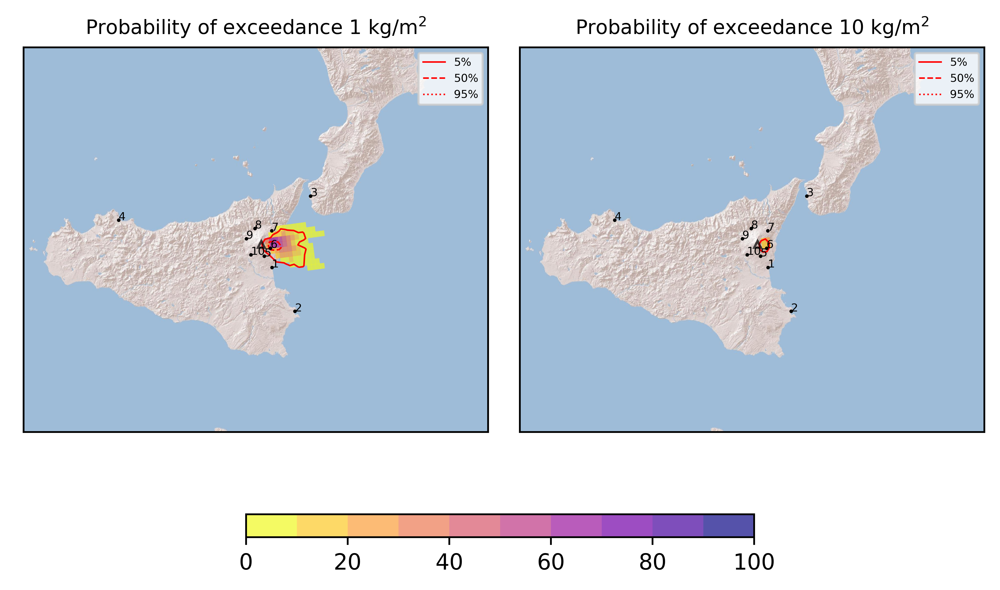
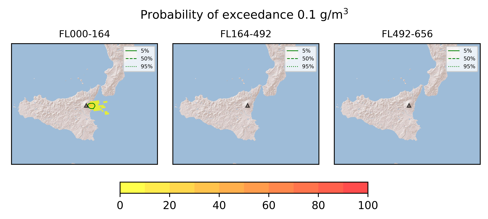

Forecast from VONA bulletin - 20210625_1833Z
============================================

Contents
========

* [Forecast products](#forecast-products)
	* [Forecast at 2021-06-25 21:30 Z](#forecast-at-2021-06-25-2130-z)
	* [Forecast at 2021-06-26 00:30 Z](#forecast-at-2021-06-26-0030-z)
	* [Forecast at 2021-06-26 03:30 Z](#forecast-at-2021-06-26-0330-z)
	* [Forecast at 2021-06-25 22:00 Z](#forecast-at-2021-06-25-2200-z)

# Forecast products

## Forecast at 2021-06-25 21:30 Z
  

|Eruption start [Z]|Eruption end [Z]|Forecast time [Z]|Column height asl [m]|
| :--- | :--- | :--- | :--- |
|2021-06-25 18:30:00|Ongoing|2021-06-25 21:30:00|4000 ± 500 - from VONA|
  
  

|Percentile|MER [kg/s¹]|Mass in the air [kg]|Mass on the ground [kg]|
| :--- | :--- | :--- | :--- |
|5th|4.57e+01|5.07e+01|3.84e+05|
|50th|4.58e+01|1.83e+04|4.76e+05|
|95th|3.56e+03|2.36e+06|3.52e+07|
  

### Ground 2021-06-25 21:30 Z
  
  
  
  
  
  
  
  
  
  
  

|Location|Ground load [kg/m²] 5th perc|Ground load [kg/m²] 50th perc|Ground load [kg/m²] 95th perc|
| :--- | :--- | :--- | :--- |
|Catania AP (1)|0.00e+00|0.00e+00|1.77e-04|
|Siracusa (2)|0.00e+00|0.00e+00|0.00e+00|
|Reggio Calabria AP (3)|0.00e+00|0.00e+00|0.00e+00|
|Palermo AP (4)|0.00e+00|0.00e+00|0.00e+00|
|Nicolosi (5)|0.00e+00|0.00e+00|3.38e-04|
|Zafferana (6)|0.00e+00|2.94e-04|9.62e-02|
|Linguaglossa (7)|0.00e+00|0.00e+00|1.05e-04|
|Randazzo (8)|0.00e+00|0.00e+00|0.00e+00|
|Bronte (9)|0.00e+00|0.00e+00|0.00e+00|
|Biancavilla (10)|0.00e+00|0.00e+00|0.00e+00|
  

### Atmosphere 2021-06-25 21:30 Z
  

## Forecast at 2021-06-26 00:30 Z
  

|Eruption start [Z]|Eruption end [Z]|Forecast time [Z]|Column height asl [m]|
| :--- | :--- | :--- | :--- |
|2021-06-25 18:30:00|Ongoing|2021-06-26 00:30:00|4000 ± 500 - from VONA|
  
  

|Percentile|MER [kg/s¹]|Mass in the air [kg]|Mass on the ground [kg]|
| :--- | :--- | :--- | :--- |
|5th|4.58e+01|1.06e+04|8.72e+05|
|50th|1.71e+02|3.61e+04|2.22e+06|
|95th|1.41e+03|3.74e+05|3.81e+07|
  

### Ground 2021-06-26 00:30 Z
  
  
  
  
  
  
  
  
  
  
  

|Location|Ground load [kg/m²] 5th perc|Ground load [kg/m²] 50th perc|Ground load [kg/m²] 95th perc|
| :--- | :--- | :--- | :--- |
|Catania AP (1)|0.00e+00|0.00e+00|1.78e-04|
|Siracusa (2)|0.00e+00|0.00e+00|0.00e+00|
|Reggio Calabria AP (3)|0.00e+00|0.00e+00|0.00e+00|
|Palermo AP (4)|0.00e+00|0.00e+00|0.00e+00|
|Nicolosi (5)|0.00e+00|0.00e+00|8.79e-04|
|Zafferana (6)|6.93e-04|2.96e-03|1.06e-01|
|Linguaglossa (7)|0.00e+00|0.00e+00|4.33e-04|
|Randazzo (8)|0.00e+00|0.00e+00|0.00e+00|
|Bronte (9)|0.00e+00|0.00e+00|0.00e+00|
|Biancavilla (10)|0.00e+00|0.00e+00|0.00e+00|
  

### Atmosphere 2021-06-26 00:30 Z
  

## Forecast at 2021-06-26 03:30 Z
  

|Eruption start [Z]|Eruption end [Z]|Forecast time [Z]|Column height asl [m]|
| :--- | :--- | :--- | :--- |
|2021-06-25 18:30:00|Ongoing|2021-06-26 03:30:00|4000 ± 500 - from VONA|
  
  

|Percentile|MER [kg/s¹]|Mass in the air [kg]|Mass on the ground [kg]|
| :--- | :--- | :--- | :--- |
|5th|4.57e+01|4.40e+02|1.56e+06|
|50th|4.20e+02|9.68e+04|8.63e+06|
|95th|1.42e+03|8.34e+05|3.87e+07|
  

### Ground 2021-06-26 03:30 Z
  
  
  
  
  
  
  
  
  
  
  

|Location|Ground load [kg/m²] 5th perc|Ground load [kg/m²] 50th perc|Ground load [kg/m²] 95th perc|
| :--- | :--- | :--- | :--- |
|Catania AP (1)|0.00e+00|0.00e+00|1.78e-04|
|Siracusa (2)|0.00e+00|0.00e+00|0.00e+00|
|Reggio Calabria AP (3)|0.00e+00|0.00e+00|0.00e+00|
|Palermo AP (4)|0.00e+00|0.00e+00|0.00e+00|
|Nicolosi (5)|0.00e+00|4.00e-06|8.94e-04|
|Zafferana (6)|1.80e-03|1.17e-02|1.08e-01|
|Linguaglossa (7)|0.00e+00|1.12e-05|1.70e-03|
|Randazzo (8)|0.00e+00|0.00e+00|0.00e+00|
|Bronte (9)|0.00e+00|0.00e+00|0.00e+00|
|Biancavilla (10)|0.00e+00|0.00e+00|0.00e+00|
  

### Atmosphere 2021-06-26 03:30 Z
  

## Forecast at 2021-06-25 22:00 Z
  

|Eruption start [Z]|Eruption end [Z]|Forecast time [Z]|Column height asl [m]|
| :--- | :--- | :--- | :--- |
|2021-06-25 18:30:00|Ongoing|2021-06-25 22:00:00|7000 ± 500 - from VONA|
  
  

|Percentile|MER [kg/s¹]|Mass in the air [kg]|Mass on the ground [kg]|
| :--- | :--- | :--- | :--- |
|5th|4.85e+04|2.17e+07|5.79e+08|
|50th|1.19e+05|1.01e+08|1.12e+09|
|95th|2.58e+05|5.43e+08|2.08e+09|
  

### Ground 2021-06-25 22:00 Z
  
  
  
  
  
  
  
  
  
  
  

|Location|Ground load [kg/m²] 5th perc|Ground load [kg/m²] 50th perc|Ground load [kg/m²] 95th perc|
| :--- | :--- | :--- | :--- |
|Catania AP (1)|0.00e+00|0.00e+00|5.97e-03|
|Siracusa (2)|0.00e+00|0.00e+00|0.00e+00|
|Reggio Calabria AP (3)|0.00e+00|0.00e+00|0.00e+00|
|Palermo AP (4)|0.00e+00|0.00e+00|0.00e+00|
|Nicolosi (5)|0.00e+00|6.36e-04|8.22e-02|
|Zafferana (6)|3.70e-01|2.05e+00|1.59e+01|
|Linguaglossa (7)|0.00e+00|8.37e-04|2.22e-01|
|Randazzo (8)|0.00e+00|0.00e+00|0.00e+00|
|Bronte (9)|0.00e+00|0.00e+00|0.00e+00|
|Biancavilla (10)|0.00e+00|0.00e+00|0.00e+00|
  

### Atmosphere 2021-06-25 22:00 Z
  
  
Go to [Supplementary page](Supplementary_page.md)  
Go to [Main directory](https://github.com/federicapardini/Real_time_ash_forecast)