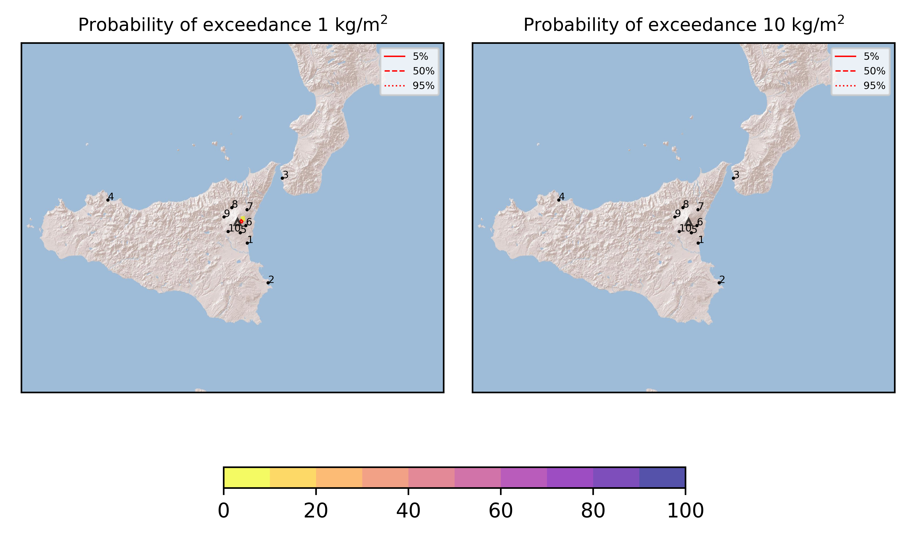

Forecast from VONA bulletin - 20210627_0856Z
============================================

Contents
========

* [Forecast products](#forecast-products)
	* [Forecast at 2021-06-27 12:00 Z](#forecast-at-2021-06-27-1200-z)
	* [Forecast at 2021-06-27 15:00 Z](#forecast-at-2021-06-27-1500-z)

# Forecast products

## Forecast at 2021-06-27 12:00 Z
  

|Eruption start [Z]|Eruption end [Z]|Forecast time [Z]|Column height asl [m]|
| :--- | :--- | :--- | :--- |
|2021-06-27 09:00:00|Ongoing|2021-06-27 12:00:00|5000 ± 500 - from VONA|
  
  

|Percentile|MER [kg/s¹]|Mass in the air [kg]|Mass on the ground [kg]|
| :--- | :--- | :--- | :--- |
|5th|4.58e+01|5.99e+02|4.74e+05|
|50th|8.52e+02|1.19e+05|8.61e+06|
|95th|8.14e+03|6.16e+06|7.44e+07|
  

### Ground 2021-06-27 12:00 Z
  
  
  
  
  
  
  
  
  
  
  

|Location|Ground load [kg/m²] 5th perc|Ground load [kg/m²] 50th perc|Ground load [kg/m²] 95th perc|
| :--- | :--- | :--- | :--- |
|Catania AP (1)|0.00e+00|0.00e+00|2.38e-03|
|Siracusa (2)|0.00e+00|0.00e+00|0.00e+00|
|Reggio Calabria AP (3)|0.00e+00|0.00e+00|0.00e+00|
|Palermo AP (4)|0.00e+00|0.00e+00|0.00e+00|
|Nicolosi (5)|0.00e+00|5.80e-05|2.84e-03|
|Zafferana (6)|0.00e+00|5.82e-03|6.74e-02|
|Linguaglossa (7)|0.00e+00|0.00e+00|2.72e-05|
|Randazzo (8)|0.00e+00|0.00e+00|0.00e+00|
|Bronte (9)|0.00e+00|0.00e+00|0.00e+00|
|Biancavilla (10)|0.00e+00|0.00e+00|0.00e+00|
  

### Atmosphere 2021-06-27 12:00 Z
  

## Forecast at 2021-06-27 15:00 Z
  

|Eruption start [Z]|Eruption end [Z]|Forecast time [Z]|Column height asl [m]|
| :--- | :--- | :--- | :--- |
|2021-06-27 09:00:00|Ongoing|2021-06-27 15:00:00|5000 ± 500 - from VONA|
  
  

|Percentile|MER [kg/s¹]|Mass in the air [kg]|Mass on the ground [kg]|
| :--- | :--- | :--- | :--- |
|5th|3.39e+02|7.28e+04|1.30e+07|
|50th|3.96e+03|1.94e+06|5.46e+07|
|95th|8.43e+03|1.11e+07|1.13e+08|
  

### Ground 2021-06-27 15:00 Z
  
  
  
  
  
  
  
  
  
  
  

|Location|Ground load [kg/m²] 5th perc|Ground load [kg/m²] 50th perc|Ground load [kg/m²] 95th perc|
| :--- | :--- | :--- | :--- |
|Catania AP (1)|0.00e+00|1.59e-05|2.53e-03|
|Siracusa (2)|0.00e+00|0.00e+00|0.00e+00|
|Reggio Calabria AP (3)|0.00e+00|0.00e+00|0.00e+00|
|Palermo AP (4)|0.00e+00|0.00e+00|0.00e+00|
|Nicolosi (5)|4.01e-05|9.59e-04|1.70e-02|
|Zafferana (6)|9.38e-03|8.90e-02|2.03e-01|
|Linguaglossa (7)|0.00e+00|0.00e+00|2.55e-03|
|Randazzo (8)|0.00e+00|0.00e+00|0.00e+00|
|Bronte (9)|0.00e+00|0.00e+00|0.00e+00|
|Biancavilla (10)|0.00e+00|0.00e+00|0.00e+00|
  

### Atmosphere 2021-06-27 15:00 Z
  
  
Go to [Supplementary page](Supplementary_page.md)  
Go to [Main directory](https://github.com/federicapardini/Real_time_ash_forecast)