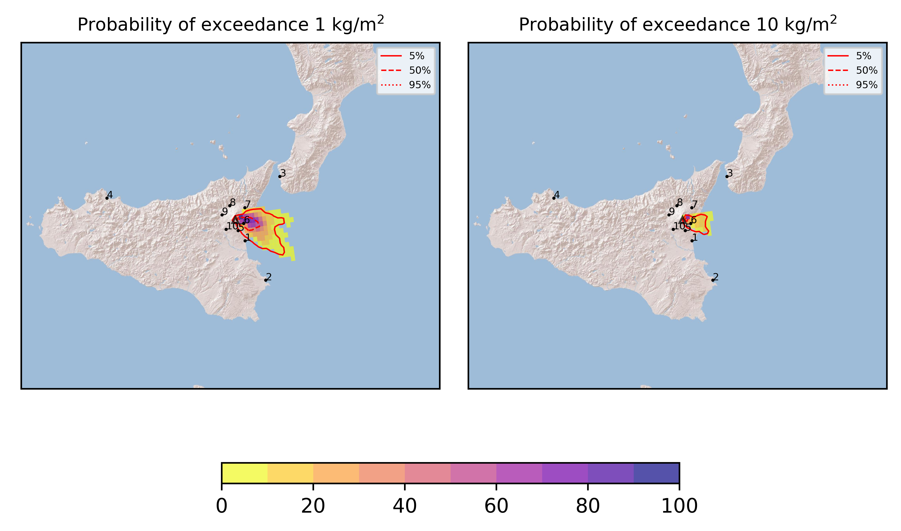
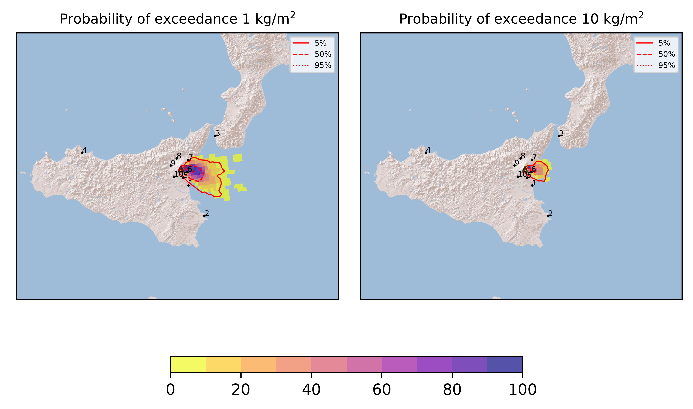
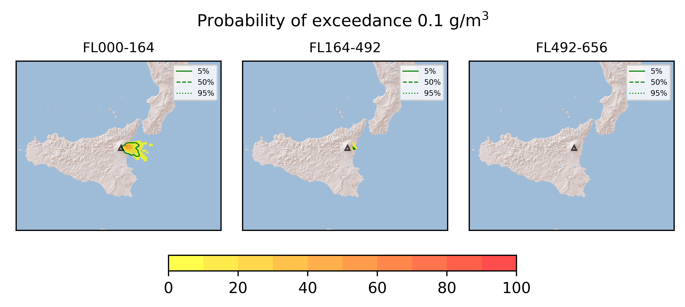

Forecast from VONA bulletin - 20210627_0856Z
============================================

Contents
========

* [Forecast products](#forecast-products)
	* [Forecast at 2021-06-27 12:00 Z](#forecast-at-2021-06-27-1200-z)
	* [Forecast at 2021-06-27 15:00 Z](#forecast-at-2021-06-27-1500-z)
	* [Forecast at 2021-06-27 18:00 Z](#forecast-at-2021-06-27-1800-z)
	* [Forecast at 2021-06-27 12:30 Z](#forecast-at-2021-06-27-1230-z)
	* [Forecast at 2021-06-27 15:30 Z](#forecast-at-2021-06-27-1530-z)
	* [Forecast at 2021-06-27 18:30 Z](#forecast-at-2021-06-27-1830-z)

# Forecast products

## Forecast at 2021-06-27 12:00 Z
  

|Eruption start [Z]|Eruption end [Z]|Forecast time [Z]|Column height asl [m]|
| :--- | :--- | :--- | :--- |
|2021-06-27 09:00:00|Ongoing|2021-06-27 12:00:00|5000 ± 500 - from VONA|
  
  

|Percentile|MER [kg/s¹]|Mass in the air [kg]|Mass on the ground [kg]|
| :--- | :--- | :--- | :--- |
|5th|4.58e+01|5.99e+02|4.74e+05|
|50th|8.52e+02|1.19e+05|8.61e+06|
|95th|8.14e+03|6.16e+06|7.44e+07|
  

### Ground 2021-06-27 12:00 Z
  
  
  
  
  
  
  
  
  
  
  

|Location|Ground load [kg/m²] 5th perc|Ground load [kg/m²] 50th perc|Ground load [kg/m²] 95th perc|
| :--- | :--- | :--- | :--- |
|Catania AP (1)|0.00e+00|0.00e+00|2.38e-03|
|Siracusa (2)|0.00e+00|0.00e+00|0.00e+00|
|Reggio Calabria AP (3)|0.00e+00|0.00e+00|0.00e+00|
|Palermo AP (4)|0.00e+00|0.00e+00|0.00e+00|
|Nicolosi (5)|0.00e+00|5.80e-05|2.84e-03|
|Zafferana (6)|0.00e+00|5.82e-03|6.74e-02|
|Linguaglossa (7)|0.00e+00|0.00e+00|2.72e-05|
|Randazzo (8)|0.00e+00|0.00e+00|0.00e+00|
|Bronte (9)|0.00e+00|0.00e+00|0.00e+00|
|Biancavilla (10)|0.00e+00|0.00e+00|0.00e+00|
  

### Atmosphere 2021-06-27 12:00 Z
  

## Forecast at 2021-06-27 15:00 Z
  

|Eruption start [Z]|Eruption end [Z]|Forecast time [Z]|Column height asl [m]|
| :--- | :--- | :--- | :--- |
|2021-06-27 09:00:00|Ongoing|2021-06-27 15:00:00|5000 ± 500 - from VONA|
  
  

|Percentile|MER [kg/s¹]|Mass in the air [kg]|Mass on the ground [kg]|
| :--- | :--- | :--- | :--- |
|5th|3.39e+02|7.28e+04|1.30e+07|
|50th|3.96e+03|1.94e+06|5.46e+07|
|95th|8.43e+03|1.11e+07|1.13e+08|
  

### Ground 2021-06-27 15:00 Z
  
  
  
  
  
  
  
  
  
  
  

|Location|Ground load [kg/m²] 5th perc|Ground load [kg/m²] 50th perc|Ground load [kg/m²] 95th perc|
| :--- | :--- | :--- | :--- |
|Catania AP (1)|0.00e+00|1.59e-05|2.53e-03|
|Siracusa (2)|0.00e+00|0.00e+00|0.00e+00|
|Reggio Calabria AP (3)|0.00e+00|0.00e+00|0.00e+00|
|Palermo AP (4)|0.00e+00|0.00e+00|0.00e+00|
|Nicolosi (5)|4.01e-05|9.59e-04|1.70e-02|
|Zafferana (6)|9.38e-03|8.90e-02|2.03e-01|
|Linguaglossa (7)|0.00e+00|0.00e+00|2.55e-03|
|Randazzo (8)|0.00e+00|0.00e+00|0.00e+00|
|Bronte (9)|0.00e+00|0.00e+00|0.00e+00|
|Biancavilla (10)|0.00e+00|0.00e+00|0.00e+00|
  

### Atmosphere 2021-06-27 15:00 Z
  

## Forecast at 2021-06-27 18:00 Z
  

|Eruption start [Z]|Eruption end [Z]|Forecast time [Z]|Column height asl [m]|
| :--- | :--- | :--- | :--- |
|2021-06-27 09:00:00|Ongoing|2021-06-27 18:00:00|5000 ± 500 - from VONA|
  
  

|Percentile|MER [kg/s¹]|Mass in the air [kg]|Mass on the ground [kg]|
| :--- | :--- | :--- | :--- |
|5th|2.56e+02|1.51e+05|2.81e+07|
|50th|2.19e+03|5.50e+05|7.59e+07|
|95th|3.19e+03|5.54e+06|1.44e+08|
  

### Ground 2021-06-27 18:00 Z
  
  
  
  
  
  
  
  
  
  
  

|Location|Ground load [kg/m²] 5th perc|Ground load [kg/m²] 50th perc|Ground load [kg/m²] 95th perc|
| :--- | :--- | :--- | :--- |
|Catania AP (1)|0.00e+00|3.48e-05|2.53e-03|
|Siracusa (2)|0.00e+00|0.00e+00|0.00e+00|
|Reggio Calabria AP (3)|0.00e+00|0.00e+00|0.00e+00|
|Palermo AP (4)|0.00e+00|0.00e+00|0.00e+00|
|Nicolosi (5)|8.36e-05|2.05e-03|1.74e-02|
|Zafferana (6)|2.26e-02|1.37e-01|2.56e-01|
|Linguaglossa (7)|0.00e+00|4.09e-05|2.77e-03|
|Randazzo (8)|0.00e+00|0.00e+00|0.00e+00|
|Bronte (9)|0.00e+00|0.00e+00|0.00e+00|
|Biancavilla (10)|0.00e+00|0.00e+00|0.00e+00|
  

### Atmosphere 2021-06-27 18:00 Z
  

## Forecast at 2021-06-27 12:30 Z
  

|Eruption start [Z]|Eruption end [Z]|Forecast time [Z]|Column height asl [m]|
| :--- | :--- | :--- | :--- |
|2021-06-27 09:00:00|Ongoing|2021-06-27 12:30:00|9000.0 ± 500 - from VONA|
  
  

|Percentile|MER [kg/s¹]|Mass in the air [kg]|Mass on the ground [kg]|
| :--- | :--- | :--- | :--- |
|5th|1.63e+05|9.95e+07|1.36e+09|
|50th|3.44e+05|4.21e+08|2.95e+09|
|95th|4.99e+05|1.37e+09|4.50e+09|
  

### Ground 2021-06-27 12:30 Z
  
  
  
  
  
  
  
  
  
  
  

|Location|Ground load [kg/m²] 5th perc|Ground load [kg/m²] 50th perc|Ground load [kg/m²] 95th perc|
| :--- | :--- | :--- | :--- |
|Catania AP (1)|0.00e+00|2.19e-05|1.31e-01|
|Siracusa (2)|0.00e+00|0.00e+00|0.00e+00|
|Reggio Calabria AP (3)|0.00e+00|0.00e+00|0.00e+00|
|Palermo AP (4)|0.00e+00|0.00e+00|0.00e+00|
|Nicolosi (5)|1.57e-05|5.92e-03|5.58e-01|
|Zafferana (6)|4.79e-01|4.73e+00|1.53e+01|
|Linguaglossa (7)|0.00e+00|1.34e-04|7.16e-02|
|Randazzo (8)|0.00e+00|0.00e+00|0.00e+00|
|Bronte (9)|0.00e+00|0.00e+00|0.00e+00|
|Biancavilla (10)|0.00e+00|0.00e+00|0.00e+00|
  

### Atmosphere 2021-06-27 12:30 Z
  

## Forecast at 2021-06-27 15:30 Z
  

|Eruption start [Z]|Eruption end [Z]|Forecast time [Z]|Column height asl [m]|
| :--- | :--- | :--- | :--- |
|2021-06-27 09:00:00|Ongoing|2021-06-27 15:30:00|9000.0 ± 500 - from VONA|
  
  

|Percentile|MER [kg/s¹]|Mass in the air [kg]|Mass on the ground [kg]|
| :--- | :--- | :--- | :--- |
|5th|1.13e+05|1.11e+08|3.90e+09|
|50th|2.69e+05|3.87e+08|6.54e+09|
|95th|4.93e+05|1.62e+09|7.68e+09|
  

### Ground 2021-06-27 15:30 Z
  
  
  
  
  
  
  
  
  
  
  

|Location|Ground load [kg/m²] 5th perc|Ground load [kg/m²] 50th perc|Ground load [kg/m²] 95th perc|
| :--- | :--- | :--- | :--- |
|Catania AP (1)|0.00e+00|3.35e-03|1.53e-01|
|Siracusa (2)|0.00e+00|0.00e+00|2.32e-05|
|Reggio Calabria AP (3)|0.00e+00|0.00e+00|0.00e+00|
|Palermo AP (4)|0.00e+00|0.00e+00|0.00e+00|
|Nicolosi (5)|4.02e-04|1.95e-02|5.90e-01|
|Zafferana (6)|1.31e+00|1.03e+01|1.88e+01|
|Linguaglossa (7)|0.00e+00|5.23e-03|4.46e-01|
|Randazzo (8)|0.00e+00|0.00e+00|0.00e+00|
|Bronte (9)|0.00e+00|0.00e+00|0.00e+00|
|Biancavilla (10)|0.00e+00|0.00e+00|0.00e+00|
  

### Atmosphere 2021-06-27 15:30 Z
  

## Forecast at 2021-06-27 18:30 Z
  

|Eruption start [Z]|Eruption end [Z]|Forecast time [Z]|Column height asl [m]|
| :--- | :--- | :--- | :--- |
|2021-06-27 09:00:00|Ongoing|2021-06-27 18:30:00|9000.0 ± 500 - from VONA|
  
  

|Percentile|MER [kg/s¹]|Mass in the air [kg]|Mass on the ground [kg]|
| :--- | :--- | :--- | :--- |
|5th|9.32e+04|5.35e+07|5.96e+09|
|50th|1.92e+05|3.01e+08|8.37e+09|
|95th|2.92e+05|8.52e+08|1.09e+10|
  

### Ground 2021-06-27 18:30 Z
  
  
  
  
  
  
  
  
  
  
  

|Location|Ground load [kg/m²] 5th perc|Ground load [kg/m²] 50th perc|Ground load [kg/m²] 95th perc|
| :--- | :--- | :--- | :--- |
|Catania AP (1)|7.53e-05|3.42e-03|1.53e-01|
|Siracusa (2)|0.00e+00|0.00e+00|2.32e-05|
|Reggio Calabria AP (3)|0.00e+00|0.00e+00|0.00e+00|
|Palermo AP (4)|0.00e+00|0.00e+00|0.00e+00|
|Nicolosi (5)|2.54e-03|5.84e-02|5.94e-01|
|Zafferana (6)|5.68e+00|1.28e+01|2.08e+01|
|Linguaglossa (7)|1.00e-03|8.93e-03|4.76e-01|
|Randazzo (8)|0.00e+00|0.00e+00|0.00e+00|
|Bronte (9)|0.00e+00|0.00e+00|0.00e+00|
|Biancavilla (10)|0.00e+00|0.00e+00|0.00e+00|
  

### Atmosphere 2021-06-27 18:30 Z
  
  
Go to [Supplementary page](Supplementary_page.md)  
Go to [Main directory](https://github.com/federicapardini/Real_time_ash_forecast)