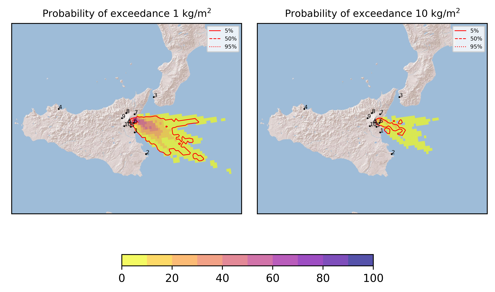
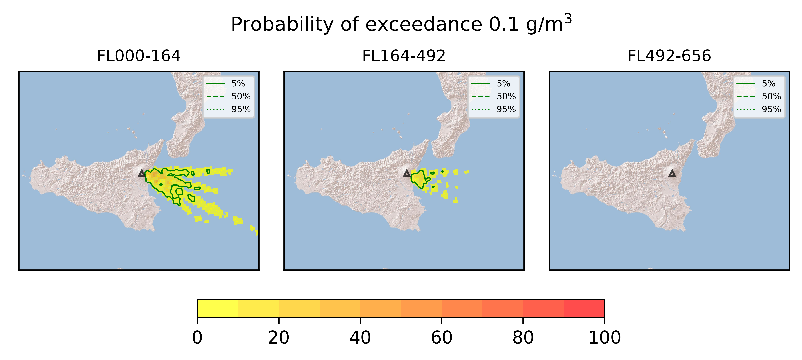

Forecast from VONA bulletin - 20210701_2324Z
============================================

Contents
========

* [Forecast products](#forecast-products)
	* [Forecast at 2021-07-02 02:20 Z](#forecast-at-2021-07-02-0220-z)

# Forecast products

## Forecast at 2021-07-02 02:20 Z
  

|Eruption start [Z]|Eruption end [Z]|Forecast time [Z]|Column height asl [m]|
| :--- | :--- | :--- | :--- |
|2021-07-01 23:20:00|Ongoing|2021-07-02 02:20:00|[6000 m, 12000 m]|
  
  

|Percentile|MER [kg/s¹]|Mass in the air [kg]|Mass on the ground [kg]|
| :--- | :--- | :--- | :--- |
|5th|9.52e+04|8.74e+07|9.02e+08|
|50th|4.50e+05|4.81e+08|4.25e+09|
|95th|3.93e+06|7.82e+09|3.04e+10|
  

### Ground 2021-07-02 02:20 Z
  
  
  
  
  
  
  
  
  
  
  

|Location|Ground load [kg/m²] 5th perc|Ground load [kg/m²] 50th perc|Ground load [kg/m²] 95th perc|
| :--- | :--- | :--- | :--- |
|Catania AP (1)|0.00e+00|0.00e+00|9.08e-02|
|Siracusa (2)|0.00e+00|0.00e+00|7.50e-06|
|Reggio Calabria AP (3)|0.00e+00|0.00e+00|0.00e+00|
|Palermo AP (4)|0.00e+00|0.00e+00|0.00e+00|
|Nicolosi (5)|0.00e+00|3.27e-05|1.44e-02|
|Zafferana (6)|3.36e-01|5.18e+00|4.22e+01|
|Linguaglossa (7)|0.00e+00|0.00e+00|0.00e+00|
|Randazzo (8)|0.00e+00|0.00e+00|0.00e+00|
|Bronte (9)|0.00e+00|0.00e+00|0.00e+00|
|Biancavilla (10)|0.00e+00|0.00e+00|0.00e+00|
  

### Atmosphere 2021-07-02 02:20 Z
  
  
Go to [Supplementary page](Supplementary_page.md)  
Go to [Main directory](https://github.com/federicapardini/Real_time_ash_forecast)