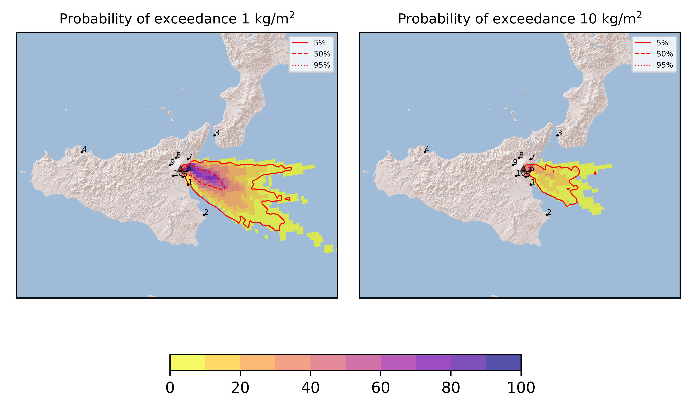
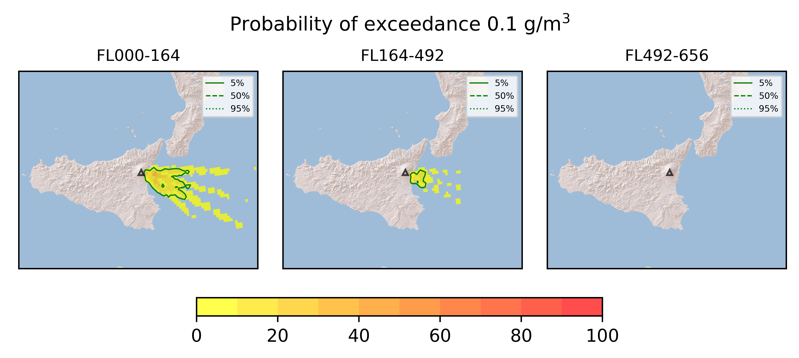
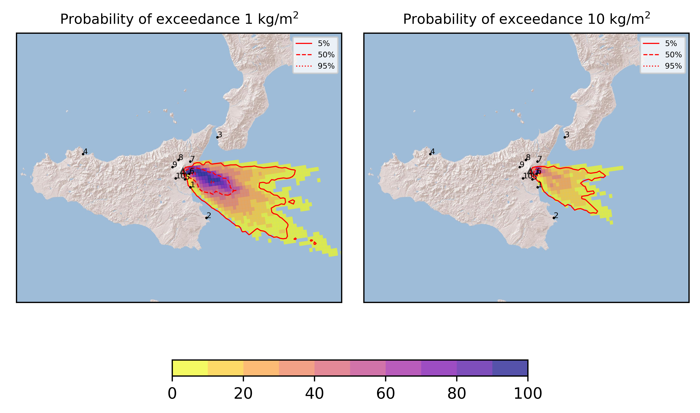
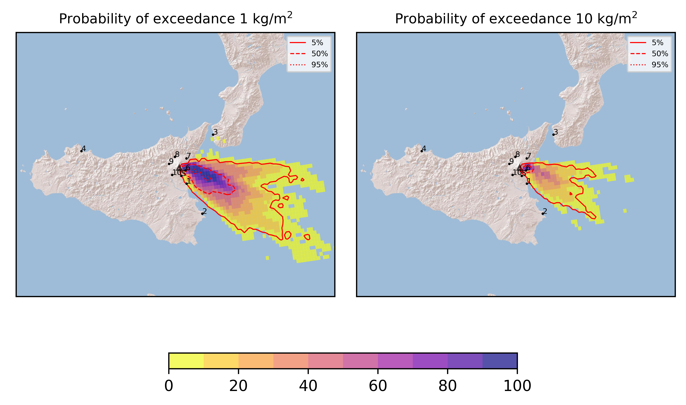
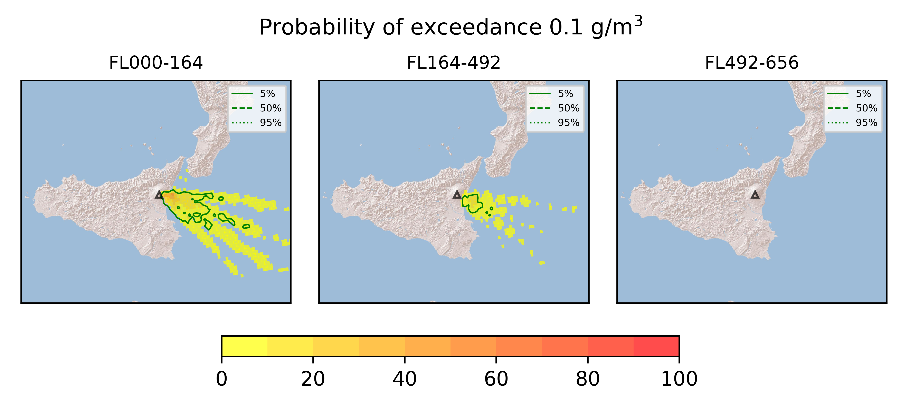

Forecast from VONA bulletin - 20210701_2324Z
============================================

Contents
========

* [Forecast products](#forecast-products)
	* [Forecast at 2021-07-02 02:20 Z](#forecast-at-2021-07-02-0220-z)
	* [Forecast at 2021-07-02 05:20 Z](#forecast-at-2021-07-02-0520-z)
	* [Forecast at 2021-07-02 08:20 Z](#forecast-at-2021-07-02-0820-z)
	* [Forecast at 2021-07-02 11:20 Z](#forecast-at-2021-07-02-1120-z)

# Forecast products

## Forecast at 2021-07-02 02:20 Z
  

|Eruption start [Z]|Eruption end [Z]|Forecast time [Z]|Column height asl [m]|
| :--- | :--- | :--- | :--- |
|2021-07-01 23:20:00|Ongoing|2021-07-02 02:20:00|[6000 m, 12000 m]|
  
  

|Percentile|MER [kg/s¹]|Mass in the air [kg]|Mass on the ground [kg]|
| :--- | :--- | :--- | :--- |
|5th|9.52e+04|8.74e+07|9.02e+08|
|50th|4.50e+05|4.81e+08|4.25e+09|
|95th|3.93e+06|7.82e+09|3.04e+10|
  

### Ground 2021-07-02 02:20 Z
  
  
  
  
  
  
  
  
  
  
  

|Location|Ground load [kg/m²] 5th perc|Ground load [kg/m²] 50th perc|Ground load [kg/m²] 95th perc|
| :--- | :--- | :--- | :--- |
|Catania AP (1)|0.00e+00|0.00e+00|9.08e-02|
|Siracusa (2)|0.00e+00|0.00e+00|7.50e-06|
|Reggio Calabria AP (3)|0.00e+00|0.00e+00|0.00e+00|
|Palermo AP (4)|0.00e+00|0.00e+00|0.00e+00|
|Nicolosi (5)|0.00e+00|3.27e-05|1.44e-02|
|Zafferana (6)|3.36e-01|5.18e+00|4.22e+01|
|Linguaglossa (7)|0.00e+00|0.00e+00|0.00e+00|
|Randazzo (8)|0.00e+00|0.00e+00|0.00e+00|
|Bronte (9)|0.00e+00|0.00e+00|0.00e+00|
|Biancavilla (10)|0.00e+00|0.00e+00|0.00e+00|
  

### Atmosphere 2021-07-02 02:20 Z
  

## Forecast at 2021-07-02 05:20 Z
  

|Eruption start [Z]|Eruption end [Z]|Forecast time [Z]|Column height asl [m]|
| :--- | :--- | :--- | :--- |
|2021-07-01 23:20:00|Ongoing|2021-07-02 05:20:00|[6000 m, 12000 m]|
  
  

|Percentile|MER [kg/s¹]|Mass in the air [kg]|Mass on the ground [kg]|
| :--- | :--- | :--- | :--- |
|5th|1.37e+05|5.98e+07|3.77e+09|
|50th|5.26e+05|1.09e+09|9.48e+09|
|95th|3.26e+06|3.49e+09|4.88e+10|
  

### Ground 2021-07-02 05:20 Z
  
  
  
  
  
  
  
  
  
  
  

|Location|Ground load [kg/m²] 5th perc|Ground load [kg/m²] 50th perc|Ground load [kg/m²] 95th perc|
| :--- | :--- | :--- | :--- |
|Catania AP (1)|0.00e+00|3.98e-06|2.78e-01|
|Siracusa (2)|0.00e+00|0.00e+00|4.50e-05|
|Reggio Calabria AP (3)|0.00e+00|0.00e+00|0.00e+00|
|Palermo AP (4)|0.00e+00|0.00e+00|0.00e+00|
|Nicolosi (5)|3.00e-07|2.33e-03|1.08e-01|
|Zafferana (6)|3.04e+00|1.58e+01|9.71e+01|
|Linguaglossa (7)|0.00e+00|0.00e+00|0.00e+00|
|Randazzo (8)|0.00e+00|0.00e+00|0.00e+00|
|Bronte (9)|0.00e+00|0.00e+00|0.00e+00|
|Biancavilla (10)|0.00e+00|0.00e+00|0.00e+00|
  

### Atmosphere 2021-07-02 05:20 Z
  

## Forecast at 2021-07-02 08:20 Z
  

|Eruption start [Z]|Eruption end [Z]|Forecast time [Z]|Column height asl [m]|
| :--- | :--- | :--- | :--- |
|2021-07-01 23:20:00|Ongoing|2021-07-02 08:20:00|[6000 m, 12000 m]|
  
  

|Percentile|MER [kg/s¹]|Mass in the air [kg]|Mass on the ground [kg]|
| :--- | :--- | :--- | :--- |
|5th|1.11e+05|1.58e+08|6.16e+09|
|50th|5.73e+05|7.65e+08|2.08e+10|
|95th|3.53e+06|4.71e+09|5.91e+10|
  

### Ground 2021-07-02 08:20 Z
  
  
  
  
  
  
  
  
  
  
  

|Location|Ground load [kg/m²] 5th perc|Ground load [kg/m²] 50th perc|Ground load [kg/m²] 95th perc|
| :--- | :--- | :--- | :--- |
|Catania AP (1)|0.00e+00|2.27e-03|1.15e+00|
|Siracusa (2)|0.00e+00|0.00e+00|1.54e-04|
|Reggio Calabria AP (3)|0.00e+00|0.00e+00|0.00e+00|
|Palermo AP (4)|0.00e+00|0.00e+00|0.00e+00|
|Nicolosi (5)|2.93e-04|1.16e-02|1.89e-01|
|Zafferana (6)|8.50e+00|2.86e+01|1.22e+02|
|Linguaglossa (7)|0.00e+00|0.00e+00|0.00e+00|
|Randazzo (8)|0.00e+00|0.00e+00|0.00e+00|
|Bronte (9)|0.00e+00|0.00e+00|0.00e+00|
|Biancavilla (10)|0.00e+00|0.00e+00|0.00e+00|
  

### Atmosphere 2021-07-02 08:20 Z
  

## Forecast at 2021-07-02 11:20 Z
  

|Eruption start [Z]|Eruption end [Z]|Forecast time [Z]|Column height asl [m]|
| :--- | :--- | :--- | :--- |
|2021-07-01 23:20:00|Ongoing|2021-07-02 11:20:00|[6000 m, 12000 m]|
  
  

|Percentile|MER [kg/s¹]|Mass in the air [kg]|Mass on the ground [kg]|
| :--- | :--- | :--- | :--- |
|5th|1.48e+05|1.25e+08|9.50e+09|
|50th|4.65e+05|4.92e+08|3.00e+10|
|95th|3.15e+06|1.32e+10|6.85e+10|
  

### Ground 2021-07-02 11:20 Z
  
  
  
  
  
  
  
  
  
  
  

|Location|Ground load [kg/m²] 5th perc|Ground load [kg/m²] 50th perc|Ground load [kg/m²] 95th perc|
| :--- | :--- | :--- | :--- |
|Catania AP (1)|0.00e+00|1.80e-02|1.24e+00|
|Siracusa (2)|0.00e+00|0.00e+00|3.08e-04|
|Reggio Calabria AP (3)|0.00e+00|0.00e+00|0.00e+00|
|Palermo AP (4)|0.00e+00|0.00e+00|0.00e+00|
|Nicolosi (5)|5.97e-04|3.78e-02|3.66e-01|
|Zafferana (6)|1.15e+01|3.55e+01|1.31e+02|
|Linguaglossa (7)|0.00e+00|0.00e+00|1.49e-05|
|Randazzo (8)|0.00e+00|0.00e+00|0.00e+00|
|Bronte (9)|0.00e+00|0.00e+00|0.00e+00|
|Biancavilla (10)|0.00e+00|0.00e+00|0.00e+00|
  

### Atmosphere 2021-07-02 11:20 Z
  
  
Go to [Supplementary page](Supplementary_page.md)  
Go to [Main directory](https://github.com/federicapardini/Real_time_ash_forecast)