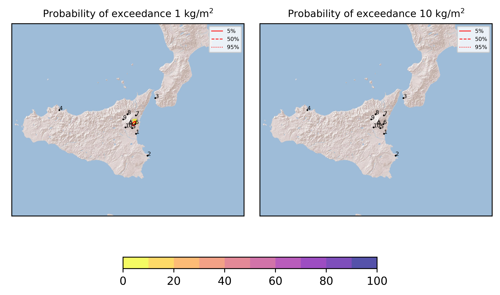

Forecast from VONA bulletin - 20210704_1507Z
============================================

Contents
========

* [Forecast products](#forecast-products)
	* [Forecast at 2021-07-04 18:10 Z](#forecast-at-2021-07-04-1810-z)
	* [Forecast at 2021-07-04 21:10 Z](#forecast-at-2021-07-04-2110-z)
	* [Forecast at 2021-07-05 00:10 Z](#forecast-at-2021-07-05-0010-z)
	* [Forecast at 2021-07-04 18:30 Z](#forecast-at-2021-07-04-1830-z)
	* [Forecast at 2021-07-04 21:30 Z](#forecast-at-2021-07-04-2130-z)

# Forecast products

## Forecast at 2021-07-04 18:10 Z
  

|Eruption start [Z]|Eruption end [Z]|Forecast time [Z]|Column height asl [m]|
| :--- | :--- | :--- | :--- |
|2021-07-04 15:10:00|Ongoing|2021-07-04 18:10:00|4000 ± 500 - from VONA|
  
  

|Percentile|MER [kg/s¹]|Mass in the air [kg]|Mass on the ground [kg]|
| :--- | :--- | :--- | :--- |
|5th|4.58e+01|1.69e+04|3.62e+05|
|50th|4.21e+02|8.62e+04|4.30e+06|
|95th|1.03e+04|7.06e+06|1.01e+08|
  

### Ground 2021-07-04 18:10 Z
  
  
  
  
  
  
  
  
  
  
  

|Location|Ground load [kg/m²] 5th perc|Ground load [kg/m²] 50th perc|Ground load [kg/m²] 95th perc|
| :--- | :--- | :--- | :--- |
|Catania AP (1)|0.00e+00|0.00e+00|9.38e-04|
|Siracusa (2)|0.00e+00|0.00e+00|0.00e+00|
|Reggio Calabria AP (3)|0.00e+00|0.00e+00|0.00e+00|
|Palermo AP (4)|0.00e+00|0.00e+00|0.00e+00|
|Nicolosi (5)|0.00e+00|6.33e-06|2.13e-03|
|Zafferana (6)|4.48e-04|1.73e-02|5.68e-01|
|Linguaglossa (7)|0.00e+00|0.00e+00|8.19e-06|
|Randazzo (8)|0.00e+00|0.00e+00|0.00e+00|
|Bronte (9)|0.00e+00|0.00e+00|0.00e+00|
|Biancavilla (10)|0.00e+00|0.00e+00|0.00e+00|
  

### Atmosphere 2021-07-04 18:10 Z
  

## Forecast at 2021-07-04 21:10 Z
  

|Eruption start [Z]|Eruption end [Z]|Forecast time [Z]|Column height asl [m]|
| :--- | :--- | :--- | :--- |
|2021-07-04 15:10:00|Ongoing|2021-07-04 21:10:00|4000 ± 500 - from VONA|
  
  

|Percentile|MER [kg/s¹]|Mass in the air [kg]|Mass on the ground [kg]|
| :--- | :--- | :--- | :--- |
|5th|4.57e+01|1.12e+04|8.67e+05|
|50th|6.36e+02|2.81e+05|2.02e+07|
|95th|5.93e+03|2.32e+06|1.10e+08|
  

### Ground 2021-07-04 21:10 Z
  
  
  
  
  
  
  
  
  
  
  

|Location|Ground load [kg/m²] 5th perc|Ground load [kg/m²] 50th perc|Ground load [kg/m²] 95th perc|
| :--- | :--- | :--- | :--- |
|Catania AP (1)|0.00e+00|3.25e-05|1.09e-02|
|Siracusa (2)|0.00e+00|0.00e+00|0.00e+00|
|Reggio Calabria AP (3)|0.00e+00|0.00e+00|0.00e+00|
|Palermo AP (4)|0.00e+00|0.00e+00|0.00e+00|
|Nicolosi (5)|0.00e+00|1.39e-04|1.11e-02|
|Zafferana (6)|1.16e-03|7.88e-02|8.57e-01|
|Linguaglossa (7)|0.00e+00|0.00e+00|8.19e-06|
|Randazzo (8)|0.00e+00|0.00e+00|0.00e+00|
|Bronte (9)|0.00e+00|0.00e+00|0.00e+00|
|Biancavilla (10)|0.00e+00|0.00e+00|0.00e+00|
  

### Atmosphere 2021-07-04 21:10 Z
  

## Forecast at 2021-07-05 00:10 Z
  

|Eruption start [Z]|Eruption end [Z]|Forecast time [Z]|Column height asl [m]|
| :--- | :--- | :--- | :--- |
|2021-07-04 15:10:00|Ongoing|2021-07-05 00:10:00|4000 ± 500 - from VONA|
  
  

|Percentile|MER [kg/s¹]|Mass in the air [kg]|Mass on the ground [kg]|
| :--- | :--- | :--- | :--- |
|5th|4.57e+01|3.73e+03|9.48e+06|
|50th|7.38e+02|1.80e+05|5.07e+07|
|95th|7.83e+03|2.83e+06|1.22e+08|
  

### Ground 2021-07-05 00:10 Z
  
  
  
  
  
  
  
  
  
  
  

|Location|Ground load [kg/m²] 5th perc|Ground load [kg/m²] 50th perc|Ground load [kg/m²] 95th perc|
| :--- | :--- | :--- | :--- |
|Catania AP (1)|0.00e+00|9.10e-05|2.56e-02|
|Siracusa (2)|0.00e+00|0.00e+00|0.00e+00|
|Reggio Calabria AP (3)|0.00e+00|0.00e+00|0.00e+00|
|Palermo AP (4)|0.00e+00|0.00e+00|0.00e+00|
|Nicolosi (5)|4.37e-05|9.68e-04|2.08e-02|
|Zafferana (6)|4.85e-03|1.99e-01|9.26e-01|
|Linguaglossa (7)|0.00e+00|0.00e+00|8.19e-06|
|Randazzo (8)|0.00e+00|0.00e+00|0.00e+00|
|Bronte (9)|0.00e+00|0.00e+00|0.00e+00|
|Biancavilla (10)|0.00e+00|0.00e+00|0.00e+00|
  

### Atmosphere 2021-07-05 00:10 Z
  

## Forecast at 2021-07-04 18:30 Z
  

|Eruption start [Z]|Eruption end [Z]|Forecast time [Z]|Column height asl [m]|
| :--- | :--- | :--- | :--- |
|2021-07-04 15:10:00|Ongoing|2021-07-04 18:30:00|5000.0 ± 500 - from VONA|
  
  

|Percentile|MER [kg/s¹]|Mass in the air [kg]|Mass on the ground [kg]|
| :--- | :--- | :--- | :--- |
|5th|2.02e+03|6.50e+05|2.20e+07|
|50th|1.30e+04|6.92e+06|1.32e+08|
|95th|5.28e+04|1.25e+08|4.02e+08|
  

### Ground 2021-07-04 18:30 Z
  
  
  
  
  
  
  
  
  
  
  

|Location|Ground load [kg/m²] 5th perc|Ground load [kg/m²] 50th perc|Ground load [kg/m²] 95th perc|
| :--- | :--- | :--- | :--- |
|Catania AP (1)|0.00e+00|3.53e-05|5.16e-02|
|Siracusa (2)|0.00e+00|0.00e+00|0.00e+00|
|Reggio Calabria AP (3)|0.00e+00|0.00e+00|0.00e+00|
|Palermo AP (4)|0.00e+00|0.00e+00|0.00e+00|
|Nicolosi (5)|3.00e-07|4.96e-04|2.88e-02|
|Zafferana (6)|3.69e-02|4.01e-01|2.16e+00|
|Linguaglossa (7)|0.00e+00|0.00e+00|5.21e-05|
|Randazzo (8)|0.00e+00|0.00e+00|0.00e+00|
|Bronte (9)|0.00e+00|0.00e+00|0.00e+00|
|Biancavilla (10)|0.00e+00|0.00e+00|0.00e+00|
  

### Atmosphere 2021-07-04 18:30 Z
  

## Forecast at 2021-07-04 21:30 Z
  

|Eruption start [Z]|Eruption end [Z]|Forecast time [Z]|Column height asl [m]|
| :--- | :--- | :--- | :--- |
|2021-07-04 15:10:00|Ongoing|2021-07-04 21:30:00|5000.0 ± 500 - from VONA|
  
  

|Percentile|MER [kg/s¹]|Mass in the air [kg]|Mass on the ground [kg]|
| :--- | :--- | :--- | :--- |
|5th|9.86e+02|6.96e+05|1.83e+08|
|50th|1.48e+04|6.24e+06|3.22e+08|
|95th|7.87e+04|2.37e+08|6.59e+08|
  

### Ground 2021-07-04 21:30 Z
  
  
  
  
  
  
  
  
  
  
  

|Location|Ground load [kg/m²] 5th perc|Ground load [kg/m²] 50th perc|Ground load [kg/m²] 95th perc|
| :--- | :--- | :--- | :--- |
|Catania AP (1)|0.00e+00|1.59e-04|1.56e-01|
|Siracusa (2)|0.00e+00|0.00e+00|0.00e+00|
|Reggio Calabria AP (3)|0.00e+00|0.00e+00|0.00e+00|
|Palermo AP (4)|0.00e+00|0.00e+00|0.00e+00|
|Nicolosi (5)|9.54e-06|5.86e-03|8.50e-02|
|Zafferana (6)|2.18e-01|1.05e+00|3.08e+00|
|Linguaglossa (7)|0.00e+00|0.00e+00|5.21e-05|
|Randazzo (8)|0.00e+00|0.00e+00|0.00e+00|
|Bronte (9)|0.00e+00|0.00e+00|0.00e+00|
|Biancavilla (10)|0.00e+00|0.00e+00|0.00e+00|
  

### Atmosphere 2021-07-04 21:30 Z
  
  
Go to [Supplementary page](Supplementary_page.md)  
Go to [Main directory](https://github.com/federicapardini/Real_time_ash_forecast)