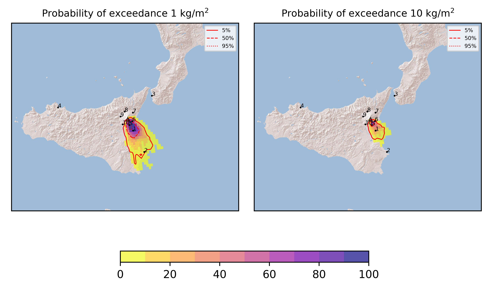
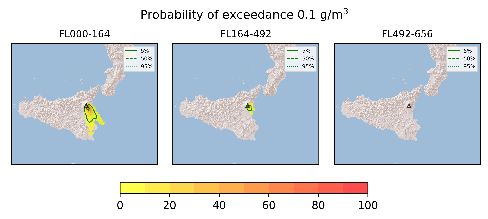
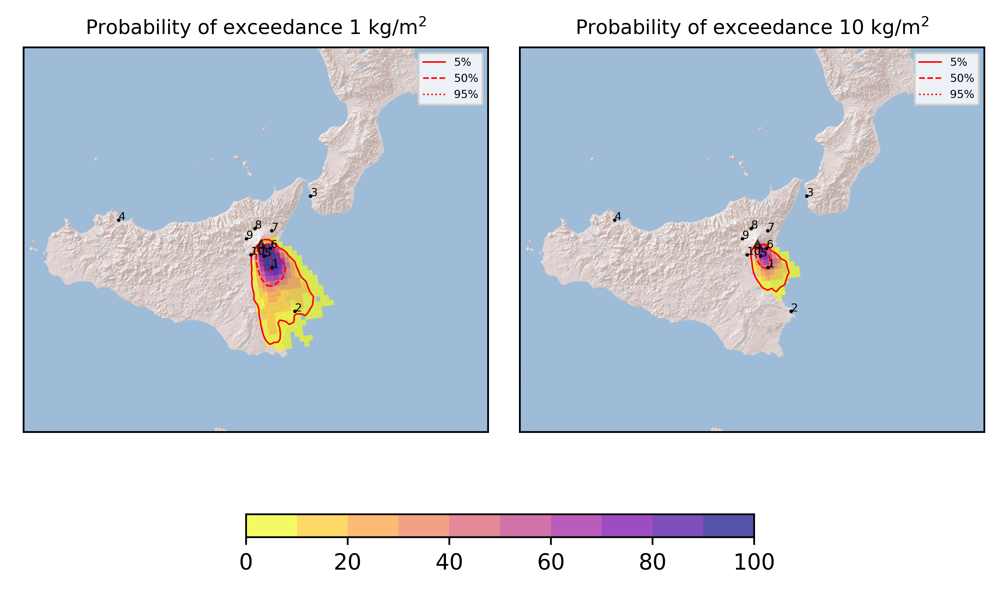
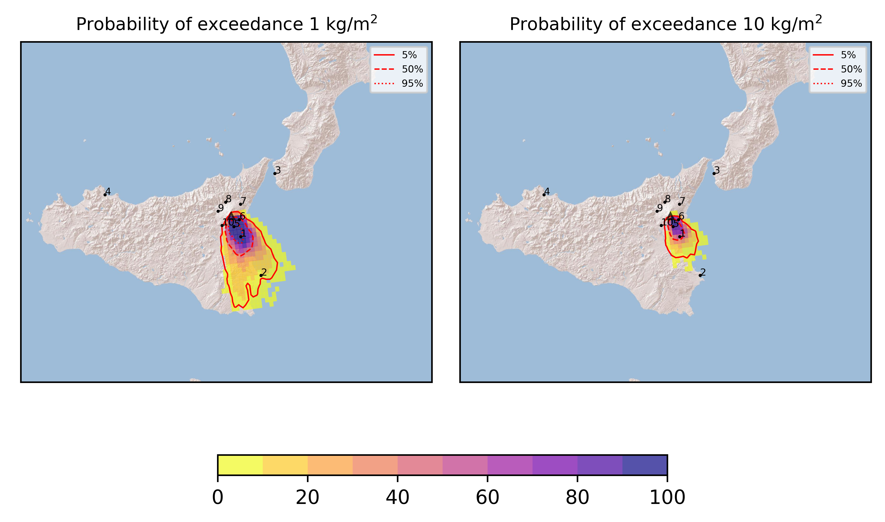
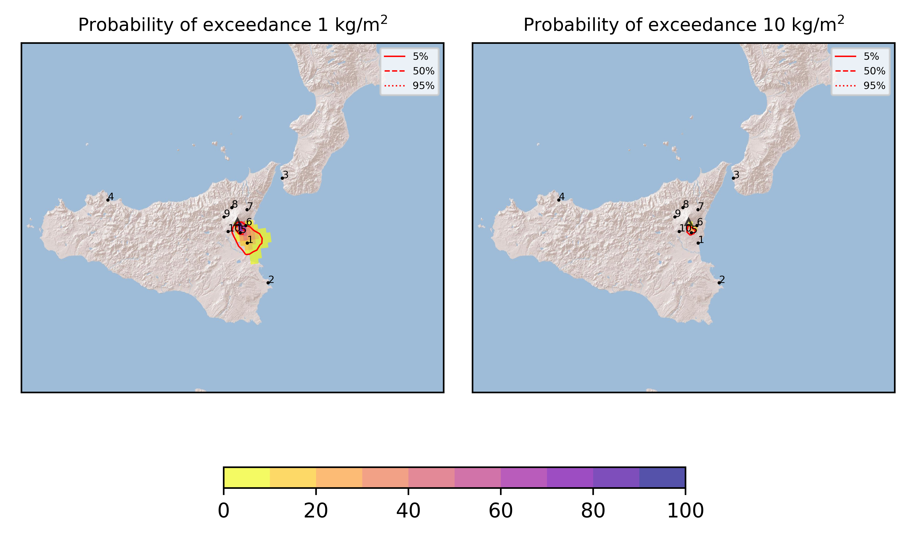

Forecast from VONA bulletin - 20210706_2218Z
============================================

Contents
========

* [Forecast products](#forecast-products)
	* [Forecast at 2021-07-07 01:20 Z](#forecast-at-2021-07-07-0120-z)
	* [Forecast at 2021-07-07 04:20 Z](#forecast-at-2021-07-07-0420-z)
	* [Forecast at 2021-07-07 07:20 Z](#forecast-at-2021-07-07-0720-z)
	* [Forecast at 2021-07-07 10:20 Z](#forecast-at-2021-07-07-1020-z)
	* [Forecast at 2021-07-07 02:10 Z](#forecast-at-2021-07-07-0210-z)
	* [Forecast at 2021-07-07 05:10 Z](#forecast-at-2021-07-07-0510-z)
	* [Forecast at 2021-07-07 08:10 Z](#forecast-at-2021-07-07-0810-z)

# Forecast products

## Forecast at 2021-07-07 01:20 Z
  

|Eruption start [Z]|Eruption end [Z]|Forecast time [Z]|Column height asl [m]|
| :--- | :--- | :--- | :--- |
|2021-07-06 22:20:00|Ongoing|2021-07-07 01:20:00|[6000 m, 12000 m]|
  
  

|Percentile|MER [kg/s¹]|Mass in the air [kg]|Mass on the ground [kg]|
| :--- | :--- | :--- | :--- |
|5th|4.54e+04|2.76e+07|4.20e+08|
|50th|3.42e+05|3.57e+08|2.96e+09|
|95th|1.39e+06|3.11e+09|1.04e+10|
  

### Ground 2021-07-07 01:20 Z
  
  
  
  
  
  
  
  
  
  
  

|Location|Ground load [kg/m²] 5th perc|Ground load [kg/m²] 50th perc|Ground load [kg/m²] 95th perc|
| :--- | :--- | :--- | :--- |
|Catania AP (1)|9.05e-02|1.43e+00|1.41e+01|
|Siracusa (2)|0.00e+00|0.00e+00|1.89e-01|
|Reggio Calabria AP (3)|0.00e+00|0.00e+00|0.00e+00|
|Palermo AP (4)|0.00e+00|0.00e+00|0.00e+00|
|Nicolosi (5)|4.70e-01|5.49e+00|3.70e+01|
|Zafferana (6)|1.09e-04|4.58e-02|3.99e+00|
|Linguaglossa (7)|0.00e+00|0.00e+00|0.00e+00|
|Randazzo (8)|0.00e+00|0.00e+00|0.00e+00|
|Bronte (9)|0.00e+00|0.00e+00|0.00e+00|
|Biancavilla (10)|0.00e+00|6.81e-06|6.47e-03|
  

### Atmosphere 2021-07-07 01:20 Z
  

## Forecast at 2021-07-07 04:20 Z
  

|Eruption start [Z]|Eruption end [Z]|Forecast time [Z]|Column height asl [m]|
| :--- | :--- | :--- | :--- |
|2021-07-06 22:20:00|Ongoing|2021-07-07 04:20:00|[6000 m, 12000 m]|
  
  

|Percentile|MER [kg/s¹]|Mass in the air [kg]|Mass on the ground [kg]|
| :--- | :--- | :--- | :--- |
|5th|5.75e+04|5.72e+07|1.64e+09|
|50th|3.88e+05|6.53e+08|7.80e+09|
|95th|1.26e+06|2.02e+09|1.86e+10|
  

### Ground 2021-07-07 04:20 Z
  
  
  
  
  
  
  
  
  
  
  

|Location|Ground load [kg/m²] 5th perc|Ground load [kg/m²] 50th perc|Ground load [kg/m²] 95th perc|
| :--- | :--- | :--- | :--- |
|Catania AP (1)|9.50e-01|5.19e+00|3.10e+01|
|Siracusa (2)|0.00e+00|7.18e-03|1.04e+00|
|Reggio Calabria AP (3)|0.00e+00|0.00e+00|0.00e+00|
|Palermo AP (4)|0.00e+00|0.00e+00|0.00e+00|
|Nicolosi (5)|1.98e+00|1.69e+01|7.44e+01|
|Zafferana (6)|4.96e-03|3.37e-01|1.20e+01|
|Linguaglossa (7)|0.00e+00|0.00e+00|0.00e+00|
|Randazzo (8)|0.00e+00|0.00e+00|0.00e+00|
|Bronte (9)|0.00e+00|0.00e+00|0.00e+00|
|Biancavilla (10)|0.00e+00|8.99e-04|4.16e-02|
  

### Atmosphere 2021-07-07 04:20 Z
  

## Forecast at 2021-07-07 07:20 Z
  

|Eruption start [Z]|Eruption end [Z]|Forecast time [Z]|Column height asl [m]|
| :--- | :--- | :--- | :--- |
|2021-07-06 22:20:00|Ongoing|2021-07-07 07:20:00|[6000 m, 12000 m]|
  
  

|Percentile|MER [kg/s¹]|Mass in the air [kg]|Mass on the ground [kg]|
| :--- | :--- | :--- | :--- |
|5th|4.50e+04|4.56e+07|2.72e+09|
|50th|3.90e+05|3.87e+08|1.31e+10|
|95th|1.20e+06|2.31e+09|2.36e+10|
  

### Ground 2021-07-07 07:20 Z
  
  
  
  
  
  
  
  
  
  
  

|Location|Ground load [kg/m²] 5th perc|Ground load [kg/m²] 50th perc|Ground load [kg/m²] 95th perc|
| :--- | :--- | :--- | :--- |
|Catania AP (1)|1.65e+00|1.27e+01|3.82e+01|
|Siracusa (2)|0.00e+00|2.10e-02|1.14e+00|
|Reggio Calabria AP (3)|0.00e+00|0.00e+00|0.00e+00|
|Palermo AP (4)|0.00e+00|0.00e+00|0.00e+00|
|Nicolosi (5)|6.79e+00|3.67e+01|8.93e+01|
|Zafferana (6)|3.21e-02|2.01e+00|1.37e+01|
|Linguaglossa (7)|0.00e+00|0.00e+00|2.05e-05|
|Randazzo (8)|0.00e+00|0.00e+00|0.00e+00|
|Bronte (9)|0.00e+00|0.00e+00|0.00e+00|
|Biancavilla (10)|2.44e-04|7.94e-03|9.84e-02|
  

### Atmosphere 2021-07-07 07:20 Z
  

## Forecast at 2021-07-07 10:20 Z
  

|Eruption start [Z]|Eruption end [Z]|Forecast time [Z]|Column height asl [m]|
| :--- | :--- | :--- | :--- |
|2021-07-06 22:20:00|Ongoing|2021-07-07 10:20:00|[6000 m, 12000 m]|
  
  

|Percentile|MER [kg/s¹]|Mass in the air [kg]|Mass on the ground [kg]|
| :--- | :--- | :--- | :--- |
|5th|5.78e+04|4.08e+07|4.75e+09|
|50th|3.24e+05|3.70e+08|1.81e+10|
|95th|1.05e+06|3.51e+09|2.98e+10|
  

### Ground 2021-07-07 10:20 Z
  
  
  
  
  
  
  
  
  
  
  

|Location|Ground load [kg/m²] 5th perc|Ground load [kg/m²] 50th perc|Ground load [kg/m²] 95th perc|
| :--- | :--- | :--- | :--- |
|Catania AP (1)|5.13e+00|1.63e+01|3.97e+01|
|Siracusa (2)|1.01e-05|5.44e-02|1.35e+00|
|Reggio Calabria AP (3)|0.00e+00|0.00e+00|0.00e+00|
|Palermo AP (4)|0.00e+00|0.00e+00|0.00e+00|
|Nicolosi (5)|1.07e+01|4.97e+01|1.03e+02|
|Zafferana (6)|5.54e-02|2.43e+00|1.37e+01|
|Linguaglossa (7)|0.00e+00|0.00e+00|6.59e-05|
|Randazzo (8)|0.00e+00|0.00e+00|0.00e+00|
|Bronte (9)|0.00e+00|0.00e+00|0.00e+00|
|Biancavilla (10)|2.26e-03|2.89e-02|2.41e-01|
  

### Atmosphere 2021-07-07 10:20 Z
  

## Forecast at 2021-07-07 02:10 Z
  

|Eruption start [Z]|Eruption end [Z]|Forecast time [Z]|Column height asl [m]|
| :--- | :--- | :--- | :--- |
|2021-07-06 22:20:00|Ongoing|2021-07-07 02:10:00|5000.0 ± 500 - from VONA|
  
  

|Percentile|MER [kg/s¹]|Mass in the air [kg]|Mass on the ground [kg]|
| :--- | :--- | :--- | :--- |
|5th|3.46e+02|9.59e+04|9.57e+07|
|50th|5.81e+03|1.86e+06|5.73e+08|
|95th|2.63e+04|7.57e+07|1.55e+09|
  

### Ground 2021-07-07 02:10 Z
  
  
  
  
  
  
  
  
  
  
  

|Location|Ground load [kg/m²] 5th perc|Ground load [kg/m²] 50th perc|Ground load [kg/m²] 95th perc|
| :--- | :--- | :--- | :--- |
|Catania AP (1)|2.33e-02|1.74e-01|2.24e+00|
|Siracusa (2)|0.00e+00|0.00e+00|4.41e-04|
|Reggio Calabria AP (3)|0.00e+00|0.00e+00|0.00e+00|
|Palermo AP (4)|0.00e+00|0.00e+00|0.00e+00|
|Nicolosi (5)|1.91e-01|1.22e+00|9.95e+00|
|Zafferana (6)|3.25e-04|2.86e-02|9.16e-01|
|Linguaglossa (7)|0.00e+00|0.00e+00|0.00e+00|
|Randazzo (8)|0.00e+00|0.00e+00|0.00e+00|
|Bronte (9)|0.00e+00|0.00e+00|0.00e+00|
|Biancavilla (10)|0.00e+00|4.52e-05|2.14e-03|
  

### Atmosphere 2021-07-07 02:10 Z
  

## Forecast at 2021-07-07 05:10 Z
  

|Eruption start [Z]|Eruption end [Z]|Forecast time [Z]|Column height asl [m]|
| :--- | :--- | :--- | :--- |
|2021-07-06 22:20:00|Ongoing|2021-07-07 05:10:00|5000.0 ± 500 - from VONA|
  
  

|Percentile|MER [kg/s¹]|Mass in the air [kg]|Mass on the ground [kg]|
| :--- | :--- | :--- | :--- |
|5th|2.07e+02|1.49e+04|9.93e+07|
|50th|6.76e+03|3.81e+06|6.02e+08|
|95th|2.22e+04|3.47e+07|1.62e+09|
  

### Ground 2021-07-07 05:10 Z
  
  
  
  
  
  
  
  
  
  
  

|Location|Ground load [kg/m²] 5th perc|Ground load [kg/m²] 50th perc|Ground load [kg/m²] 95th perc|
| :--- | :--- | :--- | :--- |
|Catania AP (1)|4.45e-02|3.46e-01|2.28e+00|
|Siracusa (2)|0.00e+00|0.00e+00|5.58e-03|
|Reggio Calabria AP (3)|0.00e+00|0.00e+00|0.00e+00|
|Palermo AP (4)|0.00e+00|0.00e+00|0.00e+00|
|Nicolosi (5)|2.65e-01|1.73e+00|1.04e+01|
|Zafferana (6)|7.15e-04|3.43e-02|9.22e-01|
|Linguaglossa (7)|0.00e+00|0.00e+00|0.00e+00|
|Randazzo (8)|0.00e+00|0.00e+00|0.00e+00|
|Bronte (9)|0.00e+00|0.00e+00|0.00e+00|
|Biancavilla (10)|0.00e+00|1.61e-04|5.11e-03|
  

### Atmosphere 2021-07-07 05:10 Z
  

## Forecast at 2021-07-07 08:10 Z
  

|Eruption start [Z]|Eruption end [Z]|Forecast time [Z]|Column height asl [m]|
| :--- | :--- | :--- | :--- |
|2021-07-06 22:20:00|Ongoing|2021-07-07 08:10:00|5000.0 ± 500 - from VONA|
  
  

|Percentile|MER [kg/s¹]|Mass in the air [kg]|Mass on the ground [kg]|
| :--- | :--- | :--- | :--- |
|5th|4.77e+01|1.15e+04|1.41e+08|
|50th|5.70e+03|3.90e+06|7.27e+08|
|95th|1.98e+04|9.60e+06|1.68e+09|
  

### Ground 2021-07-07 08:10 Z
  
  
  
  
  
  
  
  
  
  
  

|Location|Ground load [kg/m²] 5th perc|Ground load [kg/m²] 50th perc|Ground load [kg/m²] 95th perc|
| :--- | :--- | :--- | :--- |
|Catania AP (1)|6.24e-02|3.73e-01|2.28e+00|
|Siracusa (2)|0.00e+00|4.08e-06|7.52e-03|
|Reggio Calabria AP (3)|0.00e+00|0.00e+00|0.00e+00|
|Palermo AP (4)|0.00e+00|0.00e+00|0.00e+00|
|Nicolosi (5)|4.44e-01|2.37e+00|1.06e+01|
|Zafferana (6)|1.67e-03|4.95e-02|9.22e-01|
|Linguaglossa (7)|0.00e+00|0.00e+00|0.00e+00|
|Randazzo (8)|0.00e+00|0.00e+00|0.00e+00|
|Bronte (9)|0.00e+00|0.00e+00|0.00e+00|
|Biancavilla (10)|8.57e-06|7.48e-04|1.22e-02|
  

### Atmosphere 2021-07-07 08:10 Z
  
  
Go to [Supplementary page](Supplementary_page.md)  
Go to [Main directory](https://github.com/federicapardini/Real_time_ash_forecast)