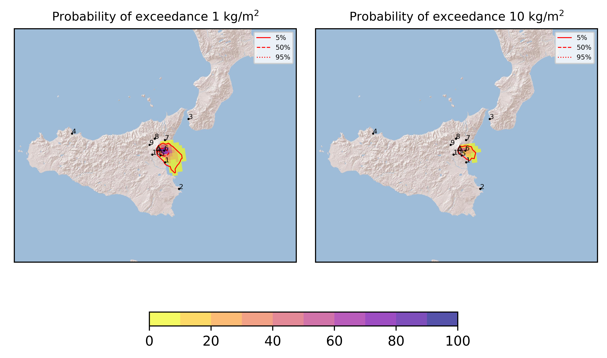
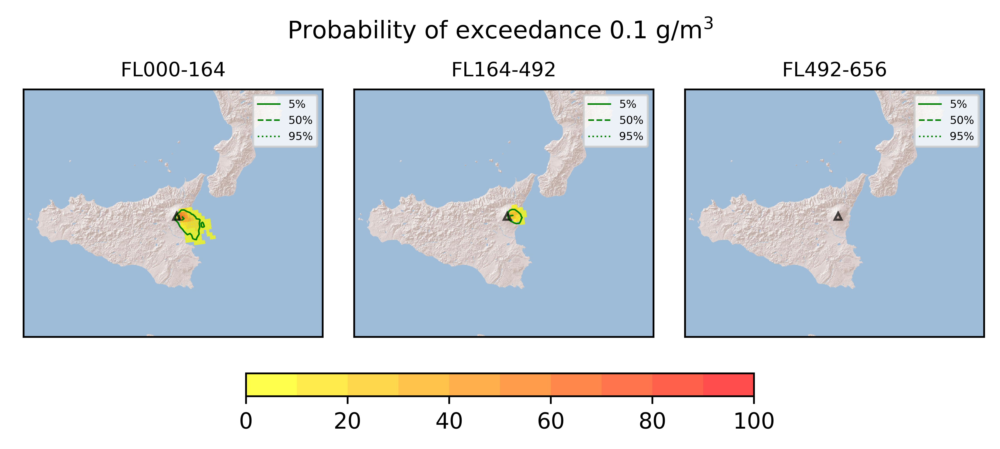
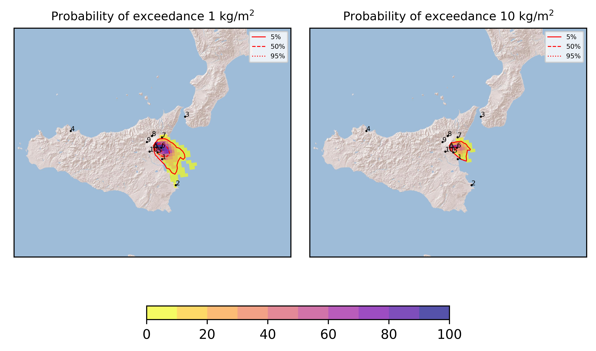

Forecast from VONA bulletin - 20210708_2021Z
============================================

Contents
========

* [Forecast products](#forecast-products)
	* [Forecast at 2021-07-08 23:20 Z](#forecast-at-2021-07-08-2320-z)
	* [Forecast at 2021-07-09 02:20 Z](#forecast-at-2021-07-09-0220-z)
	* [Forecast at 2021-07-09 05:20 Z](#forecast-at-2021-07-09-0520-z)
	* [Forecast at 2021-07-09 00:00 Z](#forecast-at-2021-07-09-0000-z)
	* [Forecast at 2021-07-09 03:00 Z](#forecast-at-2021-07-09-0300-z)

# Forecast products

## Forecast at 2021-07-08 23:20 Z
  

|Eruption start [Z]|Eruption end [Z]|Forecast time [Z]|Column height asl [m]|
| :--- | :--- | :--- | :--- |
|2021-07-08 20:20:00|Ongoing|2021-07-08 23:20:00|[6000 m, 12000 m]|
  
  

|Percentile|MER [kg/s¹]|Mass in the air [kg]|Mass on the ground [kg]|
| :--- | :--- | :--- | :--- |
|5th|1.29e+04|6.99e+06|1.42e+08|
|50th|2.29e+05|1.98e+08|1.99e+09|
|95th|1.23e+06|2.58e+09|9.75e+09|
  

### Ground 2021-07-08 23:20 Z
  
  
  
  
  
  
  
  
  
  
  

|Location|Ground load [kg/m²] 5th perc|Ground load [kg/m²] 50th perc|Ground load [kg/m²] 95th perc|
| :--- | :--- | :--- | :--- |
|Catania AP (1)|0.00e+00|4.44e-03|1.96e+00|
|Siracusa (2)|0.00e+00|0.00e+00|3.35e-03|
|Reggio Calabria AP (3)|0.00e+00|0.00e+00|0.00e+00|
|Palermo AP (4)|0.00e+00|0.00e+00|0.00e+00|
|Nicolosi (5)|1.89e-02|2.85e-01|5.08e+00|
|Zafferana (6)|5.64e-02|3.52e+00|2.63e+01|
|Linguaglossa (7)|0.00e+00|0.00e+00|6.02e-03|
|Randazzo (8)|0.00e+00|0.00e+00|0.00e+00|
|Bronte (9)|0.00e+00|0.00e+00|0.00e+00|
|Biancavilla (10)|0.00e+00|2.72e-06|1.37e-03|
  

### Atmosphere 2021-07-08 23:20 Z
  

## Forecast at 2021-07-09 02:20 Z
  

|Eruption start [Z]|Eruption end [Z]|Forecast time [Z]|Column height asl [m]|
| :--- | :--- | :--- | :--- |
|2021-07-08 20:20:00|Ongoing|2021-07-09 02:20:00|[6000 m, 12000 m]|
  
  

|Percentile|MER [kg/s¹]|Mass in the air [kg]|Mass on the ground [kg]|
| :--- | :--- | :--- | :--- |
|5th|2.41e+04|5.69e+07|8.67e+08|
|50th|2.63e+05|4.50e+08|5.50e+09|
|95th|1.29e+06|2.07e+09|1.79e+10|
  

### Ground 2021-07-09 02:20 Z
  
  
  
  
  
  
  
  
  
  
  

|Location|Ground load [kg/m²] 5th perc|Ground load [kg/m²] 50th perc|Ground load [kg/m²] 95th perc|
| :--- | :--- | :--- | :--- |
|Catania AP (1)|4.21e-04|1.70e-01|3.59e+00|
|Siracusa (2)|0.00e+00|0.00e+00|9.96e-02|
|Reggio Calabria AP (3)|0.00e+00|0.00e+00|0.00e+00|
|Palermo AP (4)|0.00e+00|0.00e+00|0.00e+00|
|Nicolosi (5)|4.10e-02|1.73e+00|8.83e+00|
|Zafferana (6)|4.92e-01|9.78e+00|4.55e+01|
|Linguaglossa (7)|0.00e+00|3.72e-06|1.12e-01|
|Randazzo (8)|0.00e+00|0.00e+00|0.00e+00|
|Bronte (9)|0.00e+00|0.00e+00|0.00e+00|
|Biancavilla (10)|0.00e+00|4.22e-05|1.48e-03|
  

### Atmosphere 2021-07-09 02:20 Z
  

## Forecast at 2021-07-09 05:20 Z
  

|Eruption start [Z]|Eruption end [Z]|Forecast time [Z]|Column height asl [m]|
| :--- | :--- | :--- | :--- |
|2021-07-08 20:20:00|Ongoing|2021-07-09 05:20:00|[6000 m, 12000 m]|
  
  

|Percentile|MER [kg/s¹]|Mass in the air [kg]|Mass on the ground [kg]|
| :--- | :--- | :--- | :--- |
|5th|2.23e+04|3.06e+07|1.64e+09|
|50th|3.11e+05|4.31e+08|1.24e+10|
|95th|1.60e+06|3.03e+09|2.52e+10|
  

### Ground 2021-07-09 05:20 Z
  
  
  
  
  
  
  
  
  
  
  

|Location|Ground load [kg/m²] 5th perc|Ground load [kg/m²] 50th perc|Ground load [kg/m²] 95th perc|
| :--- | :--- | :--- | :--- |
|Catania AP (1)|3.28e-03|5.64e-01|6.77e+00|
|Siracusa (2)|0.00e+00|4.39e-04|3.32e-01|
|Reggio Calabria AP (3)|0.00e+00|0.00e+00|0.00e+00|
|Palermo AP (4)|0.00e+00|0.00e+00|0.00e+00|
|Nicolosi (5)|6.57e-02|3.60e+00|1.06e+01|
|Zafferana (6)|2.03e+00|2.69e+01|5.43e+01|
|Linguaglossa (7)|0.00e+00|1.12e-03|3.91e-01|
|Randazzo (8)|0.00e+00|0.00e+00|0.00e+00|
|Bronte (9)|0.00e+00|0.00e+00|0.00e+00|
|Biancavilla (10)|0.00e+00|8.03e-05|2.45e-03|
  

### Atmosphere 2021-07-09 05:20 Z
  

## Forecast at 2021-07-09 00:00 Z
  

|Eruption start [Z]|Eruption end [Z]|Forecast time [Z]|Column height asl [m]|
| :--- | :--- | :--- | :--- |
|2021-07-08 20:20:00|Ongoing|2021-07-09 00:00:00|4000 ± 500 - from VONA|
  
  

|Percentile|MER [kg/s¹]|Mass in the air [kg]|Mass on the ground [kg]|
| :--- | :--- | :--- | :--- |
|5th|4.21e+02|1.16e+04|2.36e+07|
|50th|4.22e+02|2.14e+05|2.28e+08|
|95th|3.87e+03|5.75e+06|9.67e+08|
  

### Ground 2021-07-09 00:00 Z
  
  
  
  
  
  
  
  
  
  
  

|Location|Ground load [kg/m²] 5th perc|Ground load [kg/m²] 50th perc|Ground load [kg/m²] 95th perc|
| :--- | :--- | :--- | :--- |
|Catania AP (1)|6.26e-06|6.25e-04|5.25e-02|
|Siracusa (2)|0.00e+00|0.00e+00|0.00e+00|
|Reggio Calabria AP (3)|0.00e+00|0.00e+00|0.00e+00|
|Palermo AP (4)|0.00e+00|0.00e+00|0.00e+00|
|Nicolosi (5)|3.90e-03|4.03e-02|6.41e-01|
|Zafferana (6)|1.50e-02|5.19e-01|2.80e+00|
|Linguaglossa (7)|0.00e+00|0.00e+00|1.23e-03|
|Randazzo (8)|0.00e+00|0.00e+00|0.00e+00|
|Bronte (9)|0.00e+00|0.00e+00|0.00e+00|
|Biancavilla (10)|0.00e+00|6.81e-06|1.99e-04|
  

### Atmosphere 2021-07-09 00:00 Z
  

## Forecast at 2021-07-09 03:00 Z
  

|Eruption start [Z]|Eruption end [Z]|Forecast time [Z]|Column height asl [m]|
| :--- | :--- | :--- | :--- |
|2021-07-08 20:20:00|Ongoing|2021-07-09 03:00:00|4000 ± 500 - from VONA|
  
  

|Percentile|MER [kg/s¹]|Mass in the air [kg]|Mass on the ground [kg]|
| :--- | :--- | :--- | :--- |
|5th|4.58e+01|3.73e+02|2.43e+07|
|50th|4.59e+01|5.60e+03|3.81e+08|
|95th|2.18e+03|5.35e+06|3.05e+09|
  

### Ground 2021-07-09 03:00 Z
  
  
  
  
  
  
  
  
  
  
  

|Location|Ground load [kg/m²] 5th perc|Ground load [kg/m²] 50th perc|Ground load [kg/m²] 95th perc|
| :--- | :--- | :--- | :--- |
|Catania AP (1)|7.96e-05|1.75e-03|8.76e-02|
|Siracusa (2)|0.00e+00|0.00e+00|4.81e-05|
|Reggio Calabria AP (3)|0.00e+00|0.00e+00|0.00e+00|
|Palermo AP (4)|0.00e+00|0.00e+00|0.00e+00|
|Nicolosi (5)|5.61e-03|6.02e-02|1.13e+00|
|Zafferana (6)|1.51e-02|7.03e-01|6.30e+00|
|Linguaglossa (7)|0.00e+00|0.00e+00|1.23e-03|
|Randazzo (8)|0.00e+00|0.00e+00|0.00e+00|
|Bronte (9)|0.00e+00|0.00e+00|0.00e+00|
|Biancavilla (10)|0.00e+00|9.53e-06|4.07e-04|
  

### Atmosphere 2021-07-09 03:00 Z
  
  
Go to [Supplementary page](Supplementary_page.md)  
Go to [Main directory](https://github.com/federicapardini/Real_time_ash_forecast)