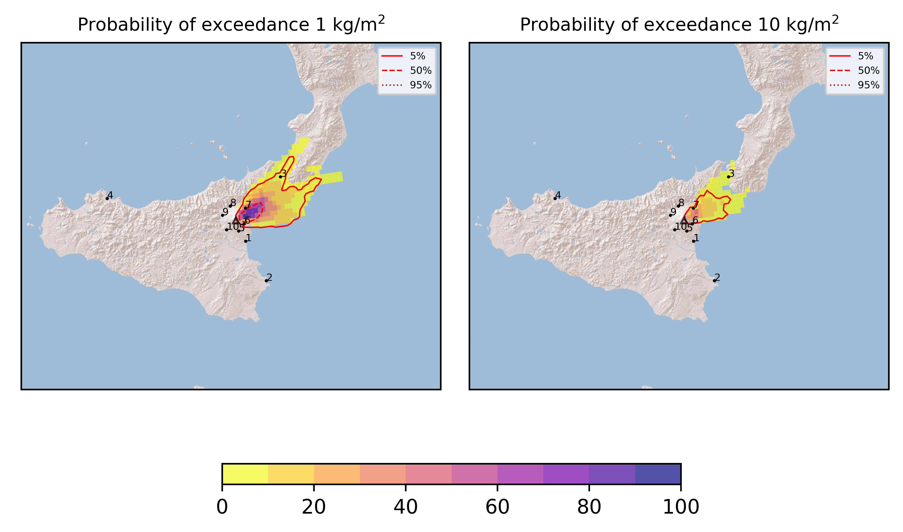
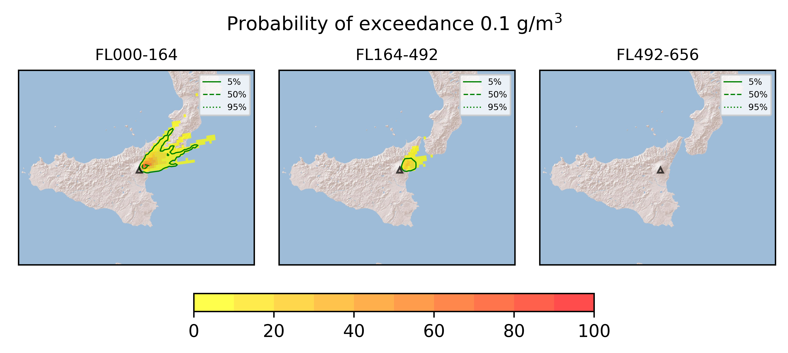
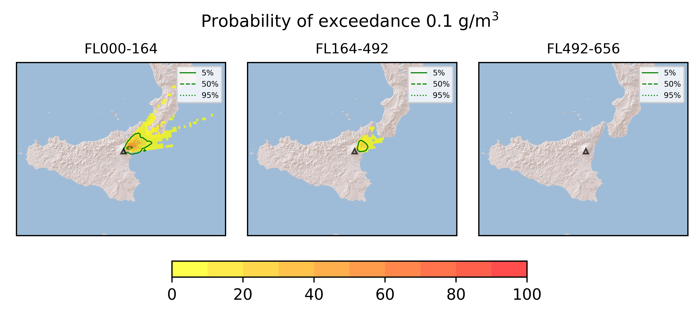
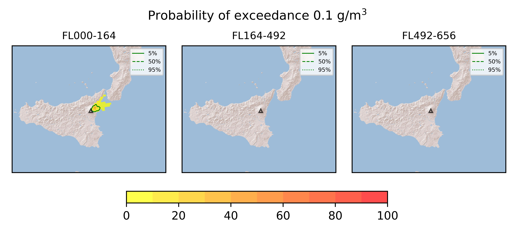
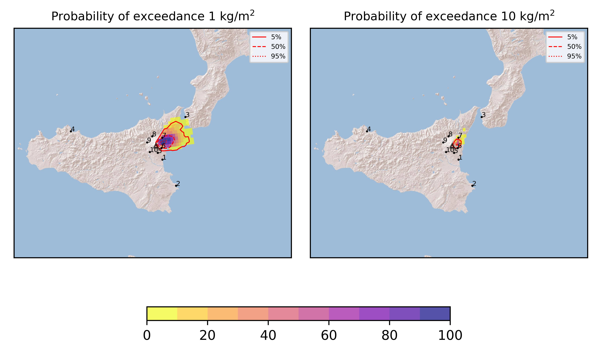
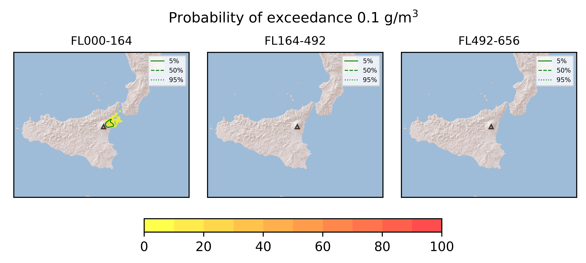
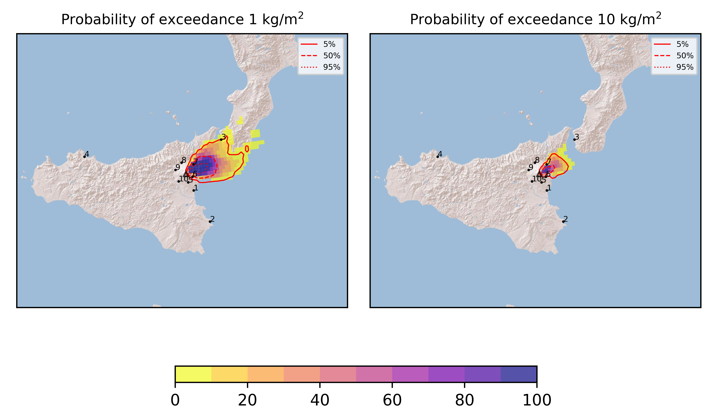
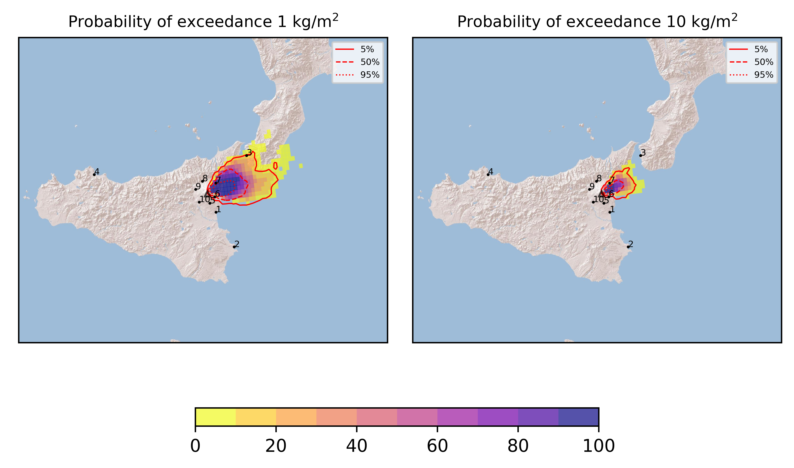

Forecast from VONA bulletin - 20210714_1022Z
============================================

Contents
========

* [Forecast products](#forecast-products)
	* [Forecast at 2021-07-14 13:20 Z](#forecast-at-2021-07-14-1320-z)
	* [Forecast at 2021-07-14 16:20 Z](#forecast-at-2021-07-14-1620-z)
	* [Forecast at 2021-07-14 19:20 Z](#forecast-at-2021-07-14-1920-z)
	* [Forecast at 2021-07-14 14:10 Z](#forecast-at-2021-07-14-1410-z)
	* [Forecast at 2021-07-14 17:10 Z](#forecast-at-2021-07-14-1710-z)
	* [Forecast at 2021-07-14 14:40 Z](#forecast-at-2021-07-14-1440-z)
	* [Forecast at 2021-07-14 17:40 Z](#forecast-at-2021-07-14-1740-z)
	* [Forecast at 2021-07-14 20:40 Z](#forecast-at-2021-07-14-2040-z)

# Forecast products

## Forecast at 2021-07-14 13:20 Z
  

|Eruption start [Z]|Eruption end [Z]|Forecast time [Z]|Column height asl [m]|
| :--- | :--- | :--- | :--- |
|2021-07-14 10:20:00|Ongoing|2021-07-14 13:20:00|[6000 m, 12000 m]|
  
  

|Percentile|MER [kg/s¹]|Mass in the air [kg]|Mass on the ground [kg]|
| :--- | :--- | :--- | :--- |
|5th|1.29e+05|1.15e+08|1.07e+09|
|50th|5.54e+05|6.20e+08|4.97e+09|
|95th|2.54e+06|6.15e+09|2.04e+10|
  

### Ground 2021-07-14 13:20 Z
  
  
  
  
  
  
  
  
  
  
  

|Location|Ground load [kg/m²] 5th perc|Ground load [kg/m²] 50th perc|Ground load [kg/m²] 95th perc|
| :--- | :--- | :--- | :--- |
|Catania AP (1)|0.00e+00|0.00e+00|4.33e-04|
|Siracusa (2)|0.00e+00|0.00e+00|0.00e+00|
|Reggio Calabria AP (3)|0.00e+00|7.78e-06|1.96e+00|
|Palermo AP (4)|0.00e+00|0.00e+00|0.00e+00|
|Nicolosi (5)|0.00e+00|8.43e-05|1.70e-03|
|Zafferana (6)|2.14e-02|7.42e-01|5.24e+00|
|Linguaglossa (7)|3.23e-03|5.85e-01|8.01e+00|
|Randazzo (8)|0.00e+00|0.00e+00|0.00e+00|
|Bronte (9)|0.00e+00|0.00e+00|0.00e+00|
|Biancavilla (10)|0.00e+00|0.00e+00|0.00e+00|
  

### Atmosphere 2021-07-14 13:20 Z
  

## Forecast at 2021-07-14 16:20 Z
  

|Eruption start [Z]|Eruption end [Z]|Forecast time [Z]|Column height asl [m]|
| :--- | :--- | :--- | :--- |
|2021-07-14 10:20:00|Ongoing|2021-07-14 16:20:00|[6000 m, 12000 m]|
  
  

|Percentile|MER [kg/s¹]|Mass in the air [kg]|Mass on the ground [kg]|
| :--- | :--- | :--- | :--- |
|5th|1.13e+05|1.84e+08|3.93e+09|
|50th|4.72e+05|6.95e+08|1.16e+10|
|95th|2.21e+06|3.53e+09|3.39e+10|
  

### Ground 2021-07-14 16:20 Z
  
  
  
  
  
  
  
  
  
  
  

|Location|Ground load [kg/m²] 5th perc|Ground load [kg/m²] 50th perc|Ground load [kg/m²] 95th perc|
| :--- | :--- | :--- | :--- |
|Catania AP (1)|0.00e+00|9.18e-05|2.51e-03|
|Siracusa (2)|0.00e+00|0.00e+00|7.08e-05|
|Reggio Calabria AP (3)|0.00e+00|3.91e-03|7.22e+00|
|Palermo AP (4)|0.00e+00|0.00e+00|0.00e+00|
|Nicolosi (5)|9.00e-07|9.10e-04|7.58e-03|
|Zafferana (6)|3.44e-01|1.91e+00|8.54e+00|
|Linguaglossa (7)|3.86e-02|2.79e+00|1.68e+01|
|Randazzo (8)|0.00e+00|0.00e+00|1.06e-04|
|Bronte (9)|0.00e+00|0.00e+00|1.33e-05|
|Biancavilla (10)|0.00e+00|0.00e+00|3.81e-05|
  

### Atmosphere 2021-07-14 16:20 Z
  

## Forecast at 2021-07-14 19:20 Z
  

|Eruption start [Z]|Eruption end [Z]|Forecast time [Z]|Column height asl [m]|
| :--- | :--- | :--- | :--- |
|2021-07-14 10:20:00|Ongoing|2021-07-14 19:20:00|[6000 m, 12000 m]|
  
  

|Percentile|MER [kg/s¹]|Mass in the air [kg]|Mass on the ground [kg]|
| :--- | :--- | :--- | :--- |
|5th|6.77e+04|7.72e+07|6.32e+09|
|50th|3.70e+05|5.55e+08|2.06e+10|
|95th|2.23e+06|4.34e+09|4.46e+10|
  

### Ground 2021-07-14 19:20 Z
  
  
  
  
  
  
  
  
  
  
  

|Location|Ground load [kg/m²] 5th perc|Ground load [kg/m²] 50th perc|Ground load [kg/m²] 95th perc|
| :--- | :--- | :--- | :--- |
|Catania AP (1)|7.80e-06|3.82e-04|3.19e-03|
|Siracusa (2)|0.00e+00|0.00e+00|1.08e-04|
|Reggio Calabria AP (3)|0.00e+00|4.35e-03|9.03e+00|
|Palermo AP (4)|0.00e+00|0.00e+00|0.00e+00|
|Nicolosi (5)|1.13e-04|1.76e-03|9.74e-03|
|Zafferana (6)|1.10e+00|3.38e+00|9.96e+00|
|Linguaglossa (7)|4.83e-01|4.45e+00|1.77e+01|
|Randazzo (8)|0.00e+00|9.33e-06|6.54e-04|
|Bronte (9)|0.00e+00|0.00e+00|1.26e-04|
|Biancavilla (10)|0.00e+00|4.08e-06|2.51e-04|
  

### Atmosphere 2021-07-14 19:20 Z
  

## Forecast at 2021-07-14 14:10 Z
  

|Eruption start [Z]|Eruption end [Z]|Forecast time [Z]|Column height asl [m]|
| :--- | :--- | :--- | :--- |
|2021-07-14 10:20:00|Ongoing|2021-07-14 14:10:00|6000 ± 500 - from VONA|
  
  

|Percentile|MER [kg/s¹]|Mass in the air [kg]|Mass on the ground [kg]|
| :--- | :--- | :--- | :--- |
|5th|3.51e+04|2.16e+07|8.28e+08|
|50th|1.05e+05|1.02e+08|1.82e+09|
|95th|2.26e+05|6.11e+08|3.80e+09|
  

### Ground 2021-07-14 14:10 Z
  
  
  
  
  
  
  
  
  
  
  

|Location|Ground load [kg/m²] 5th perc|Ground load [kg/m²] 50th perc|Ground load [kg/m²] 95th perc|
| :--- | :--- | :--- | :--- |
|Catania AP (1)|0.00e+00|1.99e-06|4.28e-04|
|Siracusa (2)|0.00e+00|0.00e+00|4.31e-06|
|Reggio Calabria AP (3)|0.00e+00|0.00e+00|5.76e-03|
|Palermo AP (4)|0.00e+00|0.00e+00|0.00e+00|
|Nicolosi (5)|9.67e-07|2.50e-04|3.79e-03|
|Zafferana (6)|1.37e-01|8.02e-01|2.06e+00|
|Linguaglossa (7)|1.33e-01|8.36e-01|3.11e+00|
|Randazzo (8)|0.00e+00|0.00e+00|2.92e-05|
|Bronte (9)|0.00e+00|0.00e+00|0.00e+00|
|Biancavilla (10)|0.00e+00|0.00e+00|7.77e-06|
  

### Atmosphere 2021-07-14 14:10 Z
  

## Forecast at 2021-07-14 17:10 Z
  

|Eruption start [Z]|Eruption end [Z]|Forecast time [Z]|Column height asl [m]|
| :--- | :--- | :--- | :--- |
|2021-07-14 10:20:00|Ongoing|2021-07-14 17:10:00|6000 ± 500 - from VONA|
  
  

|Percentile|MER [kg/s¹]|Mass in the air [kg]|Mass on the ground [kg]|
| :--- | :--- | :--- | :--- |
|5th|3.00e+04|1.39e+07|1.65e+09|
|50th|7.61e+04|4.48e+07|2.90e+09|
|95th|1.86e+05|5.48e+08|4.90e+09|
  

### Ground 2021-07-14 17:10 Z
  
  
  
  
  
  
  
  
  
  
  

|Location|Ground load [kg/m²] 5th perc|Ground load [kg/m²] 50th perc|Ground load [kg/m²] 95th perc|
| :--- | :--- | :--- | :--- |
|Catania AP (1)|0.00e+00|4.03e-05|2.02e-03|
|Siracusa (2)|0.00e+00|0.00e+00|2.65e-05|
|Reggio Calabria AP (3)|0.00e+00|4.65e-05|2.91e-02|
|Palermo AP (4)|0.00e+00|0.00e+00|0.00e+00|
|Nicolosi (5)|4.23e-06|1.28e-03|5.92e-03|
|Zafferana (6)|1.68e-01|1.30e+00|2.73e+00|
|Linguaglossa (7)|3.33e-01|1.20e+00|4.35e+00|
|Randazzo (8)|0.00e+00|0.00e+00|1.53e-04|
|Bronte (9)|0.00e+00|0.00e+00|6.67e-06|
|Biancavilla (10)|0.00e+00|0.00e+00|6.33e-05|
  

### Atmosphere 2021-07-14 17:10 Z
  

## Forecast at 2021-07-14 14:40 Z
  

|Eruption start [Z]|Eruption end [Z]|Forecast time [Z]|Column height asl [m]|
| :--- | :--- | :--- | :--- |
|2021-07-14 10:20:00|Ongoing|2021-07-14 14:40:00|9000 ± 500 - from VONA|
  
  

|Percentile|MER [kg/s¹]|Mass in the air [kg]|Mass on the ground [kg]|
| :--- | :--- | :--- | :--- |
|5th|2.76e+05|1.94e+08|2.83e+09|
|50th|5.39e+05|7.51e+08|5.46e+09|
|95th|8.56e+05|2.60e+09|9.70e+09|
  

### Ground 2021-07-14 14:40 Z
  
  
  
  
  
  
  
  
  
  
  

|Location|Ground load [kg/m²] 5th perc|Ground load [kg/m²] 50th perc|Ground load [kg/m²] 95th perc|
| :--- | :--- | :--- | :--- |
|Catania AP (1)|0.00e+00|9.94e-07|7.45e-04|
|Siracusa (2)|0.00e+00|0.00e+00|1.39e-05|
|Reggio Calabria AP (3)|0.00e+00|1.24e-05|1.39e+00|
|Palermo AP (4)|0.00e+00|0.00e+00|0.00e+00|
|Nicolosi (5)|1.33e-06|2.29e-04|3.93e-03|
|Zafferana (6)|1.51e-01|1.07e+00|4.21e+00|
|Linguaglossa (7)|7.20e-02|1.80e+00|7.47e+00|
|Randazzo (8)|0.00e+00|0.00e+00|2.51e-05|
|Bronte (9)|0.00e+00|0.00e+00|7.33e-06|
|Biancavilla (10)|0.00e+00|0.00e+00|2.37e-05|
  

### Atmosphere 2021-07-14 14:40 Z
  

## Forecast at 2021-07-14 17:40 Z
  

|Eruption start [Z]|Eruption end [Z]|Forecast time [Z]|Column height asl [m]|
| :--- | :--- | :--- | :--- |
|2021-07-14 10:20:00|Ongoing|2021-07-14 17:40:00|9000 ± 500 - from VONA|
  
  

|Percentile|MER [kg/s¹]|Mass in the air [kg]|Mass on the ground [kg]|
| :--- | :--- | :--- | :--- |
|5th|1.79e+05|1.54e+08|6.90e+09|
|50th|3.55e+05|4.50e+08|1.03e+10|
|95th|7.12e+05|1.62e+09|1.44e+10|
  

### Ground 2021-07-14 17:40 Z
  
  
  
  
  
  
  
  
  
  
  

|Location|Ground load [kg/m²] 5th perc|Ground load [kg/m²] 50th perc|Ground load [kg/m²] 95th perc|
| :--- | :--- | :--- | :--- |
|Catania AP (1)|0.00e+00|1.58e-04|3.33e-03|
|Siracusa (2)|0.00e+00|0.00e+00|3.00e-04|
|Reggio Calabria AP (3)|1.40e-06|2.25e-03|1.63e+00|
|Palermo AP (4)|0.00e+00|0.00e+00|0.00e+00|
|Nicolosi (5)|1.48e-04|1.08e-03|6.53e-03|
|Zafferana (6)|8.90e-01|2.40e+00|4.96e+00|
|Linguaglossa (7)|1.39e+00|4.15e+00|1.10e+01|
|Randazzo (8)|0.00e+00|0.00e+00|3.13e-04|
|Bronte (9)|0.00e+00|0.00e+00|4.10e-05|
|Biancavilla (10)|0.00e+00|0.00e+00|1.31e-04|
  

### Atmosphere 2021-07-14 17:40 Z
  

## Forecast at 2021-07-14 20:40 Z
  

|Eruption start [Z]|Eruption end [Z]|Forecast time [Z]|Column height asl [m]|
| :--- | :--- | :--- | :--- |
|2021-07-14 10:20:00|Ongoing|2021-07-14 20:40:00|9000 ± 500 - from VONA|
  
  

|Percentile|MER [kg/s¹]|Mass in the air [kg]|Mass on the ground [kg]|
| :--- | :--- | :--- | :--- |
|5th|1.62e+05|8.82e+07|1.06e+10|
|50th|3.34e+05|5.08e+08|1.33e+10|
|95th|1.00e+06|2.08e+09|1.96e+10|
  

### Ground 2021-07-14 20:40 Z
  
  
  
  
  
  
  
  
  
  
  

|Location|Ground load [kg/m²] 5th perc|Ground load [kg/m²] 50th perc|Ground load [kg/m²] 95th perc|
| :--- | :--- | :--- | :--- |
|Catania AP (1)|7.61e-06|2.88e-04|3.91e-03|
|Siracusa (2)|0.00e+00|0.00e+00|3.97e-04|
|Reggio Calabria AP (3)|1.42e-05|4.73e-03|1.63e+00|
|Palermo AP (4)|0.00e+00|0.00e+00|0.00e+00|
|Nicolosi (5)|3.28e-04|1.71e-03|6.95e-03|
|Zafferana (6)|1.67e+00|3.09e+00|6.35e+00|
|Linguaglossa (7)|2.08e+00|5.10e+00|1.15e+01|
|Randazzo (8)|0.00e+00|5.73e-05|1.01e-03|
|Bronte (9)|0.00e+00|0.00e+00|4.40e-05|
|Biancavilla (10)|0.00e+00|4.08e-06|1.47e-04|
  

### Atmosphere 2021-07-14 20:40 Z
  
  
Go to [Supplementary page](Supplementary_page.md)  
Go to [Main directory](https://github.com/federicapardini/Real_time_ash_forecast)