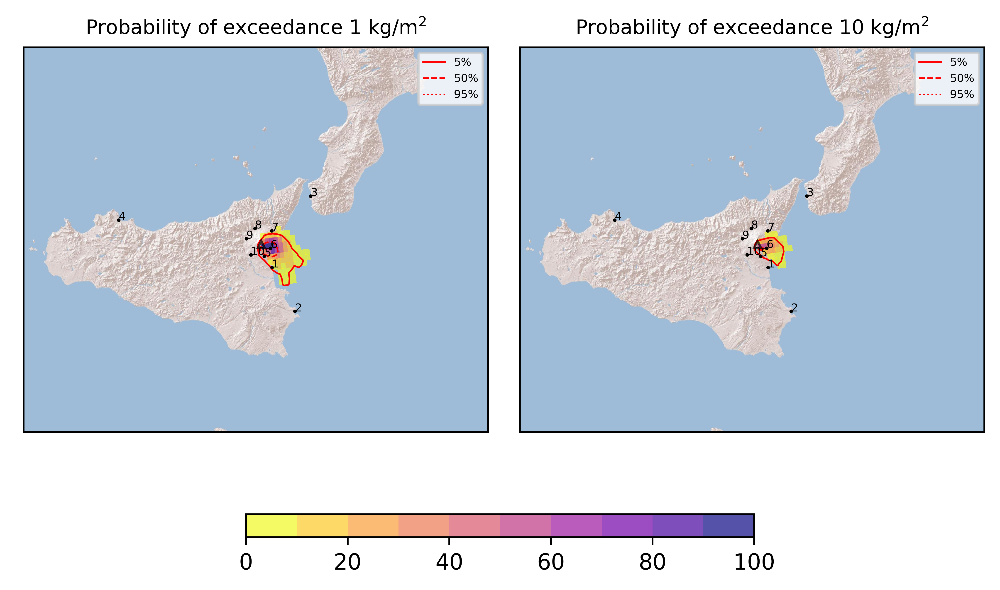
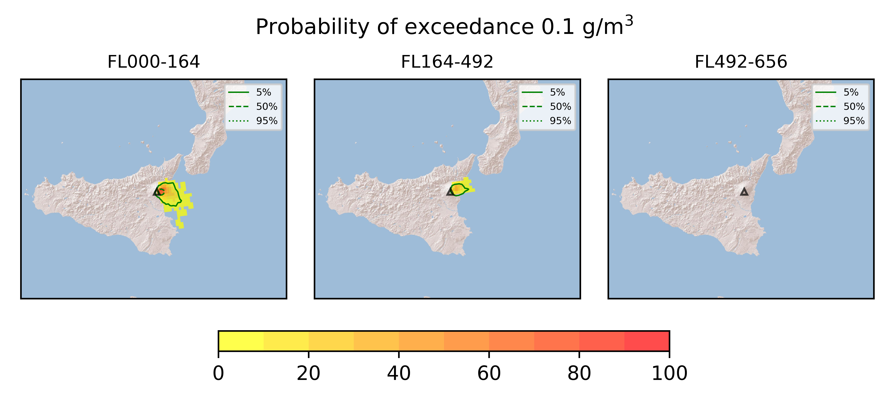
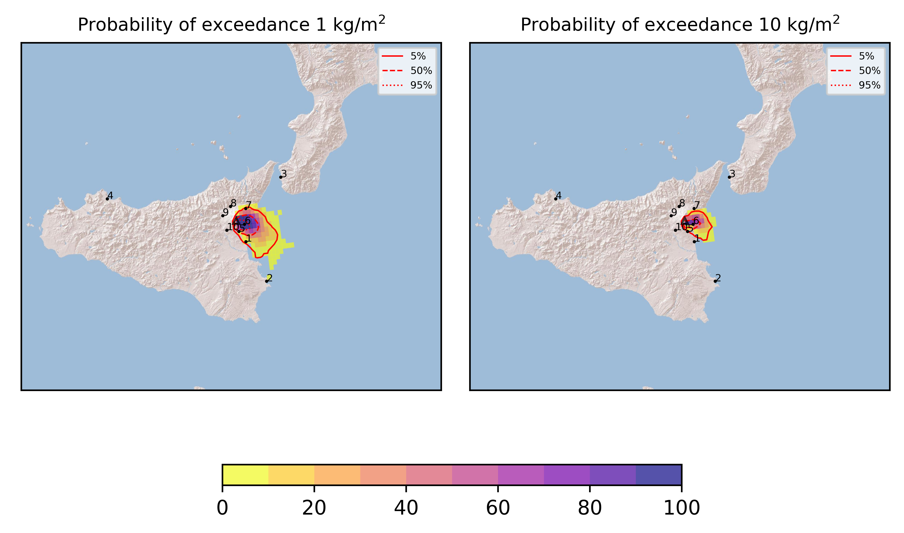

Forecast from VONA bulletin - 20210720_0339Z
============================================

Contents
========

* [Forecast products](#forecast-products)
	* [Forecast at 2021-07-20 06:40 Z](#forecast-at-2021-07-20-0640-z)
	* [Forecast at 2021-07-20 09:40 Z](#forecast-at-2021-07-20-0940-z)

# Forecast products

## Forecast at 2021-07-20 06:40 Z
  

|Eruption start [Z]|Eruption end [Z]|Forecast time [Z]|Column height asl [m]|
| :--- | :--- | :--- | :--- |
|2021-07-20 03:40:00|Ongoing|2021-07-20 06:40:00|[6000 m, 12000 m]|
  
  

|Percentile|MER [kg/s¹]|Mass in the air [kg]|Mass on the ground [kg]|
| :--- | :--- | :--- | :--- |
|5th|4.49e+04|3.62e+07|4.06e+08|
|50th|3.04e+05|2.59e+08|2.72e+09|
|95th|1.62e+06|3.37e+09|1.32e+10|
  

### Ground 2021-07-20 06:40 Z
  
  
  
  
  
  
  
  
  
  
  

|Location|Ground load [kg/m²] 5th perc|Ground load [kg/m²] 50th perc|Ground load [kg/m²] 95th perc|
| :--- | :--- | :--- | :--- |
|Catania AP (1)|0.00e+00|2.91e-03|1.47e+00|
|Siracusa (2)|0.00e+00|0.00e+00|6.18e-03|
|Reggio Calabria AP (3)|0.00e+00|0.00e+00|0.00e+00|
|Palermo AP (4)|0.00e+00|0.00e+00|0.00e+00|
|Nicolosi (5)|3.08e-02|4.14e-01|5.43e+00|
|Zafferana (6)|4.66e-01|6.90e+00|3.60e+01|
|Linguaglossa (7)|0.00e+00|5.96e-05|1.37e-01|
|Randazzo (8)|0.00e+00|0.00e+00|0.00e+00|
|Bronte (9)|0.00e+00|0.00e+00|0.00e+00|
|Biancavilla (10)|0.00e+00|0.00e+00|3.30e-03|
  

### Atmosphere 2021-07-20 06:40 Z
  

## Forecast at 2021-07-20 09:40 Z
  

|Eruption start [Z]|Eruption end [Z]|Forecast time [Z]|Column height asl [m]|
| :--- | :--- | :--- | :--- |
|2021-07-20 03:40:00|Ongoing|2021-07-20 09:40:00|[6000 m, 12000 m]|
  
  

|Percentile|MER [kg/s¹]|Mass in the air [kg]|Mass on the ground [kg]|
| :--- | :--- | :--- | :--- |
|5th|5.18e+04|1.15e+08|1.74e+09|
|50th|3.32e+05|5.63e+08|8.09e+09|
|95th|1.51e+06|2.72e+09|2.21e+10|
  

### Ground 2021-07-20 09:40 Z
  
  
  
  
  
  
  
  
  
  
  

|Location|Ground load [kg/m²] 5th perc|Ground load [kg/m²] 50th perc|Ground load [kg/m²] 95th perc|
| :--- | :--- | :--- | :--- |
|Catania AP (1)|4.35e-04|7.29e-02|1.58e+00|
|Siracusa (2)|0.00e+00|8.49e-05|3.88e-02|
|Reggio Calabria AP (3)|0.00e+00|0.00e+00|0.00e+00|
|Palermo AP (4)|0.00e+00|0.00e+00|0.00e+00|
|Nicolosi (5)|2.94e-01|1.43e+00|5.68e+00|
|Zafferana (6)|5.02e+00|2.14e+01|6.83e+01|
|Linguaglossa (7)|6.70e-06|4.57e-03|9.21e-01|
|Randazzo (8)|0.00e+00|0.00e+00|9.33e-06|
|Bronte (9)|0.00e+00|0.00e+00|6.97e-06|
|Biancavilla (10)|0.00e+00|1.31e-04|3.31e-03|
  

### Atmosphere 2021-07-20 09:40 Z
  
  
Go to [Supplementary page](Supplementary_page.md)  
Go to [Main directory](https://github.com/federicapardini/Real_time_ash_forecast)