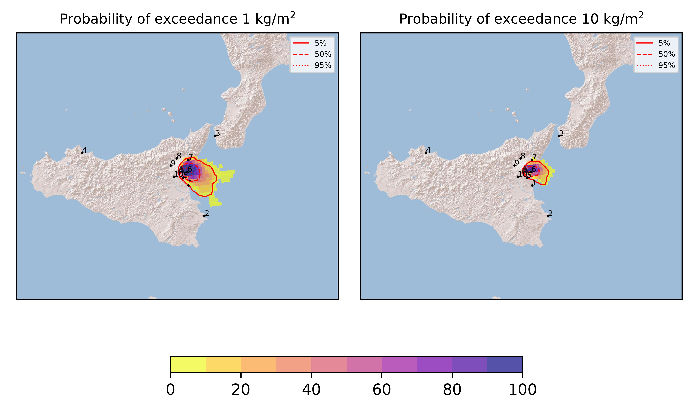
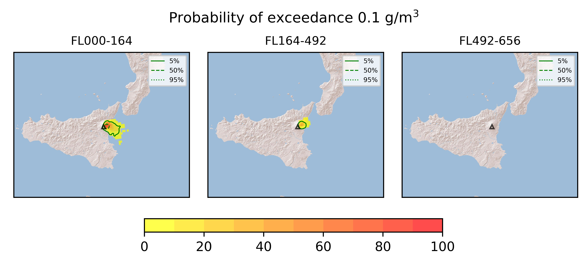

Forecast from VONA bulletin - 20210720_0549Z
============================================

Contents
========

* [Forecast products](#forecast-products)
	* [Forecast at 2021-07-20 08:50 Z](#forecast-at-2021-07-20-0850-z)
	* [Forecast at 2021-07-20 11:50 Z](#forecast-at-2021-07-20-1150-z)
	* [Forecast at 2021-07-20 14:50 Z](#forecast-at-2021-07-20-1450-z)

# Forecast products

## Forecast at 2021-07-20 08:50 Z
  

|Eruption start [Z]|Eruption end [Z]|Forecast time [Z]|Column height asl [m]|
| :--- | :--- | :--- | :--- |
|2021-07-20 05:50:00|Ongoing|2021-07-20 08:50:00|[6000 m, 12000 m]|
  
  

|Percentile|MER [kg/s¹]|Mass in the air [kg]|Mass on the ground [kg]|
| :--- | :--- | :--- | :--- |
|5th|4.88e+04|3.77e+07|4.29e+08|
|50th|3.20e+05|2.93e+08|2.91e+09|
|95th|1.65e+06|3.43e+09|1.30e+10|
  

### Ground 2021-07-20 08:50 Z
  
  
  
  
  
  
  
  
  
  
  

|Location|Ground load [kg/m²] 5th perc|Ground load [kg/m²] 50th perc|Ground load [kg/m²] 95th perc|
| :--- | :--- | :--- | :--- |
|Catania AP (1)|0.00e+00|2.78e-04|2.17e-01|
|Siracusa (2)|0.00e+00|0.00e+00|2.11e-05|
|Reggio Calabria AP (3)|0.00e+00|0.00e+00|0.00e+00|
|Palermo AP (4)|0.00e+00|0.00e+00|0.00e+00|
|Nicolosi (5)|1.26e-02|1.90e-01|2.23e+00|
|Zafferana (6)|1.11e+00|8.34e+00|3.92e+01|
|Linguaglossa (7)|0.00e+00|3.65e-04|3.10e-01|
|Randazzo (8)|0.00e+00|0.00e+00|0.00e+00|
|Bronte (9)|0.00e+00|0.00e+00|0.00e+00|
|Biancavilla (10)|0.00e+00|0.00e+00|1.82e-03|
  

### Atmosphere 2021-07-20 08:50 Z
  

## Forecast at 2021-07-20 11:50 Z
  

|Eruption start [Z]|Eruption end [Z]|Forecast time [Z]|Column height asl [m]|
| :--- | :--- | :--- | :--- |
|2021-07-20 05:50:00|Ongoing|2021-07-20 11:50:00|[6000 m, 12000 m]|
  
  

|Percentile|MER [kg/s¹]|Mass in the air [kg]|Mass on the ground [kg]|
| :--- | :--- | :--- | :--- |
|5th|4.73e+04|8.10e+07|1.61e+09|
|50th|3.81e+05|6.60e+08|8.71e+09|
|95th|1.58e+06|3.25e+09|2.33e+10|
  

### Ground 2021-07-20 11:50 Z
  
  
  
  
  
  
  
  
  
  
  

|Location|Ground load [kg/m²] 5th perc|Ground load [kg/m²] 50th perc|Ground load [kg/m²] 95th perc|
| :--- | :--- | :--- | :--- |
|Catania AP (1)|0.00e+00|4.62e-03|4.74e-01|
|Siracusa (2)|0.00e+00|0.00e+00|1.46e-02|
|Reggio Calabria AP (3)|0.00e+00|0.00e+00|0.00e+00|
|Palermo AP (4)|0.00e+00|0.00e+00|0.00e+00|
|Nicolosi (5)|4.88e-02|7.77e-01|3.41e+00|
|Zafferana (6)|6.54e+00|2.00e+01|6.96e+01|
|Linguaglossa (7)|1.34e-05|9.17e-03|1.70e+00|
|Randazzo (8)|0.00e+00|0.00e+00|4.70e-05|
|Bronte (9)|0.00e+00|0.00e+00|9.30e-06|
|Biancavilla (10)|0.00e+00|6.20e-05|2.13e-03|
  

### Atmosphere 2021-07-20 11:50 Z
  

## Forecast at 2021-07-20 14:50 Z
  

|Eruption start [Z]|Eruption end [Z]|Forecast time [Z]|Column height asl [m]|
| :--- | :--- | :--- | :--- |
|2021-07-20 05:50:00|Ongoing|2021-07-20 14:50:00|[6000 m, 12000 m]|
  
  

|Percentile|MER [kg/s¹]|Mass in the air [kg]|Mass on the ground [kg]|
| :--- | :--- | :--- | :--- |
|5th|4.69e+04|5.79e+07|3.04e+09|
|50th|4.18e+05|4.90e+08|1.63e+10|
|95th|1.57e+06|3.29e+09|3.09e+10|
  

### Ground 2021-07-20 14:50 Z
  
  
  
  
  
  
  
  
  
  
  

|Location|Ground load [kg/m²] 5th perc|Ground load [kg/m²] 50th perc|Ground load [kg/m²] 95th perc|
| :--- | :--- | :--- | :--- |
|Catania AP (1)|2.69e-03|6.10e-02|7.61e-01|
|Siracusa (2)|0.00e+00|8.68e-05|2.55e-02|
|Reggio Calabria AP (3)|0.00e+00|0.00e+00|0.00e+00|
|Palermo AP (4)|0.00e+00|0.00e+00|0.00e+00|
|Nicolosi (5)|1.66e-01|1.42e+00|3.50e+00|
|Zafferana (6)|9.60e+00|3.89e+01|8.11e+01|
|Linguaglossa (7)|1.56e-04|7.21e-02|3.73e+00|
|Randazzo (8)|0.00e+00|0.00e+00|1.16e-04|
|Bronte (9)|0.00e+00|0.00e+00|2.92e-05|
|Biancavilla (10)|0.00e+00|2.90e-04|2.36e-03|
  

### Atmosphere 2021-07-20 14:50 Z
  
  
Go to [Supplementary page](Supplementary_page.md)  
Go to [Main directory](https://github.com/federicapardini/Real_time_ash_forecast)