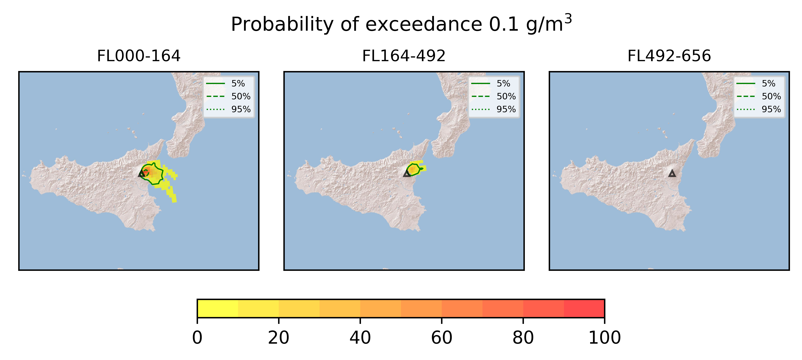
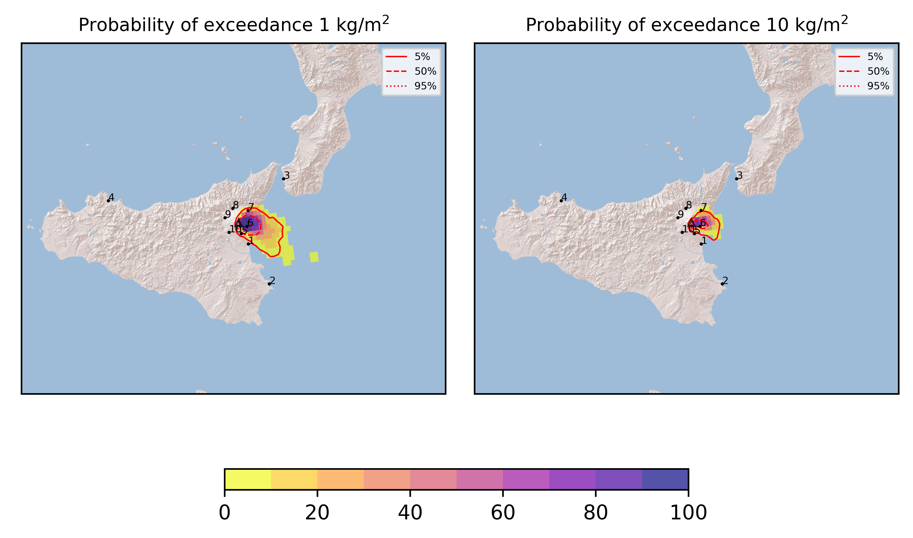

Forecast from VONA bulletin - 20210720_0903Z
============================================

Contents
========

* [Forecast products](#forecast-products)
	* [Forecast at 2021-07-20 12:00 Z](#forecast-at-2021-07-20-1200-z)
	* [Forecast at 2021-07-20 15:00 Z](#forecast-at-2021-07-20-1500-z)

# Forecast products

## Forecast at 2021-07-20 12:00 Z
  

|Eruption start [Z]|Eruption end [Z]|Forecast time [Z]|Column height asl [m]|
| :--- | :--- | :--- | :--- |
|2021-07-20 09:00:00|Ongoing|2021-07-20 12:00:00|[6000 m, 12000 m]|
  
  

|Percentile|MER [kg/s¹]|Mass in the air [kg]|Mass on the ground [kg]|
| :--- | :--- | :--- | :--- |
|5th|4.17e+04|3.95e+07|3.82e+08|
|50th|3.32e+05|2.85e+08|2.95e+09|
|95th|1.61e+06|3.42e+09|1.30e+10|
  

### Ground 2021-07-20 12:00 Z
  
  
  
  
  
  
  
  
  
  
  

|Location|Ground load [kg/m²] 5th perc|Ground load [kg/m²] 50th perc|Ground load [kg/m²] 95th perc|
| :--- | :--- | :--- | :--- |
|Catania AP (1)|0.00e+00|2.21e-04|1.54e-01|
|Siracusa (2)|0.00e+00|0.00e+00|4.12e-06|
|Reggio Calabria AP (3)|0.00e+00|0.00e+00|0.00e+00|
|Palermo AP (4)|0.00e+00|0.00e+00|0.00e+00|
|Nicolosi (5)|1.19e-02|1.34e-01|3.14e+00|
|Zafferana (6)|7.92e-01|8.49e+00|3.73e+01|
|Linguaglossa (7)|0.00e+00|7.00e-04|4.86e-01|
|Randazzo (8)|0.00e+00|0.00e+00|0.00e+00|
|Bronte (9)|0.00e+00|0.00e+00|0.00e+00|
|Biancavilla (10)|0.00e+00|0.00e+00|7.88e-04|
  

### Atmosphere 2021-07-20 12:00 Z
  

## Forecast at 2021-07-20 15:00 Z
  

|Eruption start [Z]|Eruption end [Z]|Forecast time [Z]|Column height asl [m]|
| :--- | :--- | :--- | :--- |
|2021-07-20 09:00:00|Ongoing|2021-07-20 15:00:00|[6000 m, 12000 m]|
  
  

|Percentile|MER [kg/s¹]|Mass in the air [kg]|Mass on the ground [kg]|
| :--- | :--- | :--- | :--- |
|5th|3.29e+04|6.69e+07|1.38e+09|
|50th|3.35e+05|5.16e+08|8.90e+09|
|95th|1.33e+06|2.55e+09|2.18e+10|
  

### Ground 2021-07-20 15:00 Z
  
  
  
  
  
  
  
  
  
  
  

|Location|Ground load [kg/m²] 5th perc|Ground load [kg/m²] 50th perc|Ground load [kg/m²] 95th perc|
| :--- | :--- | :--- | :--- |
|Catania AP (1)|8.80e-05|1.75e-02|3.55e-01|
|Siracusa (2)|0.00e+00|0.00e+00|3.63e-03|
|Reggio Calabria AP (3)|0.00e+00|0.00e+00|0.00e+00|
|Palermo AP (4)|0.00e+00|0.00e+00|0.00e+00|
|Nicolosi (5)|1.12e-01|5.99e-01|3.35e+00|
|Zafferana (6)|4.72e+00|1.91e+01|6.08e+01|
|Linguaglossa (7)|5.51e-05|4.88e-02|6.80e+00|
|Randazzo (8)|0.00e+00|0.00e+00|1.04e-04|
|Bronte (9)|0.00e+00|0.00e+00|0.00e+00|
|Biancavilla (10)|0.00e+00|6.24e-05|1.53e-03|
  

### Atmosphere 2021-07-20 15:00 Z
  
  
Go to [Supplementary page](Supplementary_page.md)  
Go to [Main directory](https://github.com/federicapardini/Real_time_ash_forecast)