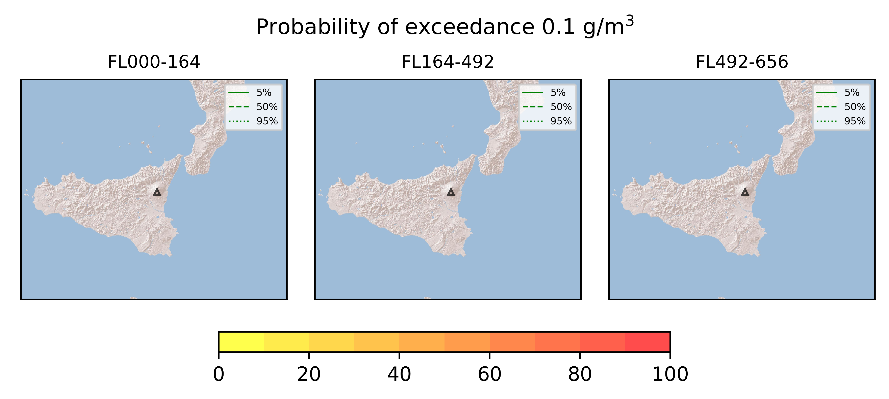

Forecast from VONA bulletin - 20210726_1848Z
============================================

Contents
========

* [Forecast products](#forecast-products)
	* [Forecast at 2021-07-26 21:50 Z](#forecast-at-2021-07-26-2150-z)

# Forecast products

## Forecast at 2021-07-26 21:50 Z
  

|Eruption start [Z]|Eruption end [Z]|Forecast time [Z]|Column height asl [m]|
| :--- | :--- | :--- | :--- |
|2021-07-26 18:50:00|Ongoing|2021-07-26 21:50:00|6000 ± 500 - from VONA|
  
  

|Percentile|MER [kg/s¹]|Mass in the air [kg]|Mass on the ground [kg]|
| :--- | :--- | :--- | :--- |
|5th|2.57e+03|7.75e+05|2.62e+07|
|50th|9.96e+03|4.90e+06|1.06e+08|
|95th|3.09e+04|4.44e+07|3.06e+08|
  

### Ground 2021-07-26 21:50 Z
  
  
  
  
  
  
  
  
  
  
  

|Location|Ground load [kg/m²] 5th perc|Ground load [kg/m²] 50th perc|Ground load [kg/m²] 95th perc|
| :--- | :--- | :--- | :--- |
|Catania AP (1)|0.00e+00|0.00e+00|0.00e+00|
|Siracusa (2)|0.00e+00|0.00e+00|0.00e+00|
|Reggio Calabria AP (3)|0.00e+00|0.00e+00|0.00e+00|
|Palermo AP (4)|0.00e+00|0.00e+00|0.00e+00|
|Nicolosi (5)|0.00e+00|0.00e+00|3.70e-05|
|Zafferana (6)|6.23e-06|1.50e-04|1.33e-03|
|Linguaglossa (7)|0.00e+00|3.22e-06|1.82e-03|
|Randazzo (8)|6.86e-05|7.27e-03|3.26e-01|
|Bronte (9)|6.66e-05|1.06e-03|2.99e-02|
|Biancavilla (10)|1.21e-05|1.24e-04|5.25e-04|
  

### Atmosphere 2021-07-26 21:50 Z
  
  
Go to [Supplementary page](Supplementary_page.md)  
Go to [Main directory](https://github.com/federicapardini/Real_time_ash_forecast)