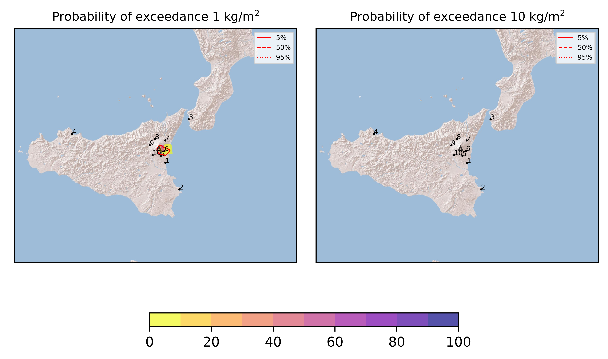

Forecast from VONA bulletin - 20210731_1828Z
============================================

Contents
========

* [Forecast products](#forecast-products)
	* [Forecast at 2021-07-31 21:30 Z](#forecast-at-2021-07-31-2130-z)
	* [Forecast at 2021-08-01 00:30 Z](#forecast-at-2021-08-01-0030-z)
	* [Forecast at 2021-08-01 03:30 Z](#forecast-at-2021-08-01-0330-z)
	* [Forecast at 2021-08-01 06:30 Z](#forecast-at-2021-08-01-0630-z)

# Forecast products

## Forecast at 2021-07-31 21:30 Z
  

|Eruption start [Z]|Eruption end [Z]|Forecast time [Z]|Column height asl [m]|
| :--- | :--- | :--- | :--- |
|2021-07-31 18:30:00|Ongoing|2021-07-31 21:30:00|5000 ± 500 - from VONA|
  
  

|Percentile|MER [kg/s¹]|Mass in the air [kg]|Mass on the ground [kg]|
| :--- | :--- | :--- | :--- |
|5th|1.10e+02|1.32e+04|1.13e+06|
|50th|7.90e+03|2.75e+06|8.88e+07|
|95th|3.11e+04|3.94e+07|3.36e+08|
  

### Ground 2021-07-31 21:30 Z
  
  
  
  
  
  
  
  
  
  
  

|Location|Ground load [kg/m²] 5th perc|Ground load [kg/m²] 50th perc|Ground load [kg/m²] 95th perc|
| :--- | :--- | :--- | :--- |
|Catania AP (1)|0.00e+00|3.98e-06|9.55e-03|
|Siracusa (2)|0.00e+00|0.00e+00|0.00e+00|
|Reggio Calabria AP (3)|0.00e+00|0.00e+00|0.00e+00|
|Palermo AP (4)|0.00e+00|0.00e+00|0.00e+00|
|Nicolosi (5)|6.16e-05|5.44e-03|9.41e-02|
|Zafferana (6)|1.22e-03|1.85e-01|1.04e+00|
|Linguaglossa (7)|0.00e+00|0.00e+00|7.28e-04|
|Randazzo (8)|0.00e+00|0.00e+00|0.00e+00|
|Bronte (9)|0.00e+00|0.00e+00|0.00e+00|
|Biancavilla (10)|0.00e+00|0.00e+00|3.54e-05|
  

### Atmosphere 2021-07-31 21:30 Z
  

## Forecast at 2021-08-01 00:30 Z
  

|Eruption start [Z]|Eruption end [Z]|Forecast time [Z]|Column height asl [m]|
| :--- | :--- | :--- | :--- |
|2021-07-31 18:30:00|Ongoing|2021-08-01 00:30:00|5000 ± 500 - from VONA|
  
  

|Percentile|MER [kg/s¹]|Mass in the air [kg]|Mass on the ground [kg]|
| :--- | :--- | :--- | :--- |
|5th|3.29e+02|6.91e+05|3.22e+07|
|50th|5.66e+03|3.99e+06|1.66e+08|
|95th|1.86e+04|1.99e+07|4.72e+08|
  

### Ground 2021-08-01 00:30 Z
  
  
  
  
  
  
  
  
  
  
  

|Location|Ground load [kg/m²] 5th perc|Ground load [kg/m²] 50th perc|Ground load [kg/m²] 95th perc|
| :--- | :--- | :--- | :--- |
|Catania AP (1)|0.00e+00|3.03e-05|9.86e-03|
|Siracusa (2)|0.00e+00|0.00e+00|0.00e+00|
|Reggio Calabria AP (3)|0.00e+00|0.00e+00|0.00e+00|
|Palermo AP (4)|0.00e+00|0.00e+00|0.00e+00|
|Nicolosi (5)|6.71e-04|6.74e-03|1.11e-01|
|Zafferana (6)|6.14e-02|4.19e-01|1.33e+00|
|Linguaglossa (7)|0.00e+00|1.82e-04|1.21e-02|
|Randazzo (8)|0.00e+00|0.00e+00|0.00e+00|
|Bronte (9)|0.00e+00|0.00e+00|0.00e+00|
|Biancavilla (10)|0.00e+00|0.00e+00|3.81e-05|
  

### Atmosphere 2021-08-01 00:30 Z
  

## Forecast at 2021-08-01 03:30 Z
  

|Eruption start [Z]|Eruption end [Z]|Forecast time [Z]|Column height asl [m]|
| :--- | :--- | :--- | :--- |
|2021-07-31 18:30:00|Ongoing|2021-08-01 03:30:00|5000 ± 500 - from VONA|
  
  

|Percentile|MER [kg/s¹]|Mass in the air [kg]|Mass on the ground [kg]|
| :--- | :--- | :--- | :--- |
|5th|9.86e+01|2.04e+05|5.75e+07|
|50th|4.11e+03|1.53e+06|2.11e+08|
|95th|1.17e+04|1.33e+07|5.43e+08|
  

### Ground 2021-08-01 03:30 Z
  
  
  
  
  
  
  
  
  
  
  

|Location|Ground load [kg/m²] 5th perc|Ground load [kg/m²] 50th perc|Ground load [kg/m²] 95th perc|
| :--- | :--- | :--- | :--- |
|Catania AP (1)|0.00e+00|3.03e-05|9.86e-03|
|Siracusa (2)|0.00e+00|0.00e+00|0.00e+00|
|Reggio Calabria AP (3)|0.00e+00|0.00e+00|0.00e+00|
|Palermo AP (4)|0.00e+00|0.00e+00|0.00e+00|
|Nicolosi (5)|7.50e-04|6.82e-03|1.12e-01|
|Zafferana (6)|9.76e-02|5.06e-01|1.50e+00|
|Linguaglossa (7)|1.49e-05|3.28e-03|5.54e-02|
|Randazzo (8)|0.00e+00|0.00e+00|0.00e+00|
|Bronte (9)|0.00e+00|0.00e+00|0.00e+00|
|Biancavilla (10)|0.00e+00|0.00e+00|3.81e-05|
  

### Atmosphere 2021-08-01 03:30 Z
  

## Forecast at 2021-08-01 06:30 Z
  

|Eruption start [Z]|Eruption end [Z]|Forecast time [Z]|Column height asl [m]|
| :--- | :--- | :--- | :--- |
|2021-07-31 18:30:00|Ongoing|2021-08-01 06:30:00|5000 ± 500 - from VONA|
  
  

|Percentile|MER [kg/s¹]|Mass in the air [kg]|Mass on the ground [kg]|
| :--- | :--- | :--- | :--- |
|5th|1.03e+02|8.75e+03|7.91e+07|
|50th|3.59e+03|1.34e+06|2.78e+08|
|95th|1.36e+04|2.95e+07|5.99e+08|
  

### Ground 2021-08-01 06:30 Z
  
  
  
  
  
  
  
  
  
  
  

|Location|Ground load [kg/m²] 5th perc|Ground load [kg/m²] 50th perc|Ground load [kg/m²] 95th perc|
| :--- | :--- | :--- | :--- |
|Catania AP (1)|0.00e+00|3.03e-05|9.86e-03|
|Siracusa (2)|0.00e+00|0.00e+00|0.00e+00|
|Reggio Calabria AP (3)|0.00e+00|0.00e+00|0.00e+00|
|Palermo AP (4)|0.00e+00|0.00e+00|0.00e+00|
|Nicolosi (5)|7.55e-04|6.82e-03|1.12e-01|
|Zafferana (6)|1.19e-01|5.38e-01|1.55e+00|
|Linguaglossa (7)|3.03e-04|8.94e-03|1.25e-01|
|Randazzo (8)|0.00e+00|0.00e+00|0.00e+00|
|Bronte (9)|0.00e+00|0.00e+00|0.00e+00|
|Biancavilla (10)|0.00e+00|0.00e+00|3.81e-05|
  

### Atmosphere 2021-08-01 06:30 Z
  
  
Go to [Supplementary page](Supplementary_page.md)  
Go to [Main directory](https://github.com/federicapardini/Real_time_ash_forecast)