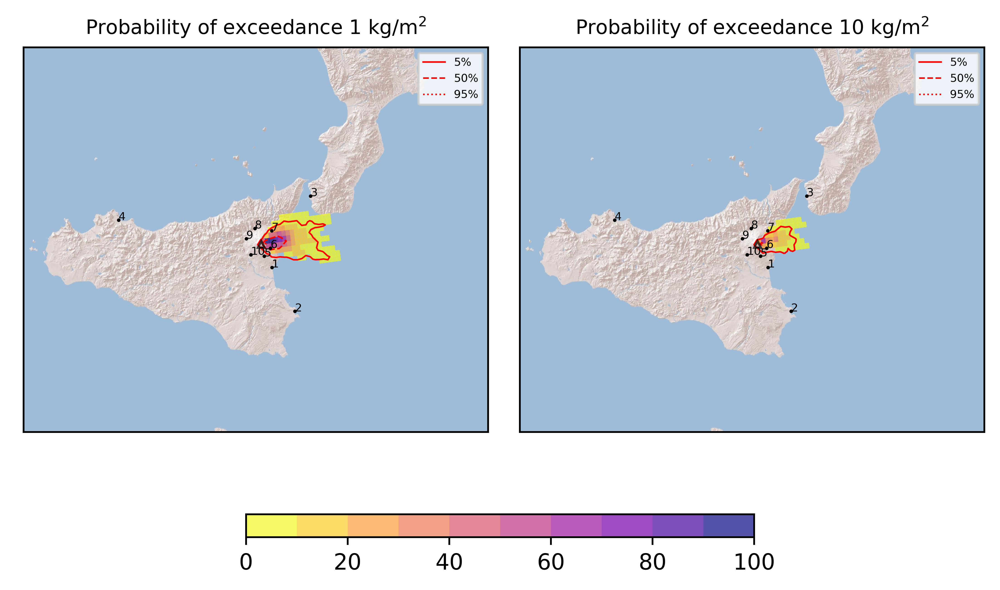
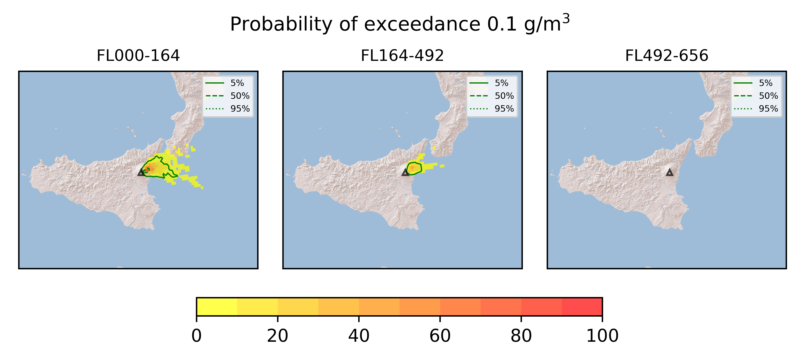
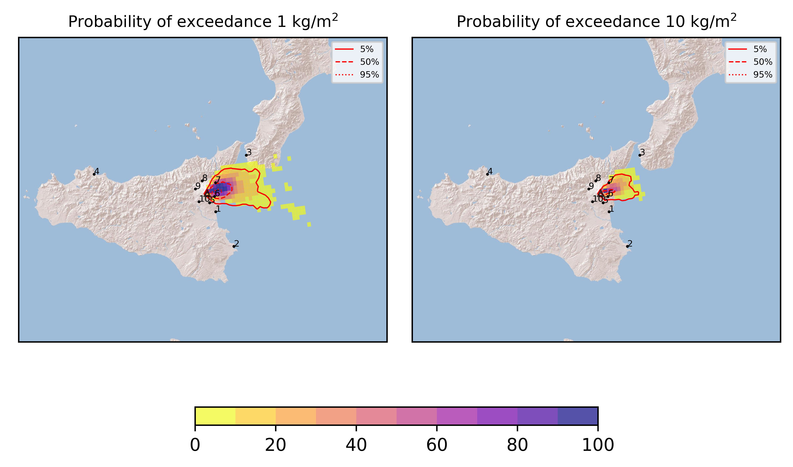
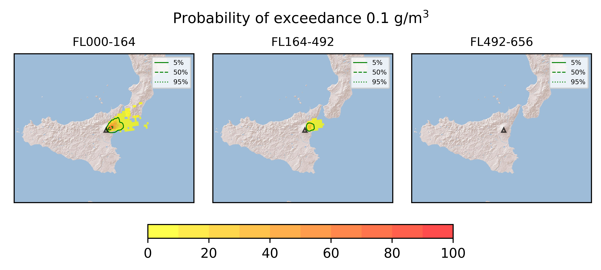

Forecast from VONA bulletin - 20210731_2126Z
============================================

Contents
========

* [Forecast products](#forecast-products)
	* [Forecast at 2021-08-01 00:30 Z](#forecast-at-2021-08-01-0030-z)
	* [Forecast at 2021-08-01 03:30 Z](#forecast-at-2021-08-01-0330-z)

# Forecast products

## Forecast at 2021-08-01 00:30 Z
  

|Eruption start [Z]|Eruption end [Z]|Forecast time [Z]|Column height asl [m]|
| :--- | :--- | :--- | :--- |
|2021-07-31 21:30:00|Ongoing|2021-08-01 00:30:00|[6000 m, 12000 m]|
  
  

|Percentile|MER [kg/s¹]|Mass in the air [kg]|Mass on the ground [kg]|
| :--- | :--- | :--- | :--- |
|5th|3.89e+04|2.95e+07|3.78e+08|
|50th|3.28e+05|2.86e+08|3.07e+09|
|95th|1.85e+06|3.82e+09|1.49e+10|
  

### Ground 2021-08-01 00:30 Z
  
  
  
  
  
  
  
  
  
  
  

|Location|Ground load [kg/m²] 5th perc|Ground load [kg/m²] 50th perc|Ground load [kg/m²] 95th perc|
| :--- | :--- | :--- | :--- |
|Catania AP (1)|0.00e+00|0.00e+00|3.42e-05|
|Siracusa (2)|0.00e+00|0.00e+00|0.00e+00|
|Reggio Calabria AP (3)|0.00e+00|0.00e+00|0.00e+00|
|Palermo AP (4)|0.00e+00|0.00e+00|0.00e+00|
|Nicolosi (5)|0.00e+00|7.04e-04|5.55e-02|
|Zafferana (6)|2.75e-01|1.99e+00|1.67e+01|
|Linguaglossa (7)|8.04e-05|2.75e-02|3.07e+00|
|Randazzo (8)|0.00e+00|0.00e+00|0.00e+00|
|Bronte (9)|0.00e+00|0.00e+00|0.00e+00|
|Biancavilla (10)|0.00e+00|0.00e+00|0.00e+00|
  

### Atmosphere 2021-08-01 00:30 Z
  

## Forecast at 2021-08-01 03:30 Z
  

|Eruption start [Z]|Eruption end [Z]|Forecast time [Z]|Column height asl [m]|
| :--- | :--- | :--- | :--- |
|2021-07-31 21:30:00|Ongoing|2021-08-01 03:30:00|[6000 m, 12000 m]|
  
  

|Percentile|MER [kg/s¹]|Mass in the air [kg]|Mass on the ground [kg]|
| :--- | :--- | :--- | :--- |
|5th|4.34e+04|9.07e+07|1.39e+09|
|50th|3.35e+05|5.70e+08|8.34e+09|
|95th|1.72e+06|2.89e+09|2.60e+10|
  

### Ground 2021-08-01 03:30 Z
  
  
  
  
  
  
  
  
  
  
  

|Location|Ground load [kg/m²] 5th perc|Ground load [kg/m²] 50th perc|Ground load [kg/m²] 95th perc|
| :--- | :--- | :--- | :--- |
|Catania AP (1)|0.00e+00|0.00e+00|3.42e-05|
|Siracusa (2)|0.00e+00|0.00e+00|0.00e+00|
|Reggio Calabria AP (3)|0.00e+00|0.00e+00|9.71e-04|
|Palermo AP (4)|0.00e+00|0.00e+00|0.00e+00|
|Nicolosi (5)|9.67e-07|1.37e-03|7.98e-02|
|Zafferana (6)|5.97e-01|2.84e+00|2.07e+01|
|Linguaglossa (7)|1.49e-02|8.13e-01|1.37e+01|
|Randazzo (8)|0.00e+00|0.00e+00|0.00e+00|
|Bronte (9)|0.00e+00|0.00e+00|0.00e+00|
|Biancavilla (10)|0.00e+00|0.00e+00|0.00e+00|
  

### Atmosphere 2021-08-01 03:30 Z
  
  
Go to [Supplementary page](Supplementary_page.md)  
Go to [Main directory](https://github.com/federicapardini/Real_time_ash_forecast)