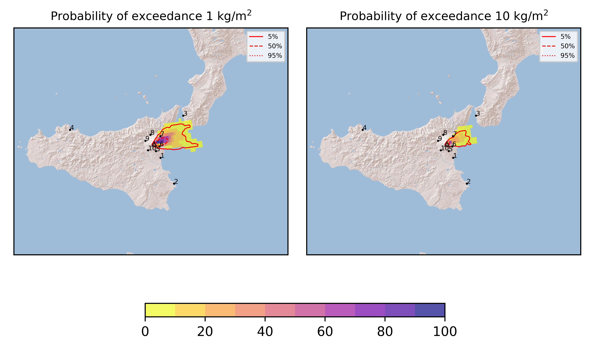
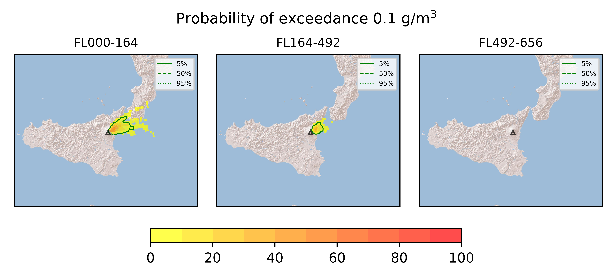
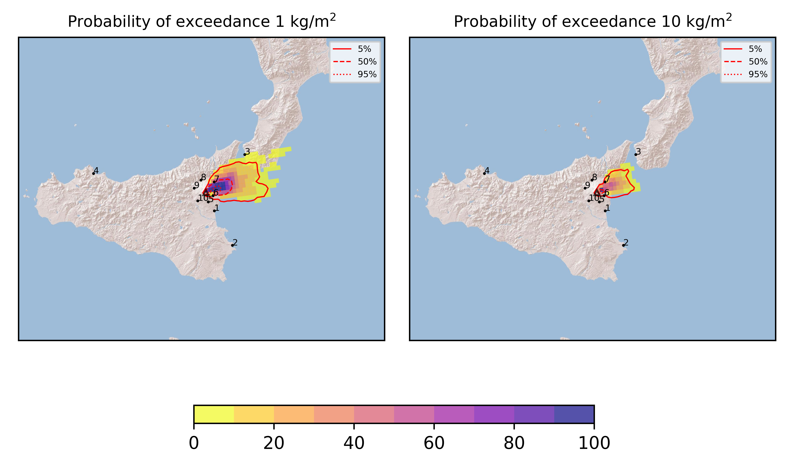
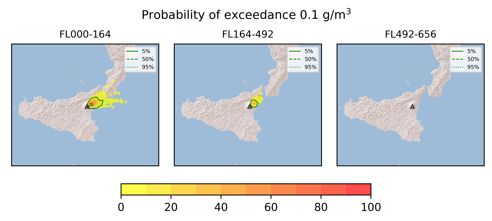
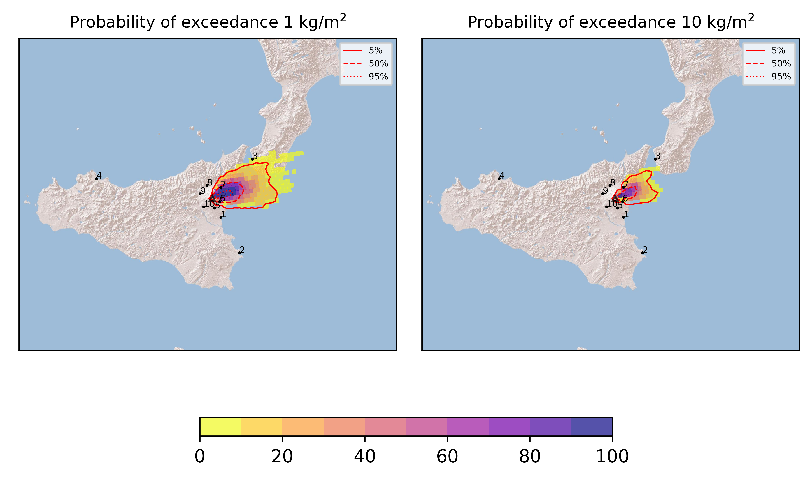
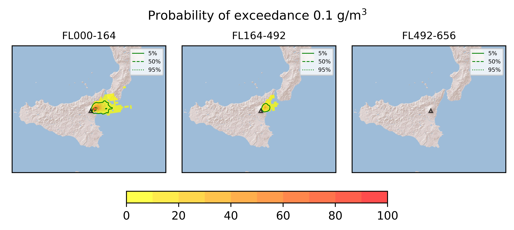

Forecast from VONA bulletin - 20210801_0012Z
============================================

Contents
========

* [Forecast products](#forecast-products)
	* [Forecast at 2021-08-01 03:10 Z](#forecast-at-2021-08-01-0310-z)
	* [Forecast at 2021-08-01 06:10 Z](#forecast-at-2021-08-01-0610-z)
	* [Forecast at 2021-08-01 09:10 Z](#forecast-at-2021-08-01-0910-z)

# Forecast products

## Forecast at 2021-08-01 03:10 Z
  

|Eruption start [Z]|Eruption end [Z]|Forecast time [Z]|Column height asl [m]|
| :--- | :--- | :--- | :--- |
|2021-08-01 00:10:00|Ongoing|2021-08-01 03:10:00|[6000 m, 12000 m]|
  
  

|Percentile|MER [kg/s¹]|Mass in the air [kg]|Mass on the ground [kg]|
| :--- | :--- | :--- | :--- |
|5th|3.42e+04|1.78e+07|3.35e+08|
|50th|3.13e+05|2.65e+08|2.80e+09|
|95th|1.82e+06|3.87e+09|1.46e+10|
  

### Ground 2021-08-01 03:10 Z
  
  
  
  
  
  
  
  
  
  
  

|Location|Ground load [kg/m²] 5th perc|Ground load [kg/m²] 50th perc|Ground load [kg/m²] 95th perc|
| :--- | :--- | :--- | :--- |
|Catania AP (1)|0.00e+00|0.00e+00|0.00e+00|
|Siracusa (2)|0.00e+00|0.00e+00|0.00e+00|
|Reggio Calabria AP (3)|0.00e+00|0.00e+00|2.74e-03|
|Palermo AP (4)|0.00e+00|0.00e+00|0.00e+00|
|Nicolosi (5)|0.00e+00|1.67e-05|6.40e-03|
|Zafferana (6)|2.72e-02|7.44e-01|5.39e+00|
|Linguaglossa (7)|1.61e-03|1.58e-01|6.61e+00|
|Randazzo (8)|0.00e+00|0.00e+00|0.00e+00|
|Bronte (9)|0.00e+00|0.00e+00|0.00e+00|
|Biancavilla (10)|0.00e+00|0.00e+00|0.00e+00|
  

### Atmosphere 2021-08-01 03:10 Z
  

## Forecast at 2021-08-01 06:10 Z
  

|Eruption start [Z]|Eruption end [Z]|Forecast time [Z]|Column height asl [m]|
| :--- | :--- | :--- | :--- |
|2021-08-01 00:10:00|Ongoing|2021-08-01 06:10:00|[6000 m, 12000 m]|
  
  

|Percentile|MER [kg/s¹]|Mass in the air [kg]|Mass on the ground [kg]|
| :--- | :--- | :--- | :--- |
|5th|5.69e+04|1.27e+08|1.60e+09|
|50th|3.96e+05|7.57e+08|8.16e+09|
|95th|2.01e+06|3.33e+09|2.82e+10|
  

### Ground 2021-08-01 06:10 Z
  
  
  
  
  
  
  
  
  
  
  

|Location|Ground load [kg/m²] 5th perc|Ground load [kg/m²] 50th perc|Ground load [kg/m²] 95th perc|
| :--- | :--- | :--- | :--- |
|Catania AP (1)|0.00e+00|0.00e+00|1.09e-06|
|Siracusa (2)|0.00e+00|0.00e+00|0.00e+00|
|Reggio Calabria AP (3)|0.00e+00|0.00e+00|2.17e-02|
|Palermo AP (4)|0.00e+00|0.00e+00|0.00e+00|
|Nicolosi (5)|0.00e+00|5.73e-05|6.74e-03|
|Zafferana (6)|2.43e-01|1.61e+00|7.50e+00|
|Linguaglossa (7)|4.01e-02|1.28e+00|1.76e+01|
|Randazzo (8)|0.00e+00|0.00e+00|0.00e+00|
|Bronte (9)|0.00e+00|0.00e+00|0.00e+00|
|Biancavilla (10)|0.00e+00|0.00e+00|0.00e+00|
  

### Atmosphere 2021-08-01 06:10 Z
  

## Forecast at 2021-08-01 09:10 Z
  

|Eruption start [Z]|Eruption end [Z]|Forecast time [Z]|Column height asl [m]|
| :--- | :--- | :--- | :--- |
|2021-08-01 00:10:00|Ongoing|2021-08-01 09:10:00|[6000 m, 12000 m]|
  
  

|Percentile|MER [kg/s¹]|Mass in the air [kg]|Mass on the ground [kg]|
| :--- | :--- | :--- | :--- |
|5th|4.80e+04|7.21e+07|3.40e+09|
|50th|4.31e+05|6.22e+08|1.83e+10|
|95th|2.10e+06|4.03e+09|3.70e+10|
  

### Ground 2021-08-01 09:10 Z
  
  
  
  
  
  
  
  
  
  
  

|Location|Ground load [kg/m²] 5th perc|Ground load [kg/m²] 50th perc|Ground load [kg/m²] 95th perc|
| :--- | :--- | :--- | :--- |
|Catania AP (1)|0.00e+00|0.00e+00|4.17e-06|
|Siracusa (2)|0.00e+00|0.00e+00|0.00e+00|
|Reggio Calabria AP (3)|0.00e+00|0.00e+00|1.55e-01|
|Palermo AP (4)|0.00e+00|0.00e+00|0.00e+00|
|Nicolosi (5)|0.00e+00|4.38e-04|9.08e-03|
|Zafferana (6)|8.51e-01|3.50e+00|1.05e+01|
|Linguaglossa (7)|1.98e-01|3.23e+00|2.39e+01|
|Randazzo (8)|0.00e+00|0.00e+00|1.03e-05|
|Bronte (9)|0.00e+00|0.00e+00|0.00e+00|
|Biancavilla (10)|0.00e+00|0.00e+00|0.00e+00|
  

### Atmosphere 2021-08-01 09:10 Z
  
  
Go to [Supplementary page](Supplementary_page.md)  
Go to [Main directory](https://github.com/federicapardini/Real_time_ash_forecast)