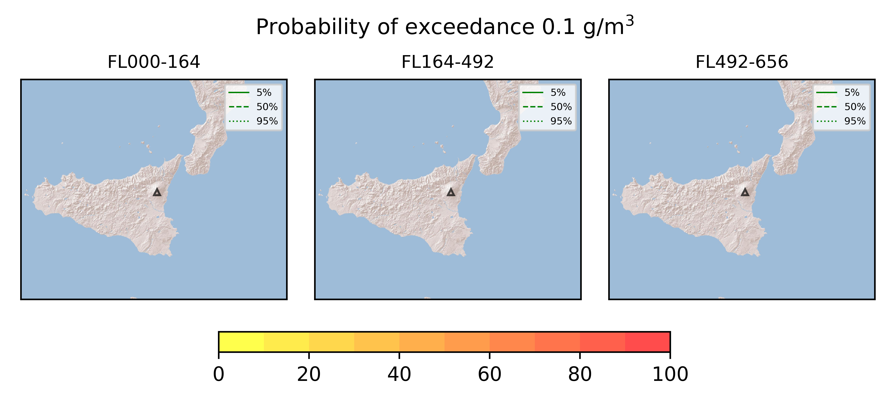
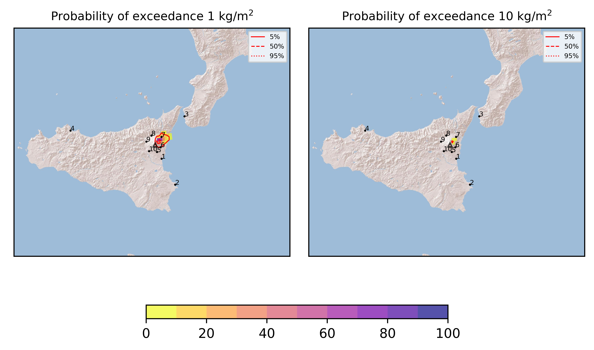
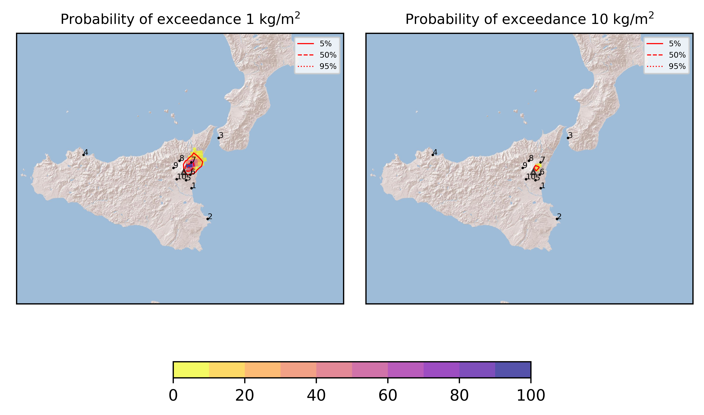

Forecast from VONA bulletin - 20210804_1310Z
============================================

Contents
========

* [Forecast products](#forecast-products)
	* [Forecast at 2021-08-04 16:10 Z](#forecast-at-2021-08-04-1610-z)
	* [Forecast at 2021-08-04 19:10 Z](#forecast-at-2021-08-04-1910-z)
	* [Forecast at 2021-08-04 22:10 Z](#forecast-at-2021-08-04-2210-z)

# Forecast products

## Forecast at 2021-08-04 16:10 Z
  

|Eruption start [Z]|Eruption end [Z]|Forecast time [Z]|Column height asl [m]|
| :--- | :--- | :--- | :--- |
|2021-08-04 13:10:00|Ongoing|2021-08-04 16:10:00|6000 ± 500 - from VONA|
  
  

|Percentile|MER [kg/s¹]|Mass in the air [kg]|Mass on the ground [kg]|
| :--- | :--- | :--- | :--- |
|5th|6.07e+03|2.53e+06|5.63e+07|
|50th|1.81e+04|1.22e+07|1.82e+08|
|95th|4.92e+04|7.74e+07|4.77e+08|
  

### Ground 2021-08-04 16:10 Z
  
  
  
  
  
  
  
  
  
  
  

|Location|Ground load [kg/m²] 5th perc|Ground load [kg/m²] 50th perc|Ground load [kg/m²] 95th perc|
| :--- | :--- | :--- | :--- |
|Catania AP (1)|0.00e+00|0.00e+00|0.00e+00|
|Siracusa (2)|0.00e+00|0.00e+00|0.00e+00|
|Reggio Calabria AP (3)|0.00e+00|0.00e+00|4.78e-03|
|Palermo AP (4)|0.00e+00|0.00e+00|0.00e+00|
|Nicolosi (5)|0.00e+00|3.00e-06|4.63e-04|
|Zafferana (6)|1.81e-04|3.26e-02|2.62e-01|
|Linguaglossa (7)|7.49e-03|1.37e-01|8.57e-01|
|Randazzo (8)|0.00e+00|0.00e+00|6.02e-04|
|Bronte (9)|0.00e+00|0.00e+00|0.00e+00|
|Biancavilla (10)|0.00e+00|0.00e+00|0.00e+00|
  

### Atmosphere 2021-08-04 16:10 Z
  

## Forecast at 2021-08-04 19:10 Z
  

|Eruption start [Z]|Eruption end [Z]|Forecast time [Z]|Column height asl [m]|
| :--- | :--- | :--- | :--- |
|2021-08-04 13:10:00|Ongoing|2021-08-04 19:10:00|6000 ± 500 - from VONA|
  
  

|Percentile|MER [kg/s¹]|Mass in the air [kg]|Mass on the ground [kg]|
| :--- | :--- | :--- | :--- |
|5th|8.60e+03|8.73e+06|1.92e+08|
|50th|2.49e+04|2.87e+07|4.38e+08|
|95th|5.64e+04|9.09e+07|7.88e+08|
  

### Ground 2021-08-04 19:10 Z
  
  
  
  
  
  
  
  
  
  
  

|Location|Ground load [kg/m²] 5th perc|Ground load [kg/m²] 50th perc|Ground load [kg/m²] 95th perc|
| :--- | :--- | :--- | :--- |
|Catania AP (1)|0.00e+00|0.00e+00|0.00e+00|
|Siracusa (2)|0.00e+00|0.00e+00|0.00e+00|
|Reggio Calabria AP (3)|0.00e+00|3.20e-04|2.04e-02|
|Palermo AP (4)|0.00e+00|0.00e+00|0.00e+00|
|Nicolosi (5)|0.00e+00|9.34e-06|6.25e-04|
|Zafferana (6)|9.48e-03|5.06e-02|5.34e-01|
|Linguaglossa (7)|5.57e-02|4.74e-01|1.32e+00|
|Randazzo (8)|0.00e+00|0.00e+00|7.26e-04|
|Bronte (9)|0.00e+00|0.00e+00|0.00e+00|
|Biancavilla (10)|0.00e+00|0.00e+00|0.00e+00|
  

### Atmosphere 2021-08-04 19:10 Z
  

## Forecast at 2021-08-04 22:10 Z
  

|Eruption start [Z]|Eruption end [Z]|Forecast time [Z]|Column height asl [m]|
| :--- | :--- | :--- | :--- |
|2021-08-04 13:10:00|Ongoing|2021-08-04 22:10:00|6000 ± 500 - from VONA|
  
  

|Percentile|MER [kg/s¹]|Mass in the air [kg]|Mass on the ground [kg]|
| :--- | :--- | :--- | :--- |
|5th|8.48e+03|4.97e+06|3.42e+08|
|50th|2.68e+04|1.40e+07|7.60e+08|
|95th|5.47e+04|9.32e+07|1.15e+09|
  

### Ground 2021-08-04 22:10 Z
  
  
  
  
  
  
  
  
  
  
  

|Location|Ground load [kg/m²] 5th perc|Ground load [kg/m²] 50th perc|Ground load [kg/m²] 95th perc|
| :--- | :--- | :--- | :--- |
|Catania AP (1)|0.00e+00|0.00e+00|0.00e+00|
|Siracusa (2)|0.00e+00|0.00e+00|0.00e+00|
|Reggio Calabria AP (3)|4.08e-05|2.06e-03|3.36e-02|
|Palermo AP (4)|0.00e+00|0.00e+00|0.00e+00|
|Nicolosi (5)|0.00e+00|3.63e-05|6.40e-04|
|Zafferana (6)|1.61e-02|1.09e-01|6.04e-01|
|Linguaglossa (7)|2.99e-01|9.11e-01|1.65e+00|
|Randazzo (8)|0.00e+00|1.54e-04|1.74e-03|
|Bronte (9)|0.00e+00|0.00e+00|0.00e+00|
|Biancavilla (10)|0.00e+00|0.00e+00|0.00e+00|
  

### Atmosphere 2021-08-04 22:10 Z
  
  
Go to [Supplementary page](Supplementary_page.md)  
Go to [Main directory](https://github.com/federicapardini/Real_time_ash_forecast)