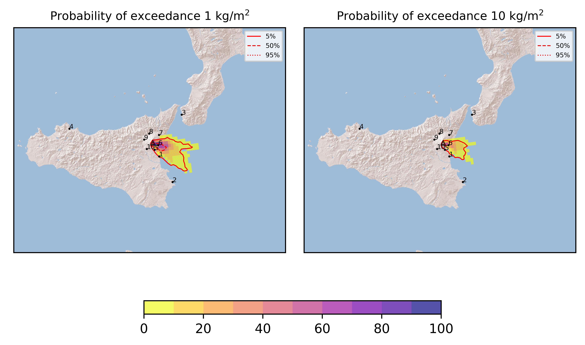
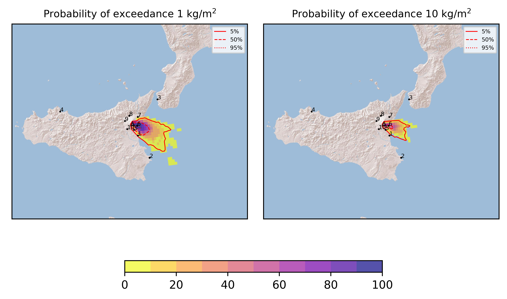
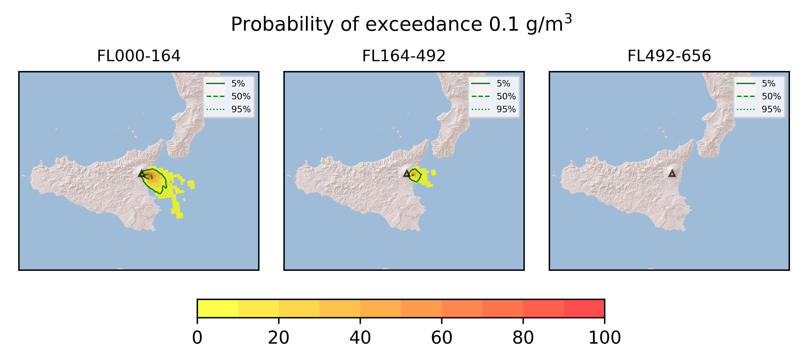
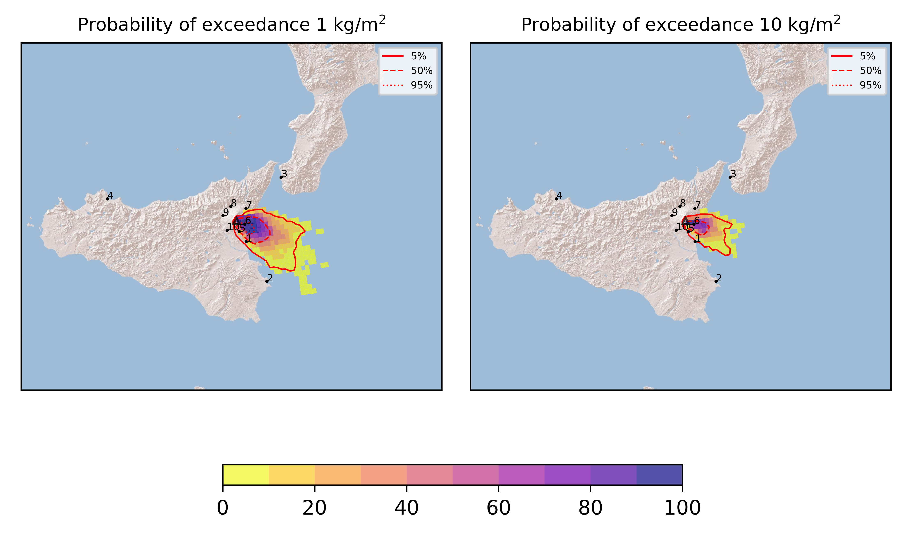
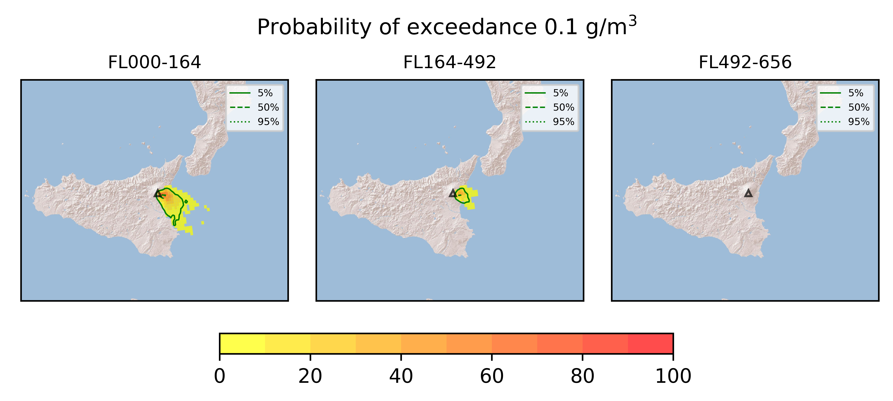
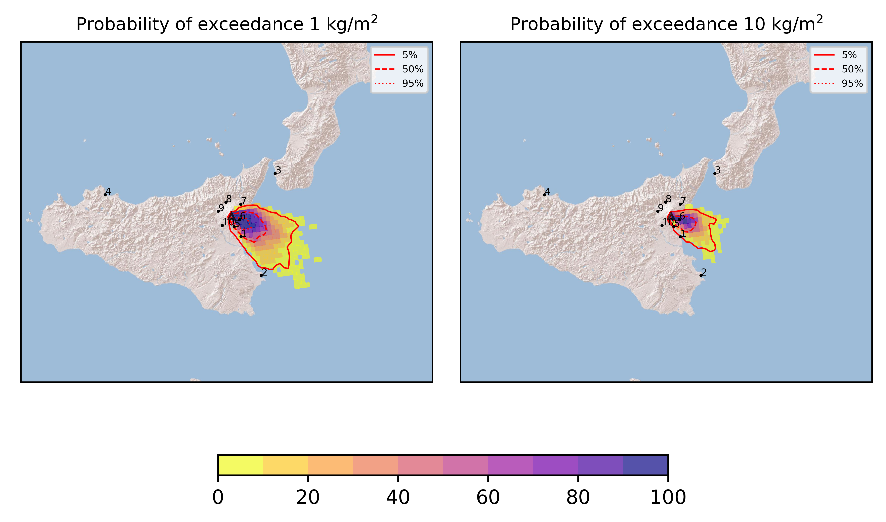

Forecast from VONA bulletin - 20210808_2317Z
============================================

Contents
========

* [Forecast products](#forecast-products)
	* [Forecast at 2021-08-09 02:20 Z](#forecast-at-2021-08-09-0220-z)
	* [Forecast at 2021-08-09 05:20 Z](#forecast-at-2021-08-09-0520-z)
	* [Forecast at 2021-08-09 08:20 Z](#forecast-at-2021-08-09-0820-z)
	* [Forecast at 2021-08-09 11:20 Z](#forecast-at-2021-08-09-1120-z)

# Forecast products

## Forecast at 2021-08-09 02:20 Z
  

|Eruption start [Z]|Eruption end [Z]|Forecast time [Z]|Column height asl [m]|
| :--- | :--- | :--- | :--- |
|2021-08-08 23:20:00|Ongoing|2021-08-09 02:20:00|[6000 m, 12000 m]|
  
  

|Percentile|MER [kg/s¹]|Mass in the air [kg]|Mass on the ground [kg]|
| :--- | :--- | :--- | :--- |
|5th|1.68e+04|1.01e+07|1.71e+08|
|50th|4.04e+05|3.59e+08|3.50e+09|
|95th|2.33e+06|5.07e+09|1.76e+10|
  

### Ground 2021-08-09 02:20 Z
  
  
  
  
  
  
  
  
  
  
  

|Location|Ground load [kg/m²] 5th perc|Ground load [kg/m²] 50th perc|Ground load [kg/m²] 95th perc|
| :--- | :--- | :--- | :--- |
|Catania AP (1)|0.00e+00|2.48e-03|1.23e+00|
|Siracusa (2)|0.00e+00|0.00e+00|8.25e-06|
|Reggio Calabria AP (3)|0.00e+00|0.00e+00|0.00e+00|
|Palermo AP (4)|0.00e+00|0.00e+00|0.00e+00|
|Nicolosi (5)|1.08e-04|8.91e-02|3.34e+00|
|Zafferana (6)|1.44e-01|5.09e+00|2.44e+01|
|Linguaglossa (7)|0.00e+00|0.00e+00|1.96e-03|
|Randazzo (8)|0.00e+00|0.00e+00|0.00e+00|
|Bronte (9)|0.00e+00|0.00e+00|0.00e+00|
|Biancavilla (10)|0.00e+00|0.00e+00|0.00e+00|
  

### Atmosphere 2021-08-09 02:20 Z
  

## Forecast at 2021-08-09 05:20 Z
  

|Eruption start [Z]|Eruption end [Z]|Forecast time [Z]|Column height asl [m]|
| :--- | :--- | :--- | :--- |
|2021-08-08 23:20:00|Ongoing|2021-08-09 05:20:00|[6000 m, 12000 m]|
  
  

|Percentile|MER [kg/s¹]|Mass in the air [kg]|Mass on the ground [kg]|
| :--- | :--- | :--- | :--- |
|5th|2.98e+04|8.38e+07|1.13e+09|
|50th|5.00e+05|8.38e+08|1.09e+10|
|95th|2.07e+06|3.96e+09|3.24e+10|
  

### Ground 2021-08-09 05:20 Z
  
  
  
  
  
  
  
  
  
  
  

|Location|Ground load [kg/m²] 5th perc|Ground load [kg/m²] 50th perc|Ground load [kg/m²] 95th perc|
| :--- | :--- | :--- | :--- |
|Catania AP (1)|4.17e-03|2.22e-01|2.12e+00|
|Siracusa (2)|0.00e+00|0.00e+00|1.98e-03|
|Reggio Calabria AP (3)|0.00e+00|0.00e+00|0.00e+00|
|Palermo AP (4)|0.00e+00|0.00e+00|0.00e+00|
|Nicolosi (5)|6.39e-02|8.99e-01|4.59e+00|
|Zafferana (6)|1.72e+00|1.33e+01|4.54e+01|
|Linguaglossa (7)|0.00e+00|4.84e-05|1.64e-02|
|Randazzo (8)|0.00e+00|0.00e+00|0.00e+00|
|Bronte (9)|0.00e+00|0.00e+00|0.00e+00|
|Biancavilla (10)|0.00e+00|0.00e+00|2.87e-05|
  

### Atmosphere 2021-08-09 05:20 Z
  

## Forecast at 2021-08-09 08:20 Z
  

|Eruption start [Z]|Eruption end [Z]|Forecast time [Z]|Column height asl [m]|
| :--- | :--- | :--- | :--- |
|2021-08-08 23:20:00|Ongoing|2021-08-09 08:20:00|[6000 m, 12000 m]|
  
  

|Percentile|MER [kg/s¹]|Mass in the air [kg]|Mass on the ground [kg]|
| :--- | :--- | :--- | :--- |
|5th|1.52e+04|2.19e+07|2.37e+09|
|50th|4.60e+05|6.29e+08|1.75e+10|
|95th|2.02e+06|3.94e+09|4.51e+10|
  

### Ground 2021-08-09 08:20 Z
  
  
  
  
  
  
  
  
  
  
  

|Location|Ground load [kg/m²] 5th perc|Ground load [kg/m²] 50th perc|Ground load [kg/m²] 95th perc|
| :--- | :--- | :--- | :--- |
|Catania AP (1)|4.77e-03|4.68e-01|4.86e+00|
|Siracusa (2)|0.00e+00|3.39e-05|1.41e-02|
|Reggio Calabria AP (3)|0.00e+00|0.00e+00|0.00e+00|
|Palermo AP (4)|0.00e+00|0.00e+00|0.00e+00|
|Nicolosi (5)|6.86e-02|1.70e+00|8.43e+00|
|Zafferana (6)|2.91e+00|2.44e+01|5.46e+01|
|Linguaglossa (7)|0.00e+00|3.46e-04|7.17e-02|
|Randazzo (8)|0.00e+00|0.00e+00|0.00e+00|
|Bronte (9)|0.00e+00|0.00e+00|0.00e+00|
|Biancavilla (10)|0.00e+00|0.00e+00|1.06e-04|
  

### Atmosphere 2021-08-09 08:20 Z
  

## Forecast at 2021-08-09 11:20 Z
  

|Eruption start [Z]|Eruption end [Z]|Forecast time [Z]|Column height asl [m]|
| :--- | :--- | :--- | :--- |
|2021-08-08 23:20:00|Ongoing|2021-08-09 11:20:00|[6000 m, 12000 m]|
  
  

|Percentile|MER [kg/s¹]|Mass in the air [kg]|Mass on the ground [kg]|
| :--- | :--- | :--- | :--- |
|5th|1.93e+04|1.44e+07|3.42e+09|
|50th|2.74e+05|3.82e+08|2.45e+10|
|95th|1.78e+06|5.16e+09|5.02e+10|
  

### Ground 2021-08-09 11:20 Z
  
  
  
  
  
  
  
  
  
  
  

|Location|Ground load [kg/m²] 5th perc|Ground load [kg/m²] 50th perc|Ground load [kg/m²] 95th perc|
| :--- | :--- | :--- | :--- |
|Catania AP (1)|5.28e-03|7.47e-01|1.07e+01|
|Siracusa (2)|0.00e+00|5.52e-04|1.23e-01|
|Reggio Calabria AP (3)|0.00e+00|0.00e+00|0.00e+00|
|Palermo AP (4)|0.00e+00|0.00e+00|0.00e+00|
|Nicolosi (5)|2.53e-01|2.18e+00|1.44e+01|
|Zafferana (6)|4.13e+00|3.35e+01|6.85e+01|
|Linguaglossa (7)|0.00e+00|4.91e-04|7.17e-02|
|Randazzo (8)|0.00e+00|0.00e+00|0.00e+00|
|Bronte (9)|0.00e+00|0.00e+00|0.00e+00|
|Biancavilla (10)|0.00e+00|0.00e+00|2.09e-04|
  

### Atmosphere 2021-08-09 11:20 Z
  
  
Go to [Supplementary page](Supplementary_page.md)  
Go to [Main directory](https://github.com/federicapardini/Real_time_ash_forecast)