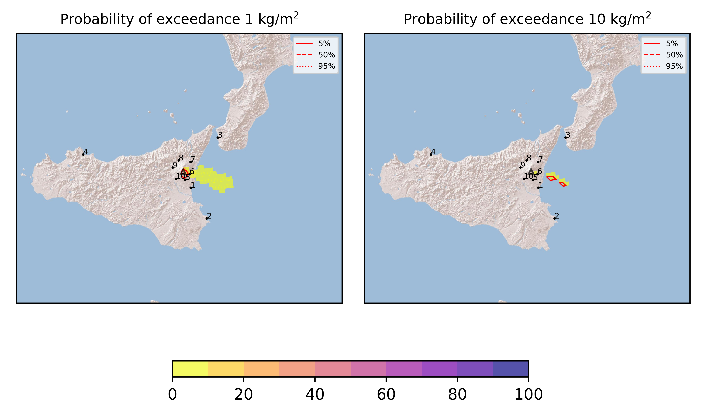

Forecast from VONA bulletin - 20210809_0118Z
============================================

Contents
========

* [Forecast products](#forecast-products)
	* [Forecast at 2021-08-09 04:20 Z](#forecast-at-2021-08-09-0420-z)
	* [Forecast at 2021-08-09 07:20 Z](#forecast-at-2021-08-09-0720-z)
	* [Forecast at 2021-08-09 10:20 Z](#forecast-at-2021-08-09-1020-z)
	* [Forecast at 2021-08-09 13:20 Z](#forecast-at-2021-08-09-1320-z)

# Forecast products

## Forecast at 2021-08-09 04:20 Z
  

|Eruption start [Z]|Eruption end [Z]|Forecast time [Z]|Column height asl [m]|
| :--- | :--- | :--- | :--- |
|2021-08-09 01:20:00|Ongoing|2021-08-09 04:20:00|5000 ± 500 - from VONA|
  
  

|Percentile|MER [kg/s¹]|Mass in the air [kg]|Mass on the ground [kg]|
| :--- | :--- | :--- | :--- |
|5th|3.97e+02|2.12e+04|1.83e+06|
|50th|6.04e+02|1.21e+05|9.68e+06|
|95th|3.88e+03|2.89e+06|2.12e+07|
  

### Ground 2021-08-09 04:20 Z
  
  
  
  
  
  
  
  
  
  
  

|Location|Ground load [kg/m²] 5th perc|Ground load [kg/m²] 50th perc|Ground load [kg/m²] 95th perc|
| :--- | :--- | :--- | :--- |
|Catania AP (1)|0.00e+00|5.96e-06|6.81e-03|
|Siracusa (2)|0.00e+00|0.00e+00|0.00e+00|
|Reggio Calabria AP (3)|0.00e+00|0.00e+00|0.00e+00|
|Palermo AP (4)|0.00e+00|0.00e+00|0.00e+00|
|Nicolosi (5)|5.27e-05|1.38e-03|8.77e-03|
|Zafferana (6)|5.07e-04|5.87e-03|2.40e-02|
|Linguaglossa (7)|0.00e+00|0.00e+00|0.00e+00|
|Randazzo (8)|0.00e+00|0.00e+00|0.00e+00|
|Bronte (9)|0.00e+00|0.00e+00|0.00e+00|
|Biancavilla (10)|0.00e+00|0.00e+00|1.50e-06|
  

### Atmosphere 2021-08-09 04:20 Z
  

## Forecast at 2021-08-09 07:20 Z
  

|Eruption start [Z]|Eruption end [Z]|Forecast time [Z]|Column height asl [m]|
| :--- | :--- | :--- | :--- |
|2021-08-09 01:20:00|Ongoing|2021-08-09 07:20:00|5000 ± 500 - from VONA|
  
  

|Percentile|MER [kg/s¹]|Mass in the air [kg]|Mass on the ground [kg]|
| :--- | :--- | :--- | :--- |
|5th|4.22e+02|1.19e+05|9.09e+06|
|50th|5.75e+02|5.56e+05|1.88e+07|
|95th|3.87e+03|2.73e+06|5.49e+07|
  

### Ground 2021-08-09 07:20 Z
  
  
  
  
  
  
  
  
  
  
  

|Location|Ground load [kg/m²] 5th perc|Ground load [kg/m²] 50th perc|Ground load [kg/m²] 95th perc|
| :--- | :--- | :--- | :--- |
|Catania AP (1)|7.95e-06|4.16e-04|1.05e-02|
|Siracusa (2)|0.00e+00|0.00e+00|4.05e-05|
|Reggio Calabria AP (3)|0.00e+00|0.00e+00|0.00e+00|
|Palermo AP (4)|0.00e+00|0.00e+00|0.00e+00|
|Nicolosi (5)|7.83e-04|3.74e-03|2.27e-02|
|Zafferana (6)|1.58e-03|1.45e-02|4.41e-02|
|Linguaglossa (7)|0.00e+00|0.00e+00|2.05e-05|
|Randazzo (8)|0.00e+00|0.00e+00|0.00e+00|
|Bronte (9)|0.00e+00|0.00e+00|0.00e+00|
|Biancavilla (10)|0.00e+00|0.00e+00|1.51e-05|
  

### Atmosphere 2021-08-09 07:20 Z
  

## Forecast at 2021-08-09 10:20 Z
  

|Eruption start [Z]|Eruption end [Z]|Forecast time [Z]|Column height asl [m]|
| :--- | :--- | :--- | :--- |
|2021-08-09 01:20:00|Ongoing|2021-08-09 10:20:00|5000 ± 500 - from VONA|
  
  

|Percentile|MER [kg/s¹]|Mass in the air [kg]|Mass on the ground [kg]|
| :--- | :--- | :--- | :--- |
|5th|4.23e+02|2.94e+05|2.46e+07|
|50th|3.39e+03|2.05e+06|3.95e+07|
|95th|3.88e+03|7.85e+06|7.74e+07|
  

### Ground 2021-08-09 10:20 Z
  
  
  
  
  
  
  
  
  
  
  

|Location|Ground load [kg/m²] 5th perc|Ground load [kg/m²] 50th perc|Ground load [kg/m²] 95th perc|
| :--- | :--- | :--- | :--- |
|Catania AP (1)|1.41e-04|4.04e-03|2.31e-02|
|Siracusa (2)|0.00e+00|0.00e+00|4.05e-05|
|Reggio Calabria AP (3)|0.00e+00|0.00e+00|0.00e+00|
|Palermo AP (4)|0.00e+00|0.00e+00|0.00e+00|
|Nicolosi (5)|3.59e-03|2.00e-02|5.31e-02|
|Zafferana (6)|8.57e-03|2.57e-02|8.03e-02|
|Linguaglossa (7)|0.00e+00|0.00e+00|2.49e-03|
|Randazzo (8)|0.00e+00|0.00e+00|0.00e+00|
|Bronte (9)|0.00e+00|0.00e+00|0.00e+00|
|Biancavilla (10)|0.00e+00|0.00e+00|1.12e-04|
  

### Atmosphere 2021-08-09 10:20 Z
  

## Forecast at 2021-08-09 13:20 Z
  

|Eruption start [Z]|Eruption end [Z]|Forecast time [Z]|Column height asl [m]|
| :--- | :--- | :--- | :--- |
|2021-08-09 01:20:00|Ongoing|2021-08-09 13:20:00|5000 ± 500 - from VONA|
  
  

|Percentile|MER [kg/s¹]|Mass in the air [kg]|Mass on the ground [kg]|
| :--- | :--- | :--- | :--- |
|5th|4.24e+02|5.34e+04|5.50e+07|
|50th|2.66e+03|4.49e+05|7.30e+07|
|95th|3.88e+03|3.14e+06|1.14e+08|
  

### Ground 2021-08-09 13:20 Z
  
  
  
  
  
  
  
  
  
  
  

|Location|Ground load [kg/m²] 5th perc|Ground load [kg/m²] 50th perc|Ground load [kg/m²] 95th perc|
| :--- | :--- | :--- | :--- |
|Catania AP (1)|7.00e-04|1.44e-02|6.06e-02|
|Siracusa (2)|0.00e+00|0.00e+00|1.24e-04|
|Reggio Calabria AP (3)|0.00e+00|0.00e+00|0.00e+00|
|Palermo AP (4)|0.00e+00|0.00e+00|0.00e+00|
|Nicolosi (5)|1.31e-02|3.79e-02|1.04e-01|
|Zafferana (6)|1.51e-02|5.18e-02|1.47e-01|
|Linguaglossa (7)|0.00e+00|0.00e+00|2.73e-03|
|Randazzo (8)|0.00e+00|0.00e+00|0.00e+00|
|Bronte (9)|0.00e+00|0.00e+00|0.00e+00|
|Biancavilla (10)|0.00e+00|1.09e-05|1.15e-04|
  

### Atmosphere 2021-08-09 13:20 Z
  
  
Go to [Supplementary page](Supplementary_page.md)  
Go to [Main directory](https://github.com/federicapardini/Real_time_ash_forecast)