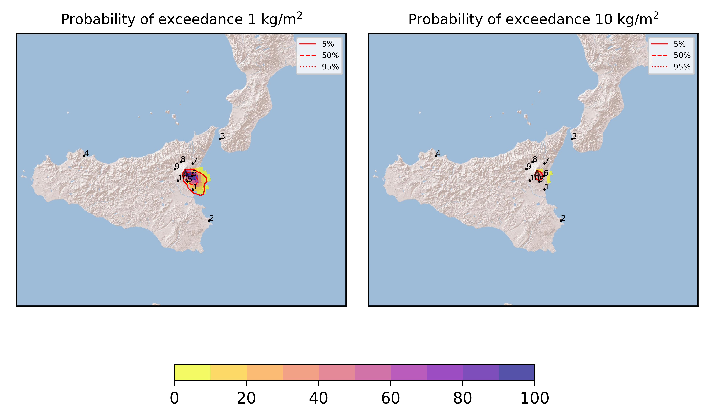
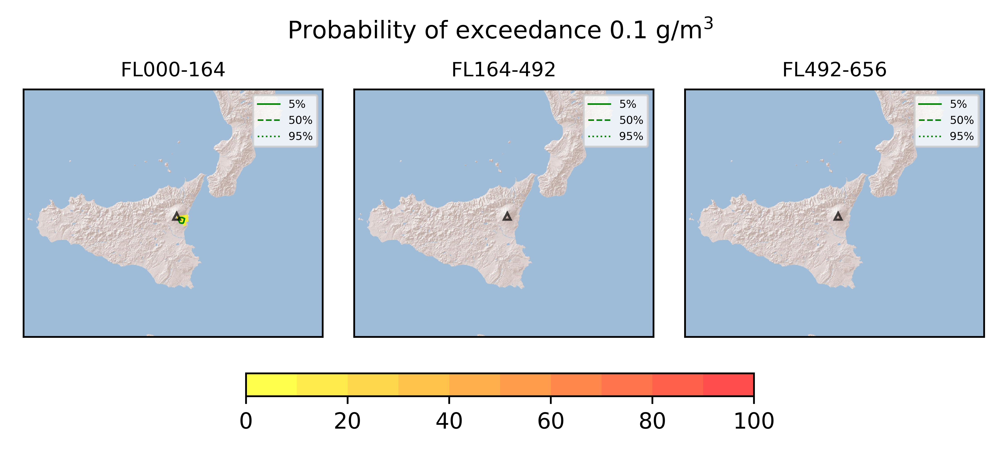

Forecast from VONA bulletin - 20210809_0452Z
============================================

Contents
========

* [Forecast products](#forecast-products)
	* [Forecast at 2021-08-09 07:50 Z](#forecast-at-2021-08-09-0750-z)
	* [Forecast at 2021-08-09 10:50 Z](#forecast-at-2021-08-09-1050-z)
	* [Forecast at 2021-08-09 13:50 Z](#forecast-at-2021-08-09-1350-z)
	* [Forecast at 2021-08-09 16:50 Z](#forecast-at-2021-08-09-1650-z)

# Forecast products

## Forecast at 2021-08-09 07:50 Z
  

|Eruption start [Z]|Eruption end [Z]|Forecast time [Z]|Column height asl [m]|
| :--- | :--- | :--- | :--- |
|2021-08-09 04:50:00|Ongoing|2021-08-09 07:50:00|7000 ± 500 - from VONA|
  
  

|Percentile|MER [kg/s¹]|Mass in the air [kg]|Mass on the ground [kg]|
| :--- | :--- | :--- | :--- |
|5th|1.30e+04|7.35e+06|1.30e+08|
|50th|4.94e+04|3.18e+07|5.46e+08|
|95th|1.80e+05|2.44e+08|1.65e+09|
  

### Ground 2021-08-09 07:50 Z
  
  
  
  
  
  
  
  
  
  
  

|Location|Ground load [kg/m²] 5th perc|Ground load [kg/m²] 50th perc|Ground load [kg/m²] 95th perc|
| :--- | :--- | :--- | :--- |
|Catania AP (1)|3.13e-06|5.85e-03|8.74e-01|
|Siracusa (2)|0.00e+00|0.00e+00|6.09e-04|
|Reggio Calabria AP (3)|0.00e+00|0.00e+00|0.00e+00|
|Palermo AP (4)|0.00e+00|0.00e+00|0.00e+00|
|Nicolosi (5)|2.51e-03|1.22e-01|1.40e+00|
|Zafferana (6)|4.56e-02|7.64e-01|3.46e+00|
|Linguaglossa (7)|0.00e+00|0.00e+00|1.61e-04|
|Randazzo (8)|0.00e+00|0.00e+00|0.00e+00|
|Bronte (9)|0.00e+00|0.00e+00|0.00e+00|
|Biancavilla (10)|0.00e+00|0.00e+00|2.96e-04|
  

### Atmosphere 2021-08-09 07:50 Z
  

## Forecast at 2021-08-09 10:50 Z
  

|Eruption start [Z]|Eruption end [Z]|Forecast time [Z]|Column height asl [m]|
| :--- | :--- | :--- | :--- |
|2021-08-09 04:50:00|Ongoing|2021-08-09 10:50:00|7000 ± 500 - from VONA|
  
  

|Percentile|MER [kg/s¹]|Mass in the air [kg]|Mass on the ground [kg]|
| :--- | :--- | :--- | :--- |
|5th|1.24e+04|1.61e+07|4.27e+08|
|50th|4.24e+04|4.24e+07|1.12e+09|
|95th|1.09e+05|1.39e+08|2.40e+09|
  

### Ground 2021-08-09 10:50 Z
  
  
  
  
  
  
  
  
  
  
  

|Location|Ground load [kg/m²] 5th perc|Ground load [kg/m²] 50th perc|Ground load [kg/m²] 95th perc|
| :--- | :--- | :--- | :--- |
|Catania AP (1)|9.72e-04|8.93e-02|1.25e+00|
|Siracusa (2)|0.00e+00|0.00e+00|9.37e-03|
|Reggio Calabria AP (3)|0.00e+00|0.00e+00|0.00e+00|
|Palermo AP (4)|0.00e+00|0.00e+00|0.00e+00|
|Nicolosi (5)|2.07e-02|5.02e-01|2.15e+00|
|Zafferana (6)|1.19e-01|1.54e+00|5.80e+00|
|Linguaglossa (7)|0.00e+00|0.00e+00|1.83e-04|
|Randazzo (8)|0.00e+00|0.00e+00|0.00e+00|
|Bronte (9)|0.00e+00|0.00e+00|0.00e+00|
|Biancavilla (10)|0.00e+00|3.27e-05|6.28e-04|
  

### Atmosphere 2021-08-09 10:50 Z
  

## Forecast at 2021-08-09 13:50 Z
  

|Eruption start [Z]|Eruption end [Z]|Forecast time [Z]|Column height asl [m]|
| :--- | :--- | :--- | :--- |
|2021-08-09 04:50:00|Ongoing|2021-08-09 13:50:00|7000 ± 500 - from VONA|
  
  

|Percentile|MER [kg/s¹]|Mass in the air [kg]|Mass on the ground [kg]|
| :--- | :--- | :--- | :--- |
|5th|4.64e+03|7.26e+06|7.30e+08|
|50th|4.01e+04|3.31e+07|1.61e+09|
|95th|1.10e+05|1.74e+08|2.88e+09|
  

### Ground 2021-08-09 13:50 Z
  
  
  
  
  
  
  
  
  
  
  

|Location|Ground load [kg/m²] 5th perc|Ground load [kg/m²] 50th perc|Ground load [kg/m²] 95th perc|
| :--- | :--- | :--- | :--- |
|Catania AP (1)|4.25e-03|1.16e-01|1.81e+00|
|Siracusa (2)|0.00e+00|0.00e+00|1.33e-02|
|Reggio Calabria AP (3)|0.00e+00|0.00e+00|0.00e+00|
|Palermo AP (4)|0.00e+00|0.00e+00|0.00e+00|
|Nicolosi (5)|1.24e-01|1.05e+00|2.50e+00|
|Zafferana (6)|5.50e-01|2.64e+00|7.23e+00|
|Linguaglossa (7)|0.00e+00|0.00e+00|4.08e-04|
|Randazzo (8)|0.00e+00|0.00e+00|0.00e+00|
|Bronte (9)|0.00e+00|0.00e+00|0.00e+00|
|Biancavilla (10)|0.00e+00|1.02e-04|8.98e-04|
  

### Atmosphere 2021-08-09 13:50 Z
  

## Forecast at 2021-08-09 16:50 Z
  

|Eruption start [Z]|Eruption end [Z]|Forecast time [Z]|Column height asl [m]|
| :--- | :--- | :--- | :--- |
|2021-08-09 04:50:00|Ongoing|2021-08-09 16:50:00|7000 ± 500 - from VONA|
  
  

|Percentile|MER [kg/s¹]|Mass in the air [kg]|Mass on the ground [kg]|
| :--- | :--- | :--- | :--- |
|5th|1.69e+04|7.82e+06|1.12e+09|
|50th|4.05e+04|3.70e+07|2.13e+09|
|95th|1.07e+05|2.81e+08|3.61e+09|
  

### Ground 2021-08-09 16:50 Z
  
  
  
  
  
  
  
  
  
  
  

|Location|Ground load [kg/m²] 5th perc|Ground load [kg/m²] 50th perc|Ground load [kg/m²] 95th perc|
| :--- | :--- | :--- | :--- |
|Catania AP (1)|5.80e-03|3.32e-01|1.87e+00|
|Siracusa (2)|0.00e+00|3.25e-05|1.34e-02|
|Reggio Calabria AP (3)|0.00e+00|0.00e+00|0.00e+00|
|Palermo AP (4)|0.00e+00|0.00e+00|0.00e+00|
|Nicolosi (5)|1.52e-01|1.26e+00|2.77e+00|
|Zafferana (6)|1.46e+00|4.12e+00|8.58e+00|
|Linguaglossa (7)|0.00e+00|0.00e+00|7.68e-04|
|Randazzo (8)|0.00e+00|0.00e+00|0.00e+00|
|Bronte (9)|0.00e+00|0.00e+00|0.00e+00|
|Biancavilla (10)|0.00e+00|1.22e-04|9.77e-04|
  

### Atmosphere 2021-08-09 16:50 Z
  
  
Go to [Supplementary page](Supplementary_page.md)  
Go to [Main directory](https://github.com/federicapardini/Real_time_ash_forecast)