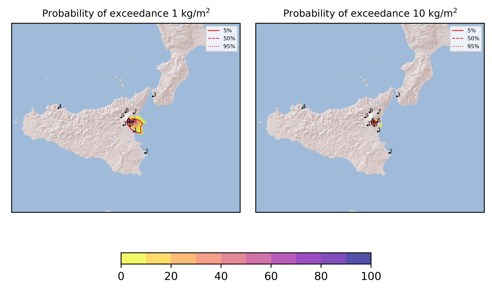

Forecast from VONA bulletin - 20210809_0452Z
============================================

Contents
========

* [Forecast products](#forecast-products)
	* [Forecast at 2021-08-09 07:50 Z](#forecast-at-2021-08-09-0750-z)

# Forecast products

## Forecast at 2021-08-09 07:50 Z
  

|Eruption start [Z]|Eruption end [Z]|Forecast time [Z]|Column height asl [m]|
| :--- | :--- | :--- | :--- |
|2021-08-09 04:50:00|Ongoing|2021-08-09 07:50:00|7000 ± 500 - from VONA|
  
  

|Percentile|MER [kg/s¹]|Mass in the air [kg]|Mass on the ground [kg]|
| :--- | :--- | :--- | :--- |
|5th|1.30e+04|7.35e+06|1.30e+08|
|50th|4.94e+04|3.18e+07|5.46e+08|
|95th|1.80e+05|2.44e+08|1.65e+09|
  

### Ground 2021-08-09 07:50 Z
  
  
  
  
  
  
  
  
  
  
  

|Location|Ground load [kg/m²] 5th perc|Ground load [kg/m²] 50th perc|Ground load [kg/m²] 95th perc|
| :--- | :--- | :--- | :--- |
|Catania AP (1)|3.13e-06|5.85e-03|8.74e-01|
|Siracusa (2)|0.00e+00|0.00e+00|6.09e-04|
|Reggio Calabria AP (3)|0.00e+00|0.00e+00|0.00e+00|
|Palermo AP (4)|0.00e+00|0.00e+00|0.00e+00|
|Nicolosi (5)|2.51e-03|1.22e-01|1.40e+00|
|Zafferana (6)|4.56e-02|7.64e-01|3.46e+00|
|Linguaglossa (7)|0.00e+00|0.00e+00|1.61e-04|
|Randazzo (8)|0.00e+00|0.00e+00|0.00e+00|
|Bronte (9)|0.00e+00|0.00e+00|0.00e+00|
|Biancavilla (10)|0.00e+00|0.00e+00|2.96e-04|
  

### Atmosphere 2021-08-09 07:50 Z
  
  
Go to [Supplementary page](Supplementary_page.md)  
Go to [Main directory](https://github.com/federicapardini/Real_time_ash_forecast)