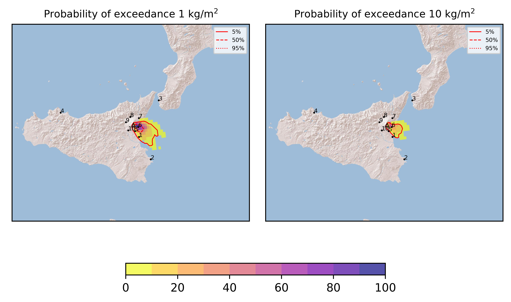
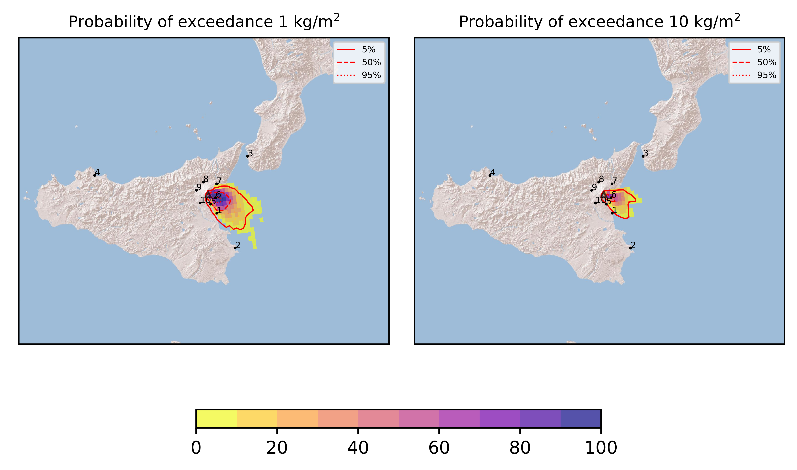
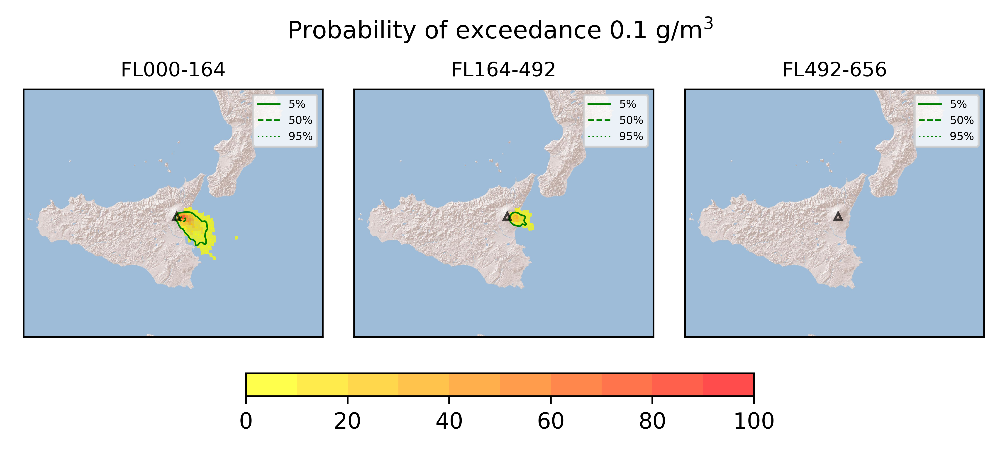
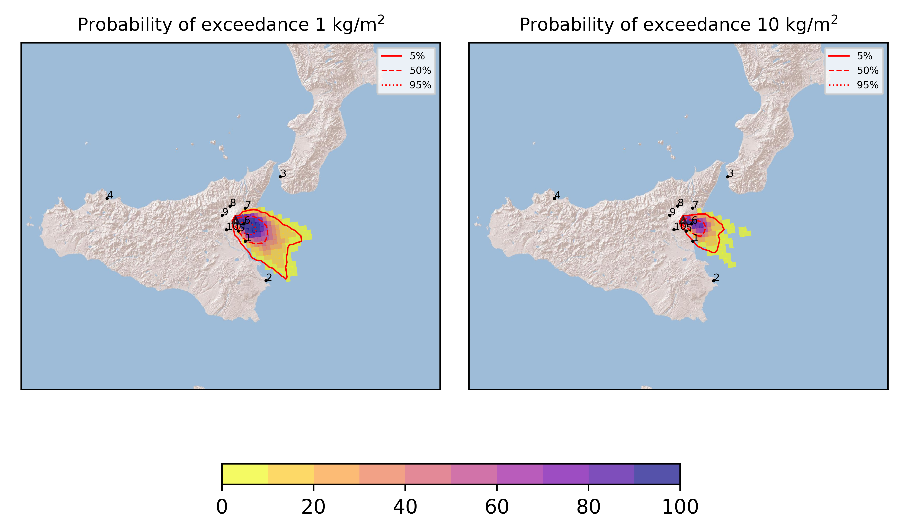
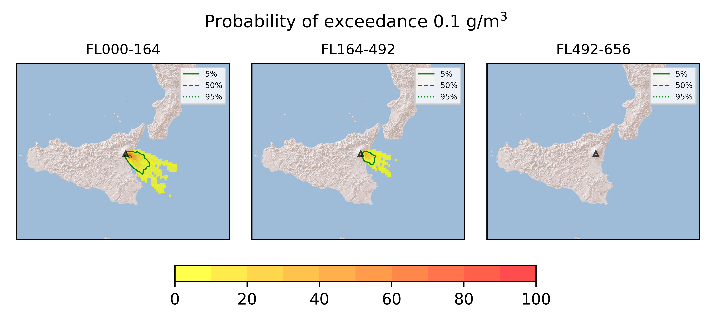

Forecast from VONA bulletin - 20210810_0929Z
============================================

Contents
========

* [Forecast products](#forecast-products)
	* [Forecast at 2021-08-10 12:30 Z](#forecast-at-2021-08-10-1230-z)
	* [Forecast at 2021-08-10 15:30 Z](#forecast-at-2021-08-10-1530-z)
	* [Forecast at 2021-08-10 18:30 Z](#forecast-at-2021-08-10-1830-z)
	* [Forecast at 2021-08-10 21:30 Z](#forecast-at-2021-08-10-2130-z)

# Forecast products

## Forecast at 2021-08-10 12:30 Z
  

|Eruption start [Z]|Eruption end [Z]|Forecast time [Z]|Column height asl [m]|
| :--- | :--- | :--- | :--- |
|2021-08-10 09:30:00|Ongoing|2021-08-10 12:30:00|[6000 m, 12000 m]|
  
  

|Percentile|MER [kg/s¹]|Mass in the air [kg]|Mass on the ground [kg]|
| :--- | :--- | :--- | :--- |
|5th|2.50e+04|1.35e+07|2.20e+08|
|50th|2.86e+05|2.15e+08|2.59e+09|
|95th|1.65e+06|3.23e+09|1.36e+10|
  

### Ground 2021-08-10 12:30 Z
  
  
  
  
  
  
  
  
  
  
  

|Location|Ground load [kg/m²] 5th perc|Ground load [kg/m²] 50th perc|Ground load [kg/m²] 95th perc|
| :--- | :--- | :--- | :--- |
|Catania AP (1)|0.00e+00|7.61e-03|3.92e+00|
|Siracusa (2)|0.00e+00|0.00e+00|1.37e-04|
|Reggio Calabria AP (3)|0.00e+00|0.00e+00|0.00e+00|
|Palermo AP (4)|0.00e+00|0.00e+00|0.00e+00|
|Nicolosi (5)|6.51e-04|1.66e-01|4.68e+00|
|Zafferana (6)|3.99e-01|6.35e+00|2.34e+01|
|Linguaglossa (7)|0.00e+00|0.00e+00|1.04e-02|
|Randazzo (8)|0.00e+00|0.00e+00|0.00e+00|
|Bronte (9)|0.00e+00|0.00e+00|0.00e+00|
|Biancavilla (10)|0.00e+00|0.00e+00|4.92e-04|
  

### Atmosphere 2021-08-10 12:30 Z
  

## Forecast at 2021-08-10 15:30 Z
  

|Eruption start [Z]|Eruption end [Z]|Forecast time [Z]|Column height asl [m]|
| :--- | :--- | :--- | :--- |
|2021-08-10 09:30:00|Ongoing|2021-08-10 15:30:00|[6000 m, 12000 m]|
  
  

|Percentile|MER [kg/s¹]|Mass in the air [kg]|Mass on the ground [kg]|
| :--- | :--- | :--- | :--- |
|5th|4.00e+04|9.22e+07|1.23e+09|
|50th|3.10e+05|5.24e+08|7.95e+09|
|95th|1.46e+06|2.41e+09|2.26e+10|
  

### Ground 2021-08-10 15:30 Z
  
  
  
  
  
  
  
  
  
  
  

|Location|Ground load [kg/m²] 5th perc|Ground load [kg/m²] 50th perc|Ground load [kg/m²] 95th perc|
| :--- | :--- | :--- | :--- |
|Catania AP (1)|1.18e-04|4.55e-01|5.09e+00|
|Siracusa (2)|0.00e+00|0.00e+00|1.28e-02|
|Reggio Calabria AP (3)|0.00e+00|0.00e+00|0.00e+00|
|Palermo AP (4)|0.00e+00|0.00e+00|0.00e+00|
|Nicolosi (5)|5.61e-02|5.50e-01|5.30e+00|
|Zafferana (6)|2.62e+00|1.37e+01|3.97e+01|
|Linguaglossa (7)|0.00e+00|3.05e-04|3.43e-02|
|Randazzo (8)|0.00e+00|0.00e+00|0.00e+00|
|Bronte (9)|0.00e+00|0.00e+00|0.00e+00|
|Biancavilla (10)|0.00e+00|0.00e+00|7.57e-04|
  

### Atmosphere 2021-08-10 15:30 Z
  

## Forecast at 2021-08-10 18:30 Z
  

|Eruption start [Z]|Eruption end [Z]|Forecast time [Z]|Column height asl [m]|
| :--- | :--- | :--- | :--- |
|2021-08-10 09:30:00|Ongoing|2021-08-10 18:30:00|[6000 m, 12000 m]|
  
  

|Percentile|MER [kg/s¹]|Mass in the air [kg]|Mass on the ground [kg]|
| :--- | :--- | :--- | :--- |
|5th|2.29e+04|2.98e+07|2.06e+09|
|50th|3.71e+05|4.26e+08|1.38e+10|
|95th|1.70e+06|3.41e+09|2.89e+10|
  

### Ground 2021-08-10 18:30 Z
  
  
  
  
  
  
  
  
  
  
  

|Location|Ground load [kg/m²] 5th perc|Ground load [kg/m²] 50th perc|Ground load [kg/m²] 95th perc|
| :--- | :--- | :--- | :--- |
|Catania AP (1)|3.65e-04|6.86e-01|7.11e+00|
|Siracusa (2)|0.00e+00|0.00e+00|1.63e-02|
|Reggio Calabria AP (3)|0.00e+00|0.00e+00|0.00e+00|
|Palermo AP (4)|0.00e+00|0.00e+00|0.00e+00|
|Nicolosi (5)|8.37e-02|1.65e+00|7.66e+00|
|Zafferana (6)|5.87e+00|2.37e+01|4.96e+01|
|Linguaglossa (7)|0.00e+00|5.51e-04|4.75e-02|
|Randazzo (8)|0.00e+00|0.00e+00|0.00e+00|
|Bronte (9)|0.00e+00|0.00e+00|0.00e+00|
|Biancavilla (10)|0.00e+00|1.36e-06|9.22e-04|
  

### Atmosphere 2021-08-10 18:30 Z
  

## Forecast at 2021-08-10 21:30 Z
  

|Eruption start [Z]|Eruption end [Z]|Forecast time [Z]|Column height asl [m]|
| :--- | :--- | :--- | :--- |
|2021-08-10 09:30:00|Ongoing|2021-08-10 21:30:00|[6000 m, 12000 m]|
  
  

|Percentile|MER [kg/s¹]|Mass in the air [kg]|Mass on the ground [kg]|
| :--- | :--- | :--- | :--- |
|5th|3.73e+04|3.45e+07|3.60e+09|
|50th|3.32e+05|4.66e+08|1.82e+10|
|95th|1.94e+06|6.75e+09|3.54e+10|
  

### Ground 2021-08-10 21:30 Z
  
  
  
  
  
  
  
  
  
  
  

|Location|Ground load [kg/m²] 5th perc|Ground load [kg/m²] 50th perc|Ground load [kg/m²] 95th perc|
| :--- | :--- | :--- | :--- |
|Catania AP (1)|2.84e-02|6.87e-01|1.01e+01|
|Siracusa (2)|0.00e+00|1.16e-05|5.01e-02|
|Reggio Calabria AP (3)|0.00e+00|0.00e+00|0.00e+00|
|Palermo AP (4)|0.00e+00|0.00e+00|0.00e+00|
|Nicolosi (5)|3.28e-01|1.77e+00|1.12e+01|
|Zafferana (6)|6.78e+00|3.39e+01|6.55e+01|
|Linguaglossa (7)|0.00e+00|6.48e-04|4.75e-02|
|Randazzo (8)|0.00e+00|0.00e+00|0.00e+00|
|Bronte (9)|0.00e+00|0.00e+00|0.00e+00|
|Biancavilla (10)|0.00e+00|4.08e-06|9.37e-04|
  

### Atmosphere 2021-08-10 21:30 Z
  
  
Go to [Supplementary page](Supplementary_page.md)  
Go to [Main directory](https://github.com/federicapardini/Real_time_ash_forecast)