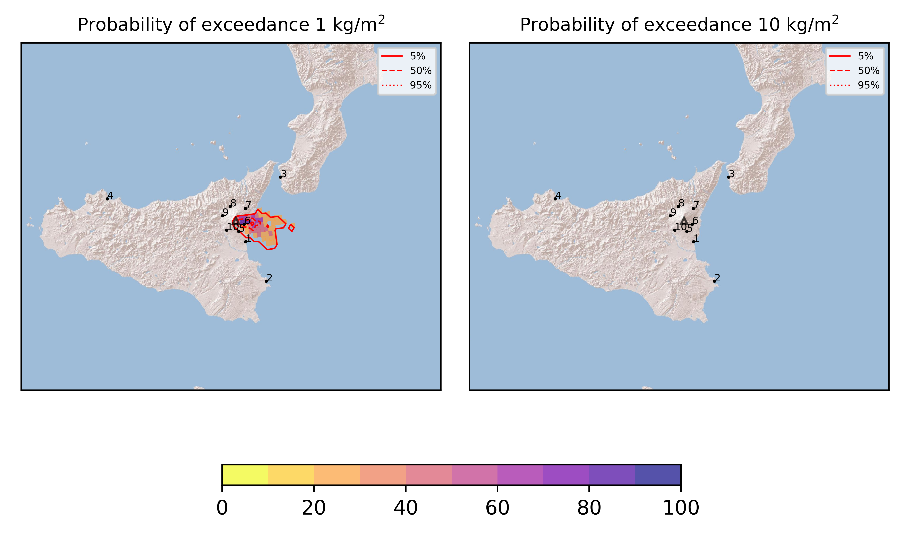
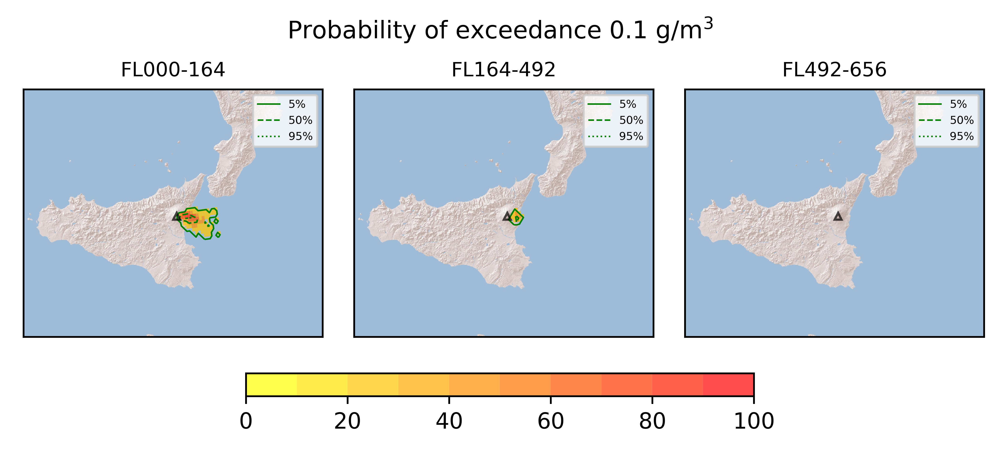
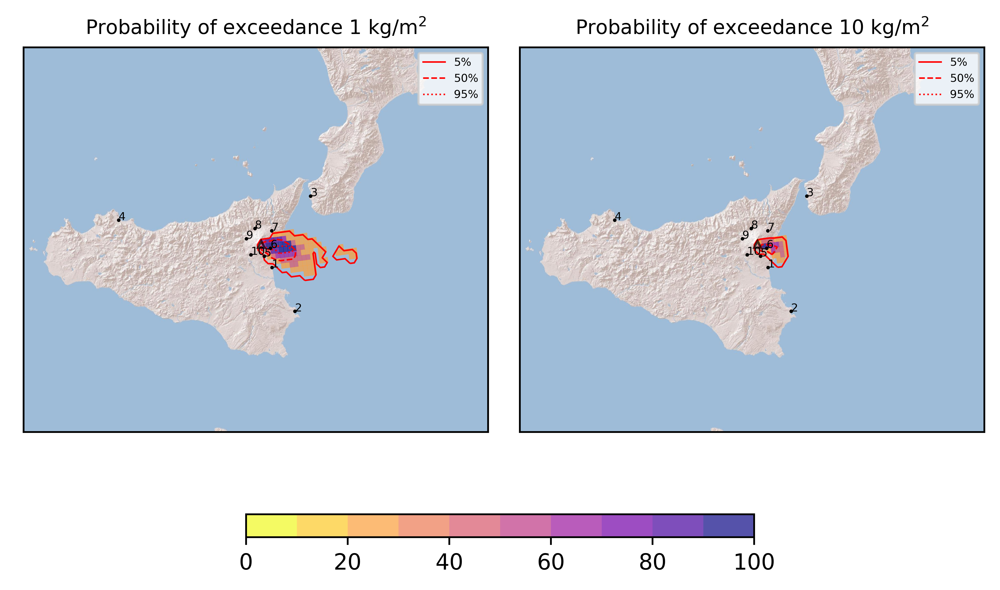
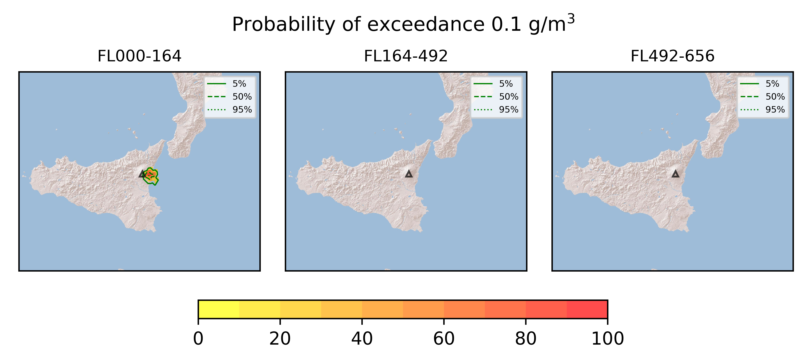
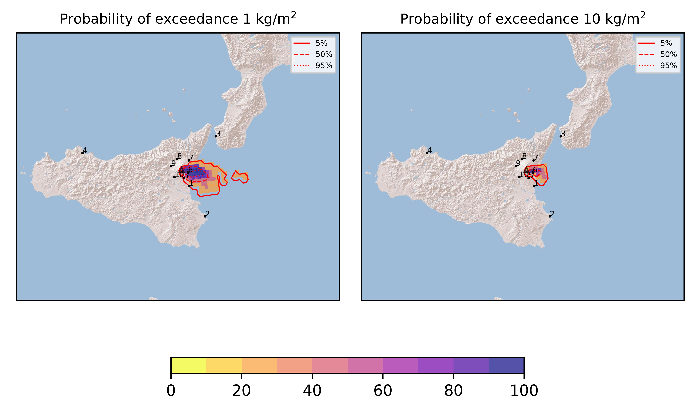

Forecast from VONA bulletin - 20210824_1030Z
============================================

Contents
========

* [Forecast products](#forecast-products)
	* [Forecast at 2021-08-24 13:30 Z](#forecast-at-2021-08-24-1330-z)
	* [Forecast at 2021-08-24 16:30 Z](#forecast-at-2021-08-24-1630-z)
	* [Forecast at 2021-08-24 19:30 Z](#forecast-at-2021-08-24-1930-z)

# Forecast products

## Forecast at 2021-08-24 13:30 Z
  

|Eruption start [Z]|Eruption end [Z]|Forecast time [Z]|Column height asl [m]|
| :--- | :--- | :--- | :--- |
|2021-08-24 10:30:00|Ongoing|2021-08-24 13:30:00|[6000 m, 12000 m]|
  
  

|Percentile|MER [kg/s¹]|Mass in the air [kg]|Mass on the ground [kg]|
| :--- | :--- | :--- | :--- |
|5th|1.25e+05|7.74e+08|9.50e+08|
|50th|2.94e+05|1.53e+09|1.60e+09|
|95th|5.69e+05|1.99e+09|2.28e+09|
  

### Ground 2021-08-24 13:30 Z
  
  
  
  
  
  
  
  
  
  
  

|Location|Ground load [kg/m²] 5th perc|Ground load [kg/m²] 50th perc|Ground load [kg/m²] 95th perc|
| :--- | :--- | :--- | :--- |
|Catania AP (1)|0.00e+00|0.00e+00|3.87e-02|
|Siracusa (2)|0.00e+00|0.00e+00|0.00e+00|
|Reggio Calabria AP (3)|0.00e+00|0.00e+00|0.00e+00|
|Palermo AP (4)|0.00e+00|0.00e+00|0.00e+00|
|Nicolosi (5)|7.39e-05|2.72e-03|1.47e-01|
|Zafferana (6)|7.98e-01|2.46e+00|3.90e+00|
|Linguaglossa (7)|7.44e-06|1.12e-04|3.40e-03|
|Randazzo (8)|0.00e+00|0.00e+00|0.00e+00|
|Bronte (9)|0.00e+00|0.00e+00|0.00e+00|
|Biancavilla (10)|0.00e+00|0.00e+00|0.00e+00|
  

### Atmosphere 2021-08-24 13:30 Z
  

## Forecast at 2021-08-24 16:30 Z
  

|Eruption start [Z]|Eruption end [Z]|Forecast time [Z]|Column height asl [m]|
| :--- | :--- | :--- | :--- |
|2021-08-24 10:30:00|Ongoing|2021-08-24 16:30:00|[6000 m, 12000 m]|
  
  

|Percentile|MER [kg/s¹]|Mass in the air [kg]|Mass on the ground [kg]|
| :--- | :--- | :--- | :--- |
|5th|2.90e+05|4.44e+08|5.92e+09|
|50th|6.23e+05|7.39e+08|1.01e+10|
|95th|1.01e+06|8.52e+08|1.07e+10|
  

### Ground 2021-08-24 16:30 Z
  
  
  
  
  
  
  
  
  
  
  

|Location|Ground load [kg/m²] 5th perc|Ground load [kg/m²] 50th perc|Ground load [kg/m²] 95th perc|
| :--- | :--- | :--- | :--- |
|Catania AP (1)|0.00e+00|3.64e-03|1.29e-01|
|Siracusa (2)|0.00e+00|0.00e+00|7.95e-04|
|Reggio Calabria AP (3)|0.00e+00|0.00e+00|0.00e+00|
|Palermo AP (4)|0.00e+00|0.00e+00|0.00e+00|
|Nicolosi (5)|5.39e-03|6.10e-02|1.23e+00|
|Zafferana (6)|6.28e+00|1.45e+01|1.91e+01|
|Linguaglossa (7)|2.97e-04|1.82e-03|5.38e-02|
|Randazzo (8)|0.00e+00|0.00e+00|0.00e+00|
|Bronte (9)|0.00e+00|0.00e+00|0.00e+00|
|Biancavilla (10)|0.00e+00|0.00e+00|0.00e+00|
  

### Atmosphere 2021-08-24 16:30 Z
  

## Forecast at 2021-08-24 19:30 Z
  

|Eruption start [Z]|Eruption end [Z]|Forecast time [Z]|Column height asl [m]|
| :--- | :--- | :--- | :--- |
|2021-08-24 10:30:00|Ongoing|2021-08-24 19:30:00|[6000 m, 12000 m]|
  
  

|Percentile|MER [kg/s¹]|Mass in the air [kg]|Mass on the ground [kg]|
| :--- | :--- | :--- | :--- |
|5th|4.84e+04|1.83e+08|6.90e+09|
|50th|9.67e+04|2.97e+08|1.17e+10|
|95th|1.43e+05|3.41e+08|1.23e+10|
  

### Ground 2021-08-24 19:30 Z
  
  
  
  
  
  
  
  
  
  
  

|Location|Ground load [kg/m²] 5th perc|Ground load [kg/m²] 50th perc|Ground load [kg/m²] 95th perc|
| :--- | :--- | :--- | :--- |
|Catania AP (1)|9.80e-04|1.29e-01|5.84e-01|
|Siracusa (2)|0.00e+00|0.00e+00|6.93e-03|
|Reggio Calabria AP (3)|0.00e+00|0.00e+00|0.00e+00|
|Palermo AP (4)|0.00e+00|0.00e+00|0.00e+00|
|Nicolosi (5)|4.48e-02|4.05e-01|1.33e+00|
|Zafferana (6)|7.49e+00|1.62e+01|2.23e+01|
|Linguaglossa (7)|3.15e-04|1.85e-03|5.43e-02|
|Randazzo (8)|0.00e+00|0.00e+00|0.00e+00|
|Bronte (9)|0.00e+00|0.00e+00|0.00e+00|
|Biancavilla (10)|0.00e+00|0.00e+00|0.00e+00|
  

### Atmosphere 2021-08-24 19:30 Z
  
  
Go to [Supplementary page](Supplementary_page.md)  
Go to [Main directory](https://github.com/federicapardini/Real_time_ash_forecast)