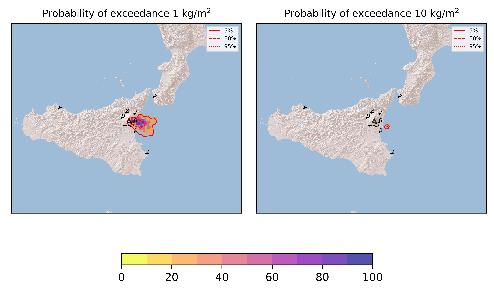
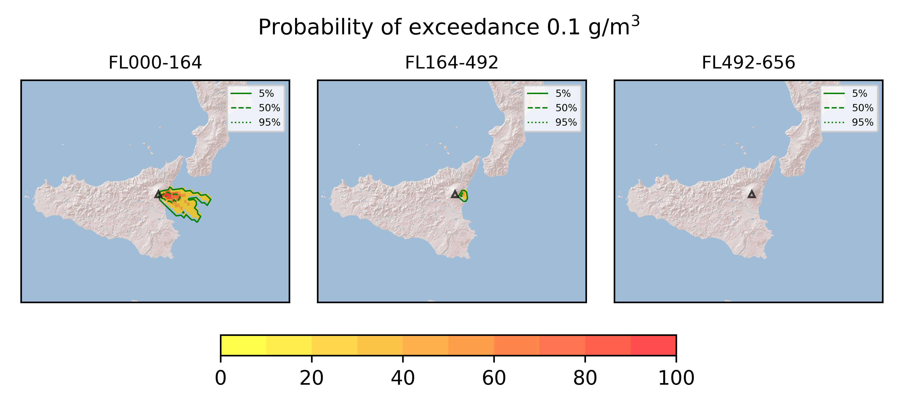
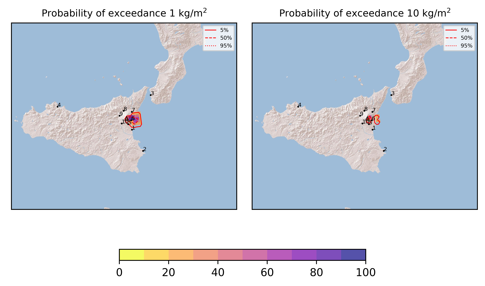

Forecast from VONA bulletin - 20210824_1230Z
============================================

Contents
========

* [Forecast products](#forecast-products)
	* [Forecast at 2021-08-24 15:30 Z](#forecast-at-2021-08-24-1530-z)
	* [Forecast at 2021-08-24 15:30 Z](#forecast-at-2021-08-24-1530-z)
	* [Forecast at 2021-08-24 18:30 Z](#forecast-at-2021-08-24-1830-z)
	* [Forecast at 2021-08-24 21:30 Z](#forecast-at-2021-08-24-2130-z)

# Forecast products

## Forecast at 2021-08-24 15:30 Z
  

|Eruption start [Z]|Eruption end [Z]|Forecast time [Z]|Column height asl [m]|
| :--- | :--- | :--- | :--- |
|2021-08-24 12:30:00|Ongoing|2021-08-24 15:30:00|[6000 m, 12000 m]|
  
  

|Percentile|MER [kg/s¹]|Mass in the air [kg]|Mass on the ground [kg]|
| :--- | :--- | :--- | :--- |
|5th|2.03e+05|9.13e+08|1.40e+09|
|50th|4.05e+05|1.58e+09|2.64e+09|
|95th|5.72e+05|2.24e+09|3.49e+09|
  

### Ground 2021-08-24 15:30 Z
  
  
  
  
  
  
  
  
  
  
  

|Location|Ground load [kg/m²] 5th perc|Ground load [kg/m²] 50th perc|Ground load [kg/m²] 95th perc|
| :--- | :--- | :--- | :--- |
|Catania AP (1)|0.00e+00|7.95e-06|1.08e-01|
|Siracusa (2)|0.00e+00|0.00e+00|1.83e-05|
|Reggio Calabria AP (3)|0.00e+00|0.00e+00|0.00e+00|
|Palermo AP (4)|0.00e+00|0.00e+00|0.00e+00|
|Nicolosi (5)|2.55e-04|5.17e-03|2.37e-01|
|Zafferana (6)|1.41e+00|4.17e+00|4.48e+00|
|Linguaglossa (7)|0.00e+00|7.44e-06|2.19e-03|
|Randazzo (8)|0.00e+00|0.00e+00|0.00e+00|
|Bronte (9)|0.00e+00|0.00e+00|0.00e+00|
|Biancavilla (10)|0.00e+00|0.00e+00|0.00e+00|
  

### Atmosphere 2021-08-24 15:30 Z
  

## Forecast at 2021-08-24 15:30 Z
  

|Eruption start [Z]|Eruption end [Z]|Forecast time [Z]|Column height asl [m]|
| :--- | :--- | :--- | :--- |
|2021-08-24 12:30:00|2021-08-24 13:30:00|2021-08-24 15:30:00|[6000 m, 12000 m]|
  
  

|Percentile|MER [kg/s¹]|Mass in the air [kg]|Mass on the ground [kg]|
| :--- | :--- | :--- | :--- |
|5th|2.90e+05|3.22e-03|1.10e+09|
|50th|5.75e+05|4.95e-03|2.00e+09|
|95th|8.06e+05|8.85e-03|2.72e+09|
  

### Ground 2021-08-24 15:30 Z
  
  
  
  
  
  
  
  
  
  
  

|Location|Ground load [kg/m²] 5th perc|Ground load [kg/m²] 50th perc|Ground load [kg/m²] 95th perc|
| :--- | :--- | :--- | :--- |
|Catania AP (1)|0.00e+00|0.00e+00|4.51e-03|
|Siracusa (2)|0.00e+00|0.00e+00|0.00e+00|
|Reggio Calabria AP (3)|0.00e+00|0.00e+00|0.00e+00|
|Palermo AP (4)|0.00e+00|0.00e+00|0.00e+00|
|Nicolosi (5)|2.63e-04|4.82e-03|2.86e-01|
|Zafferana (6)|1.01e+00|4.47e+00|5.81e+00|
|Linguaglossa (7)|0.00e+00|1.03e-03|3.70e-02|
|Randazzo (8)|0.00e+00|0.00e+00|0.00e+00|
|Bronte (9)|0.00e+00|0.00e+00|0.00e+00|
|Biancavilla (10)|0.00e+00|0.00e+00|0.00e+00|
  

### Atmosphere 2021-08-24 15:30 Z
  

## Forecast at 2021-08-24 18:30 Z
  

|Eruption start [Z]|Eruption end [Z]|Forecast time [Z]|Column height asl [m]|
| :--- | :--- | :--- | :--- |
|2021-08-24 12:30:00|2021-08-24 13:30:00|2021-08-24 18:30:00|None|
  
  

|Percentile|MER [kg/s¹]|Mass in the air [kg]|Mass on the ground [kg]|
| :--- | :--- | :--- | :--- |
|5th|0.00e+00|1.49e-07|1.10e+09|
|50th|0.00e+00|2.57e-07|2.00e+09|
|95th|0.00e+00|3.13e-07|2.72e+09|
  

### Ground 2021-08-24 18:30 Z
  
  
  
  
  
  
  
  
  
  
  

|Location|Ground load [kg/m²] 5th perc|Ground load [kg/m²] 50th perc|Ground load [kg/m²] 95th perc|
| :--- | :--- | :--- | :--- |
|Catania AP (1)|0.00e+00|0.00e+00|4.51e-03|
|Siracusa (2)|0.00e+00|0.00e+00|0.00e+00|
|Reggio Calabria AP (3)|0.00e+00|0.00e+00|0.00e+00|
|Palermo AP (4)|0.00e+00|0.00e+00|0.00e+00|
|Nicolosi (5)|2.63e-04|4.82e-03|2.86e-01|
|Zafferana (6)|1.01e+00|4.47e+00|5.81e+00|
|Linguaglossa (7)|0.00e+00|1.03e-03|3.70e-02|
|Randazzo (8)|0.00e+00|0.00e+00|0.00e+00|
|Bronte (9)|0.00e+00|0.00e+00|0.00e+00|
|Biancavilla (10)|0.00e+00|0.00e+00|0.00e+00|
  

### Atmosphere 2021-08-24 18:30 Z
  

## Forecast at 2021-08-24 21:30 Z
  

|Eruption start [Z]|Eruption end [Z]|Forecast time [Z]|Column height asl [m]|
| :--- | :--- | :--- | :--- |
|2021-08-24 12:30:00|2021-08-24 13:30:00|2021-08-24 21:30:00|None|
  
  

|Percentile|MER [kg/s¹]|Mass in the air [kg]|Mass on the ground [kg]|
| :--- | :--- | :--- | :--- |
|5th|0.00e+00|1.29e-11|1.10e+09|
|50th|0.00e+00|1.00e-10|2.00e+09|
|95th|0.00e+00|9.39e-10|2.72e+09|
  

### Ground 2021-08-24 21:30 Z
  
  
  
  
  
  
  
  
  
  
  

|Location|Ground load [kg/m²] 5th perc|Ground load [kg/m²] 50th perc|Ground load [kg/m²] 95th perc|
| :--- | :--- | :--- | :--- |
|Catania AP (1)|0.00e+00|0.00e+00|4.51e-03|
|Siracusa (2)|0.00e+00|0.00e+00|0.00e+00|
|Reggio Calabria AP (3)|0.00e+00|0.00e+00|0.00e+00|
|Palermo AP (4)|0.00e+00|0.00e+00|0.00e+00|
|Nicolosi (5)|2.63e-04|4.82e-03|2.86e-01|
|Zafferana (6)|1.01e+00|4.47e+00|5.81e+00|
|Linguaglossa (7)|0.00e+00|1.03e-03|3.70e-02|
|Randazzo (8)|0.00e+00|0.00e+00|0.00e+00|
|Bronte (9)|0.00e+00|0.00e+00|0.00e+00|
|Biancavilla (10)|0.00e+00|0.00e+00|0.00e+00|
  

### Atmosphere 2021-08-24 21:30 Z
  
  
Go to [Supplementary page](Supplementary_page.md)  
Go to [Main directory](https://github.com/federicapardini/Real_time_ash_forecast)