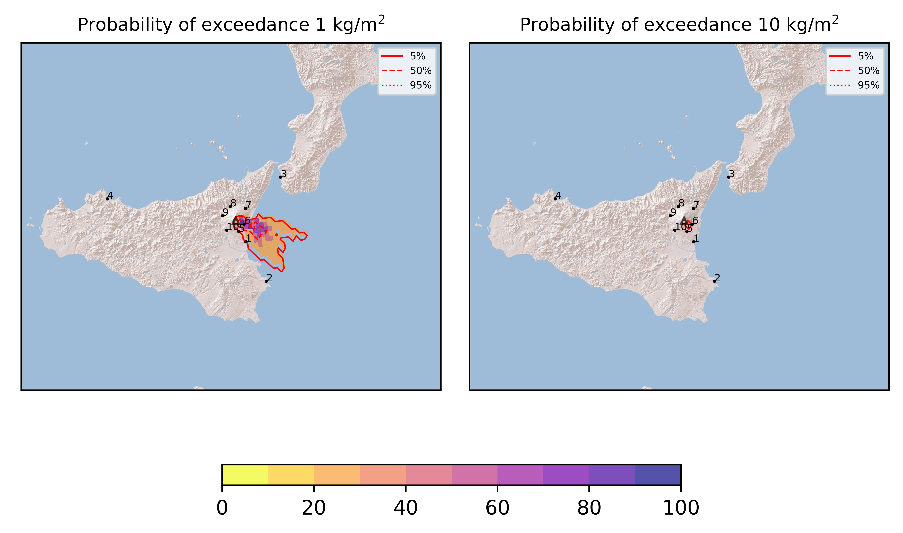
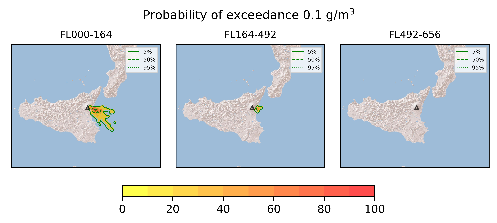
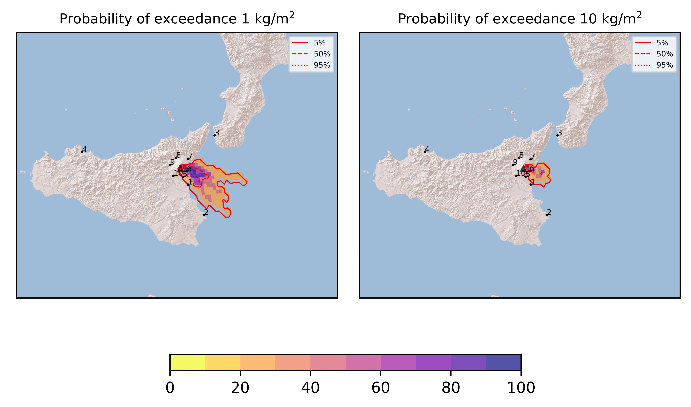
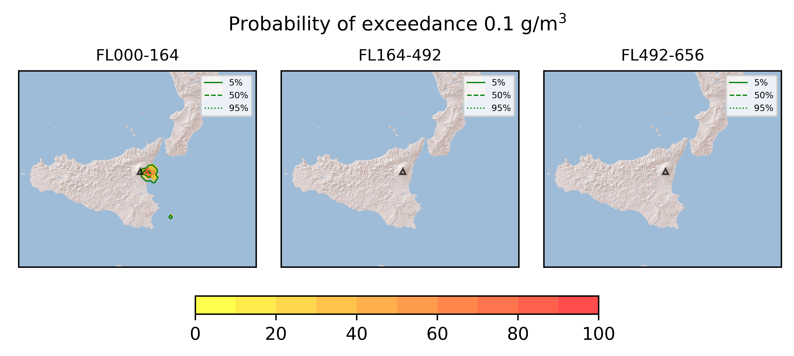
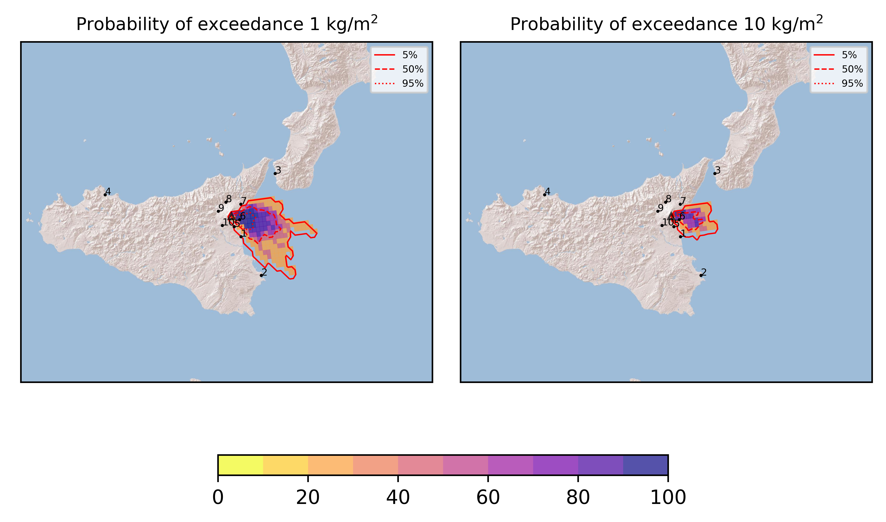
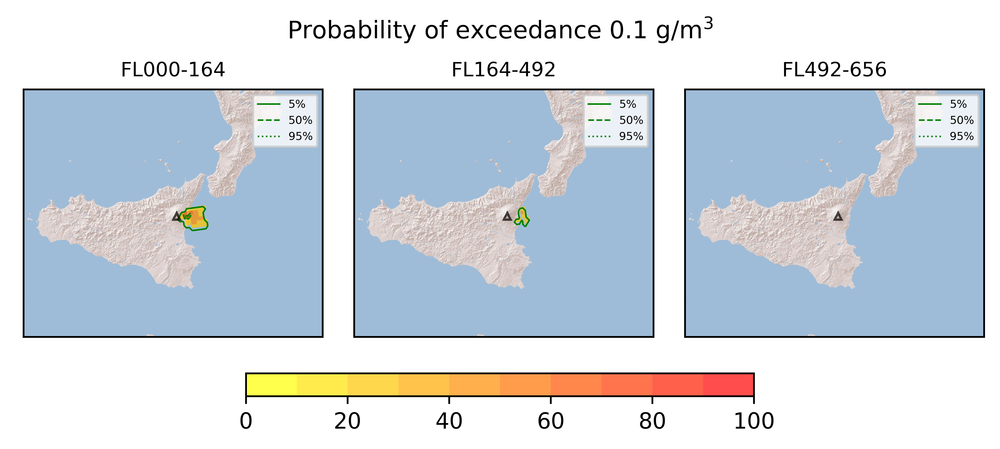

Forecast from VONA bulletin - 20210824_1730Z
============================================

Contents
========

* [Forecast products](#forecast-products)
	* [Forecast at 2021-08-24 20:30 Z - Ongoing Eruption scenario](#forecast-at-2021-08-24-2030-z---ongoing-eruption-scenario)
	* [Forecast at 2021-08-24 23:30 Z - Ongoing Eruption scenario](#forecast-at-2021-08-24-2330-z---ongoing-eruption-scenario)
	* [Forecast at 2021-08-25 02:30 Z - Ongoing Eruption scenario](#forecast-at-2021-08-25-0230-z---ongoing-eruption-scenario)
	* [Forecast at 2021-08-25 05:30 Z - Ongoing Eruption scenario](#forecast-at-2021-08-25-0530-z---ongoing-eruption-scenario)

# Forecast products

## Forecast at 2021-08-24 20:30 Z - Ongoing Eruption scenario
  

|Eruption start [Z]|Eruption end [Z]|Forecast time [Z]|Column height asl [m]|
| :--- | :--- | :--- | :--- |
|2021-08-24 17:30:00|Ongoing|2021-08-24 20:30:00|[6000 m, 12000 m]|
  
  

|Percentile|MER [kg/s¹]|Mass in the air [kg]|Mass on the ground [kg]|
| :--- | :--- | :--- | :--- |
|5th|2.02e+05|9.44e+08|1.46e+09|
|50th|4.02e+05|1.64e+09|2.73e+09|
|95th|5.52e+05|2.30e+09|3.49e+09|
  

### Ground 2021-08-24 20:30 Z
  
  
  
  
  
  
  
  
  
  
  

|Location|Ground load [kg/m²] 5th perc|Ground load [kg/m²] 50th perc|Ground load [kg/m²] 95th perc|
| :--- | :--- | :--- | :--- |
|Catania AP (1)|9.94e-06|2.84e-04|7.27e-01|
|Siracusa (2)|0.00e+00|0.00e+00|1.27e-02|
|Reggio Calabria AP (3)|0.00e+00|0.00e+00|0.00e+00|
|Palermo AP (4)|0.00e+00|0.00e+00|0.00e+00|
|Nicolosi (5)|8.49e-05|1.21e-02|3.15e-01|
|Zafferana (6)|1.92e-01|2.82e+00|3.25e+00|
|Linguaglossa (7)|0.00e+00|0.00e+00|0.00e+00|
|Randazzo (8)|0.00e+00|0.00e+00|0.00e+00|
|Bronte (9)|0.00e+00|0.00e+00|0.00e+00|
|Biancavilla (10)|0.00e+00|0.00e+00|0.00e+00|
  

### Atmosphere 2021-08-24 20:30 Z
  

## Forecast at 2021-08-24 23:30 Z - Ongoing Eruption scenario
  

|Eruption start [Z]|Eruption end [Z]|Forecast time [Z]|Column height asl [m]|
| :--- | :--- | :--- | :--- |
|2021-08-24 17:30:00|Ongoing|2021-08-24 23:30:00|[6000 m, 12000 m]|
  
  

|Percentile|MER [kg/s¹]|Mass in the air [kg]|Mass on the ground [kg]|
| :--- | :--- | :--- | :--- |
|5th|3.46e+05|4.91e+08|8.25e+09|
|50th|6.77e+05|6.01e+08|9.08e+09|
|95th|9.32e+05|9.08e+08|1.32e+10|
  

### Ground 2021-08-24 23:30 Z
  
  
  
  
  
  
  
  
  
  
  

|Location|Ground load [kg/m²] 5th perc|Ground load [kg/m²] 50th perc|Ground load [kg/m²] 95th perc|
| :--- | :--- | :--- | :--- |
|Catania AP (1)|9.07e-05|1.72e-02|1.32e+00|
|Siracusa (2)|0.00e+00|0.00e+00|4.64e-02|
|Reggio Calabria AP (3)|0.00e+00|0.00e+00|0.00e+00|
|Palermo AP (4)|0.00e+00|0.00e+00|0.00e+00|
|Nicolosi (5)|3.37e-04|1.50e-02|1.13e+00|
|Zafferana (6)|5.27e+00|6.86e+00|2.98e+01|
|Linguaglossa (7)|0.00e+00|0.00e+00|8.16e-04|
|Randazzo (8)|0.00e+00|0.00e+00|0.00e+00|
|Bronte (9)|0.00e+00|0.00e+00|0.00e+00|
|Biancavilla (10)|0.00e+00|0.00e+00|0.00e+00|
  

### Atmosphere 2021-08-24 23:30 Z
  

## Forecast at 2021-08-25 02:30 Z - Ongoing Eruption scenario
  

|Eruption start [Z]|Eruption end [Z]|Forecast time [Z]|Column height asl [m]|
| :--- | :--- | :--- | :--- |
|2021-08-24 17:30:00|Ongoing|2021-08-25 02:30:00|[6000 m, 12000 m]|
  
  

|Percentile|MER [kg/s¹]|Mass in the air [kg]|Mass on the ground [kg]|
| :--- | :--- | :--- | :--- |
|5th|6.44e+04|2.04e+08|9.30e+09|
|50th|1.21e+05|3.35e+08|1.05e+10|
|95th|1.59e+05|4.29e+08|1.48e+10|
  

### Ground 2021-08-25 02:30 Z
  
  
  
  
  
  
  
  
  
  
  

|Location|Ground load [kg/m²] 5th perc|Ground load [kg/m²] 50th perc|Ground load [kg/m²] 95th perc|
| :--- | :--- | :--- | :--- |
|Catania AP (1)|1.13e-04|2.44e-02|1.33e+00|
|Siracusa (2)|0.00e+00|0.00e+00|4.64e-02|
|Reggio Calabria AP (3)|0.00e+00|0.00e+00|0.00e+00|
|Palermo AP (4)|0.00e+00|0.00e+00|0.00e+00|
|Nicolosi (5)|3.00e-03|3.37e-02|1.16e+00|
|Zafferana (6)|5.80e+00|9.48e+00|3.11e+01|
|Linguaglossa (7)|0.00e+00|2.75e-04|2.33e-03|
|Randazzo (8)|0.00e+00|0.00e+00|0.00e+00|
|Bronte (9)|0.00e+00|0.00e+00|0.00e+00|
|Biancavilla (10)|0.00e+00|0.00e+00|0.00e+00|
  

### Atmosphere 2021-08-25 02:30 Z
  

## Forecast at 2021-08-25 05:30 Z - Ongoing Eruption scenario
  

|Eruption start [Z]|Eruption end [Z]|Forecast time [Z]|Column height asl [m]|
| :--- | :--- | :--- | :--- |
|2021-08-24 17:30:00|Ongoing|2021-08-25 05:30:00|[6000 m, 12000 m]|
  
  

|Percentile|MER [kg/s¹]|Mass in the air [kg]|Mass on the ground [kg]|
| :--- | :--- | :--- | :--- |
|5th|5.54e+05|3.96e+08|2.09e+10|
|50th|1.09e+06|7.53e+08|2.18e+10|
|95th|1.48e+06|1.07e+09|2.48e+10|
  

### Ground 2021-08-25 05:30 Z
  
  
  
  
  
  
  
  
  
  
  

|Location|Ground load [kg/m²] 5th perc|Ground load [kg/m²] 50th perc|Ground load [kg/m²] 95th perc|
| :--- | :--- | :--- | :--- |
|Catania AP (1)|2.41e-03|2.44e-02|1.33e+00|
|Siracusa (2)|0.00e+00|0.00e+00|4.64e-02|
|Reggio Calabria AP (3)|0.00e+00|0.00e+00|0.00e+00|
|Palermo AP (4)|0.00e+00|0.00e+00|0.00e+00|
|Nicolosi (5)|1.57e-02|3.65e-02|1.16e+00|
|Zafferana (6)|1.25e+01|2.58e+01|7.99e+01|
|Linguaglossa (7)|4.44e-04|2.93e-03|1.78e-02|
|Randazzo (8)|0.00e+00|0.00e+00|0.00e+00|
|Bronte (9)|0.00e+00|0.00e+00|0.00e+00|
|Biancavilla (10)|0.00e+00|0.00e+00|0.00e+00|
  

### Atmosphere 2021-08-25 05:30 Z
  
  
Go to [Supplementary page](Supplementary_page.md)  
Go to [Main directory](https://github.com/federicapardini/Real_time_ash_forecast)