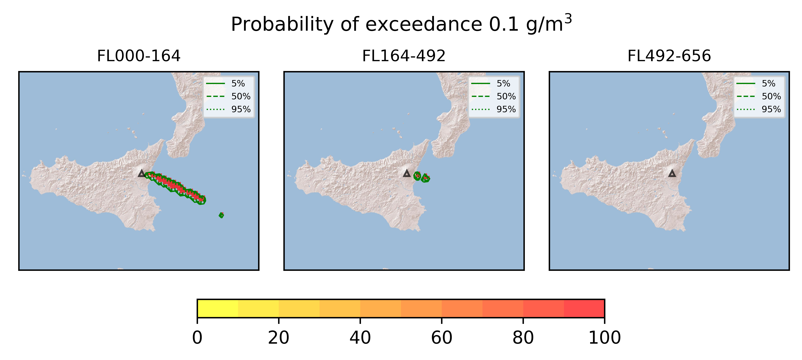
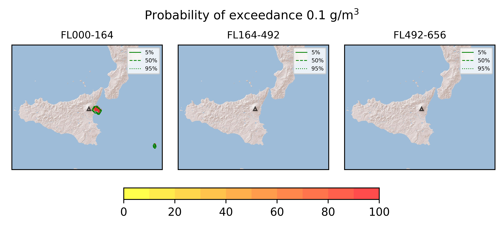
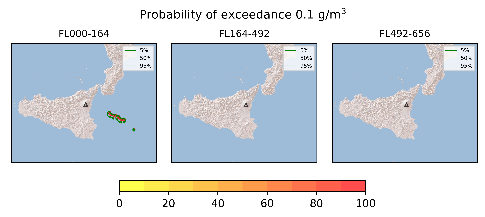
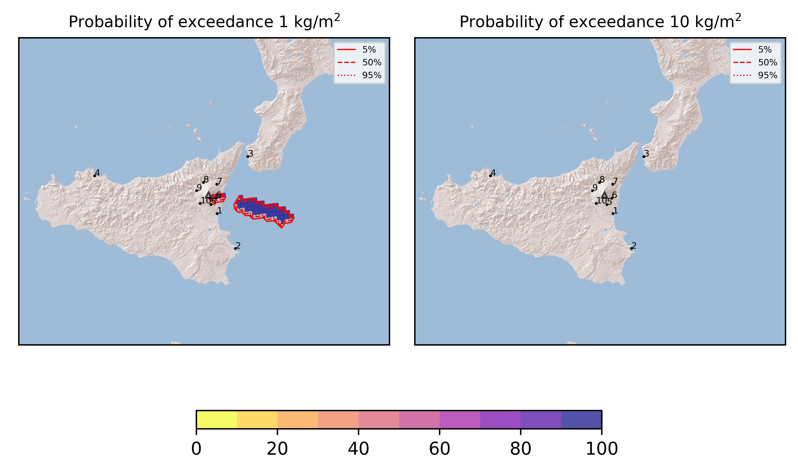

Forecast from VONA bulletin - 20210825_1430Z
============================================

Contents
========

* [Forecast products](#forecast-products)
	* [Forecast at 2021-08-25 17:30 Z - Ongoing Eruption](#forecast-at-2021-08-25-1730-z---ongoing-eruption)
	* [Forecast at 2021-08-25 20:30 Z - Ongoing Eruption](#forecast-at-2021-08-25-2030-z---ongoing-eruption)
	* [Forecast at 2021-08-25 17:30 Z - Terminated Erupion from Orange VONA](#forecast-at-2021-08-25-1730-z---terminated-erupion-from-orange-vona)
	* [Forecast at 2021-08-25 20:30 Z - Terminated Erupion from Orange VONA](#forecast-at-2021-08-25-2030-z---terminated-erupion-from-orange-vona)
	* [Forecast at 2021-08-25 17:30 Z - Terminated Erupion from Orange VONA](#forecast-at-2021-08-25-1730-z---terminated-erupion-from-orange-vona)
	* [Forecast at 2021-08-25 20:30 Z - Terminated Erupion from Orange VONA](#forecast-at-2021-08-25-2030-z---terminated-erupion-from-orange-vona)
	* [Forecast at 2021-08-25 17:30 Z - Terminated Erupion from Orange VONA](#forecast-at-2021-08-25-1730-z---terminated-erupion-from-orange-vona)

# Forecast products

## Forecast at 2021-08-25 17:30 Z - Ongoing Eruption
  

|Eruption start [Z]|Eruption end [Z]|Forecast time [Z]|Column height asl [m]|
| :--- | :--- | :--- | :--- |
|2021-08-25 14:30:00|Ongoing|2021-08-25 17:30:00|[6000 m, 12000 m]|
  
  

|Percentile|MER [kg/s¹]|Mass in the air [kg]|Mass on the ground [kg]|
| :--- | :--- | :--- | :--- |
|5th|7.59e+05|3.20e+09|4.88e+09|
|50th|7.59e+05|3.20e+09|4.88e+09|
|95th|8.08e+05|3.20e+09|4.88e+09|
  

### Ground 2021-08-25 17:30 Z
  
  
  
  
  
  
  
  
  
  

|Location|Ground load [kg/m²] 5th perc|Ground load [kg/m²] 50th perc|Ground load [kg/m²] 95th perc|
| :--- | :--- | :--- | :--- |
|Catania AP (1)|5.94e-05|5.94e-05|5.94e-05|
|Siracusa (2)|0.00e+00|0.00e+00|0.00e+00|
|Reggio Calabria AP (3)|0.00e+00|0.00e+00|0.00e+00|
|Palermo AP (4)|0.00e+00|0.00e+00|0.00e+00|
|Nicolosi (5)|1.57e-03|1.57e-03|1.57e-03|
|Zafferana (6)|5.10e+00|5.10e+00|5.10e+00|
|Linguaglossa (7)|1.12e-04|1.12e-04|1.12e-04|
|Randazzo (8)|0.00e+00|0.00e+00|0.00e+00|
|Bronte (9)|0.00e+00|0.00e+00|0.00e+00|
|Biancavilla (10)|0.00e+00|0.00e+00|0.00e+00|
  

### Atmosphere 2021-08-25 17:30 Z
  

## Forecast at 2021-08-25 20:30 Z - Ongoing Eruption
  

|Eruption start [Z]|Eruption end [Z]|Forecast time [Z]|Column height asl [m]|
| :--- | :--- | :--- | :--- |
|2021-08-25 14:30:00|Ongoing|2021-08-25 20:30:00|[6000 m, 12000 m]|
  
  

|Percentile|MER [kg/s¹]|Mass in the air [kg]|Mass on the ground [kg]|
| :--- | :--- | :--- | :--- |
|5th|9.56e+05|9.74e+08|1.81e+10|
|50th|9.56e+05|9.74e+08|1.81e+10|
|95th|1.25e+06|9.74e+08|1.81e+10|
  

### Ground 2021-08-25 20:30 Z
  
  
  
  
  
  
  
  
  
  

|Location|Ground load [kg/m²] 5th perc|Ground load [kg/m²] 50th perc|Ground load [kg/m²] 95th perc|
| :--- | :--- | :--- | :--- |
|Catania AP (1)|6.53e-05|6.53e-05|6.53e-05|
|Siracusa (2)|0.00e+00|0.00e+00|0.00e+00|
|Reggio Calabria AP (3)|0.00e+00|0.00e+00|0.00e+00|
|Palermo AP (4)|0.00e+00|0.00e+00|0.00e+00|
|Nicolosi (5)|1.72e-03|1.72e-03|1.72e-03|
|Zafferana (6)|5.10e+01|5.10e+01|5.10e+01|
|Linguaglossa (7)|3.84e-04|3.84e-04|3.84e-04|
|Randazzo (8)|0.00e+00|0.00e+00|0.00e+00|
|Bronte (9)|0.00e+00|0.00e+00|0.00e+00|
|Biancavilla (10)|0.00e+00|0.00e+00|0.00e+00|
  

### Atmosphere 2021-08-25 20:30 Z
  

## Forecast at 2021-08-25 17:30 Z - Terminated Erupion from Orange VONA
  

|Eruption start [Z]|Eruption end [Z]|Forecast time [Z]|Column height asl [m]|
| :--- | :--- | :--- | :--- |
|2021-08-25 14:30:00|2021-08-25 16:30:00|2021-08-25 17:30:00|[6000 m, 12000 m]|
  
  

|Percentile|MER [kg/s¹]|Mass in the air [kg]|Mass on the ground [kg]|
| :--- | :--- | :--- | :--- |
|5th|7.59e+05|1.25e+09|4.19e+09|
|50th|7.59e+05|1.25e+09|4.19e+09|
|95th|8.11e+05|1.25e+09|4.19e+09|
  

### Ground 2021-08-25 17:30 Z
  
  
  
  
  
  
  
  
  
  

|Location|Ground load [kg/m²] 5th perc|Ground load [kg/m²] 50th perc|Ground load [kg/m²] 95th perc|
| :--- | :--- | :--- | :--- |
|Catania AP (1)|5.74e-05|5.74e-05|5.74e-05|
|Siracusa (2)|0.00e+00|0.00e+00|0.00e+00|
|Reggio Calabria AP (3)|0.00e+00|0.00e+00|0.00e+00|
|Palermo AP (4)|0.00e+00|0.00e+00|0.00e+00|
|Nicolosi (5)|1.52e-03|1.52e-03|1.52e-03|
|Zafferana (6)|3.40e+00|3.40e+00|3.40e+00|
|Linguaglossa (7)|1.12e-04|1.12e-04|1.12e-04|
|Randazzo (8)|0.00e+00|0.00e+00|0.00e+00|
|Bronte (9)|0.00e+00|0.00e+00|0.00e+00|
|Biancavilla (10)|0.00e+00|0.00e+00|0.00e+00|
  

### Atmosphere 2021-08-25 17:30 Z
  
  

## Forecast at 2021-08-25 20:30 Z - Terminated Erupion from Orange VONA
  

|Eruption start [Z]|Eruption end [Z]|Forecast time [Z]|Column height asl [m]|
| :--- | :--- | :--- | :--- |
|2021-08-25 14:30:00|2021-08-25 16:30:00|2021-08-25 20:30:00|None|
  
  

|Percentile|MER [kg/s¹]|Mass in the air [kg]|Mass on the ground [kg]|
| :--- | :--- | :--- | :--- |
|5th|7.59e+05|1.25e+09|4.19e+09|
|50th|7.59e+05|1.25e+09|4.19e+09|
|95th|8.11e+05|1.25e+09|4.19e+09|
  

### Ground 2021-08-25 20:30 Z
  
  
  
  
  
  
  
  
  
  

|Location|Ground load [kg/m²] 5th perc|Ground load [kg/m²] 50th perc|Ground load [kg/m²] 95th perc|
| :--- | :--- | :--- | :--- |
|Catania AP (1)|5.74e-05|5.74e-05|5.74e-05|
|Siracusa (2)|0.00e+00|0.00e+00|0.00e+00|
|Reggio Calabria AP (3)|0.00e+00|0.00e+00|0.00e+00|
|Palermo AP (4)|0.00e+00|0.00e+00|0.00e+00|
|Nicolosi (5)|1.52e-03|1.52e-03|1.52e-03|
|Zafferana (6)|3.40e+00|3.40e+00|3.40e+00|
|Linguaglossa (7)|1.12e-04|1.12e-04|1.12e-04|
|Randazzo (8)|0.00e+00|0.00e+00|0.00e+00|
|Bronte (9)|0.00e+00|0.00e+00|0.00e+00|
|Biancavilla (10)|0.00e+00|0.00e+00|0.00e+00|
  

### Atmosphere 2021-08-25 20:30 Z
  

## Forecast at 2021-08-25 17:30 Z - Terminated Erupion from Orange VONA
  

|Eruption start [Z]|Eruption end [Z]|Forecast time [Z]|Column height asl [m]|
| :--- | :--- | :--- | :--- |
|2021-08-25 14:30:00|2021-08-25 16:30:00|2021-08-25 17:30:00|[6000 m, 12000 m]|
  
  

|Percentile|MER [kg/s¹]|Mass in the air [kg]|Mass on the ground [kg]|
| :--- | :--- | :--- | :--- |
|5th|7.59e+05|1.25e+09|4.19e+09|
|50th|7.59e+05|1.25e+09|4.19e+09|
|95th|8.11e+05|1.25e+09|4.19e+09|
  

### Ground 2021-08-25 17:30 Z
  
  
  
  
  
  
  
  
  
  

|Location|Ground load [kg/m²] 5th perc|Ground load [kg/m²] 50th perc|Ground load [kg/m²] 95th perc|
| :--- | :--- | :--- | :--- |
|Catania AP (1)|5.74e-05|5.74e-05|5.74e-05|
|Siracusa (2)|0.00e+00|0.00e+00|0.00e+00|
|Reggio Calabria AP (3)|0.00e+00|0.00e+00|0.00e+00|
|Palermo AP (4)|0.00e+00|0.00e+00|0.00e+00|
|Nicolosi (5)|1.52e-03|1.52e-03|1.52e-03|
|Zafferana (6)|3.40e+00|3.40e+00|3.40e+00|
|Linguaglossa (7)|1.12e-04|1.12e-04|1.12e-04|
|Randazzo (8)|0.00e+00|0.00e+00|0.00e+00|
|Bronte (9)|0.00e+00|0.00e+00|0.00e+00|
|Biancavilla (10)|0.00e+00|0.00e+00|0.00e+00|
  

### Atmosphere 2021-08-25 17:30 Z
  
  

## Forecast at 2021-08-25 20:30 Z - Terminated Erupion from Orange VONA
  

|Eruption start [Z]|Eruption end [Z]|Forecast time [Z]|Column height asl [m]|
| :--- | :--- | :--- | :--- |
|2021-08-25 14:30:00|2021-08-25 16:30:00|2021-08-25 20:30:00|None|
  
  

|Percentile|MER [kg/s¹]|Mass in the air [kg]|Mass on the ground [kg]|
| :--- | :--- | :--- | :--- |
|5th|0.00e+00|6.51e+07|5.17e+09|
|50th|0.00e+00|6.51e+07|5.17e+09|
|95th|0.00e+00|6.51e+07|5.17e+09|
  

### Ground 2021-08-25 20:30 Z
  
  
  
  
  
  
  
  
  
  

|Location|Ground load [kg/m²] 5th perc|Ground load [kg/m²] 50th perc|Ground load [kg/m²] 95th perc|
| :--- | :--- | :--- | :--- |
|Catania AP (1)|6.34e-05|6.34e-05|6.34e-05|
|Siracusa (2)|0.00e+00|0.00e+00|0.00e+00|
|Reggio Calabria AP (3)|0.00e+00|0.00e+00|0.00e+00|
|Palermo AP (4)|0.00e+00|0.00e+00|0.00e+00|
|Nicolosi (5)|1.63e-03|1.63e-03|1.63e-03|
|Zafferana (6)|3.40e+00|3.40e+00|3.40e+00|
|Linguaglossa (7)|1.49e-04|1.49e-04|1.49e-04|
|Randazzo (8)|0.00e+00|0.00e+00|0.00e+00|
|Bronte (9)|0.00e+00|0.00e+00|0.00e+00|
|Biancavilla (10)|0.00e+00|0.00e+00|0.00e+00|
  

### Atmosphere 2021-08-25 20:30 Z
  
  

## Forecast at 2021-08-25 17:30 Z - Terminated Erupion from Orange VONA
  

|Eruption start [Z]|Eruption end [Z]|Forecast time [Z]|Column height asl [m]|
| :--- | :--- | :--- | :--- |
|2021-08-25 14:30:00|2021-08-25 16:30:00|2021-08-25 17:30:00|[6000 m, 12000 m]|
  
  

|Percentile|MER [kg/s¹]|Mass in the air [kg]|Mass on the ground [kg]|
| :--- | :--- | :--- | :--- |
|5th|7.59e+05|1.25e+09|4.19e+09|
|50th|7.59e+05|1.25e+09|4.19e+09|
|95th|8.11e+05|1.25e+09|4.19e+09|
  

### Ground 2021-08-25 17:30 Z
  
  
  
  
  
  
  
  
  
  
  

|Location|Ground load [kg/m²] 5th perc|Ground load [kg/m²] 50th perc|Ground load [kg/m²] 95th perc|
| :--- | :--- | :--- | :--- |
|Catania AP (1)|5.74e-05|5.74e-05|5.74e-05|
|Siracusa (2)|0.00e+00|0.00e+00|0.00e+00|
|Reggio Calabria AP (3)|0.00e+00|0.00e+00|0.00e+00|
|Palermo AP (4)|0.00e+00|0.00e+00|0.00e+00|
|Nicolosi (5)|1.52e-03|1.52e-03|1.52e-03|
|Zafferana (6)|3.40e+00|3.40e+00|3.40e+00|
|Linguaglossa (7)|1.12e-04|1.12e-04|1.12e-04|
|Randazzo (8)|0.00e+00|0.00e+00|0.00e+00|
|Bronte (9)|0.00e+00|0.00e+00|0.00e+00|
|Biancavilla (10)|0.00e+00|0.00e+00|0.00e+00|
  

### Atmosphere 2021-08-25 17:30 Z
  
  
  
Go to [Supplementary page](Supplementary_page.md)  
Go to [Main directory](https://github.com/federicapardini/Real_time_ash_forecast)