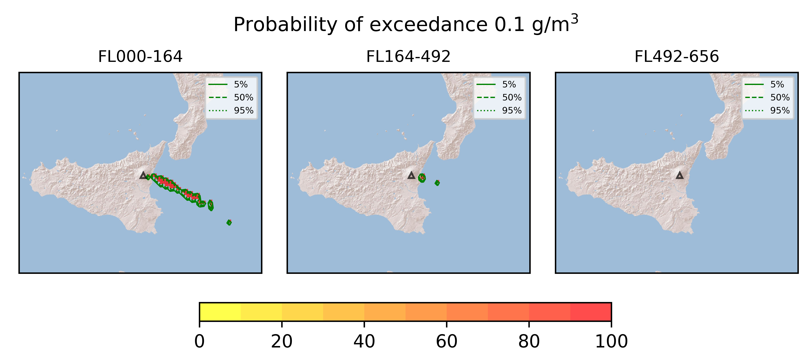
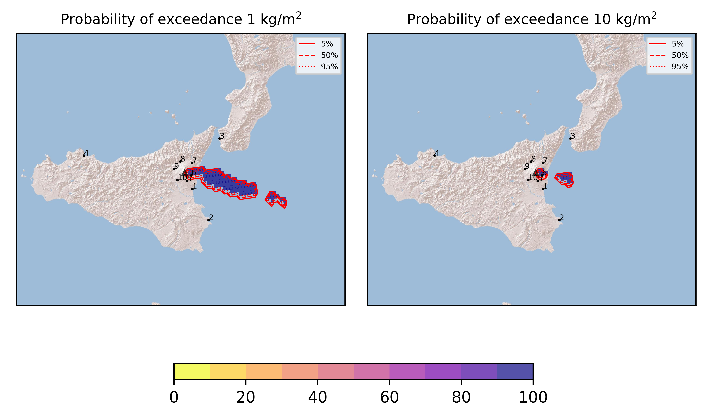
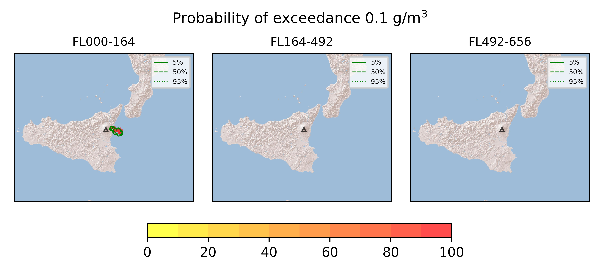
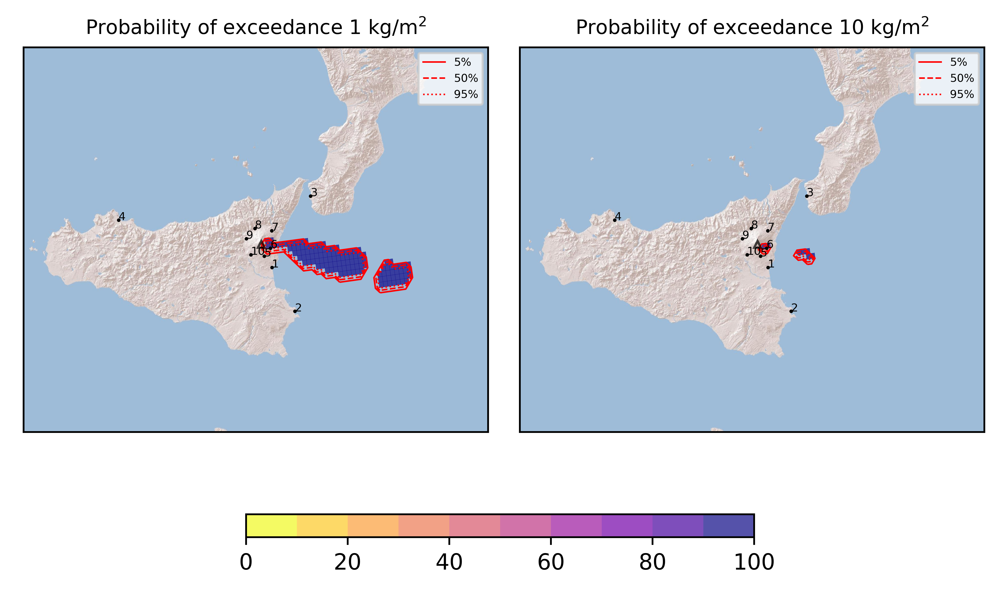

Forecast from VONA bulletin - 20210825_1530Z
============================================

Contents
========

* [Forecast products](#forecast-products)
	* [Forecast at 2021-08-25 18:30 Z - Ongoing Eruption](#forecast-at-2021-08-25-1830-z---ongoing-eruption)
	* [Forecast at 2021-08-25 21:30 Z - Ongoing Eruption](#forecast-at-2021-08-25-2130-z---ongoing-eruption)
	* [Forecast at 2021-08-26 00:30 Z - Terminated Erupion from Orange VONA](#forecast-at-2021-08-26-0030-z---terminated-erupion-from-orange-vona)
	* [Forecast at 2021-08-26 00:30 Z - Terminated Erupion from Orange VONA](#forecast-at-2021-08-26-0030-z---terminated-erupion-from-orange-vona)

# Forecast products

## Forecast at 2021-08-25 18:30 Z - Ongoing Eruption
  

|Eruption start [Z]|Eruption end [Z]|Forecast time [Z]|Column height asl [m]|
| :--- | :--- | :--- | :--- |
|2021-08-25 15:30:00|Ongoing|2021-08-25 18:30:00|[6000 m, 12000 m]|
  
  

|Percentile|MER [kg/s¹]|Mass in the air [kg]|Mass on the ground [kg]|
| :--- | :--- | :--- | :--- |
|5th|7.08e+05|2.87e+09|5.01e+09|
|50th|7.59e+05|2.87e+09|5.01e+09|
|95th|7.59e+05|2.87e+09|5.01e+09|
  

### Ground 2021-08-25 18:30 Z
  
  
  
  
  
  
  
  
  
  
  

|Location|Ground load [kg/m²] 5th perc|Ground load [kg/m²] 50th perc|Ground load [kg/m²] 95th perc|
| :--- | :--- | :--- | :--- |
|Catania AP (1)|1.99e-06|1.99e-06|1.99e-06|
|Siracusa (2)|0.00e+00|0.00e+00|0.00e+00|
|Reggio Calabria AP (3)|0.00e+00|0.00e+00|0.00e+00|
|Palermo AP (4)|0.00e+00|0.00e+00|0.00e+00|
|Nicolosi (5)|5.02e-04|5.02e-04|5.02e-04|
|Zafferana (6)|5.40e+00|5.40e+00|5.40e+00|
|Linguaglossa (7)|5.21e-05|5.21e-05|5.21e-05|
|Randazzo (8)|0.00e+00|0.00e+00|0.00e+00|
|Bronte (9)|0.00e+00|0.00e+00|0.00e+00|
|Biancavilla (10)|0.00e+00|0.00e+00|0.00e+00|
  

### Atmosphere 2021-08-25 18:30 Z
  

## Forecast at 2021-08-25 21:30 Z - Ongoing Eruption
  

|Eruption start [Z]|Eruption end [Z]|Forecast time [Z]|Column height asl [m]|
| :--- | :--- | :--- | :--- |
|2021-08-25 15:30:00|Ongoing|2021-08-25 21:30:00|[6000 m, 12000 m]|
  
  

|Percentile|MER [kg/s¹]|Mass in the air [kg]|Mass on the ground [kg]|
| :--- | :--- | :--- | :--- |
|5th|9.27e+05|9.98e+08|1.66e+10|
|50th|9.56e+05|9.98e+08|1.66e+10|
|95th|9.56e+05|9.98e+08|1.66e+10|
  

### Ground 2021-08-25 21:30 Z
  
  
  
  
  
  
  
  
  
  
  

|Location|Ground load [kg/m²] 5th perc|Ground load [kg/m²] 50th perc|Ground load [kg/m²] 95th perc|
| :--- | :--- | :--- | :--- |
|Catania AP (1)|1.99e-06|1.99e-06|1.99e-06|
|Siracusa (2)|0.00e+00|0.00e+00|0.00e+00|
|Reggio Calabria AP (3)|0.00e+00|0.00e+00|0.00e+00|
|Palermo AP (4)|0.00e+00|0.00e+00|0.00e+00|
|Nicolosi (5)|5.24e-04|5.24e-04|5.24e-04|
|Zafferana (6)|4.25e+01|4.25e+01|4.25e+01|
|Linguaglossa (7)|6.70e-05|6.70e-05|6.70e-05|
|Randazzo (8)|0.00e+00|0.00e+00|0.00e+00|
|Bronte (9)|0.00e+00|0.00e+00|0.00e+00|
|Biancavilla (10)|0.00e+00|0.00e+00|0.00e+00|
  

### Atmosphere 2021-08-25 21:30 Z
  

## Forecast at 2021-08-26 00:30 Z - Terminated Erupion from Orange VONA
  

|Eruption start [Z]|Eruption end [Z]|Forecast time [Z]|Column height asl [m]|
| :--- | :--- | :--- | :--- |
|2021-08-25 15:30:00|2021-08-25 20:10:00|2021-08-26 00:30:00|None|
  
  

|Percentile|MER [kg/s¹]|Mass in the air [kg]|Mass on the ground [kg]|
| :--- | :--- | :--- | :--- |
|5th|0.00e+00|2.55e+08|1.37e+10|
|50th|0.00e+00|2.55e+08|1.37e+10|
|95th|0.00e+00|2.55e+08|1.37e+10|
  

### Ground 2021-08-26 00:30 Z
  
  
  
  
  
  
  
  
  
  
  

|Location|Ground load [kg/m²] 5th perc|Ground load [kg/m²] 50th perc|Ground load [kg/m²] 95th perc|
| :--- | :--- | :--- | :--- |
|Catania AP (1)|1.99e-06|1.99e-06|1.99e-06|
|Siracusa (2)|0.00e+00|0.00e+00|0.00e+00|
|Reggio Calabria AP (3)|0.00e+00|0.00e+00|0.00e+00|
|Palermo AP (4)|0.00e+00|0.00e+00|0.00e+00|
|Nicolosi (5)|5.55e-04|5.55e-04|5.55e-04|
|Zafferana (6)|1.08e+01|1.08e+01|1.08e+01|
|Linguaglossa (7)|9.68e-05|9.68e-05|9.68e-05|
|Randazzo (8)|0.00e+00|0.00e+00|0.00e+00|
|Bronte (9)|0.00e+00|0.00e+00|0.00e+00|
|Biancavilla (10)|0.00e+00|0.00e+00|0.00e+00|
  

### Atmosphere 2021-08-26 00:30 Z
  

## Forecast at 2021-08-26 00:30 Z - Terminated Erupion from Orange VONA
  

|Eruption start [Z]|Eruption end [Z]|Forecast time [Z]|Column height asl [m]|
| :--- | :--- | :--- | :--- |
|2021-08-25 15:30:00|2021-08-25 20:10:00|2021-08-26 00:30:00|None|
  
  

|Percentile|MER [kg/s¹]|Mass in the air [kg]|Mass on the ground [kg]|
| :--- | :--- | :--- | :--- |
|5th|0.00e+00|2.55e+08|1.37e+10|
|50th|0.00e+00|2.55e+08|1.37e+10|
|95th|0.00e+00|2.55e+08|1.37e+10|
  

### Ground 2021-08-26 00:30 Z
  
  
  
  
  
  
  
  
  
  
  

|Location|Ground load [kg/m²] 5th perc|Ground load [kg/m²] 50th perc|Ground load [kg/m²] 95th perc|
| :--- | :--- | :--- | :--- |
|Catania AP (1)|1.99e-06|1.99e-06|1.99e-06|
|Siracusa (2)|0.00e+00|0.00e+00|0.00e+00|
|Reggio Calabria AP (3)|0.00e+00|0.00e+00|0.00e+00|
|Palermo AP (4)|0.00e+00|0.00e+00|0.00e+00|
|Nicolosi (5)|5.55e-04|5.55e-04|5.55e-04|
|Zafferana (6)|1.08e+01|1.08e+01|1.08e+01|
|Linguaglossa (7)|9.68e-05|9.68e-05|9.68e-05|
|Randazzo (8)|0.00e+00|0.00e+00|0.00e+00|
|Bronte (9)|0.00e+00|0.00e+00|0.00e+00|
|Biancavilla (10)|0.00e+00|0.00e+00|0.00e+00|
  

### Atmosphere 2021-08-26 00:30 Z
  
  
Go to [Supplementary page](Supplementary_page.md)  
Go to [Main directory](https://github.com/federicapardini/Real_time_ash_forecast)