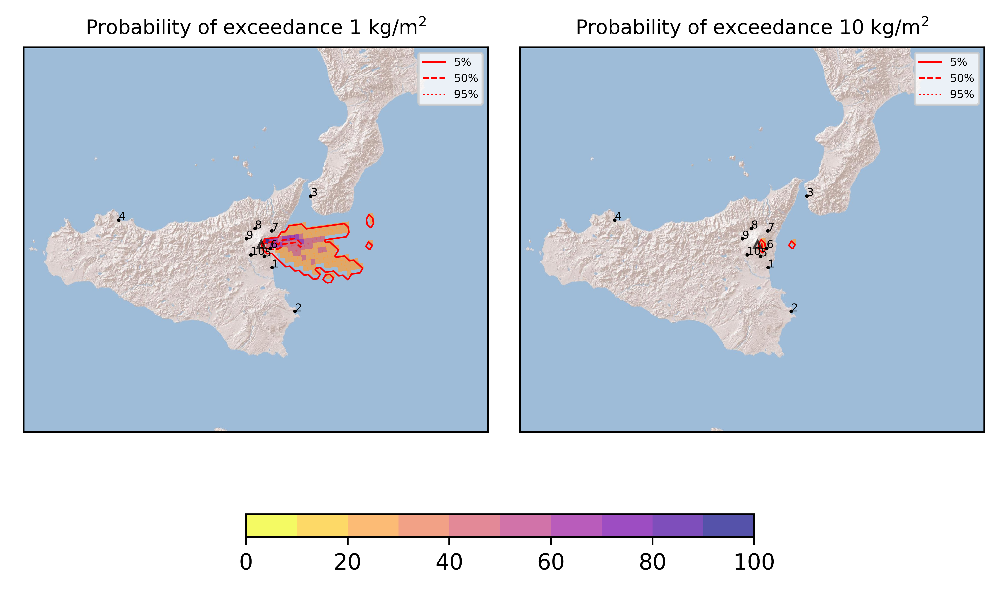
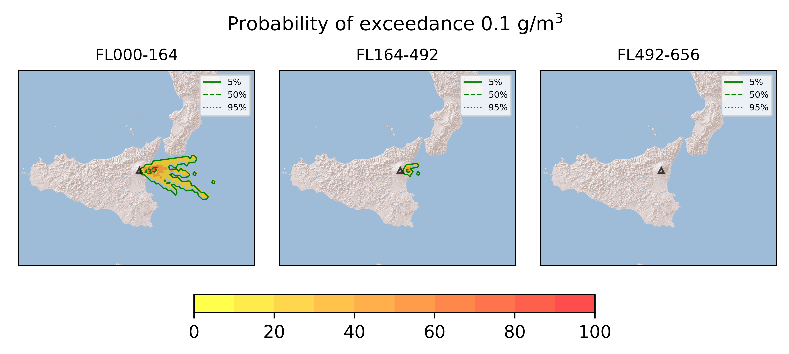
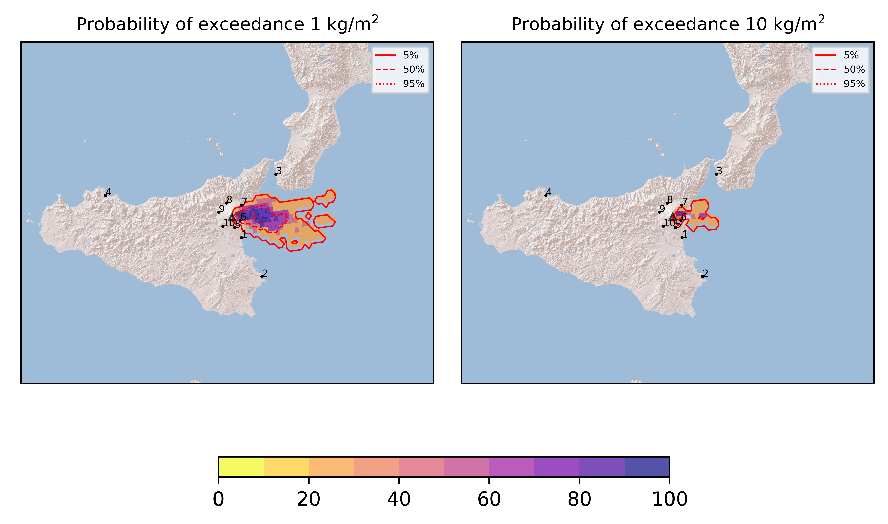
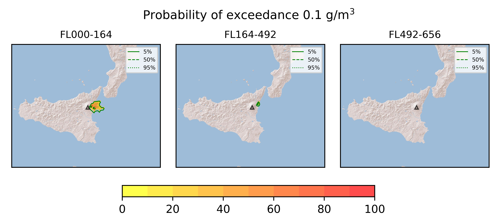
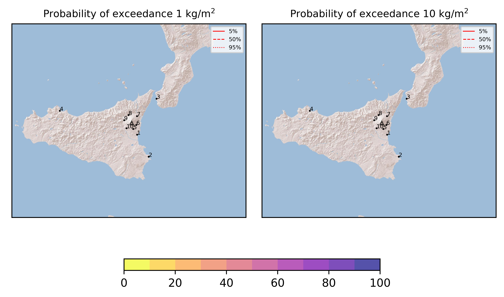

Forecast from VONA bulletin - 20210825_1730Z
============================================

Contents
========

* [Forecast products](#forecast-products)
	* [Forecast at 2021-08-25 20:30 Z - Ongoing Eruption scenario](#forecast-at-2021-08-25-2030-z---ongoing-eruption-scenario)
	* [Forecast at 2021-08-25 23:30 Z - Ongoing Eruption scenario](#forecast-at-2021-08-25-2330-z---ongoing-eruption-scenario)
	* [Forecast at 2021-08-25 20:30 Z - Terminated Erupion from Orange VONA](#forecast-at-2021-08-25-2030-z---terminated-erupion-from-orange-vona)
	* [Forecast at 2021-08-25 20:30 Z - Terminated Erupion from Orange VONA](#forecast-at-2021-08-25-2030-z---terminated-erupion-from-orange-vona)

# Forecast products

## Forecast at 2021-08-25 20:30 Z - Ongoing Eruption scenario
  

|Eruption start [Z]|Eruption end [Z]|Forecast time [Z]|Column height asl [m]|
| :--- | :--- | :--- | :--- |
|2021-08-25 17:30:00|Ongoing|2021-08-25 20:30:00|[6000 m, 12000 m]|
  
  

|Percentile|MER [kg/s¹]|Mass in the air [kg]|Mass on the ground [kg]|
| :--- | :--- | :--- | :--- |
|5th|2.77e+05|1.29e+09|2.00e+09|
|50th|5.35e+05|2.22e+09|3.53e+09|
|95th|7.02e+05|2.94e+09|4.34e+09|
  

### Ground 2021-08-25 20:30 Z
  
  
  
  
  
  
  
  
  
  
  

|Location|Ground load [kg/m²] 5th perc|Ground load [kg/m²] 50th perc|Ground load [kg/m²] 95th perc|
| :--- | :--- | :--- | :--- |
|Catania AP (1)|0.00e+00|0.00e+00|4.65e-04|
|Siracusa (2)|0.00e+00|0.00e+00|0.00e+00|
|Reggio Calabria AP (3)|0.00e+00|0.00e+00|0.00e+00|
|Palermo AP (4)|0.00e+00|0.00e+00|0.00e+00|
|Nicolosi (5)|0.00e+00|4.73e-05|3.84e-04|
|Zafferana (6)|5.30e-01|2.10e+00|5.90e+00|
|Linguaglossa (7)|0.00e+00|1.27e-04|1.77e-03|
|Randazzo (8)|0.00e+00|0.00e+00|0.00e+00|
|Bronte (9)|0.00e+00|0.00e+00|0.00e+00|
|Biancavilla (10)|0.00e+00|0.00e+00|0.00e+00|
  

### Atmosphere 2021-08-25 20:30 Z
  

## Forecast at 2021-08-25 23:30 Z - Ongoing Eruption scenario
  

|Eruption start [Z]|Eruption end [Z]|Forecast time [Z]|Column height asl [m]|
| :--- | :--- | :--- | :--- |
|2021-08-25 17:30:00|Ongoing|2021-08-25 23:30:00|[6000 m, 12000 m]|
  
  

|Percentile|MER [kg/s¹]|Mass in the air [kg]|Mass on the ground [kg]|
| :--- | :--- | :--- | :--- |
|5th|3.49e+05|5.10e+08|8.02e+09|
|50th|6.86e+05|7.85e+08|1.05e+10|
|95th|9.24e+05|9.45e+08|1.50e+10|
  

### Ground 2021-08-25 23:30 Z
  
  
  
  
  
  
  
  
  
  
  

|Location|Ground load [kg/m²] 5th perc|Ground load [kg/m²] 50th perc|Ground load [kg/m²] 95th perc|
| :--- | :--- | :--- | :--- |
|Catania AP (1)|0.00e+00|1.99e-06|8.41e-04|
|Siracusa (2)|0.00e+00|0.00e+00|0.00e+00|
|Reggio Calabria AP (3)|0.00e+00|0.00e+00|2.49e-06|
|Palermo AP (4)|0.00e+00|0.00e+00|0.00e+00|
|Nicolosi (5)|1.55e-05|8.27e-05|1.60e-03|
|Zafferana (6)|3.11e+00|8.84e+00|1.16e+01|
|Linguaglossa (7)|4.81e-04|3.07e-03|8.70e-02|
|Randazzo (8)|0.00e+00|0.00e+00|0.00e+00|
|Bronte (9)|0.00e+00|0.00e+00|0.00e+00|
|Biancavilla (10)|0.00e+00|0.00e+00|0.00e+00|
  

### Atmosphere 2021-08-25 23:30 Z
  

## Forecast at 2021-08-25 20:30 Z - Terminated Erupion from Orange VONA
  

|Eruption start [Z]|Eruption end [Z]|Forecast time [Z]|Column height asl [m]|
| :--- | :--- | :--- | :--- |
|2021-08-25 17:30:00|2021-08-25 19:20:00|2021-08-25 20:30:00|[6000 m, 12000 m]|
  
  

|Percentile|MER [kg/s¹]|Mass in the air [kg]|Mass on the ground [kg]|
| :--- | :--- | :--- | :--- |
|5th|0.00e+00|0.00e+00|0.00e+00|
|50th|0.00e+00|0.00e+00|0.00e+00|
|95th|0.00e+00|0.00e+00|0.00e+00|
  

### Ground 2021-08-25 20:30 Z
  
  
  
  
  
  
  
  
  
  
  

|Location|Ground load [kg/m²] 5th perc|Ground load [kg/m²] 50th perc|Ground load [kg/m²] 95th perc|
| :--- | :--- | :--- | :--- |
|Catania AP (1)|0.00e+00|0.00e+00|0.00e+00|
|Siracusa (2)|0.00e+00|0.00e+00|0.00e+00|
|Reggio Calabria AP (3)|0.00e+00|0.00e+00|0.00e+00|
|Palermo AP (4)|0.00e+00|0.00e+00|0.00e+00|
|Nicolosi (5)|0.00e+00|0.00e+00|0.00e+00|
|Zafferana (6)|0.00e+00|0.00e+00|0.00e+00|
|Linguaglossa (7)|0.00e+00|0.00e+00|0.00e+00|
|Randazzo (8)|0.00e+00|0.00e+00|0.00e+00|
|Bronte (9)|0.00e+00|0.00e+00|0.00e+00|
|Biancavilla (10)|0.00e+00|0.00e+00|0.00e+00|
  

### Atmosphere 2021-08-25 20:30 Z
  

## Forecast at 2021-08-25 20:30 Z - Terminated Erupion from Orange VONA
  

|Eruption start [Z]|Eruption end [Z]|Forecast time [Z]|Column height asl [m]|
| :--- | :--- | :--- | :--- |
|2021-08-25 17:30:00|2021-08-25 19:20:00|2021-08-25 20:30:00|[6000 m, 12000 m]|
  
  

|Percentile|MER [kg/s¹]|Mass in the air [kg]|Mass on the ground [kg]|
| :--- | :--- | :--- | :--- |
|5th|0.00e+00|0.00e+00|0.00e+00|
|50th|0.00e+00|0.00e+00|0.00e+00|
|95th|0.00e+00|0.00e+00|0.00e+00|
  

### Ground 2021-08-25 20:30 Z
  
  
  
  
  
  
  
  
  
  
  
  

|Location|Ground load [kg/m²] 5th perc|Ground load [kg/m²] 50th perc|Ground load [kg/m²] 95th perc|
| :--- | :--- | :--- | :--- |
|Catania AP (1)|0.00e+00|0.00e+00|0.00e+00|
|Siracusa (2)|0.00e+00|0.00e+00|0.00e+00|
|Reggio Calabria AP (3)|0.00e+00|0.00e+00|0.00e+00|
|Palermo AP (4)|0.00e+00|0.00e+00|0.00e+00|
|Nicolosi (5)|0.00e+00|0.00e+00|0.00e+00|
|Zafferana (6)|0.00e+00|0.00e+00|0.00e+00|
|Linguaglossa (7)|0.00e+00|0.00e+00|0.00e+00|
|Randazzo (8)|0.00e+00|0.00e+00|0.00e+00|
|Bronte (9)|0.00e+00|0.00e+00|0.00e+00|
|Biancavilla (10)|0.00e+00|0.00e+00|0.00e+00|
  

### Atmosphere 2021-08-25 20:30 Z
  
  
  
Go to [Supplementary page](Supplementary_page.md)  
Go to [Main directory](https://github.com/federicapardini/Real_time_ash_forecast)