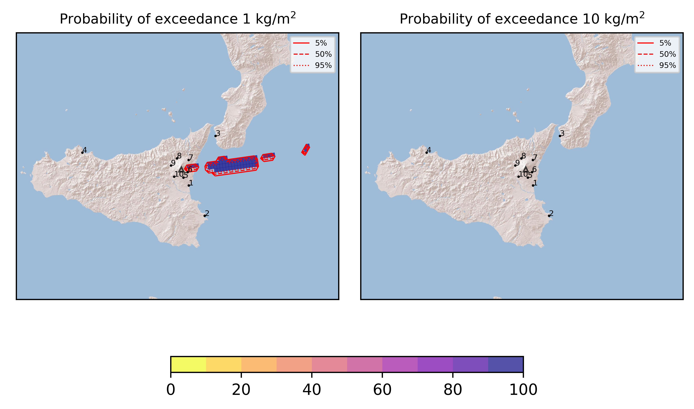
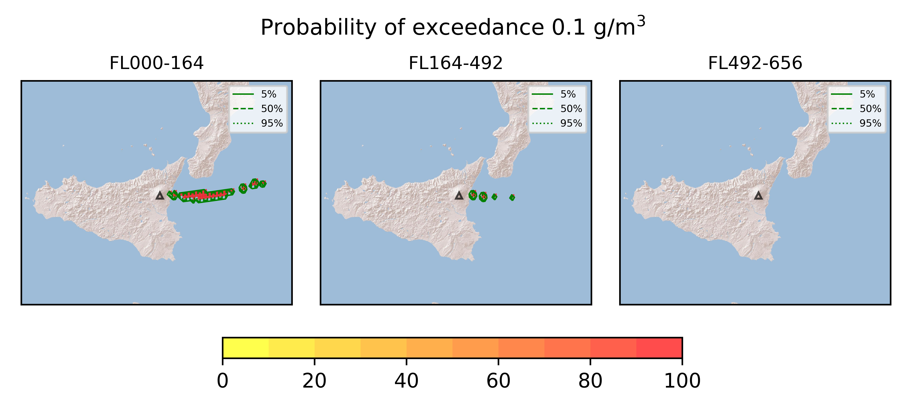
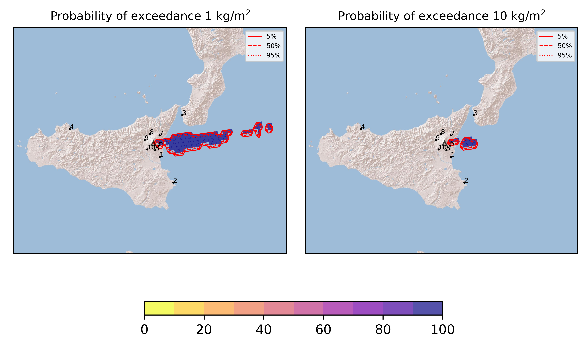
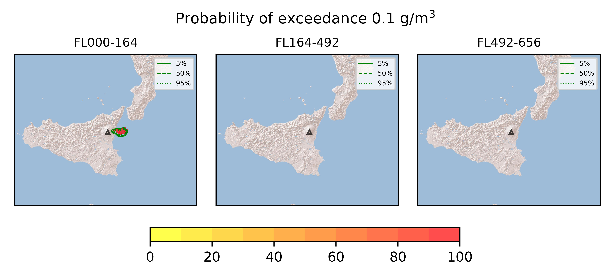

Forecast from VONA bulletin - 20210826_1430Z
============================================

Contents
========

* [Forecast products](#forecast-products)
	* [Forecast at 2021-08-26 17:30 Z - Ongoing Eruption](#forecast-at-2021-08-26-1730-z---ongoing-eruption)
	* [Forecast at 2021-08-26 20:30 Z - Ongoing Eruption](#forecast-at-2021-08-26-2030-z---ongoing-eruption)

# Forecast products

## Forecast at 2021-08-26 17:30 Z - Ongoing Eruption
  

|Eruption start [Z]|Eruption end [Z]|Forecast time [Z]|Column height asl [m]|
| :--- | :--- | :--- | :--- |
|2021-08-26 14:30:00|Ongoing|2021-08-26 17:30:00|[6000 m, 12000 m]|
  
  

|Percentile|MER [kg/s¹]|Mass in the air [kg]|Mass on the ground [kg]|
| :--- | :--- | :--- | :--- |
|5th|8.15e+05|3.40e+09|5.28e+09|
|50th|8.15e+05|3.40e+09|5.28e+09|
|95th|8.92e+05|3.40e+09|5.28e+09|
  

### Ground 2021-08-26 17:30 Z
  
  
  
  
  
  
  
  
  
  
  

|Location|Ground load [kg/m²] 5th perc|Ground load [kg/m²] 50th perc|Ground load [kg/m²] 95th perc|
| :--- | :--- | :--- | :--- |
|Catania AP (1)|0.00e+00|0.00e+00|0.00e+00|
|Siracusa (2)|0.00e+00|0.00e+00|0.00e+00|
|Reggio Calabria AP (3)|0.00e+00|0.00e+00|0.00e+00|
|Palermo AP (4)|0.00e+00|0.00e+00|0.00e+00|
|Nicolosi (5)|1.33e-06|1.33e-06|1.33e-06|
|Zafferana (6)|6.81e-01|6.81e-01|6.81e-01|
|Linguaglossa (7)|5.98e-03|5.98e-03|5.98e-03|
|Randazzo (8)|0.00e+00|0.00e+00|0.00e+00|
|Bronte (9)|0.00e+00|0.00e+00|0.00e+00|
|Biancavilla (10)|0.00e+00|0.00e+00|0.00e+00|
  

### Atmosphere 2021-08-26 17:30 Z
  

## Forecast at 2021-08-26 20:30 Z - Ongoing Eruption
  

|Eruption start [Z]|Eruption end [Z]|Forecast time [Z]|Column height asl [m]|
| :--- | :--- | :--- | :--- |
|2021-08-26 14:30:00|Ongoing|2021-08-26 20:30:00|[6000 m, 12000 m]|
  
  

|Percentile|MER [kg/s¹]|Mass in the air [kg]|Mass on the ground [kg]|
| :--- | :--- | :--- | :--- |
|5th|1.34e+06|1.12e+09|2.14e+10|
|50th|1.41e+06|1.12e+09|2.14e+10|
|95th|1.41e+06|1.12e+09|2.14e+10|
  

### Ground 2021-08-26 20:30 Z
  
  
  
  
  
  
  
  
  
  
  

|Location|Ground load [kg/m²] 5th perc|Ground load [kg/m²] 50th perc|Ground load [kg/m²] 95th perc|
| :--- | :--- | :--- | :--- |
|Catania AP (1)|0.00e+00|0.00e+00|0.00e+00|
|Siracusa (2)|0.00e+00|0.00e+00|0.00e+00|
|Reggio Calabria AP (3)|0.00e+00|0.00e+00|0.00e+00|
|Palermo AP (4)|0.00e+00|0.00e+00|0.00e+00|
|Nicolosi (5)|1.33e-06|1.33e-06|1.33e-06|
|Zafferana (6)|1.00e+01|1.00e+01|1.00e+01|
|Linguaglossa (7)|6.34e-03|6.34e-03|6.34e-03|
|Randazzo (8)|0.00e+00|0.00e+00|0.00e+00|
|Bronte (9)|0.00e+00|0.00e+00|0.00e+00|
|Biancavilla (10)|0.00e+00|0.00e+00|0.00e+00|
  

### Atmosphere 2021-08-26 20:30 Z
  
  
Go to [Supplementary page](Supplementary_page.md)  
Go to [Main directory](https://github.com/federicapardini/Real_time_ash_forecast)