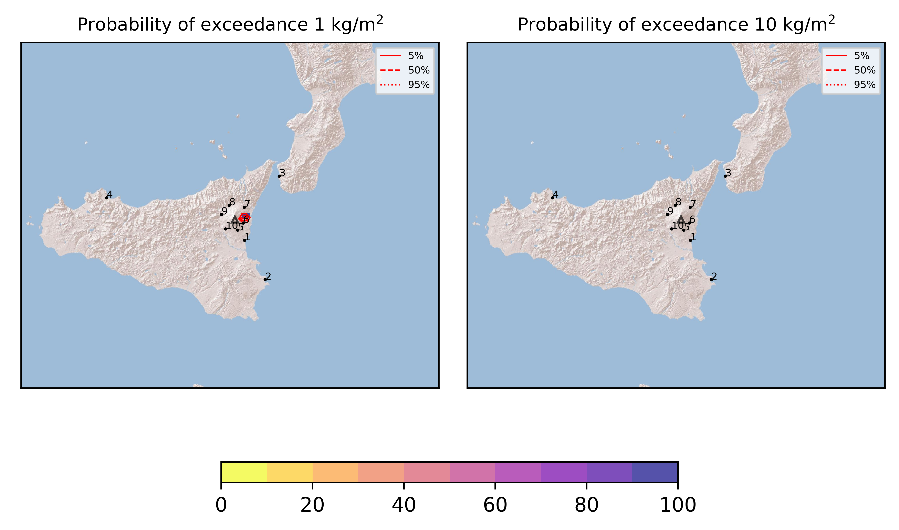

Forecast from VONA bulletin - 20210826_1615Z
============================================

Contents
========

* [Forecast products](#forecast-products)
	* [Forecast at 2021-08-26 19:20 Z - Ongoing Eruption](#forecast-at-2021-08-26-1920-z---ongoing-eruption)
	* [Forecast at 2021-08-26 20:20 Z - Ongoing Eruption](#forecast-at-2021-08-26-2020-z---ongoing-eruption)
	* [Forecast at 2021-08-26 23:20 Z - Ongoing Eruption](#forecast-at-2021-08-26-2320-z---ongoing-eruption)

# Forecast products

## Forecast at 2021-08-26 19:20 Z - Ongoing Eruption
  

|Eruption start [Z]|Eruption end [Z]|Forecast time [Z]|Column height asl [m]|
| :--- | :--- | :--- | :--- |
|2021-08-26 16:20:00|Ongoing|2021-08-26 19:20:00|8000 ± 500 - from VONA|
  
  

|Percentile|MER [kg/s¹]|Mass in the air [kg]|Mass on the ground [kg]|
| :--- | :--- | :--- | :--- |
|5th|5.89e+05|2.26e+09|3.99e+09|
|50th|6.02e+05|2.26e+09|3.99e+09|
|95th|6.15e+05|2.26e+09|3.99e+09|
  

### Ground 2021-08-26 19:20 Z
  
  
  
  
  
  
  
  
  
  
  

|Location|Ground load [kg/m²] 5th perc|Ground load [kg/m²] 50th perc|Ground load [kg/m²] 95th perc|
| :--- | :--- | :--- | :--- |
|Catania AP (1)|0.00e+00|0.00e+00|0.00e+00|
|Siracusa (2)|0.00e+00|0.00e+00|0.00e+00|
|Reggio Calabria AP (3)|0.00e+00|0.00e+00|0.00e+00|
|Palermo AP (4)|0.00e+00|0.00e+00|0.00e+00|
|Nicolosi (5)|0.00e+00|0.00e+00|0.00e+00|
|Zafferana (6)|7.39e-01|7.39e-01|7.39e-01|
|Linguaglossa (7)|3.42e-04|3.42e-04|3.42e-04|
|Randazzo (8)|0.00e+00|0.00e+00|0.00e+00|
|Bronte (9)|0.00e+00|0.00e+00|0.00e+00|
|Biancavilla (10)|0.00e+00|0.00e+00|0.00e+00|
  

### Atmosphere 2021-08-26 19:20 Z
  

## Forecast at 2021-08-26 20:20 Z - Ongoing Eruption
  

|Eruption start [Z]|Eruption end [Z]|Forecast time [Z]|Column height asl [m]|
| :--- | :--- | :--- | :--- |
|2021-08-26 16:20:00|Ongoing|2021-08-26 20:20:00|5000 ± 500 - from VONA|
  
  

|Percentile|MER [kg/s¹]|Mass in the air [kg]|Mass on the ground [kg]|
| :--- | :--- | :--- | :--- |
|5th|2.06e+04|6.18e+06|7.03e+08|
|50th|2.06e+04|6.18e+06|7.03e+08|
|95th|2.18e+04|6.18e+06|7.03e+08|
  

### Ground 2021-08-26 20:20 Z
  
  
  
  
  
  
  
  
  
  
  

|Location|Ground load [kg/m²] 5th perc|Ground load [kg/m²] 50th perc|Ground load [kg/m²] 95th perc|
| :--- | :--- | :--- | :--- |
|Catania AP (1)|0.00e+00|0.00e+00|0.00e+00|
|Siracusa (2)|0.00e+00|0.00e+00|0.00e+00|
|Reggio Calabria AP (3)|0.00e+00|0.00e+00|0.00e+00|
|Palermo AP (4)|0.00e+00|0.00e+00|0.00e+00|
|Nicolosi (5)|5.33e-06|5.33e-06|5.33e-06|
|Zafferana (6)|4.78e-01|4.78e-01|4.78e-01|
|Linguaglossa (7)|3.65e-04|3.65e-04|3.65e-04|
|Randazzo (8)|0.00e+00|0.00e+00|0.00e+00|
|Bronte (9)|0.00e+00|0.00e+00|0.00e+00|
|Biancavilla (10)|0.00e+00|0.00e+00|0.00e+00|
  

### Atmosphere 2021-08-26 20:20 Z
  

## Forecast at 2021-08-26 23:20 Z - Ongoing Eruption
  

|Eruption start [Z]|Eruption end [Z]|Forecast time [Z]|Column height asl [m]|
| :--- | :--- | :--- | :--- |
|2021-08-26 16:20:00|Ongoing|2021-08-26 23:20:00|5000 ± 500 - from VONA|
  
  

|Percentile|MER [kg/s¹]|Mass in the air [kg]|Mass on the ground [kg]|
| :--- | :--- | :--- | :--- |
|5th|1.86e+03|3.02e+06|7.26e+08|
|50th|1.88e+03|3.02e+06|7.26e+08|
|95th|1.88e+03|3.02e+06|7.26e+08|
  

### Ground 2021-08-26 23:20 Z
  
  
  
  
  
  
  
  
  
  
  

|Location|Ground load [kg/m²] 5th perc|Ground load [kg/m²] 50th perc|Ground load [kg/m²] 95th perc|
| :--- | :--- | :--- | :--- |
|Catania AP (1)|0.00e+00|0.00e+00|0.00e+00|
|Siracusa (2)|0.00e+00|0.00e+00|0.00e+00|
|Reggio Calabria AP (3)|0.00e+00|0.00e+00|0.00e+00|
|Palermo AP (4)|0.00e+00|0.00e+00|0.00e+00|
|Nicolosi (5)|6.00e-06|6.00e-06|6.00e-06|
|Zafferana (6)|4.98e-01|4.98e-01|4.98e-01|
|Linguaglossa (7)|3.72e-04|3.72e-04|3.72e-04|
|Randazzo (8)|0.00e+00|0.00e+00|0.00e+00|
|Bronte (9)|0.00e+00|0.00e+00|0.00e+00|
|Biancavilla (10)|0.00e+00|0.00e+00|0.00e+00|
  

### Atmosphere 2021-08-26 23:20 Z
  
  
Go to [Supplementary page](Supplementary_page.md)  
Go to [Main directory](https://github.com/federicapardini/Real_time_ash_forecast)