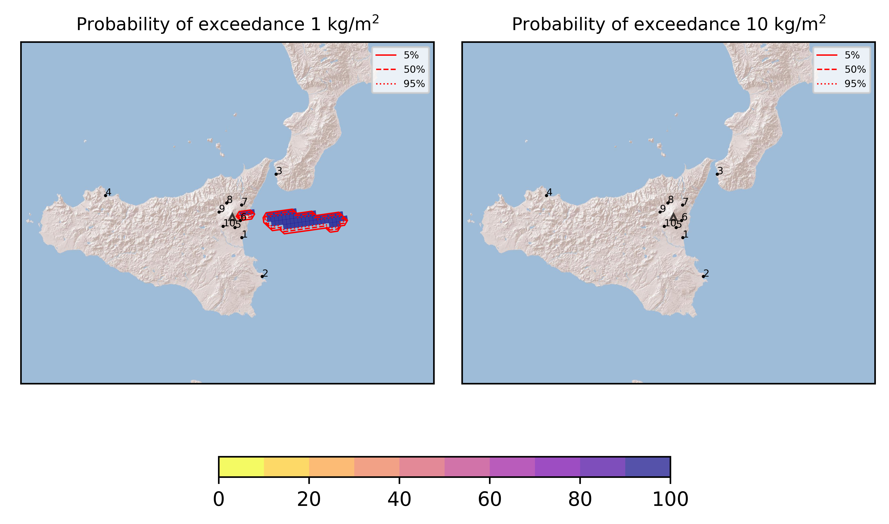
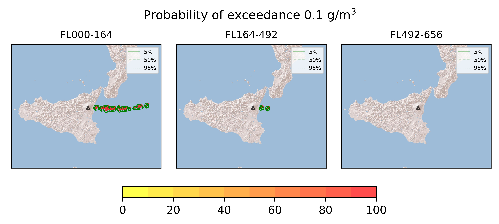
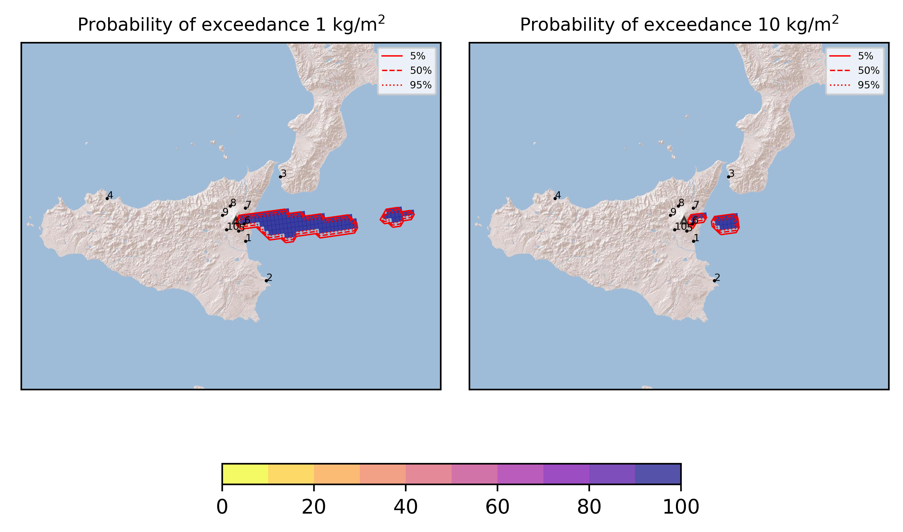
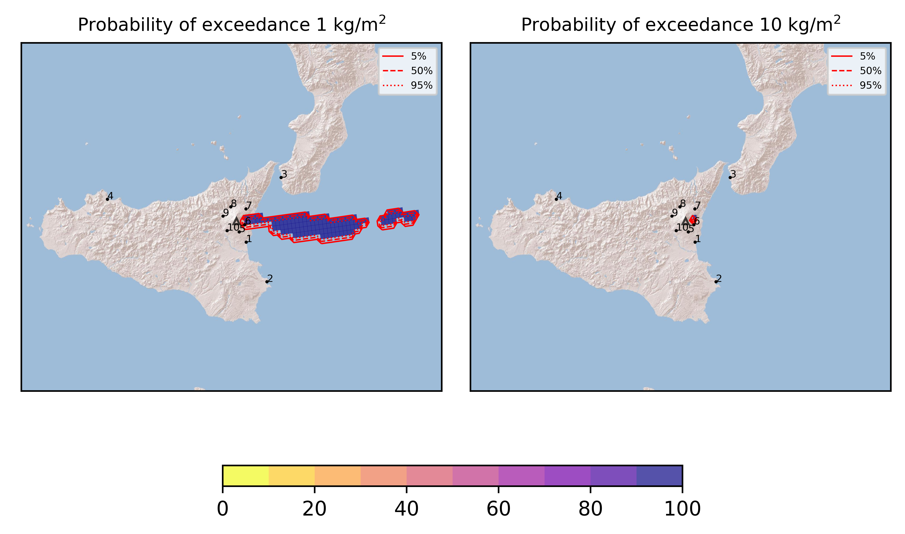
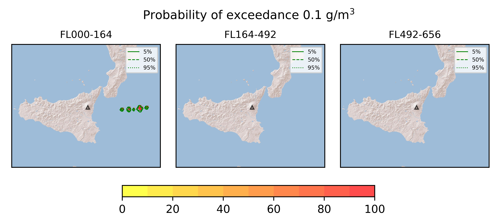

Forecast from VONA bulletin - 20210826_1730Z
============================================

Contents
========

* [Forecast products](#forecast-products)
	* [Forecast at 2021-08-26 20:30 Z - Ongoing Eruption](#forecast-at-2021-08-26-2030-z---ongoing-eruption)
	* [Forecast at 2021-08-26 23:30 Z - Ongoing Eruption](#forecast-at-2021-08-26-2330-z---ongoing-eruption)
	* [Forecast at 2021-08-26 23:30 Z - Terminated Erupion from Orange VONA](#forecast-at-2021-08-26-2330-z---terminated-erupion-from-orange-vona)
	* [Forecast at 2021-08-26 23:30 Z - Terminated Erupion from Orange VONA](#forecast-at-2021-08-26-2330-z---terminated-erupion-from-orange-vona)

# Forecast products

## Forecast at 2021-08-26 20:30 Z - Ongoing Eruption
  

|Eruption start [Z]|Eruption end [Z]|Forecast time [Z]|Column height asl [m]|
| :--- | :--- | :--- | :--- |
|2021-08-26 17:30:00|Ongoing|2021-08-26 20:30:00|[6000 m, 12000 m]|
  
  

|Percentile|MER [kg/s¹]|Mass in the air [kg]|Mass on the ground [kg]|
| :--- | :--- | :--- | :--- |
|5th|7.89e+05|3.16e+09|5.05e+09|
|50th|7.89e+05|3.16e+09|5.05e+09|
|95th|8.11e+05|3.16e+09|5.05e+09|
  

### Ground 2021-08-26 20:30 Z
  
  
  
  
  
  
  
  
  
  
  

|Location|Ground load [kg/m²] 5th perc|Ground load [kg/m²] 50th perc|Ground load [kg/m²] 95th perc|
| :--- | :--- | :--- | :--- |
|Catania AP (1)|1.00e-05|1.00e-05|1.00e-05|
|Siracusa (2)|0.00e+00|0.00e+00|0.00e+00|
|Reggio Calabria AP (3)|0.00e+00|0.00e+00|0.00e+00|
|Palermo AP (4)|0.00e+00|0.00e+00|0.00e+00|
|Nicolosi (5)|4.00e-06|4.00e-06|4.00e-06|
|Zafferana (6)|1.33e+00|1.33e+00|1.33e+00|
|Linguaglossa (7)|7.44e-06|7.44e-06|7.44e-06|
|Randazzo (8)|0.00e+00|0.00e+00|0.00e+00|
|Bronte (9)|0.00e+00|0.00e+00|0.00e+00|
|Biancavilla (10)|0.00e+00|0.00e+00|0.00e+00|
  

### Atmosphere 2021-08-26 20:30 Z
  

## Forecast at 2021-08-26 23:30 Z - Ongoing Eruption
  

|Eruption start [Z]|Eruption end [Z]|Forecast time [Z]|Column height asl [m]|
| :--- | :--- | :--- | :--- |
|2021-08-26 17:30:00|Ongoing|2021-08-26 23:30:00|[6000 m, 12000 m]|
  
  

|Percentile|MER [kg/s¹]|Mass in the air [kg]|Mass on the ground [kg]|
| :--- | :--- | :--- | :--- |
|5th|1.33e+06|1.13e+09|2.07e+10|
|50th|1.33e+06|1.13e+09|2.07e+10|
|95th|1.40e+06|1.13e+09|2.07e+10|
  

### Ground 2021-08-26 23:30 Z
  
  
  
  
  
  
  
  
  
  
  

|Location|Ground load [kg/m²] 5th perc|Ground load [kg/m²] 50th perc|Ground load [kg/m²] 95th perc|
| :--- | :--- | :--- | :--- |
|Catania AP (1)|6.43e-05|6.43e-05|6.43e-05|
|Siracusa (2)|0.00e+00|0.00e+00|0.00e+00|
|Reggio Calabria AP (3)|0.00e+00|0.00e+00|0.00e+00|
|Palermo AP (4)|0.00e+00|0.00e+00|0.00e+00|
|Nicolosi (5)|4.07e-05|4.07e-05|4.07e-05|
|Zafferana (6)|2.72e+01|2.72e+01|2.72e+01|
|Linguaglossa (7)|3.72e-05|3.72e-05|3.72e-05|
|Randazzo (8)|0.00e+00|0.00e+00|0.00e+00|
|Bronte (9)|0.00e+00|0.00e+00|0.00e+00|
|Biancavilla (10)|0.00e+00|0.00e+00|0.00e+00|
  

### Atmosphere 2021-08-26 23:30 Z
  

## Forecast at 2021-08-26 23:30 Z - Terminated Erupion from Orange VONA
  

|Eruption start [Z]|Eruption end [Z]|Forecast time [Z]|Column height asl [m]|
| :--- | :--- | :--- | :--- |
|2021-08-26 17:30:00|2021-08-26 21:20:00|2021-08-26 23:30:00|[6000 m, 12000 m]|
  
  

|Percentile|MER [kg/s¹]|Mass in the air [kg]|Mass on the ground [kg]|
| :--- | :--- | :--- | :--- |
|5th|7.22e+05|1.11e+09|1.16e+10|
|50th|7.54e+05|1.11e+09|1.16e+10|
|95th|7.86e+05|1.11e+09|1.16e+10|
  

### Ground 2021-08-26 23:30 Z
  
  
  
  
  
  
  
  
  
  
  
  

|Location|Ground load [kg/m²] 5th perc|Ground load [kg/m²] 50th perc|Ground load [kg/m²] 95th perc|
| :--- | :--- | :--- | :--- |
|Catania AP (1)|1.60e-04|1.60e-04|1.60e-04|
|Siracusa (2)|0.00e+00|0.00e+00|0.00e+00|
|Reggio Calabria AP (3)|0.00e+00|0.00e+00|0.00e+00|
|Palermo AP (4)|0.00e+00|0.00e+00|0.00e+00|
|Nicolosi (5)|4.47e-05|4.47e-05|4.47e-05|
|Zafferana (6)|3.75e+00|3.75e+00|3.75e+00|
|Linguaglossa (7)|5.21e-05|5.21e-05|5.21e-05|
|Randazzo (8)|0.00e+00|0.00e+00|0.00e+00|
|Bronte (9)|0.00e+00|0.00e+00|0.00e+00|
|Biancavilla (10)|0.00e+00|0.00e+00|0.00e+00|
  

### Atmosphere 2021-08-26 23:30 Z
  
  

## Forecast at 2021-08-26 23:30 Z - Terminated Erupion from Orange VONA
  

|Eruption start [Z]|Eruption end [Z]|Forecast time [Z]|Column height asl [m]|
| :--- | :--- | :--- | :--- |
|2021-08-26 17:30:00|2021-08-26 21:20:00|2021-08-26 23:30:00|[6000 m, 12000 m]|
  
  

|Percentile|MER [kg/s¹]|Mass in the air [kg]|Mass on the ground [kg]|
| :--- | :--- | :--- | :--- |
|5th|7.22e+05|1.11e+09|1.16e+10|
|50th|7.54e+05|1.11e+09|1.16e+10|
|95th|7.86e+05|1.11e+09|1.16e+10|
  

### Ground 2021-08-26 23:30 Z
  
  
  
  
  
  
  
  
  
  
  

|Location|Ground load [kg/m²] 5th perc|Ground load [kg/m²] 50th perc|Ground load [kg/m²] 95th perc|
| :--- | :--- | :--- | :--- |
|Catania AP (1)|1.60e-04|1.60e-04|1.60e-04|
|Siracusa (2)|0.00e+00|0.00e+00|0.00e+00|
|Reggio Calabria AP (3)|0.00e+00|0.00e+00|0.00e+00|
|Palermo AP (4)|0.00e+00|0.00e+00|0.00e+00|
|Nicolosi (5)|4.47e-05|4.47e-05|4.47e-05|
|Zafferana (6)|3.75e+00|3.75e+00|3.75e+00|
|Linguaglossa (7)|5.21e-05|5.21e-05|5.21e-05|
|Randazzo (8)|0.00e+00|0.00e+00|0.00e+00|
|Bronte (9)|0.00e+00|0.00e+00|0.00e+00|
|Biancavilla (10)|0.00e+00|0.00e+00|0.00e+00|
  

### Atmosphere 2021-08-26 23:30 Z
  
  
Go to [Supplementary page](Supplementary_page.md)  
Go to [Main directory](https://github.com/federicapardini/Real_time_ash_forecast)