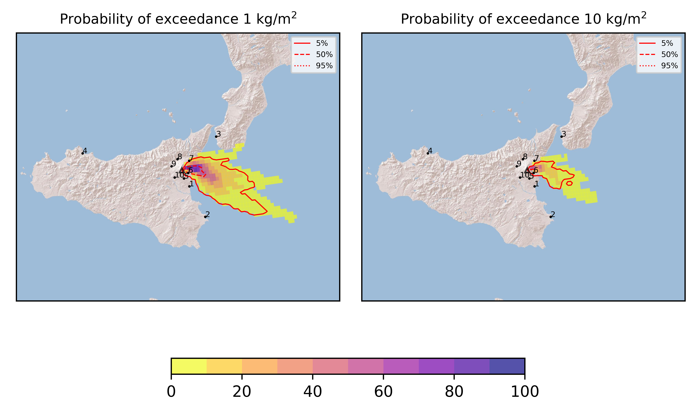
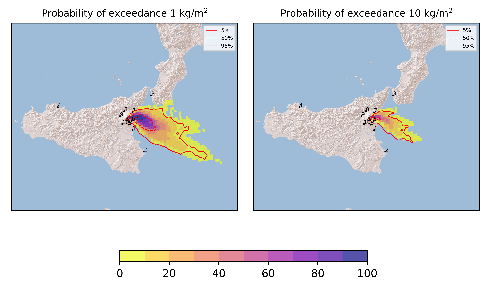
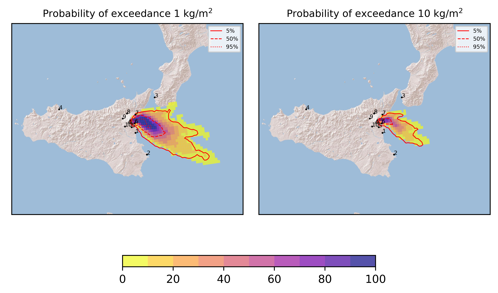
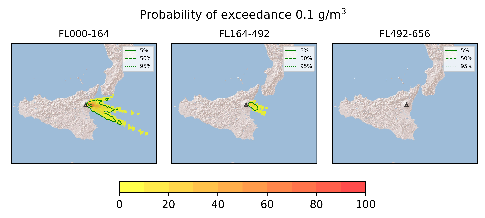
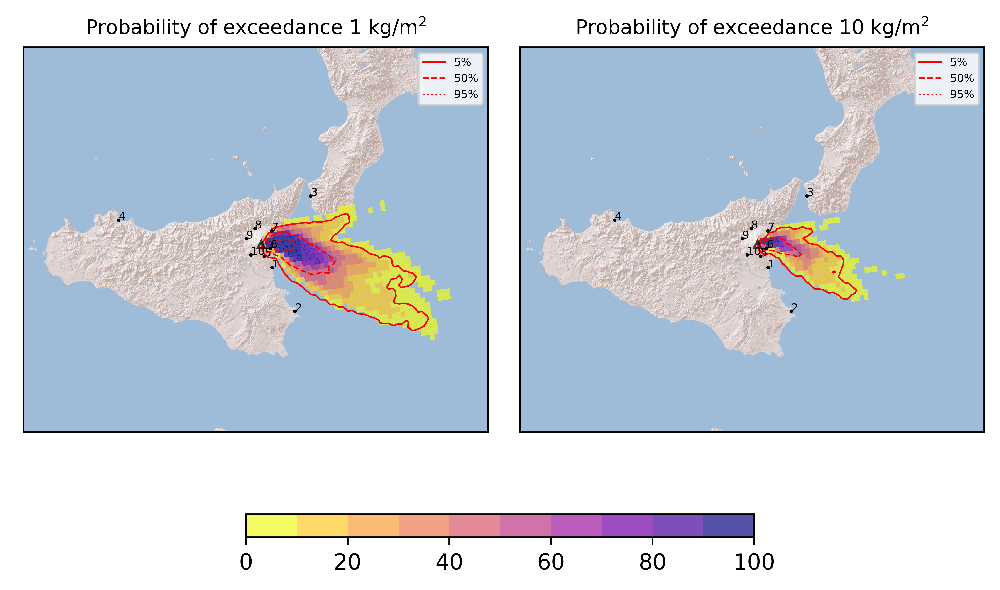
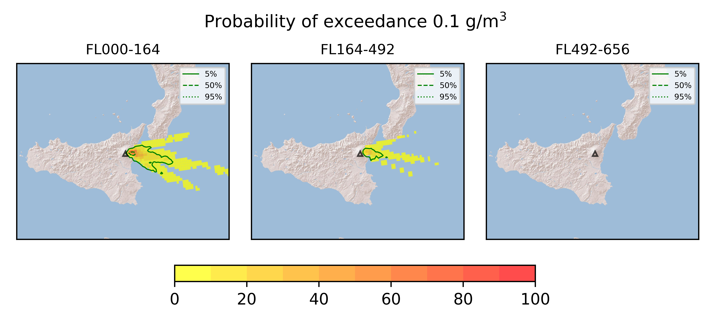

Forecast from VONA bulletin - 20210829_1525Z
============================================

Contents
========

* [Forecast products](#forecast-products)
	* [Forecast at 2021-08-29 18:30 Z - Ongoing Eruption](#forecast-at-2021-08-29-1830-z---ongoing-eruption)
	* [Forecast at 2021-08-29 21:30 Z - Ongoing Eruption](#forecast-at-2021-08-29-2130-z---ongoing-eruption)
	* [Forecast at 2021-08-30 00:30 Z - Ongoing Eruption](#forecast-at-2021-08-30-0030-z---ongoing-eruption)
	* [Forecast at 2021-08-30 03:30 Z - Ongoing Eruption](#forecast-at-2021-08-30-0330-z---ongoing-eruption)

# Forecast products

## Forecast at 2021-08-29 18:30 Z - Ongoing Eruption
  

|Eruption start [Z]|Eruption end [Z]|Forecast time [Z]|Column height asl [m]|
| :--- | :--- | :--- | :--- |
|2021-08-29 15:30:00|Ongoing|2021-08-29 18:30:00|[6000 m, 12000 m]|
  
  

|Percentile|MER [kg/s¹]|Mass in the air [kg]|Mass on the ground [kg]|
| :--- | :--- | :--- | :--- |
|5th|1.41e+05|1.26e+08|1.27e+09|
|50th|6.18e+05|7.91e+08|5.11e+09|
|95th|3.67e+06|8.17e+09|2.64e+10|
  

### Ground 2021-08-29 18:30 Z
  
  
  
  
  
  
  
  
  
  
  

|Location|Ground load [kg/m²] 5th perc|Ground load [kg/m²] 50th perc|Ground load [kg/m²] 95th perc|
| :--- | :--- | :--- | :--- |
|Catania AP (1)|0.00e+00|0.00e+00|4.95e-03|
|Siracusa (2)|0.00e+00|0.00e+00|9.35e-05|
|Reggio Calabria AP (3)|0.00e+00|0.00e+00|0.00e+00|
|Palermo AP (4)|0.00e+00|0.00e+00|0.00e+00|
|Nicolosi (5)|0.00e+00|2.40e-05|1.30e-03|
|Zafferana (6)|2.91e-01|2.59e+00|4.49e+01|
|Linguaglossa (7)|0.00e+00|1.96e-03|1.19e+00|
|Randazzo (8)|0.00e+00|0.00e+00|0.00e+00|
|Bronte (9)|0.00e+00|0.00e+00|0.00e+00|
|Biancavilla (10)|0.00e+00|0.00e+00|0.00e+00|
  

### Atmosphere 2021-08-29 18:30 Z
  

## Forecast at 2021-08-29 21:30 Z - Ongoing Eruption
  

|Eruption start [Z]|Eruption end [Z]|Forecast time [Z]|Column height asl [m]|
| :--- | :--- | :--- | :--- |
|2021-08-29 15:30:00|Ongoing|2021-08-29 21:30:00|[6000 m, 12000 m]|
  
  

|Percentile|MER [kg/s¹]|Mass in the air [kg]|Mass on the ground [kg]|
| :--- | :--- | :--- | :--- |
|5th|1.23e+05|1.89e+08|4.59e+09|
|50th|6.27e+05|1.14e+09|1.46e+10|
|95th|3.27e+06|4.34e+09|4.83e+10|
  

### Ground 2021-08-29 21:30 Z
  
  
  
  
  
  
  
  
  
  
  

|Location|Ground load [kg/m²] 5th perc|Ground load [kg/m²] 50th perc|Ground load [kg/m²] 95th perc|
| :--- | :--- | :--- | :--- |
|Catania AP (1)|0.00e+00|1.15e-04|7.80e-03|
|Siracusa (2)|0.00e+00|0.00e+00|3.58e-04|
|Reggio Calabria AP (3)|0.00e+00|0.00e+00|0.00e+00|
|Palermo AP (4)|0.00e+00|0.00e+00|0.00e+00|
|Nicolosi (5)|0.00e+00|1.93e-04|2.29e-03|
|Zafferana (6)|1.32e+00|1.05e+01|6.86e+01|
|Linguaglossa (7)|1.41e-04|1.08e-02|1.55e+00|
|Randazzo (8)|0.00e+00|0.00e+00|0.00e+00|
|Bronte (9)|0.00e+00|0.00e+00|0.00e+00|
|Biancavilla (10)|0.00e+00|0.00e+00|0.00e+00|
  

### Atmosphere 2021-08-29 21:30 Z
  

## Forecast at 2021-08-30 00:30 Z - Ongoing Eruption
  

|Eruption start [Z]|Eruption end [Z]|Forecast time [Z]|Column height asl [m]|
| :--- | :--- | :--- | :--- |
|2021-08-29 15:30:00|Ongoing|2021-08-30 00:30:00|[6000 m, 12000 m]|
  
  

|Percentile|MER [kg/s¹]|Mass in the air [kg]|Mass on the ground [kg]|
| :--- | :--- | :--- | :--- |
|5th|1.12e+05|1.43e+08|8.01e+09|
|50th|5.40e+05|8.42e+08|2.53e+10|
|95th|3.01e+06|3.89e+09|5.55e+10|
  

### Ground 2021-08-30 00:30 Z
  
  
  
  
  
  
  
  
  
  
  

|Location|Ground load [kg/m²] 5th perc|Ground load [kg/m²] 50th perc|Ground load [kg/m²] 95th perc|
| :--- | :--- | :--- | :--- |
|Catania AP (1)|8.94e-07|1.11e-03|9.56e-03|
|Siracusa (2)|0.00e+00|0.00e+00|3.58e-04|
|Reggio Calabria AP (3)|0.00e+00|0.00e+00|0.00e+00|
|Palermo AP (4)|0.00e+00|0.00e+00|0.00e+00|
|Nicolosi (5)|3.39e-05|9.50e-04|5.25e-03|
|Zafferana (6)|3.67e+00|1.89e+01|9.06e+01|
|Linguaglossa (7)|1.79e-04|7.58e-02|1.55e+00|
|Randazzo (8)|0.00e+00|0.00e+00|0.00e+00|
|Bronte (9)|0.00e+00|0.00e+00|0.00e+00|
|Biancavilla (10)|0.00e+00|0.00e+00|0.00e+00|
  

### Atmosphere 2021-08-30 00:30 Z
  

## Forecast at 2021-08-30 03:30 Z - Ongoing Eruption
  

|Eruption start [Z]|Eruption end [Z]|Forecast time [Z]|Column height asl [m]|
| :--- | :--- | :--- | :--- |
|2021-08-29 15:30:00|Ongoing|2021-08-30 03:30:00|[6000 m, 12000 m]|
  
  

|Percentile|MER [kg/s¹]|Mass in the air [kg]|Mass on the ground [kg]|
| :--- | :--- | :--- | :--- |
|5th|1.15e+05|1.09e+08|1.12e+10|
|50th|5.55e+05|7.48e+08|3.33e+10|
|95th|2.90e+06|9.22e+09|6.43e+10|
  

### Ground 2021-08-30 03:30 Z
  
  
  
  
  
  
  
  
  
  
  

|Location|Ground load [kg/m²] 5th perc|Ground load [kg/m²] 50th perc|Ground load [kg/m²] 95th perc|
| :--- | :--- | :--- | :--- |
|Catania AP (1)|6.63e-06|1.68e-03|1.05e-02|
|Siracusa (2)|0.00e+00|6.68e-05|3.33e-03|
|Reggio Calabria AP (3)|0.00e+00|0.00e+00|0.00e+00|
|Palermo AP (4)|0.00e+00|0.00e+00|0.00e+00|
|Nicolosi (5)|2.01e-04|2.42e-03|3.26e-01|
|Zafferana (6)|6.68e+00|2.60e+01|1.11e+02|
|Linguaglossa (7)|1.79e-04|8.92e-02|1.55e+00|
|Randazzo (8)|0.00e+00|0.00e+00|0.00e+00|
|Bronte (9)|0.00e+00|0.00e+00|0.00e+00|
|Biancavilla (10)|0.00e+00|0.00e+00|0.00e+00|
  

### Atmosphere 2021-08-30 03:30 Z
  
  
Go to [Supplementary page](Supplementary_page.md)  
Go to [Main directory](https://github.com/federicapardini/Real_time_ash_forecast)